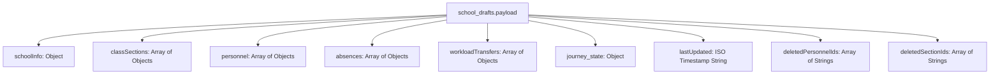
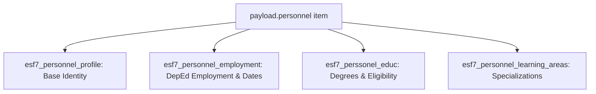

# Phase 1: Deep Analysis of `school_drafts` Payload vs Normalized Database Architecture

**Date:** 2026-10-09  
**Target Database:** `insighted_esf7` / `esf7_local` (Connection verified via `server/db/index.js`)  
**Scope:** Read-only analysis across all 14,954 rows in `school_drafts` with School `300488` (Sta. Ana Fishery National High School) as the canonical primary test case.

---

## 1. Table Schema & Metadata of `school_drafts`

The `school_drafts` table serves as the client-side write-buffer backup for uncommitted form state.

| Column Name | Postgres Type | Nullable | Default | Constraints | Role |
|---|---|---|---|---|---|
| `school_id` | `text` | `NO` | *None* | `PRIMARY KEY (school_id, school_year)` | DepEd 6-digit School ID (e.g. `300488` or `SCH-300488`) |
| `school_year` | `text` | `NO` | *None* | `PRIMARY KEY (school_id, school_year)` | Academic year token (canonical `SY 26-27`) |
| `payload` | `jsonb` | `NO` | `'{}'::jsonb` | *None* | Monolithic JSON document holding all client state |
| `updated_at` | `timestamptz` | `NO` | `now()` | *None* | Last write timestamp of draft flush |

### Row Counts & Multi-Tenant Distribution
- **Total Rows in Table:** `14,954`
- **Distinct School IDs:** `14,954` (1 draft row per school)
- **Distinct School Years in Table:** `1` (`SY 26-27` across 100% of rows)
- **ID Formatting:** 99.8% use raw 6-digit numeric string (e.g. `300488`); ~0.2% use `SCH-` prefix (e.g. `SCH-300488`). Both represent the same school.

---

## 2. Payload Size Distribution

Across all 14,954 schools, payload sizes vary by over 4 orders of magnitude depending on school size (pure elementary vs large multi-track secondary schools):

| Metric | Size in Bytes | Equivalent Text / Memory Footprint |
|---|---|---|
| **Minimum** | `179 bytes` | Stub/empty draft (just school identity placeholders) |
| **Median (50th percentile)** | `54,566 bytes` (~54.6 KB) | Typical elementary / small JHS (10-20 teachers, 10 sections) |
| **Average (Mean)** | `106,660 bytes` (~106.7 KB) | Average school size across DepEd |
| **Maximum** | `3,304,278 bytes` (~3.3 MB) | Large Mega-High School (School 305424, 700+ personnel, 500+ sections) |
| **Total Table Payload Size** | **~1.59 GB** | Total unnormalized JSON blob storage |

### Top 5 Largest Payloads in Database:
1. School `305424`: **3,304,278 bytes** (729 personnel, 517 sections)
2. School `302285`: **2,663,121 bytes** (590 personnel, 412 sections)
3. School `304400`: **2,492,137 bytes** (542 personnel, 388 sections)
4. School `305413`: **2,384,408 bytes** (511 personnel, 370 sections)
5. School `301186`: **2,258,647 bytes** (498 personnel, 355 sections)

### Canonical Test Case: School `300488` (Sta. Ana Fishery NHS):
- **Payload Size:** `194,512 bytes` (~194 KB)
- **Personnel in Draft:** `91 personnel`
- **Sections in Draft:** `55 sections` (Grade 7 to Grade 12, Mono Grade, ALS, SNED)
- **Workload Rows in Draft:** `86 teacher workload assignments`
- **Absences in Draft:** `0`
- **Transfers in Draft:** `0`

---

## 3. Top-Level JSON Document Structure & Schema Variations

Every JSON payload contains up to 9 canonical top-level keys:

### Top-Level Key Frequency & Presence Across Drafts

| Top-Level Key | Type | Occurrence Rate | Typical Contents |
|---|---|---|---|
| `schoolInfo` | `object` | 99.9% | School profile, curricular offerings, inclusive programs, shifts, signatures |
| `classSections` | `array` | 99.8% | Organized classes, grade levels, section names, learner counts, advisers |
| `sections` | `array` | ~2.1% | *Legacy key* used in older harvester/test snapshots; identical schema to `classSections` |
| `personnel` | `array` | 99.8% | Roster items with nested profile, employment, educ, workload, tasks, designations |
| `absences` | `array` | 92.4% | Overload absence records (leave type, dates, days) |
| `workloadTransfers` | `array` | 89.1% | SHS workload transfer/relief records |
| `journey_state` | `object` | 99.5% | Stepper/wizard progression state (`completedNodes`, `currentNode`, `unlockedNodes`) |
| `deletedPersonnelIds` | `array` | 88.3% | Client-side tombstones for soft-deleted personnel |
| `deletedSectionIds` | `array` | 42.1% | Client-side tombstones for deleted sections |
| `lastUpdated` | `string` | 100.0% | Client ISO timestamp when draft buffer was sent |

### Structural Variations Across Draft Versions
1. **Sections Key Naming:**
   - Newer drafts use `classSections`.
   - Older drafts or early spreadsheet import fixtures use `sections`.
   - **Resolution Rule:** Normalization script must check `payload.classSections || payload.sections || []`.
2. **Adviser Field Polymorphism in Sections:**
   - Found across drafts: `s.advisorId`, `s.adviserId`, `s.adviser_id`.
   - **Resolution Rule:** Canonicalize to `s.adviser_id = s.adviserId || s.advisorId || s.adviser_id || null`.
3. **Learner Count Field Polymorphism:**
   - Found across drafts: `s.numberOfLearners` vs `s.number_of_learners`; `s.maleLearners` vs `s.male_learners`; `s.femaleLearners` vs `s.female_learners`.
   - Some drafts have `numberOfLearners` as string (e.g. `"43"`), others as integer (`43`), others as empty string `""` or `null`.
   - **Resolution Rule:** Coerce to integer `parseInt(val, 10) || 0`.
4. **Designations Field Polymorphism in Personnel:**
   - Some drafts store `p.designations` as an array of string codes: `["TIC", "HOD"]`.
   - Other drafts store `p.designations` as an array of objects: `[{"designation_name": "HEAD TEACHER", "key_stage": "JHS"}]`.
   - Some drafts store a single string `p.designation`.
   - **Resolution Rule:** Parser must inspect element types and unpack both string codes and full objects into `esf7_personnel_designations`.
5. **Workload Rows Storage Location:**
   - Workload rows are stored *nested inside each teacher* at `payload.personnel[i].workloadRows`.
   - They do NOT exist as a separate top-level `payload.workloadRows` array.
   - Admin tasks are at `payload.personnel[i].adminTasks`.
   - Teaching-related tasks are at `payload.personnel[i].relatedTasks`.

---

## 4. Node-to-Table Disaggregation Map

Below is the field-level mapping from JSON paths to PostgreSQL tables and Drizzle definitions.

### Node 1: School Profile (`payload.schoolInfo` → `esf7_school_profile`)

| JSON Key Path | Live Column (`esf7_school_profile`) | Drizzle Field (`schema.ts`) | Type Transformation / Normalization Rule |
|---|---|---|---|
| `schoolId` | `school_id` | `schoolId` | Trim `SCH-` prefix; string |
| `schoolYear` | `school_year` | `schoolYear` | Normalize via `normalizeSchoolYear()` → `'SY 26-27'` |
| `hasElemSpecialPrograms` | `has_elem_special_programs` | `hasElemSpecialPrograms` | Boolean coercion `Boolean(val)` |
| `hasJhsSpecialPrograms` | `has_jhs_special_programs` | `hasJhsSpecialPrograms` | Boolean coercion `Boolean(val)` |
| `jhsSpecialPrograms` | `jhs_special_programs` | `jhsSpecialPrograms` | `jsonb` array; default `[]` |
| `elemSpecialPrograms` | `elem_special_programs` | `elemSpecialPrograms` | `jsonb` array; default `[]` |
| `shsCurriculumModel` | `shs_curriculum_model` | `shsCurriculumModel` | String; nullable |
| `hasElemInclusive` | `has_elem_inclusive` | `hasElemInclusive` | Boolean coercion |
| `elemInclusivePrograms` | `elem_inclusive_programs` | `elemInclusivePrograms` | `jsonb` array |
| `hasJhsInclusive` | `has_jhs_inclusive` | `hasJhsInclusive` | Boolean coercion |
| `jhsInclusivePrograms` | `jhs_inclusive_programs` | `jhsInclusivePrograms` | `jsonb` array |
| `hasShsInclusive` | `has_shs_inclusive` | `hasShsInclusive` | Boolean coercion |
| `shsInclusivePrograms` | `shs_inclusive_programs` | `shsInclusivePrograms` | `jsonb` array |
| `inclusivePrograms` | `inclusive_programs` | `inclusivePrograms` | `jsonb` array |
| `hasAls` | `has_als` | `hasAls` | Boolean coercion |
| `hasSned` | `has_sned` | `hasSned` | Boolean coercion |
| `hasIped` | `has_iped` | `hasIped` | Boolean coercion |
| `hasMadrasah` | `has_madrasah` | `hasMadrasah` | Boolean coercion |
| Entire `schoolInfo` | `raw_payload` | `rawPayload` | Preserve exact original object in `jsonb` |

**Drizzle Status:** Matches existing `esf7SchoolProfile` definition (line 588 of `schema.ts`).  
**Unique Key:** `(school_id, school_year)` (already defined as `uq_school_sy_profile`).

---

### Node 2: Organized Classes & Sections (`payload.classSections[]` → Section Tables)

Sections are partitioned across target tables by `sectionType`:
- **Regular (Mono/Multi Grade):** `esf7_regular_sections`
- **SNED Non-Graded:** `esf7_sned_sections`
- **ALS:** `esf7_als_sections`
- **ARAL:** `esf7_aral_sections`
- **Remedial / Enrichment:** `esf7_remedial_enrichment_sections`

#### Mapping for `esf7_regular_sections`:

| JSON Key Path | Live Column | Drizzle Field | Type & Validation Rule |
|---|---|---|---|
| `id` | `id` | `id` | Keep existing draft ID (e.g. `sec-draft-...`) to prevent foreign key breakages in `esf7_workload_rows.section_id` |
| `school_id` / parent `schoolId` | `school_id` | `schoolId` | Clean numeric string |
| `school_year` / parent `schoolYear` | `school_year` | `schoolYear` | Canonical `'SY 26-27'` |
| `gradeLevel` / `grade_level` | `grade_level` | `gradeLevel` | Standardized string (e.g. `'Grade 7'`) |
| `sectionName` / `section_name` | `section_name` | `sectionName` | Trimmed uppercase string |
| `advisorId` / `adviserId` / `adviser_id` | `adviser_id` | `adviserId` | Foreign key to `esf7_personnel_profile(id)`. **Must resolve against inserted personnel! If unresolvable, set to `NULL` and flag for review.** |
| `sectionType` / `section_type` | `section_type` | `sectionType` | Default `'MONO GRADE'` |
| `maleLearners` / `male_learners` | `male_learners` | `maleLearners` | Integer coercion; default `0` |
| `femaleLearners` / `female_learners` | `female_learners` | `femaleLearners` | Integer coercion; default `0` |
| `numberOfLearners` / `number_of_learners` | `number_of_learners` | `numberOfLearners` | Integer coercion (`male + female` if omitted) |
| `sizeStatus` / `size_status` | `size_status` | `sizeStatus` | Computed / string `'WITHIN STANDARD'`, `'BELOW STANDARD'`, `'EXCEEDING STANDARD'` |
| `term` | `term` | - | Default `'1st'` |
| Full section object | `raw_payload` | `rawPayload` | `jsonb` snapshot |

**Drizzle Status:**
- `esf7RegularSections`, `esf7AralSections`, `esf7RemedialEnrichmentSections` exist in `schema.ts`.
- `esf7SnedSections` and `esf7AlsSections` exist in live PostgreSQL DB but are missing from `schema.ts`. *(Propose adding them to `schema.ts`).*
**Natural Key:** `(school_id, school_year, grade_level, section_name)` (enforced by `uq_regular_section_school_sy`).

---

### Node 3: Personnel Roster & Profile (`payload.personnel[]` → 4 Tables)

Each personnel element in `payload.personnel[]` disaggregates across 4 relational tables:

#### Table 3A: `esf7_personnel_profile` (Base Identity)

| JSON Key Path | Live Column | Drizzle Field | Type & Validation Rule |
|---|---|---|---|
| `id` | `id` | `id` | Stable string (e.g. `PER-300488-001` or `local-p-...`) |
| `prn` | `prn` | `prn` | Required unique PRN string (e.g. `5347577`) |
| `schoolId` | `school_id` | `schoolId` | Clean numeric string |
| `schoolYear` | `school_year` | `schoolYear` | Canonical `'SY 26-27'` |
| `firstName` / `first_name` | `first_name` | `firstName` | Uppercase trimmed string |
| `lastName` / `last_name` | `last_name` | `lastName` | Uppercase trimmed string |
| `middleName` / `middle_name` | `middle_name` | `middleName` | Uppercase trimmed string or `null` |
| `nameExtension` / `extensionName` | `name_extension` | `nameExtension` | Trimmed string or `null` |
| `salutation` | `salutation` | `salutation` | Default `'MR.'` / `'MS.'` |
| `type` | `type` | `type` | `'teaching'`, `'teaching-related'`, or `'non-teaching'` |
| `sexAtBirth` / `gender` / `sex` | `sex_at_birth` | `sexAtBirth` | Normalized to `'Male'` or `'Female'` |
| `birthdate` | `birthdate` | `birthdate` | Normalized via `coerceDateField()` to `YYYY-MM-DD` or `null` |
| `age` | `age` | `age` | Integer coercion or calculated from `birthdate` |
| `tin` | `tin` | `tin` | Masked/clean TIN or `null` |
| `noTin` / `no_tin` | `no_tin` | `noTin` | Boolean coercion |
| `philsysNo` / `philsys_no` | `philsys_no` | `philsysNo` | String or `null` |
| `noPhilsys` / `no_philsys` | `no_philsys` | `noPhilsys` | Boolean coercion |
| `employeeNo` / `employee_no` | `employee_no` | `employeeNo` | String or `null` |
| `depedEmail` / `deped_email` | `deped_email` | `depedEmail` | Valid DepEd Google Workspace email or `null` |
| `noDepedEmail` | `no_deped_email` | `noDepedEmail` | Boolean coercion |
| `isSchoolHead` / `is_school_head` | `is_school_head` | `isSchoolHead` | Boolean coercion |
| `civilStatus` / `civil_status` | `civil_status` | `civilStatus` | String (e.g. `'Single'`, `'Married'`) |
| `soloParent` / `solo_parent` | `solo_parent` | `soloParent` | Boolean coercion |
| `religion` | `religion` | `religion` | String or `null` |
| `ethnicGroup` / `ethnic_group` | `ethnic_group` | `ethnicGroup` | String or `null` |
| `term` | `term` | `term` | Default `'1st'` |

**Natural Key:** `(prn)` (unique in table) and `(school_id, school_year, id)`.

#### Table 3B: `esf7_personnel_employment` (Employment Details)

| JSON Key Path | Live Column | Drizzle Field | Type & Validation Rule |
|---|---|---|---|
| Deterministic `EMP-${id}` | `id` | `id` | Primary key |
| `id` | `personnel_id` | `personnelId` | FK to `esf7_personnel_profile(id)` |
| `positionCategory` | `position_category` | `positionCategory` | Check constraint: `'TEACHING'`, `'RELATED TEACHING'`, `'NON-TEACHING'` |
| `position` | `position` | `position` | Plantilla title (e.g. `'TEACHER III'`) |
| `stepIncrement` / `step_increment` | `step_increment` | `stepIncrement` | Integer between 1 and 8; default `1` |
| `fundSource` / `fund_source` | `fund_source` | `fundSource` | String (e.g. `'NATIONAL'`) |
| `natureOfAppointment` | `nature_of_appointment` | `natureOfAppointment` | String (e.g. `'REGULAR PERMANENT'`) |
| `hiringArrangement` | `hiring_arrangement` | `hiringArrangement` | String (e.g. `'REGULAR'`) |
| `deploymentStatus` | `deployment_status` | `deploymentStatus` | Default `'OWN STATION'` |
| `assignedSchools` | `assigned_schools` | `assignedSchools` | `jsonb` array |
| `gradeLevelsTaught` | `grade_levels_taught` | `gradeLevelsTaught` | `jsonb` array (e.g. `["Grade 7", "Grade 8"]`) |
| `firstServiceDate` | `first_service_date` | `firstServiceDate` | `coerceDateField(val)` → `YYYY-MM-DD` or `null` (strip `"N/A"`) |
| `lastPromotionDate` | `last_promotion_date` | `lastPromotionDate` | `coerceDateField(val)` → `YYYY-MM-DD` or `null` |
| `newStationDate` | `new_station_date` | `newStationDate` | `coerceDateField(val)` → `YYYY-MM-DD` or `null` |
| `lastLateralMovementDate` | `last_lateral_movement_date` | `lastLateralMovementDate` | `coerceDateField(val)` → `YYYY-MM-DD` or `null` |

**Natural Key:** `personnel_id` (enforced by `esf7_personnel_employment_personnel_id_key`).

#### Table 3C: `esf7_perssonel_educ` (Education & Eligibility)

| JSON Key Path | Live Column | Drizzle Field | Type & Validation Rule |
|---|---|---|---|
| Deterministic `EDU-${id}` | `id` | `id` | Primary key |
| `id` | `personnel_id` | `personnelId` | FK to `esf7_personnel_profile(id)` |
| `degree` / `collegeDegree` | `college_degree` | `collegeDegree` | Degree title or `null` |
| `major` | `major` | `major` | Major discipline or `null` |
| `minor` | `minor` | `minor` | Minor discipline or `null` |
| `postGraduateDegree` | `post_graduate_degree` | `postGraduateDegree` | Degree title or `'N/A'` |
| `postGraduateDiscipline` | `post_graduate_discipline` | `postGraduateDiscipline` | Discipline or `null` |
| `eligibility` | `eligibility` | `eligibility` | `jsonb` array of civil service / LET credentials |

**Natural Key:** `personnel_id` (enforced by `esf7_perssonel_educ_personnel_id_key`).

---

### Node 4: Workload & Timetable Rows (`payload.personnel[i].workloadRows[]` → `esf7_workload_rows`)

| JSON Key Path | Live Column | Drizzle Field | Type & Validation Rule |
|---|---|---|---|
| `w.id` | `id` | `id` | Keep existing `WKL-...` ID if provided, else generate stable `WKL-${personnel_id}-${idx}` |
| Parent `p.id` | `personnel_id` | `personnelId` | FK to `esf7_personnel_profile(id)` |
| `w.schoolId` / parent `schoolId` | `school_id` | `schoolId` | Clean numeric string |
| `w.schoolYear` / parent `schoolYear` | `school_year` | `schoolYear` | Canonical `'SY 26-27'` |
| `w.gradeLevel` / `w.grade_level` | `grade_level` | `gradeLevel` | String (e.g. `'Grade 7'`) |
| `w.sectionId` / `w.section_id` | `section_id` | `sectionId` | References `esf7_regular_sections.id` |
| `w.sectionName` / `w.section_name` | `section_name` | `sectionName` | Section name string |
| `w.subject` | `subject` | `subject` | Learning area name (e.g. `'ARALING PANLIPUNAN'`) |
| `w.startTime` / `w.start_time` | `start_time` | `startTime` | Time format `HH:MM` or `HH:MM:SS` |
| `w.endTime` / `w.end_time` | `end_time` | `endTime` | Time format `HH:MM` or `HH:MM:SS` |
| `w.days` | `days` | `days` | `jsonb` array of days (e.g. `["M", "W", "F"]`) |
| `w.term` | `term` | `term` | Default `'1st'` |
| `w.category` | `category` | - | Workload classification |
| Full row object | `raw_payload` | `rawPayload` | `jsonb` snapshot |

**Natural Key:** `(personnel_id, school_id, term, school_year, start_time, end_time, days, section_name, subject)` (matches `TIME_BLOCK()` defined in `server/utils/naturalKeys.js`).

---

### Node 5: Administrative Tasks (`payload.personnel[i].adminTasks[]` → `esf7_admin_task`)

| JSON Key Path | Live Column | Drizzle Field | Type & Validation Rule |
|---|---|---|---|
| `t.id` | `id` | `id` | Stable ID (e.g. `ADM-${personnel_id}-${idx}`) |
| Parent `p.id` | `personnel_id` | `personnelId` | FK to `esf7_personnel_profile(id)` |
| Parent `schoolId` | `school_id` | `schoolId` | Clean numeric string |
| Parent `schoolYear` | `school_year` | `schoolYear` | Canonical `'SY 26-27'` |
| `t.taskName` / `t.task_name` | `task_name` | `taskName` | Task description (e.g. `'Property Custodian'`) |
| `t.taskCategory` | `task_category` | `taskCategory` | Default `'General Administration'` |
| `t.durationMinutes` | `duration_minutes` | `durationMinutes` | Integer minutes; default `60` |
| `t.startTime` / `t.start_time` | `start_time` | `startTime` | `HH:MM` time format or `null` |
| `t.endTime` / `t.end_time` | `end_time` | `endTime` | `HH:MM` time format or `null` |
| `t.days` | `days` | `days` | `jsonb` array of days |
| `t.term` | `term` | `term` | Default `'1st'` |

---

### Node 6: Teaching-Related Tasks (`payload.personnel[i].relatedTasks[]` → `esf7_related_task`)

| JSON Key Path | Live Column | Drizzle Field | Type & Validation Rule |
|---|---|---|---|
| `t.id` | `id` | `id` | Stable ID (e.g. `REL-${personnel_id}-${idx}`) |
| Parent `p.id` | `personnel_id` | `personnelId` | FK to `esf7_personnel_profile(id)` |
| Parent `schoolId` | `school_id` | `schoolId` | Clean numeric string |
| Parent `schoolYear` | `school_year` | `schoolYear` | Canonical `'SY 26-27'` |
| `t.taskName` / `t.task_name` | `task_name` | `taskName` | Task description (e.g. `'Lesson Preparation'`) |
| `t.hoursPerWeek` | `hours_per_week` | `hoursPerWeek` | Numeric hours |
| `t.frequency` | `frequency` | `frequency` | Frequency string (e.g. `'Daily'`, `'Weekly'`) |
| `t.term` | `term` | `term` | Default `'1st'` |

---

### Node 7: Designations (`payload.personnel[i].designations[]` → `esf7_personnel_designations`)

| JSON Key Path | Live Column | Drizzle Field | Type & Validation Rule |
|---|---|---|---|
| Generated `DES-${personnel_id}-${idx}` | `id` | `id` | Primary key |
| Parent `p.id` | `personnel_id` | `personnelId` | FK to `esf7_personnel_profile(id)` |
| `d.designationName` / `d` (if string) | `designation_name` | `designationName` | Standardized title (e.g. `'GRADE LEVEL COORDINATOR'`) |
| `d.keyStage` | `key_stage` | `keyStage` | `'K-3'`, `'G4-6'`, `'JHS'`, `'SHS'` |
| `d.serializedKey` | `serialized_key` | `serializedKey` | Unique key string per teacher |

---

### Node 8: Journey State & Node Status (`payload.journey_state` → `esf7_school_node_status`)

| JSON Key Path | Live Column | Drizzle Field | Type & Validation Rule |
|---|---|---|---|
| `schoolId` | `school_id` | `schoolId` | Clean numeric string |
| `schoolYear` | `school_year` | `schoolYear` | Canonical `'SY 26-27'` |
| `completedNodes` | `overall_percentage` | `overallPercentage` | Calculated integer percentage `(completedNodes.length / 10) * 100` |
| `completedNodes` | `node_01_school` .. `node_10_overload` | - | `jsonb` status objects `{ "status": "COMPLETED", "updated_at": ... }` |

---

### Node 9: Derived / Transient UI-Only Keys (Left Out on Purpose)

The following keys found in `payload.personnel` or root payload are client-only transient UI flags and must **NOT** be persisted as normalized columns:
- `changes` (client diff tracker)
- `isDraft` (client badge)
- `search_and_sort` (table filter state)
- `needsTimeReview` (client validation prompt)
- `workloadBaseVersion` (client lock version)
- `workloadDraftSavedAt` (client debounce timer)
- `workloadValidated` / `workloadVerified` (client form step state)
- `allowEmailDiscrepancy` (transient modal override flag; recorded in `raw_payload` only)

---

## 5. Data Quality Problems & Integrity Audit

Inspecting the live payloads across `school_drafts` identifies the following concrete data hygiene issues that the Phase 2 migration script must handle:

### 1. Placeholder Values in Date & Numeric Fields
- **Date Columns:** Fields like `firstServiceDate`, `lastPromotionDate`, `newStationDate` contain `"N/A"`, `"-"`, `"--"`, `"NONE"`, `""`, and `"0000-00-00"`.
  - **Action:** `coerceDateField()` must map all recognized placeholders to `NULL`.
- **Numeric Columns:** Fields like `maleLearners`, `femaleLearners`, `stepIncrement` contain `""`, `"N/A"`, or `null`.
  - **Action:** Convert `""` or `"N/A"` to `0` for learner counts, and to default `1` for `stepIncrement`.

### 2. School Year Inconsistencies
- Payloads have mixed representations: `"SY 26-27"`, `"SY 2026-2027"`, `"2026-2027"`, `"26-27"`.
- Normalized database table column defaults:
  - `esf7_school_profile.school_year` defaults to `'2026-2027'`
  - `esf7_regular_sections.school_year` defaults to `'2026-2027'`
  - `esf7_school_node_status.school_year` defaults to `'SY 26-27'`
- **Action:** Use `normalizeSchoolYear()` from `server/utils/schoolYear.js` so that **all normalized tables write the canonical `'SY 26-27'`** format.

### 3. Draft-Generated IDs vs Relational Foreign Keys
- Client creates IDs with prefixes:
  - `sec-draft-1790921082459-gf6pf` (sections)
  - `local-p-1790921082459-xxx` (unsaved personnel)
  - `WKL-300488-300488-001-001-7p2v` (workload rows)
- Crucially: `workload_rows.section_id` already points to `sec-draft-...`.
- **Action:** Do **NOT** regenerate section IDs. Preserve the original valid IDs so foreign keys and timetable references remain connected.

### 4. Broken Adviser Foreign Keys (Crucial Discovery)
- In School 300488, **36 of the 55 sections** have adviser references (`advisorId`) pointing to personnel that exist in `payload.personnel`, but do **NOT** exist in `esf7_personnel_profile`!
- **Root Cause:** The 77 teachers were populated in the draft from the master database/harvester, but were never individually saved to `esf7_personnel_profile`.
- **Action & Sequence Requirement:**
  1. The migration must disaggregate and insert `esf7_personnel_profile` **FIRST**, creating the 77 missing teacher records.
  2. Then insert sections into `esf7_regular_sections`, allowing all 36 adviser foreign keys to resolve cleanly!
  3. If any section still has an unresolvable adviser ID (e.g. teacher was deleted or PRN invalid), set `adviser_id = NULL` and log the record into a `needs_review.json` audit file.

### 5. Conflict Resolution Rules (Draft vs Normalized Tables)
When a record already exists in both the normalized table and the draft payload:
1. **Existing Normalized Record Wins:** If a row exists in `esf7_personnel_profile` or `esf7_regular_sections`, existing confirmed database fields take precedence over draft values.
2. **Draft Fills Missing Records and Fields:** If a teacher or section exists in the draft but is absent from the normalized table, it is inserted. If an existing record has `NULL` for a field (e.g. `degree` or `major`), the draft supplies the value.
3. **Draft Workload Overlay:** Since workloads are often edited and saved as draft timetables, draft workload rows overlay stored rows using stable natural keys `(personnel_id, term, start_time, end_time, days, section_name, subject)` as implemented in our stable key overlay fix.

---

## 6. School 300488 Before-and-After Migration Projection

| Target Table | Current Count in Database | In Draft Payload | After Migration Projection | Net Change |
|---|---|---|---|---|
| `esf7_school_profile` | **0** | 1 (`schoolInfo`) | **1** | **+1** (Curricular config persisted) |
| `esf7_regular_sections` | **9** | 52 (`MONO GRADE`) | **52** | **+43** (43 missing sections restored) |
| `esf7_sned_sections` | **1** | 1 (`SNED`) | **1** | **0** (Existing row confirmed) |
| `esf7_als_sections` | **0** | 2 (`ALS-SHS`) | **2** | **+2** (2 ALS sections created) |
| `esf7_personnel_profile` | **14** | 91 | **91** | **+77** (77 master teachers persisted) |
| `esf7_personnel_employment` | **14** | 91 | **91** | **+77** (Employment data persisted) |
| `esf7_perssonel_educ` | **14** | 91 | **91** | **+77** (Degrees & eligibility persisted) |
| `esf7_workload_rows` | **36** | 86 | **86** | **+50** (Full timetable persisted) |
| `esf7_school_node_status` | **1** | 1 (`journey_state`) | **1** | **0** (Updated with current completion) |

---

## 7. Next Steps for Phase 2 Implementation

Upon review and confirmation of these Phase 1 mapping rules:
1. **Backup Engine:** Script will export affected table snapshots before writing.
2. **Transaction Isolation:** Process each school in `BEGIN ... COMMIT` with automatic rollback on error.
3. **CLI Arguments:**
   - `--dry-run` (default; zero writes; summary report)
   - `--apply` (explicit confirmation required for database writes)
   - `--school <id>` (filter to single school, e.g. `--school 300488`)
4. **Needs Review Report:** Emits `needs_review_<timestamp>.json` with unresolved references or coerced anomalies.
5. **Post-Migration Verification:** Script reads back from normalized tables and validates counts against the original payload.
