# Data flow: InsightED-ESF7-Official

> **Coverage is limited:** Drizzle is used only to define the schema; runtime writes are raw SQL. The field-to-column table below is derived from SQL text and variable tracing, so it is **not guaranteed complete**. Every row carries a confidence level; see Section 8 for what could not be resolved.

## 1. Coverage and assumptions

- **Parse mode:** `ast` (typescript compiler API located call expressions; field and SQL analysis is textual).
- **ORM coverage:** `schema-only`. Write calls by API: raw-sql=414.
- **Scope:** 173 routes (105 write routes), 32 Drizzle tables, 414 write calls (184 in application code), 119 client calls, 465 source files scanned.
- **Method:** static analysis only. No database, Redis, or server was contacted; `.env*` files were not read.
- **Overrides:** Manual overrides applied from `overrides.json`.
- **Confidence summary:** routes (high=173, medium=0, low=0); writes (high=140, medium=242, low=32); client calls (high=118, medium=1, low=0).
- **Reading confidence:** `high` = found directly in the handler or schema; `medium` = reached through one helper hop or partly inferred; `low` = heuristic link, dynamic SQL, or unresolved value.
- **Limits:** middleware order is not evaluated (all `app.use` middleware whose prefix matches is listed); loops are counted once and flagged; helper calls are followed two hops.

## 2. System overview

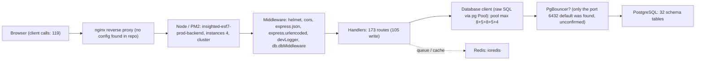
```mermaid
flowchart LR
  B["Browser (client calls: 119)"]
  N["nginx reverse proxy (no config found in repo)"]
  P["Node / PM2: insighted-esf7-prod-backend, instances 4, cluster"]
  M["Middleware: helmet, cors, express.json, express.urlencoded, devLogger, db.dbMiddleware"]
  H["Handlers: 173 routes (105 write)"]
  D["Database client (raw SQL via pg Pool): pool max 8+5+8+5+4"]
  PG["PostgreSQL: 32 schema tables"]
  B --> N --> P --> M --> H --> D
  PB["PgBouncer? (only the port 6432 default was found, unconfirmed)"]
  D --> PB --> PG
  R["Redis: ioredis"]
  H -.->|queue / cache| R
```

Pool sizes found in application code sum to **30** connections per Node process (8 at server/db/index.js:85; 5 at server/db/index.js:109; 8 at server/db/index.js:135; 5 at server/db/index.js:164; 4 at server/db/index.js:196). Multiply by PM2 instances for the worst case.

## 3. Write routes

### POST /api/absences

- **Handler:** server/controllers/absences/index.js:90 (inline); **registered at** server/controllers/absences/index.js:90; **confidence:** high
- **Middleware:** helmet, cors, express.json, express.urlencoded, devLogger, db.dbMiddleware, apiAuthGate (auth: yes; rate limit: not seen; validation: not seen)
- **Request fields read in handler:** body.endDate, body.end_date, body.id, body.leaveType, body.leave_type, body.personnelId, body.personnel_id, body.schoolId, body.schoolYear, body.school_id, body.school_year, body.startDate, body.start_date, body.totalDays, body.total_days (whole body also used)

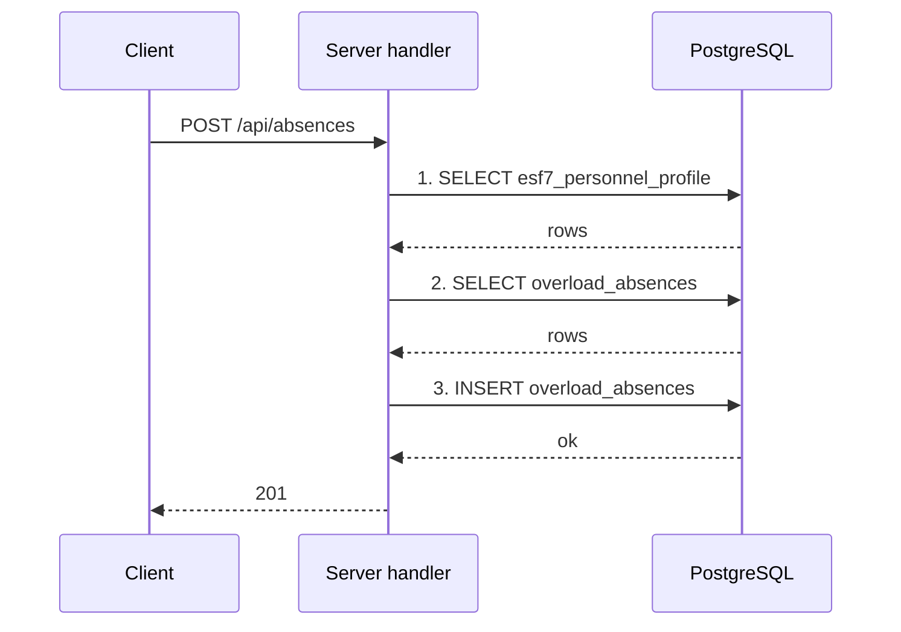
```mermaid
sequenceDiagram
  participant C as Client
  participant S as Server handler
  participant DB as PostgreSQL
  C->>S: POST /api/absences
  S->>DB: 1. SELECT esf7_personnel_profile
  DB-->>S: rows
  S->>DB: 2. SELECT overload_absences
  DB-->>S: rows
  S->>DB: 3. INSERT overload_absences
  DB-->>S: ok
  S-->>C: 201
```

Steps:
1. Client sends `POST /api/absences`.
2. Middleware runs: helmet, cors, express.json, express.urlencoded, devLogger, db.dbMiddleware, apiAuthGate.
3. SELECT esf7_personnel_profile — server/controllers/absences/index.js:114 [direct, high]
4. SELECT overload_absences — server/controllers/absences/index.js:133 [direct, high]
5. INSERT overload_absences (9 columns, ON CONFLICT update) — server/controllers/absences/index.js:161 [direct, high]
6. Response 201 — server/controllers/absences/index.js:162.

**Queries per request:** 3 data queries (2 reads, 1 writes) + 0 transaction-control statements = **3 round trips**.

### DELETE /api/absences/:id

- **Handler:** server/controllers/absences/index.js:177 (inline); **registered at** server/controllers/absences/index.js:177; **confidence:** high
- **Middleware:** helmet, cors, express.json, express.urlencoded, devLogger, db.dbMiddleware, apiAuthGate (auth: yes; rate limit: not seen; validation: not seen)
- **Request fields read in handler:** params.id

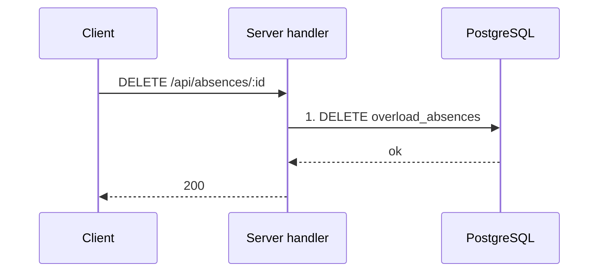
```mermaid
sequenceDiagram
  participant C as Client
  participant S as Server handler
  participant DB as PostgreSQL
  C->>S: DELETE /api/absences/:id
  S->>DB: 1. DELETE overload_absences
  DB-->>S: ok
  S-->>C: 200
```

Steps:
1. Client sends `DELETE /api/absences/:id`.
2. Middleware runs: helmet, cors, express.json, express.urlencoded, devLogger, db.dbMiddleware, apiAuthGate.
3. DELETE overload_absences (0 columns) — server/controllers/absences/index.js:179 [direct, high]
4. Response 200 — server/controllers/absences/index.js:182.

**Queries per request:** 1 data queries (0 reads, 1 writes) + 0 transaction-control statements = **1 round trips**.

### GET /api/allowances

- **Handler:** server/controllers/allowances/index.js:149 (inline); **registered at** server/controllers/allowances/index.js:149; **confidence:** high
- **Middleware:** helmet, cors, express.json, express.urlencoded, devLogger, db.dbMiddleware, apiAuthGate (auth: yes; rate limit: not seen; validation: not seen)
- **Request fields read in handler:** headers.x-school-id, query.schoolId, query.schoolYear, query.school_id, query.school_year (whole body also used)
- **Read by helper functions:** body.payload, body.school, body.schoolHead, body.schoolID, body.schoolId, body.school_id, headers.Authorization, headers.authorization, params.schoolID, params.schoolId, params.school_id, query.schoolID

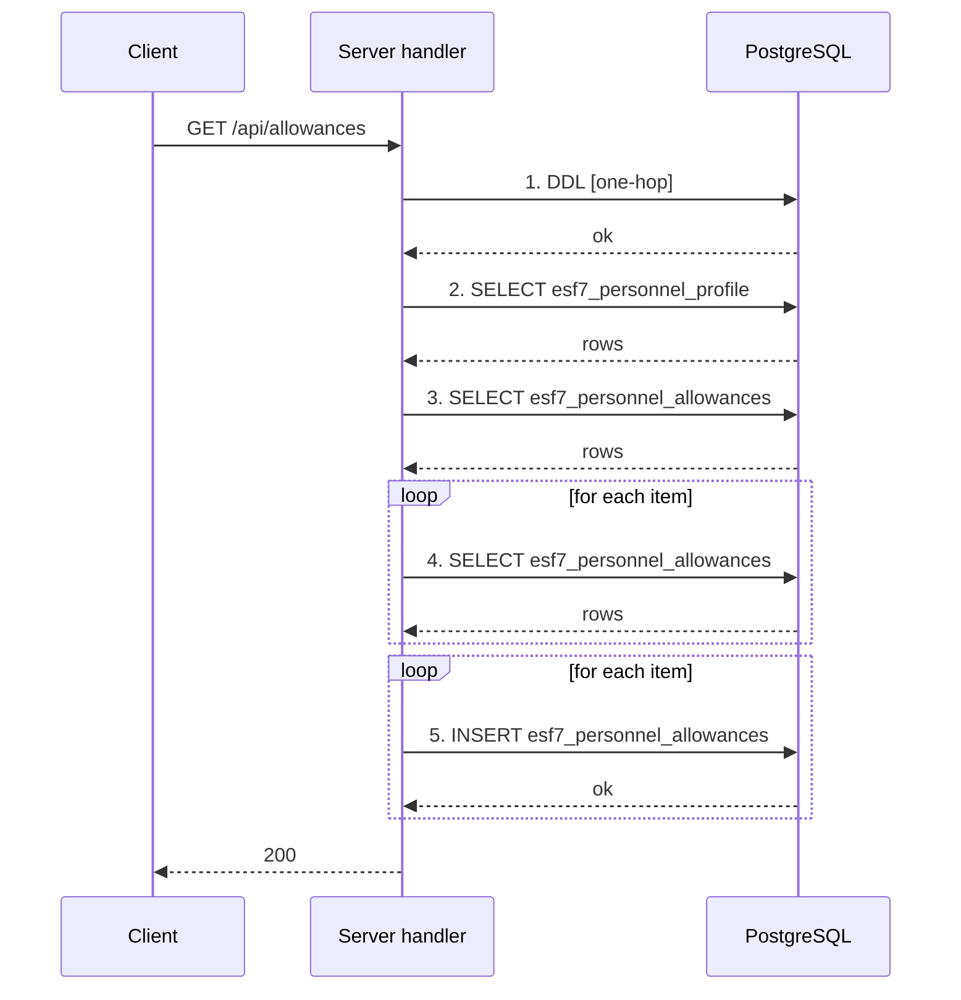
```mermaid
sequenceDiagram
  participant C as Client
  participant S as Server handler
  participant DB as PostgreSQL
  C->>S: GET /api/allowances
  S->>DB: 1. DDL [one-hop]
  DB-->>S: ok
  S->>DB: 2. SELECT esf7_personnel_profile
  DB-->>S: rows
  S->>DB: 3. SELECT esf7_personnel_allowances
  DB-->>S: rows
  loop for each item
  S->>DB: 4. SELECT esf7_personnel_allowances
  DB-->>S: rows
  end
  loop for each item
  S->>DB: 5. INSERT esf7_personnel_allowances
  DB-->>S: ok
  end
  S-->>C: 200
```

Steps:
1. Client sends `GET /api/allowances`.
2. Middleware runs: helmet, cors, express.json, express.urlencoded, devLogger, db.dbMiddleware, apiAuthGate.
3. DDL — server/controllers/allowances/index.js:22 [one-hop, medium]
4. SELECT esf7_personnel_profile — server/controllers/allowances/index.js:162 [direct, high]
5. SELECT esf7_personnel_allowances — server/controllers/allowances/index.js:168 [direct, high]
6. SELECT esf7_personnel_allowances **inside a loop** — server/controllers/allowances/index.js:199 [direct, high]
7. INSERT esf7_personnel_allowances (15 columns, ON CONFLICT update) **inside a loop** — server/controllers/allowances/index.js:205 [direct, high]
8. Response 200 — server/controllers/allowances/index.js:234.

**Queries per request:** 5 data queries (3 reads, 1 writes) + 0 transaction-control statements = **5 round trips**; **2 of these run inside loops (multiplied by item count)**.

### POST /api/allowances/bulk

- **Handler:** server/controllers/allowances/index.js:437 (inline); **registered at** server/controllers/allowances/index.js:437; **confidence:** high
- **Middleware:** helmet, cors, express.json, express.urlencoded, devLogger, db.dbMiddleware, apiAuthGate (auth: yes; rate limit: not seen; validation: not seen)
- **Request fields read in handler:** body.schoolId, body.school_id, headers.x-school-id (whole body also used)
- **Read by helper functions:** body.payload, body.school, body.schoolHead, body.schoolID, headers.Authorization, headers.authorization, params.schoolID, params.schoolId, params.school_id, query.schoolID, query.schoolId, query.school_id

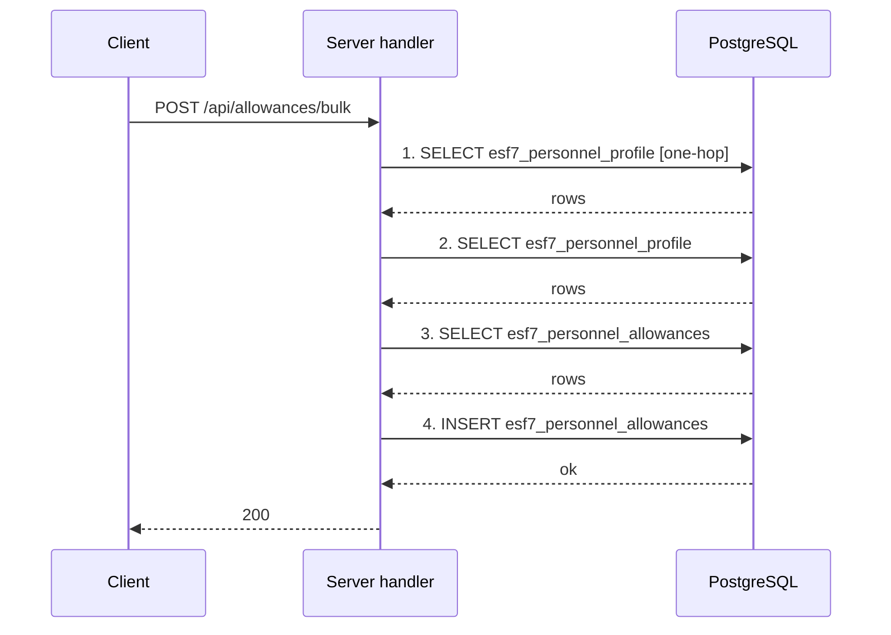
```mermaid
sequenceDiagram
  participant C as Client
  participant S as Server handler
  participant DB as PostgreSQL
  C->>S: POST /api/allowances/bulk
  S->>DB: 1. SELECT esf7_personnel_profile [one-hop]
  DB-->>S: rows
  S->>DB: 2. SELECT esf7_personnel_profile
  DB-->>S: rows
  S->>DB: 3. SELECT esf7_personnel_allowances
  DB-->>S: rows
  S->>DB: 4. INSERT esf7_personnel_allowances
  DB-->>S: ok
  S-->>C: 200
```

Steps:
1. Client sends `POST /api/allowances/bulk`.
2. Middleware runs: helmet, cors, express.json, express.urlencoded, devLogger, db.dbMiddleware, apiAuthGate.
3. SELECT esf7_personnel_profile — server/controllers/allowances/index.js:38 [one-hop, medium]
4. SELECT esf7_personnel_profile — server/controllers/allowances/index.js:454 [direct, high]
5. SELECT esf7_personnel_allowances — server/controllers/allowances/index.js:469 [direct, high]
6. INSERT esf7_personnel_allowances (15 columns, ON CONFLICT update) — server/controllers/allowances/index.js:540 [direct, high]
7. Response 200 — server/controllers/allowances/index.js:558.

**Queries per request:** 4 data queries (3 reads, 1 writes) + 0 transaction-control statements = **4 round trips**.

### POST /api/allowances/disable

- **Handler:** server/controllers/allowances/index.js:371 (inline); **registered at** server/controllers/allowances/index.js:371; **confidence:** high
- **Middleware:** helmet, cors, express.json, express.urlencoded, devLogger, db.dbMiddleware, apiAuthGate (auth: yes; rate limit: not seen; validation: not seen)
- **Request fields read in handler:** body.allowanceKey, body.isDisabled, body.personnelId, body.schoolYear (whole body also used)

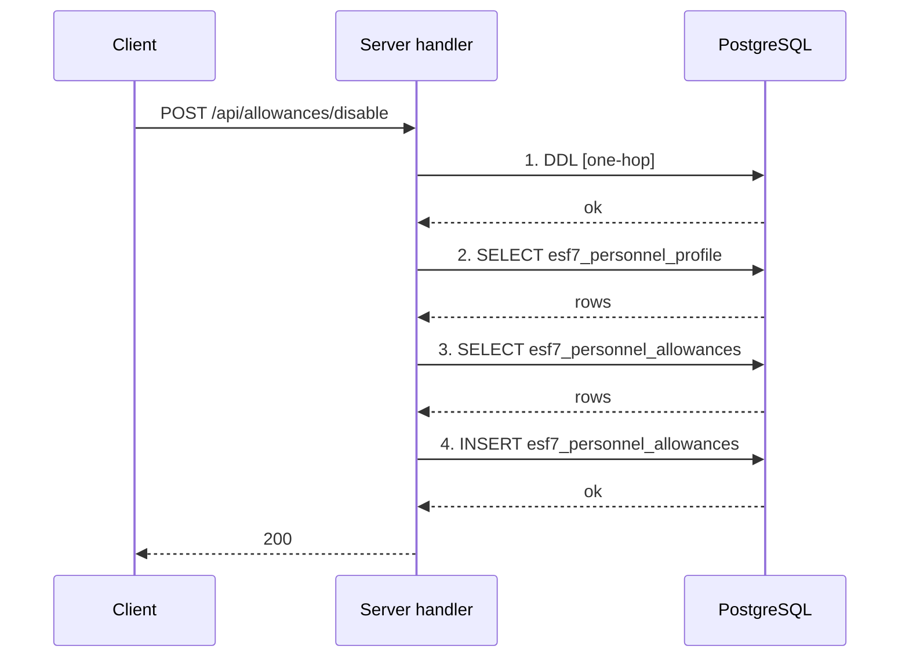
```mermaid
sequenceDiagram
  participant C as Client
  participant S as Server handler
  participant DB as PostgreSQL
  C->>S: POST /api/allowances/disable
  S->>DB: 1. DDL [one-hop]
  DB-->>S: ok
  S->>DB: 2. SELECT esf7_personnel_profile
  DB-->>S: rows
  S->>DB: 3. SELECT esf7_personnel_allowances
  DB-->>S: rows
  S->>DB: 4. INSERT esf7_personnel_allowances
  DB-->>S: ok
  S-->>C: 200
```

Steps:
1. Client sends `POST /api/allowances/disable`.
2. Middleware runs: helmet, cors, express.json, express.urlencoded, devLogger, db.dbMiddleware, apiAuthGate.
3. DDL — server/controllers/allowances/index.js:22 [one-hop, medium]
4. SELECT esf7_personnel_profile — server/controllers/allowances/index.js:389 [direct, high]
5. SELECT esf7_personnel_allowances — server/controllers/allowances/index.js:399 [direct, high]
6. INSERT esf7_personnel_allowances (0 columns, ON CONFLICT update, multi-row) — server/controllers/allowances/index.js:404 [direct, high]
7. Response 200 — server/controllers/allowances/index.js:428.

**Queries per request:** 4 data queries (2 reads, 1 writes) + 0 transaction-control statements = **4 round trips**.

### POST /api/allowances/toggle

- **Handler:** server/controllers/allowances/index.js:248 (inline); **registered at** server/controllers/allowances/index.js:248; **confidence:** high
- **Middleware:** helmet, cors, express.json, express.urlencoded, devLogger, db.dbMiddleware, apiAuthGate (auth: yes; rate limit: not seen; validation: not seen)
- **Request fields read in handler:** body.allowanceKey, body.amount, body.isGranted, body.personnelId, body.schoolId, body.schoolYear, body.school_id, headers.x-school-id (whole body also used)
- **Read by helper functions:** body.payload, body.school, body.schoolHead, body.schoolID, headers.Authorization, headers.authorization, params.schoolID, params.schoolId, params.school_id, query.schoolID, query.schoolId, query.school_id

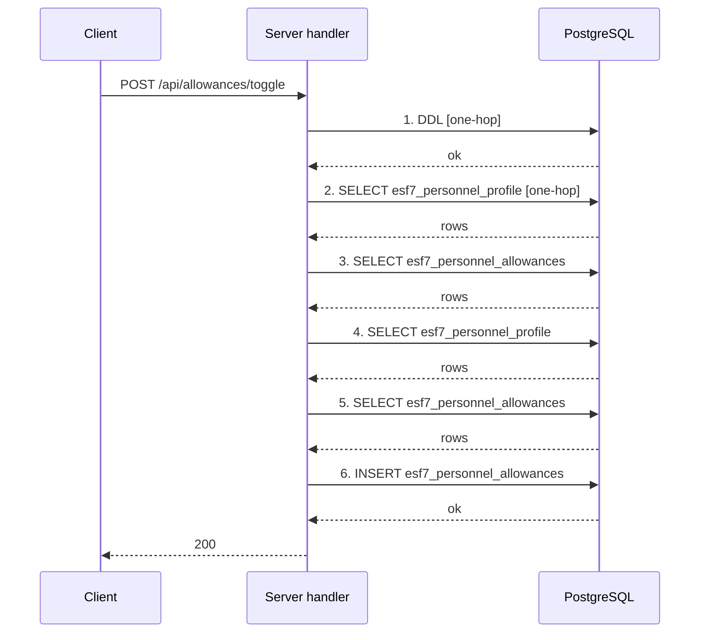
```mermaid
sequenceDiagram
  participant C as Client
  participant S as Server handler
  participant DB as PostgreSQL
  C->>S: POST /api/allowances/toggle
  S->>DB: 1. DDL [one-hop]
  DB-->>S: ok
  S->>DB: 2. SELECT esf7_personnel_profile [one-hop]
  DB-->>S: rows
  S->>DB: 3. SELECT esf7_personnel_allowances
  DB-->>S: rows
  S->>DB: 4. SELECT esf7_personnel_profile
  DB-->>S: rows
  S->>DB: 5. SELECT esf7_personnel_allowances
  DB-->>S: rows
  S->>DB: 6. INSERT esf7_personnel_allowances
  DB-->>S: ok
  S-->>C: 200
```

Steps:
1. Client sends `POST /api/allowances/toggle`.
2. Middleware runs: helmet, cors, express.json, express.urlencoded, devLogger, db.dbMiddleware, apiAuthGate.
3. DDL — server/controllers/allowances/index.js:22 [one-hop, medium]
4. SELECT esf7_personnel_profile — server/controllers/allowances/index.js:38 [one-hop, medium]
5. SELECT esf7_personnel_allowances — server/controllers/allowances/index.js:278 [direct, high]
6. SELECT esf7_personnel_profile — server/controllers/allowances/index.js:306 [direct, high]
7. SELECT esf7_personnel_allowances — server/controllers/allowances/index.js:321 [direct, high]
8. INSERT esf7_personnel_allowances (7 columns, ON CONFLICT update) — server/controllers/allowances/index.js:348 [direct, low]
9. Response 200 — server/controllers/allowances/index.js:358.

**Queries per request:** 6 data queries (4 reads, 1 writes) + 0 transaction-control statements = **6 round trips**.

> Note: The INSERT at server/controllers/allowances/index.js:348 picks its flag and amount columns at runtime (${hasCol}, ${amtCol}); the fixed columns are id, personnel_id, school_id, school_year, raw_payload.

### POST /api/auth/master-login

- **Handler:** server/controllers/auth/index.js:144 (handlePasswordLogin); **registered at** server/controllers/auth/index.js:570; **confidence:** high
- **Middleware:** authLimiter, validateRequest, helmet, cors, express.json, express.urlencoded, devLogger, db.dbMiddleware, apiAuthGate (auth: yes; rate limit: yes; validation: yes)
- **Request fields read in handler:** body.identifier, body.password, body.school_id (whole body also used)

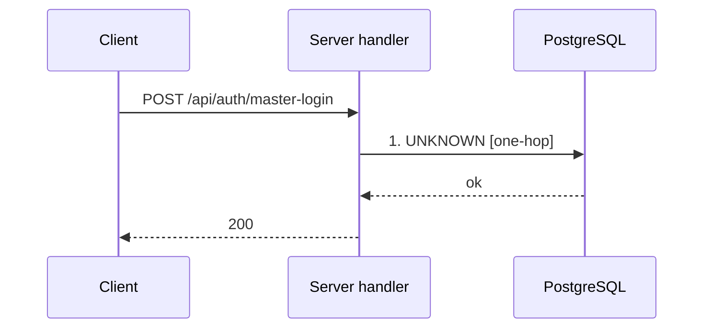
```mermaid
sequenceDiagram
  participant C as Client
  participant S as Server handler
  participant DB as PostgreSQL
  C->>S: POST /api/auth/master-login
  S->>DB: 1. UNKNOWN [one-hop]
  DB-->>S: ok
  S-->>C: 200
```

Steps:
1. Client sends `POST /api/auth/master-login`.
2. Middleware runs: authLimiter, validateRequest, helmet, cors, express.json, express.urlencoded, devLogger, db.dbMiddleware, apiAuthGate.
3. UNKNOWN — server/db/index.js:367 [one-hop, low]
4. Response 200 — server/controllers/auth/index.js:179.

**Queries per request:** 1 data queries (0 reads, 0 writes) + 0 transaction-control statements = **1 round trips**.

### POST /api/auth/migrate-login

- **Handler:** server/controllers/auth/index.js:144 (handlePasswordLogin); **registered at** server/controllers/auth/index.js:564; **confidence:** high
- **Middleware:** authLimiter, validateRequest, helmet, cors, express.json, express.urlencoded, devLogger, db.dbMiddleware, apiAuthGate (auth: yes; rate limit: yes; validation: yes)
- **Request fields read in handler:** body.identifier, body.password, body.school_id (whole body also used)

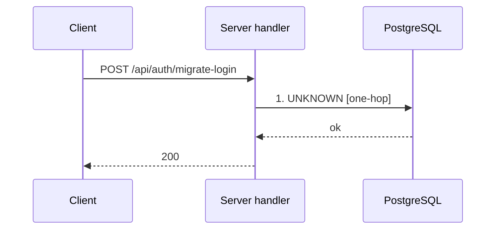
```mermaid
sequenceDiagram
  participant C as Client
  participant S as Server handler
  participant DB as PostgreSQL
  C->>S: POST /api/auth/migrate-login
  S->>DB: 1. UNKNOWN [one-hop]
  DB-->>S: ok
  S-->>C: 200
```

Steps:
1. Client sends `POST /api/auth/migrate-login`.
2. Middleware runs: authLimiter, validateRequest, helmet, cors, express.json, express.urlencoded, devLogger, db.dbMiddleware, apiAuthGate.
3. UNKNOWN — server/db/index.js:367 [one-hop, low]
4. Response 200 — server/controllers/auth/index.js:179.

**Queries per request:** 1 data queries (0 reads, 0 writes) + 0 transaction-control statements = **1 round trips**.

### POST /api/auth/passcode-login

- **Handler:** server/controllers/auth/index.js:329 (handlePasscodeLogin); **registered at** server/controllers/auth/index.js:583; **confidence:** high
- **Middleware:** passcodeLimiter, validateRequest, helmet, cors, express.json, express.urlencoded, devLogger, db.dbMiddleware, apiAuthGate (auth: yes; rate limit: yes; validation: yes)
- **Request fields read in handler:** body.email, body.identifier, body.passcode, body.pin, body.school_id (whole body also used)

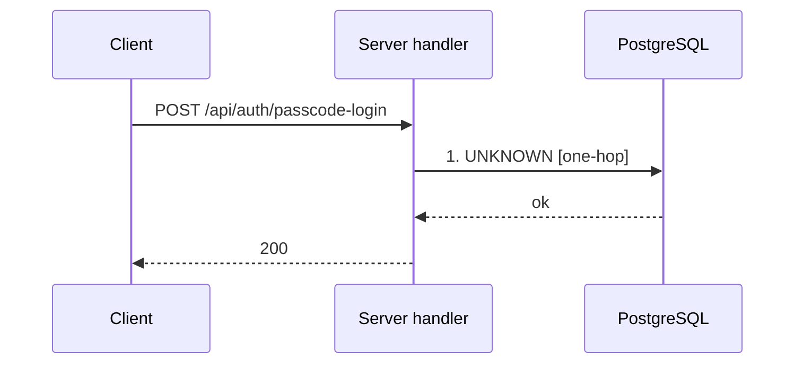
```mermaid
sequenceDiagram
  participant C as Client
  participant S as Server handler
  participant DB as PostgreSQL
  C->>S: POST /api/auth/passcode-login
  S->>DB: 1. UNKNOWN [one-hop]
  DB-->>S: ok
  S-->>C: 200
```

Steps:
1. Client sends `POST /api/auth/passcode-login`.
2. Middleware runs: passcodeLimiter, validateRequest, helmet, cors, express.json, express.urlencoded, devLogger, db.dbMiddleware, apiAuthGate.
3. UNKNOWN — server/db/index.js:367 [one-hop, low]
4. Response 200 — server/controllers/auth/index.js:367.

**Queries per request:** 1 data queries (0 reads, 0 writes) + 0 transaction-control statements = **1 round trips**.

### POST /api/auth/password-login

- **Handler:** server/controllers/auth/index.js:144 (handlePasswordLogin); **registered at** server/controllers/auth/index.js:576; **confidence:** high
- **Middleware:** authLimiter, validateRequest, helmet, cors, express.json, express.urlencoded, devLogger, db.dbMiddleware, apiAuthGate (auth: yes; rate limit: yes; validation: yes)
- **Request fields read in handler:** body.identifier, body.password, body.school_id (whole body also used)

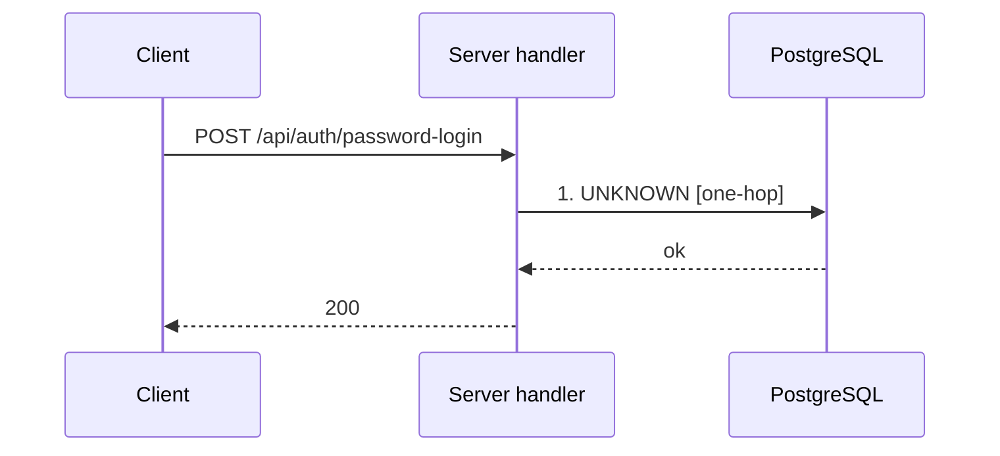
```mermaid
sequenceDiagram
  participant C as Client
  participant S as Server handler
  participant DB as PostgreSQL
  C->>S: POST /api/auth/password-login
  S->>DB: 1. UNKNOWN [one-hop]
  DB-->>S: ok
  S-->>C: 200
```

Steps:
1. Client sends `POST /api/auth/password-login`.
2. Middleware runs: authLimiter, validateRequest, helmet, cors, express.json, express.urlencoded, devLogger, db.dbMiddleware, apiAuthGate.
3. UNKNOWN — server/db/index.js:367 [one-hop, low]
4. Response 200 — server/controllers/auth/index.js:179.

**Queries per request:** 1 data queries (0 reads, 0 writes) + 0 transaction-control statements = **1 round trips**.

### POST /api/auth/pin-login

- **Handler:** server/controllers/auth/index.js:329 (handlePasscodeLogin); **registered at** server/controllers/auth/index.js:589; **confidence:** high
- **Middleware:** passcodeLimiter, validateRequest, helmet, cors, express.json, express.urlencoded, devLogger, db.dbMiddleware, apiAuthGate (auth: yes; rate limit: yes; validation: yes)
- **Request fields read in handler:** body.email, body.identifier, body.passcode, body.pin, body.school_id (whole body also used)

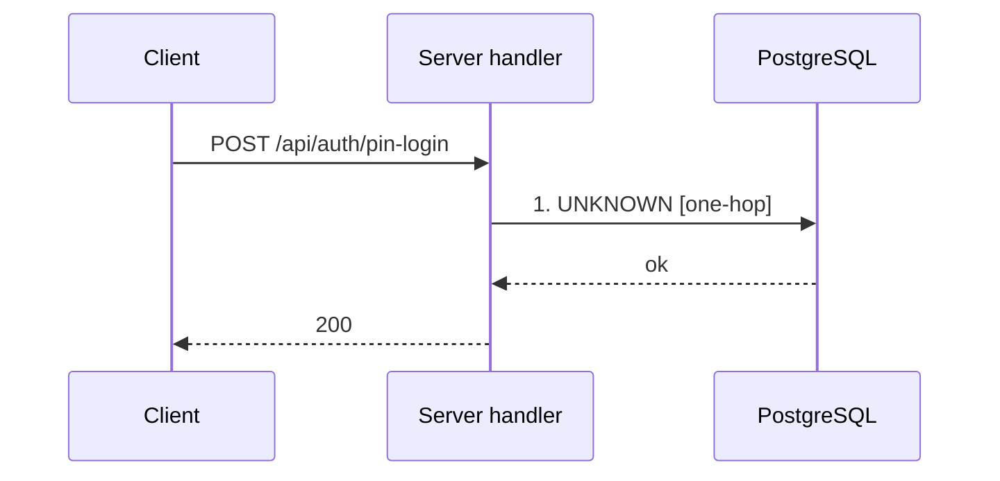
```mermaid
sequenceDiagram
  participant C as Client
  participant S as Server handler
  participant DB as PostgreSQL
  C->>S: POST /api/auth/pin-login
  S->>DB: 1. UNKNOWN [one-hop]
  DB-->>S: ok
  S-->>C: 200
```

Steps:
1. Client sends `POST /api/auth/pin-login`.
2. Middleware runs: passcodeLimiter, validateRequest, helmet, cors, express.json, express.urlencoded, devLogger, db.dbMiddleware, apiAuthGate.
3. UNKNOWN — server/db/index.js:367 [one-hop, low]
4. Response 200 — server/controllers/auth/index.js:367.

**Queries per request:** 1 data queries (0 reads, 0 writes) + 0 transaction-control statements = **1 round trips**.

### POST /api/auth/verify-passcode

- **Handler:** server/controllers/auth/index.js:601 (inline); **registered at** server/controllers/auth/index.js:597; **confidence:** high
- **Middleware:** passcodeLimiter, validateRequest, helmet, cors, express.json, express.urlencoded, devLogger, db.dbMiddleware, apiAuthGate (auth: yes; rate limit: yes; validation: yes)
- **Request fields read in handler:** none seen

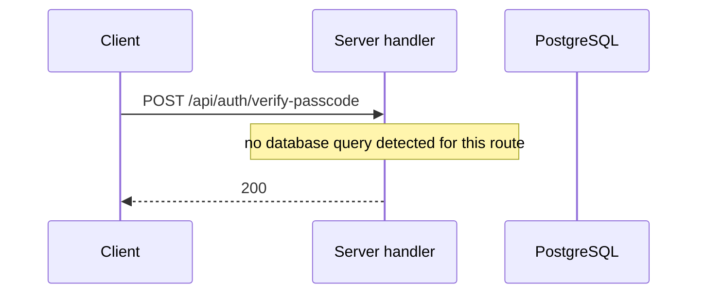
```mermaid
sequenceDiagram
  participant C as Client
  participant S as Server handler
  participant DB as PostgreSQL
  C->>S: POST /api/auth/verify-passcode
  Note over S: no database query detected for this route
  S-->>C: 200
```

Steps:
1. Client sends `POST /api/auth/verify-passcode`.
2. Middleware runs: passcodeLimiter, validateRequest, helmet, cors, express.json, express.urlencoded, devLogger, db.dbMiddleware, apiAuthGate.
3. Response 200 — server/controllers/auth/index.js:602.

**Queries per request:** 0 data queries (0 reads, 0 writes) + 0 transaction-control statements = **0 round trips**.

### POST /api/designations

- **Handler:** server/controllers/personnel_designations/index.js:110 (inline); **registered at** server/controllers/personnel_designations/index.js:110; **confidence:** high
- **Also mounted at:** /api/personnel-designations
- **Middleware:** helmet, cors, express.json, express.urlencoded, devLogger, db.dbMiddleware, apiAuthGate (auth: yes; rate limit: not seen; validation: not seen)
- **Request fields read in handler:** body.designation, body.designationName, body.designation_name, body.gradeLevel, body.grade_level, body.id, body.isSdsApproved, body.is_sds_approved, body.keyStage, body.key_stage, body.personnelId, body.personnel_id, body.sdsConfirmed, body.sds_confirmed, body.serializedKey, body.serialized_key, body.subjectArea, body.subject_area, body.track (whole body also used)

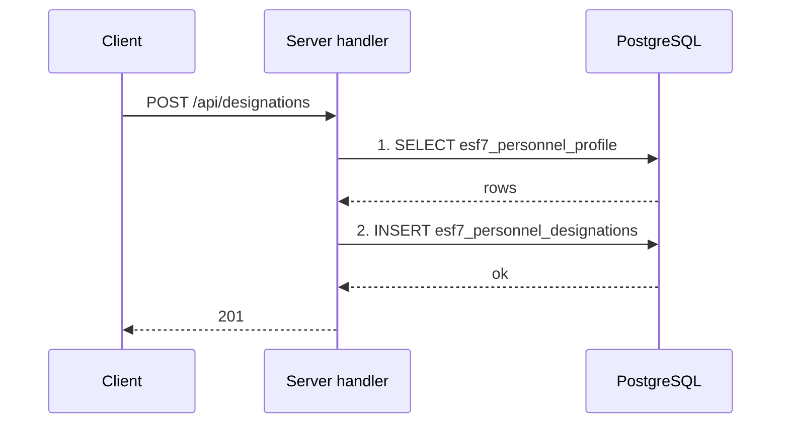
```mermaid
sequenceDiagram
  participant C as Client
  participant S as Server handler
  participant DB as PostgreSQL
  C->>S: POST /api/designations
  S->>DB: 1. SELECT esf7_personnel_profile
  DB-->>S: rows
  S->>DB: 2. INSERT esf7_personnel_designations
  DB-->>S: ok
  S-->>C: 201
```

Steps:
1. Client sends `POST /api/designations`.
2. Middleware runs: helmet, cors, express.json, express.urlencoded, devLogger, db.dbMiddleware, apiAuthGate.
3. SELECT esf7_personnel_profile — server/controllers/personnel_designations/index.js:138 [direct, high]
4. INSERT esf7_personnel_designations (11 columns) — server/controllers/personnel_designations/index.js:190 [direct, high]
5. Response 201 — server/controllers/personnel_designations/index.js:191.

**Queries per request:** 2 data queries (1 reads, 1 writes) + 0 transaction-control statements = **2 round trips**.

### DELETE /api/designations/:id

- **Handler:** server/controllers/personnel_designations/index.js:199 (inline); **registered at** server/controllers/personnel_designations/index.js:199; **confidence:** high
- **Also mounted at:** /api/personnel-designations/:id
- **Middleware:** helmet, cors, express.json, express.urlencoded, devLogger, db.dbMiddleware, apiAuthGate (auth: yes; rate limit: not seen; validation: not seen)
- **Request fields read in handler:** params.id

```mermaid
sequenceDiagram
  participant C as Client
  participant S as Server handler
  participant DB as PostgreSQL
  C->>S: DELETE /api/designations/:id
  S->>DB: 1. DELETE esf7_personnel_designations
  DB-->>S: ok
  S-->>C: 200
```

Steps:
1. Client sends `DELETE /api/designations/:id`.
2. Middleware runs: helmet, cors, express.json, express.urlencoded, devLogger, db.dbMiddleware, apiAuthGate.
3. DELETE esf7_personnel_designations (0 columns) — server/controllers/personnel_designations/index.js:201 [direct, high]
4. Response 200 — server/controllers/personnel_designations/index.js:204.

**Queries per request:** 1 data queries (0 reads, 1 writes) + 0 transaction-control statements = **1 round trips**.

### POST /api/employment/:personnel_id

- **Handler:** server/controllers/personnel_employment/index.js:183 (inline); **registered at** server/controllers/personnel_employment/index.js:183; **confidence:** high
- **Middleware:** helmet, cors, express.json, express.urlencoded, devLogger, db.dbMiddleware, apiAuthGate (auth: yes; rate limit: not seen; validation: not seen)
- **Request fields read in handler:** body.assignedGradeLevels, body.assignedSchools, body.assigned_grade_levels, body.assigned_schools, body.deploymentStatus, body.deployment_status, body.firstServiceDate, body.first_service_date, body.fundSource, body.fund_source, body.gradeLevelsTaught, body.grade_levels_taught, body.hiringArrangement, body.hiring_arrangement, body.lastLateralMovementDate, body.lastPromotionDate, body.last_lateral_movement_date, body.last_promotion_date, body.natureOfAppointment, body.nature_of_appointment, body.newStationDate, body.new_station_date, body.position, body.positionCategory, body.position_category, body.stepIncrement, body.step_increment, params.personnel_id (whole body also used)

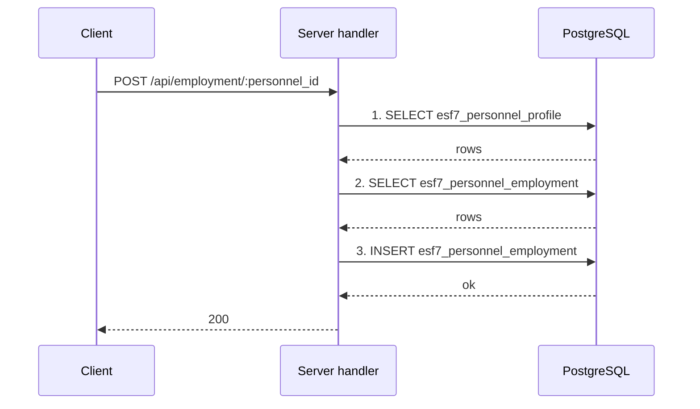
```mermaid
sequenceDiagram
  participant C as Client
  participant S as Server handler
  participant DB as PostgreSQL
  C->>S: POST /api/employment/:personnel_id
  S->>DB: 1. SELECT esf7_personnel_profile
  DB-->>S: rows
  S->>DB: 2. SELECT esf7_personnel_employment
  DB-->>S: rows
  S->>DB: 3. INSERT esf7_personnel_employment
  DB-->>S: ok
  S-->>C: 200
```

Steps:
1. Client sends `POST /api/employment/:personnel_id`.
2. Middleware runs: helmet, cors, express.json, express.urlencoded, devLogger, db.dbMiddleware, apiAuthGate.
3. SELECT esf7_personnel_profile — server/controllers/personnel_employment/index.js:217 [direct, high]
4. SELECT esf7_personnel_employment — server/controllers/personnel_employment/index.js:226 [direct, high]
5. INSERT esf7_personnel_employment (16 columns, ON CONFLICT update) — server/controllers/personnel_employment/index.js:312 [direct, high]
6. Response 200 — server/controllers/personnel_employment/index.js:313.

**Queries per request:** 3 data queries (2 reads, 1 writes) + 0 transaction-control statements = **3 round trips**.

### PUT /api/employment/:personnel_id

- **Handler:** server/controllers/personnel_employment/index.js:321 (inline); **registered at** server/controllers/personnel_employment/index.js:321; **confidence:** high (manual link)
- **Middleware:** helmet, cors, express.json, express.urlencoded, devLogger, db.dbMiddleware, apiAuthGate (auth: yes; rate limit: not seen; validation: not seen)
- **Request fields read in handler:** none seen

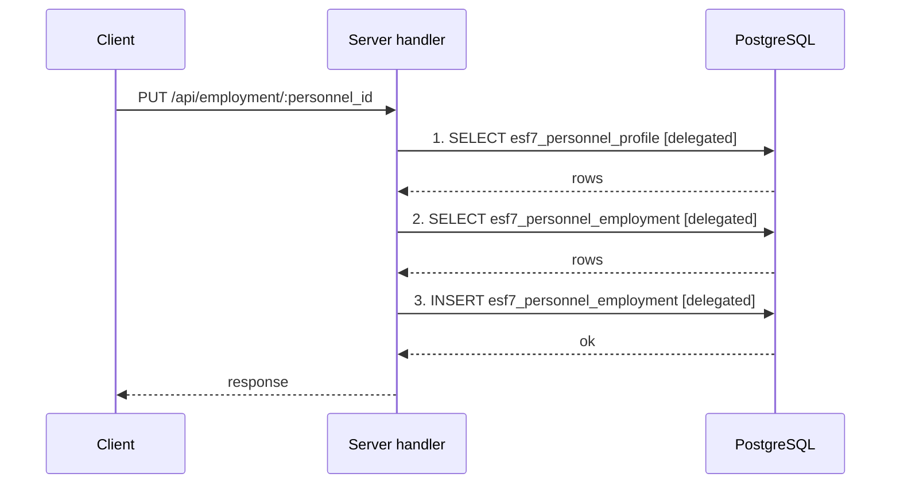
```mermaid
sequenceDiagram
  participant C as Client
  participant S as Server handler
  participant DB as PostgreSQL
  C->>S: PUT /api/employment/:personnel_id
  S->>DB: 1. SELECT esf7_personnel_profile [delegated]
  DB-->>S: rows
  S->>DB: 2. SELECT esf7_personnel_employment [delegated]
  DB-->>S: rows
  S->>DB: 3. INSERT esf7_personnel_employment [delegated]
  DB-->>S: ok
  S-->>C: response
```

Steps:
1. Client sends `PUT /api/employment/:personnel_id`.
2. Middleware runs: helmet, cors, express.json, express.urlencoded, devLogger, db.dbMiddleware, apiAuthGate.
3. SELECT esf7_personnel_profile — server/controllers/personnel_employment/index.js:217 [delegated, medium]
4. SELECT esf7_personnel_employment — server/controllers/personnel_employment/index.js:226 [delegated, medium]
5. INSERT esf7_personnel_employment (16 columns, ON CONFLICT update) — server/controllers/personnel_employment/index.js:312 [delegated, medium]
6. Response.

**Queries per request:** 3 data queries (2 reads, 1 writes) + 0 transaction-control statements = **3 round trips**.

> Note: Delegates to POST /api/employment/:personnel_id (manual link).
> Note: server/controllers/personnel_employment/index.js:321 re-dispatches to the POST handler with router.handle, so the PUT does the same work.

### POST /api/esf7-upload

- **Handler:** server/controllers/esf7_upload/index.js:246 (inline); **registered at** server/controllers/esf7_upload/index.js:246; **confidence:** high
- **Middleware:** upload.single, helmet, cors, express.json, express.urlencoded, devLogger, db.dbMiddleware, apiAuthGate (auth: yes; rate limit: not seen; validation: not seen)
- **Request fields read in handler:** body.schoolId, body.school_id

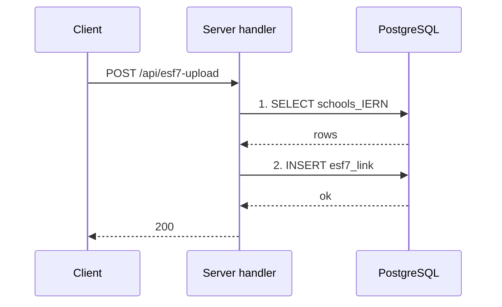
```mermaid
sequenceDiagram
  participant C as Client
  participant S as Server handler
  participant DB as PostgreSQL
  C->>S: POST /api/esf7-upload
  S->>DB: 1. SELECT schools_IERN
  DB-->>S: rows
  S->>DB: 2. INSERT esf7_link
  DB-->>S: ok
  S-->>C: 200
```

Steps:
1. Client sends `POST /api/esf7-upload`.
2. Middleware runs: upload.single, helmet, cors, express.json, express.urlencoded, devLogger, db.dbMiddleware, apiAuthGate.
3. SELECT schools_IERN — server/controllers/esf7_upload/index.js:283 [direct, high]
4. INSERT esf7_link (8 columns, ON CONFLICT update) — server/controllers/esf7_upload/index.js:313 [direct, high]
5. Response 200 — server/controllers/esf7_upload/index.js:324.

**Queries per request:** 2 data queries (1 reads, 1 writes) + 0 transaction-control statements = **2 round trips**.

### POST /api/esf7-upload/import-converted

- **Handler:** server/controllers/esf7_upload/index.js:341 (inline); **registered at** server/controllers/esf7_upload/index.js:341; **confidence:** high
- **Middleware:** helmet, cors, express.json, express.urlencoded, devLogger, db.dbMiddleware, apiAuthGate (auth: yes; rate limit: not seen; validation: not seen)
- **Request fields read in handler:** body.old_school_id, body.school_id (whole body also used)

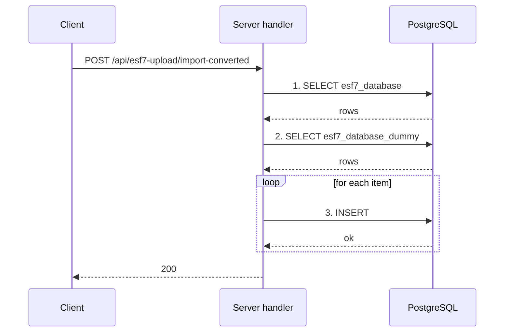
```mermaid
sequenceDiagram
  participant C as Client
  participant S as Server handler
  participant DB as PostgreSQL
  C->>S: POST /api/esf7-upload/import-converted
  S->>DB: 1. SELECT esf7_database
  DB-->>S: rows
  S->>DB: 2. SELECT esf7_database_dummy
  DB-->>S: rows
  loop for each item
  S->>DB: 3. INSERT
  DB-->>S: ok
  end
  S-->>C: 200
```

Steps:
1. Client sends `POST /api/esf7-upload/import-converted`.
2. Middleware runs: helmet, cors, express.json, express.urlencoded, devLogger, db.dbMiddleware, apiAuthGate.
3. SELECT esf7_database — server/controllers/esf7_upload/index.js:365 [direct, high]
4. SELECT esf7_database_dummy — server/controllers/esf7_upload/index.js:371 [direct, high]
5. INSERT (0 columns, ON CONFLICT nothing) **inside a loop** — server/controllers/esf7_upload/index.js:397 [direct, low]
6. Response 200 — server/controllers/esf7_upload/index.js:409.

**Queries per request:** 3 data queries (2 reads, 1 writes) + 0 transaction-control statements = **3 round trips**; **1 of these run inside loops (multiplied by item count)**.

### DELETE /api/extra-tasks/:id

- **Handler:** server/controllers/personnel_extra_tasks/index.js:140 (inline); **registered at** server/controllers/personnel_extra_tasks/index.js:140; **confidence:** high
- **Middleware:** helmet, cors, express.json, express.urlencoded, devLogger, db.dbMiddleware, apiAuthGate (auth: yes; rate limit: not seen; validation: not seen)
- **Request fields read in handler:** params.id

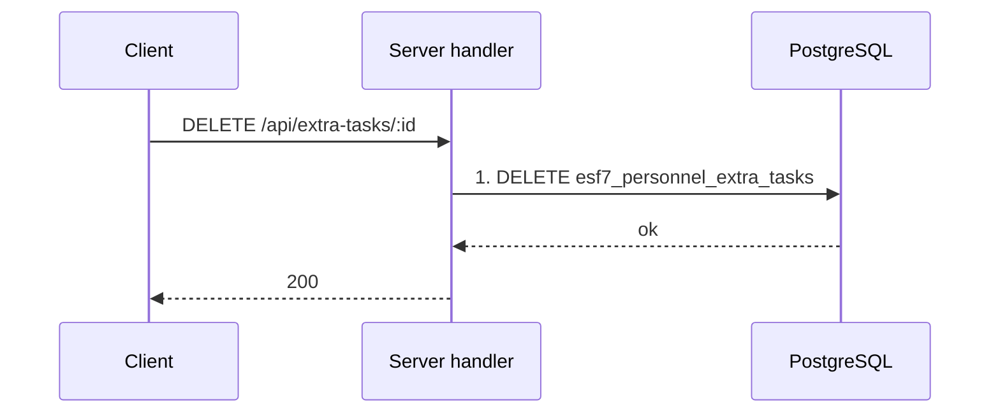
```mermaid
sequenceDiagram
  participant C as Client
  participant S as Server handler
  participant DB as PostgreSQL
  C->>S: DELETE /api/extra-tasks/:id
  S->>DB: 1. DELETE esf7_personnel_extra_tasks
  DB-->>S: ok
  S-->>C: 200
```

Steps:
1. Client sends `DELETE /api/extra-tasks/:id`.
2. Middleware runs: helmet, cors, express.json, express.urlencoded, devLogger, db.dbMiddleware, apiAuthGate.
3. DELETE esf7_personnel_extra_tasks (0 columns) — server/controllers/personnel_extra_tasks/index.js:143 [direct, high]
4. Response 200 — server/controllers/personnel_extra_tasks/index.js:146.

**Queries per request:** 1 data queries (0 reads, 1 writes) + 0 transaction-control statements = **1 round trips**.

### POST /api/extra-tasks/batch

- **Handler:** server/controllers/personnel_extra_tasks/index.js:67 (inline); **registered at** server/controllers/personnel_extra_tasks/index.js:67; **confidence:** high
- **Middleware:** helmet, cors, express.json, express.urlencoded, devLogger, db.dbMiddleware, apiAuthGate (auth: yes; rate limit: not seen; validation: not seen)
- **Request fields read in handler:** body.personnelId, body.personnel_id, body.schoolId, body.schoolYear, body.school_id, body.school_year, body.tasks (whole body also used)
- **Read by helper functions:** body.payload, body.school, body.schoolHead, body.schoolID, headers.Authorization, headers.authorization, headers.x-school-id, params.schoolID, params.schoolId, params.school_id, query.schoolID, query.schoolId, query.school_id

```mermaid
sequenceDiagram
  participant C as Client
  participant S as Server handler
  participant DB as PostgreSQL
  C->>S: POST /api/extra-tasks/batch
  S->>DB: 1. DELETE esf7_personnel_extra_tasks
  DB-->>S: ok
  loop for each item
  S->>DB: 2. INSERT esf7_personnel_extra_tasks
  DB-->>S: ok
  end
  S-->>C: 200
```

Steps:
1. Client sends `POST /api/extra-tasks/batch`.
2. Middleware runs: helmet, cors, express.json, express.urlencoded, devLogger, db.dbMiddleware, apiAuthGate.
3. DELETE esf7_personnel_extra_tasks (0 columns) — server/controllers/personnel_extra_tasks/index.js:84 [direct, high]
4. INSERT esf7_personnel_extra_tasks (10 columns) **inside a loop** — server/controllers/personnel_extra_tasks/index.js:106 [direct, high]
5. Response 200 — server/controllers/personnel_extra_tasks/index.js:128.

**Queries per request:** 2 data queries (0 reads, 2 writes) + 0 transaction-control statements = **2 round trips**; **1 of these run inside loops (multiplied by item count)**.

### POST /api/learning-areas/:personnel_id

- **Handler:** server/controllers/personnel_learning_areas/index.js:176 (inline); **registered at** server/controllers/personnel_learning_areas/index.js:176; **confidence:** high
- **Also mounted at:** /api/personnel-learning-areas/:personnel_id
- **Middleware:** helmet, cors, express.json, express.urlencoded, devLogger, db.dbMiddleware, apiAuthGate (auth: yes; rate limit: not seen; validation: not seen)
- **Request fields read in handler:** body.learningAreaMap, body.matrix_data, params.personnel_id (whole body also used)

```mermaid
sequenceDiagram
  participant C as Client
  participant S as Server handler
  participant DB as PostgreSQL
  C->>S: POST /api/learning-areas/:personnel_id
  S->>DB: 1. SELECT esf7_personnel_profile
  DB-->>S: rows
  S->>DB: 2. INSERT esf7_personnel_profile
  DB-->>S: ok
  S->>DB: 3. SELECT esf7_personnel_learning_areas
  DB-->>S: rows
  S->>DB: 4. INSERT esf7_personnel_learning_areas
  DB-->>S: ok
  S->>DB: 5. UNKNOWN [one-hop]
  DB-->>S: ok
  S-->>C: 200
```

Steps:
1. Client sends `POST /api/learning-areas/:personnel_id`.
2. Middleware runs: helmet, cors, express.json, express.urlencoded, devLogger, db.dbMiddleware, apiAuthGate.
3. SELECT esf7_personnel_profile — server/controllers/personnel_learning_areas/index.js:182 [direct, high]
4. INSERT esf7_personnel_profile (9 columns, ON CONFLICT nothing) — server/controllers/personnel_learning_areas/index.js:227 [direct, high]
5. SELECT esf7_personnel_learning_areas — server/controllers/personnel_learning_areas/index.js:236 [direct, high]
6. INSERT esf7_personnel_learning_areas (5 columns, ON CONFLICT update) — server/controllers/personnel_learning_areas/index.js:252 [direct, high]
7. UNKNOWN — server/db/index.js:367 [one-hop, low]
8. Response 200 — server/controllers/personnel_learning_areas/index.js:259.

**Queries per request:** 5 data queries (2 reads, 2 writes) + 0 transaction-control statements = **5 round trips**.

### PUT /api/learning-areas/:personnel_id

- **Handler:** server/controllers/personnel_learning_areas/index.js:267 (inline); **registered at** server/controllers/personnel_learning_areas/index.js:267; **confidence:** high (manual link)
- **Also mounted at:** /api/personnel-learning-areas/:personnel_id
- **Middleware:** helmet, cors, express.json, express.urlencoded, devLogger, db.dbMiddleware, apiAuthGate (auth: yes; rate limit: not seen; validation: not seen)
- **Request fields read in handler:** none seen

```mermaid
sequenceDiagram
  participant C as Client
  participant S as Server handler
  participant DB as PostgreSQL
  C->>S: PUT /api/learning-areas/:personnel_id
  S->>DB: 1. SELECT esf7_personnel_profile [delegated]
  DB-->>S: rows
  S->>DB: 2. INSERT esf7_personnel_profile [delegated]
  DB-->>S: ok
  S->>DB: 3. SELECT esf7_personnel_learning_areas [delegated]
  DB-->>S: rows
  S->>DB: 4. INSERT esf7_personnel_learning_areas [delegated]
  DB-->>S: ok
  S->>DB: 5. UNKNOWN [delegated]
  DB-->>S: ok
  S-->>C: response
```

Steps:
1. Client sends `PUT /api/learning-areas/:personnel_id`.
2. Middleware runs: helmet, cors, express.json, express.urlencoded, devLogger, db.dbMiddleware, apiAuthGate.
3. SELECT esf7_personnel_profile — server/controllers/personnel_learning_areas/index.js:182 [delegated, medium]
4. INSERT esf7_personnel_profile (9 columns, ON CONFLICT nothing) — server/controllers/personnel_learning_areas/index.js:227 [delegated, medium]
5. SELECT esf7_personnel_learning_areas — server/controllers/personnel_learning_areas/index.js:236 [delegated, medium]
6. INSERT esf7_personnel_learning_areas (5 columns, ON CONFLICT update) — server/controllers/personnel_learning_areas/index.js:252 [delegated, medium]
7. UNKNOWN — server/db/index.js:367 [delegated, medium]
8. Response.

**Queries per request:** 5 data queries (2 reads, 2 writes) + 0 transaction-control statements = **5 round trips**.

> Note: Delegates to POST /api/learning-areas/:personnel_id (manual link).
> Note: PUT re-dispatches to the POST handler (same pattern as employment); verified by the PUT handler body being a single router.handle call.

### POST /api/learning-areas/toggle

- **Handler:** server/controllers/personnel_learning_areas/index.js:41 (inline); **registered at** server/controllers/personnel_learning_areas/index.js:41; **confidence:** high
- **Also mounted at:** /api/personnel-learning-areas/toggle
- **Middleware:** helmet, cors, express.json, express.urlencoded, devLogger, db.dbMiddleware, apiAuthGate (auth: yes; rate limit: not seen; validation: not seen)
- **Request fields read in handler:** body.checked, body.learningArea, body.personnelId, body.schoolYear, body.yearsTaught (whole body also used)

```mermaid
sequenceDiagram
  participant C as Client
  participant S as Server handler
  participant DB as PostgreSQL
  C->>S: POST /api/learning-areas/toggle
  S->>DB: 1. SELECT esf7_personnel_profile
  DB-->>S: rows
  S->>DB: 2. INSERT esf7_personnel_profile
  DB-->>S: ok
  S->>DB: 3. SELECT esf7_personnel_learning_areas
  DB-->>S: rows
  S->>DB: 4. SELECT esf7_personnel_learning_areas
  DB-->>S: rows
  S->>DB: 5. INSERT esf7_personnel_learning_areas
  DB-->>S: ok
  S->>DB: 6. UNKNOWN [one-hop]
  DB-->>S: ok
  S-->>C: 200
```

Steps:
1. Client sends `POST /api/learning-areas/toggle`.
2. Middleware runs: helmet, cors, express.json, express.urlencoded, devLogger, db.dbMiddleware, apiAuthGate.
3. SELECT esf7_personnel_profile — server/controllers/personnel_learning_areas/index.js:49 [direct, high]
4. INSERT esf7_personnel_profile (9 columns, ON CONFLICT nothing) — server/controllers/personnel_learning_areas/index.js:94 [direct, high]
5. SELECT esf7_personnel_learning_areas — server/controllers/personnel_learning_areas/index.js:103 [direct, high]
6. SELECT esf7_personnel_learning_areas — server/controllers/personnel_learning_areas/index.js:120 [direct, high]
7. INSERT esf7_personnel_learning_areas (5 columns, ON CONFLICT update) — server/controllers/personnel_learning_areas/index.js:136 [direct, high]
8. UNKNOWN — server/db/index.js:367 [one-hop, low]
9. Response 200 — server/controllers/personnel_learning_areas/index.js:145.

**Queries per request:** 6 data queries (3 reads, 2 writes) + 0 transaction-control statements = **6 round trips**.

### PUT /api/node-status/personnel/:personnelId/:nodeId

- **Handler:** server/controllers/node_status/index.js:297 (inline); **registered at** server/controllers/node_status/index.js:297; **confidence:** high
- **Also mounted at:** /api/nodes/personnel/:personnelId/:nodeId
- **Middleware:** helmet, cors, express.json, express.urlencoded, devLogger, db.dbMiddleware, apiAuthGate (auth: yes; rate limit: not seen; validation: not seen)
- **Request fields read in handler:** params.nodeId, params.personnelId, query.schoolId (whole body also used)
- **Read by helper functions:** body.payload, body.school, body.schoolHead, body.schoolID, body.schoolId, body.school_id, headers.Authorization, headers.authorization, headers.x-school-id, params.schoolID, params.schoolId, params.school_id, query.schoolID, query.school_id

```mermaid
sequenceDiagram
  participant C as Client
  participant S as Server handler
  participant DB as PostgreSQL
  C->>S: PUT /api/node-status/personnel/:personnelId/:nodeId
  S->>DB: 1. SELECT esf7_personnel_node_status [one-hop]
  DB-->>S: rows
  S->>DB: 2. UPDATE esf7_school_node_status [one-hop]
  DB-->>S: ok
  S->>DB: 3. INSERT esf7_personnel_node_status
  DB-->>S: ok
  S-->>C: 200
```

Steps:
1. Client sends `PUT /api/node-status/personnel/:personnelId/:nodeId`.
2. Middleware runs: helmet, cors, express.json, express.urlencoded, devLogger, db.dbMiddleware, apiAuthGate.
3. SELECT esf7_personnel_node_status — server/controllers/node_status/index.js:28 [one-hop, medium]
4. UPDATE esf7_school_node_status (2 columns) — server/controllers/node_status/index.js:60 [one-hop, medium]
5. INSERT esf7_personnel_node_status (10 columns, ON CONFLICT update) — server/controllers/node_status/index.js:349 [direct, low]
6. Response 200 — server/controllers/node_status/index.js:364.

**Queries per request:** 3 data queries (1 reads, 2 writes) + 0 transaction-control statements = **3 round trips**.

### PUT /api/node-status/school/:nodeId

- **Handler:** server/controllers/node_status/index.js:180 (inline); **registered at** server/controllers/node_status/index.js:180; **confidence:** high
- **Also mounted at:** /api/nodes/school/:nodeId
- **Middleware:** helmet, cors, express.json, express.urlencoded, devLogger, db.dbMiddleware, apiAuthGate (auth: yes; rate limit: not seen; validation: not seen)
- **Request fields read in handler:** params.nodeId, query.schoolId (whole body also used)
- **Read by helper functions:** body.payload, body.school, body.schoolHead, body.schoolID, body.schoolId, body.school_id, headers.Authorization, headers.authorization, headers.x-school-id, params.schoolID, params.schoolId, params.school_id, query.schoolID, query.school_id

```mermaid
sequenceDiagram
  participant C as Client
  participant S as Server handler
  participant DB as PostgreSQL
  C->>S: PUT /api/node-status/school/:nodeId
  S->>DB: 1. INSERT esf7_school_node_status
  DB-->>S: ok
  S-->>C: 200
```

Steps:
1. Client sends `PUT /api/node-status/school/:nodeId`.
2. Middleware runs: helmet, cors, express.json, express.urlencoded, devLogger, db.dbMiddleware, apiAuthGate.
3. INSERT esf7_school_node_status (6 columns, ON CONFLICT update) — server/controllers/node_status/index.js:226 [direct, low]
4. Response 200 — server/controllers/node_status/index.js:234.

**Queries per request:** 1 data queries (0 reads, 1 writes) + 0 transaction-control statements = **1 round trips**.

### POST /api/overload-late-undertime

- **Handler:** server/controllers/overload_late_undertime/index.js:142 (inline); **registered at** server/controllers/overload_late_undertime/index.js:142; **confidence:** high
- **Also mounted at:** /api/overload-late, /api/tardiness
- **Middleware:** helmet, cors, express.json, express.urlencoded, devLogger, db.dbMiddleware, apiAuthGate (auth: yes; rate limit: not seen; validation: not seen)
- **Request fields read in handler:** body.actualRenderedMinutes, body.actual_rendered_minutes, body.date, body.id, body.isExcused, body.is_excused, body.lateMinutes, body.late_minutes, body.leaveType, body.logDate, body.logType, body.log_date, body.log_type, body.missedMinutes, body.missedSlotIds, body.missedTeachingMinutes, body.missed_slot_ids, body.missed_teaching_minutes, body.month, body.personnelId, body.personnel_id, body.rawPayload, body.raw_payload, body.reason, body.scheduledTeachingMinutes, body.scheduled_teaching_minutes, body.schoolId, body.schoolYear, body.school_id, body.school_year, body.startDate, body.tardinessDate, body.tardiness_date, body.term, body.timeIn, body.timeOut, body.time_in, body.time_out, body.totalDtrDeficitMinutes, body.total_dtr_deficit_minutes, body.undertimeMinutes, body.undertime_minutes, headers.x-school-id (whole body also used)

```mermaid
sequenceDiagram
  participant C as Client
  participant S as Server handler
  participant DB as PostgreSQL
  C->>S: POST /api/overload-late-undertime
  S->>DB: 1. INSERT overload_late_undertime
  DB-->>S: ok
  S-->>C: 201
```

Steps:
1. Client sends `POST /api/overload-late-undertime`.
2. Middleware runs: helmet, cors, express.json, express.urlencoded, devLogger, db.dbMiddleware, apiAuthGate.
3. INSERT overload_late_undertime (21 columns, ON CONFLICT update) — server/controllers/overload_late_undertime/index.js:299 [direct, high]
4. Response 201 — server/controllers/overload_late_undertime/index.js:300.

**Queries per request:** 1 data queries (0 reads, 1 writes) + 0 transaction-control statements = **1 round trips**.

### DELETE /api/overload-late-undertime/:id

- **Handler:** server/controllers/overload_late_undertime/index.js:308 (inline); **registered at** server/controllers/overload_late_undertime/index.js:308; **confidence:** high
- **Also mounted at:** /api/overload-late/:id, /api/tardiness/:id
- **Middleware:** helmet, cors, express.json, express.urlencoded, devLogger, db.dbMiddleware, apiAuthGate (auth: yes; rate limit: not seen; validation: not seen)
- **Request fields read in handler:** params.id

```mermaid
sequenceDiagram
  participant C as Client
  participant S as Server handler
  participant DB as PostgreSQL
  C->>S: DELETE /api/overload-late-undertime/:id
  S->>DB: 1. DELETE overload_late_undertime
  DB-->>S: ok
  S-->>C: 200
```

Steps:
1. Client sends `DELETE /api/overload-late-undertime/:id`.
2. Middleware runs: helmet, cors, express.json, express.urlencoded, devLogger, db.dbMiddleware, apiAuthGate.
3. DELETE overload_late_undertime (0 columns) — server/controllers/overload_late_undertime/index.js:311 [direct, high]
4. Response 200 — server/controllers/overload_late_undertime/index.js:312.

**Queries per request:** 1 data queries (0 reads, 1 writes) + 0 transaction-control statements = **1 round trips**.

### POST /api/overload-no-work

- **Handler:** server/controllers/overload_no_work/index.js:75 (inline); **registered at** server/controllers/overload_no_work/index.js:75; **confidence:** high
- **Also mounted at:** /api/no-work
- **Middleware:** helmet, cors, express.json, express.urlencoded, devLogger, db.dbMiddleware, apiAuthGate (auth: yes; rate limit: not seen; validation: not seen)
- **Request fields read in handler:** body.date, body.description, body.division, body.eventType, body.event_type, body.id, body.name, body.noWorkDate, body.no_work_date, body.region, body.schoolId, body.schoolYear, body.school_id, body.school_year, body.title (whole body also used)

```mermaid
sequenceDiagram
  participant C as Client
  participant S as Server handler
  participant DB as PostgreSQL
  C->>S: POST /api/overload-no-work
  S->>DB: 1. SELECT overload_no_work
  DB-->>S: rows
  S->>DB: 2. INSERT overload_no_work
  DB-->>S: ok
  S-->>C: 201
```

Steps:
1. Client sends `POST /api/overload-no-work`.
2. Middleware runs: helmet, cors, express.json, express.urlencoded, devLogger, db.dbMiddleware, apiAuthGate.
3. SELECT overload_no_work — server/controllers/overload_no_work/index.js:115 [direct, high]
4. INSERT overload_no_work (9 columns, ON CONFLICT update) — server/controllers/overload_no_work/index.js:145 [direct, high]
5. Response 201 — server/controllers/overload_no_work/index.js:146.

**Queries per request:** 2 data queries (1 reads, 1 writes) + 0 transaction-control statements = **2 round trips**.

### DELETE /api/overload-no-work/:id

- **Handler:** server/controllers/overload_no_work/index.js:154 (inline); **registered at** server/controllers/overload_no_work/index.js:154; **confidence:** high
- **Also mounted at:** /api/no-work/:id
- **Middleware:** helmet, cors, express.json, express.urlencoded, devLogger, db.dbMiddleware, apiAuthGate (auth: yes; rate limit: not seen; validation: not seen)
- **Request fields read in handler:** params.id

```mermaid
sequenceDiagram
  participant C as Client
  participant S as Server handler
  participant DB as PostgreSQL
  C->>S: DELETE /api/overload-no-work/:id
  S->>DB: 1. DELETE overload_no_work
  DB-->>S: ok
  S-->>C: 200
```

Steps:
1. Client sends `DELETE /api/overload-no-work/:id`.
2. Middleware runs: helmet, cors, express.json, express.urlencoded, devLogger, db.dbMiddleware, apiAuthGate.
3. DELETE overload_no_work (0 columns) — server/controllers/overload_no_work/index.js:156 [direct, high]
4. Response 200 — server/controllers/overload_no_work/index.js:159.

**Queries per request:** 1 data queries (0 reads, 1 writes) + 0 transaction-control statements = **1 round trips**.

### POST /api/overload-pay-and-reason/batch

- **Handler:** server/controllers/overload_pay_and_reason/index.js:207 (inline); **registered at** server/controllers/overload_pay_and_reason/index.js:207; **confidence:** high
- **Also mounted at:** /api/overload-pay/batch
- **Middleware:** helmet, cors, express.json, express.urlencoded, devLogger, db.dbMiddleware, apiAuthGate (auth: yes; rate limit: not seen; validation: not seen)
- **Request fields read in handler:** body.items, body.schoolYear, body.term (whole body also used)

```mermaid
sequenceDiagram
  participant C as Client
  participant S as Server handler
  participant DB as PostgreSQL
  C->>S: POST /api/overload-pay-and-reason/batch
  loop for each item
  S->>DB: 1. SELECT esf7_personnel_profile
  DB-->>S: rows
  end
  loop for each item
  S->>DB: 2. SELECT overload_pay_and_reason
  DB-->>S: rows
  end
  loop for each item
  S->>DB: 3. INSERT overload_pay_and_reason
  DB-->>S: ok
  end
  S-->>C: 200
```

Steps:
1. Client sends `POST /api/overload-pay-and-reason/batch`.
2. Middleware runs: helmet, cors, express.json, express.urlencoded, devLogger, db.dbMiddleware, apiAuthGate.
3. SELECT esf7_personnel_profile **inside a loop** — server/controllers/overload_pay_and_reason/index.js:230 [direct, high]
4. SELECT overload_pay_and_reason **inside a loop** — server/controllers/overload_pay_and_reason/index.js:242 [direct, high]
5. INSERT overload_pay_and_reason (12 columns, ON CONFLICT update) **inside a loop** — server/controllers/overload_pay_and_reason/index.js:276 [direct, high]
6. Response 200 — server/controllers/overload_pay_and_reason/index.js:293.

**Queries per request:** 3 data queries (2 reads, 1 writes) + 0 transaction-control statements = **3 round trips**; **3 of these run inside loops (multiplied by item count)**.

### POST /api/overload-pay-and-reason/save

- **Handler:** server/controllers/overload_pay_and_reason/index.js:94 (inline); **registered at** server/controllers/overload_pay_and_reason/index.js:94; **confidence:** high
- **Also mounted at:** /api/overload-pay/save
- **Middleware:** helmet, cors, express.json, express.urlencoded, devLogger, db.dbMiddleware, apiAuthGate (auth: yes; rate limit: not seen; validation: not seen)
- **Request fields read in handler:** body.id, body.month, body.netTermPay, body.net_term_pay, body.overloadHours, body.overloadPay, body.overload_hours, body.overload_pay, body.personnelId, body.personnel_id, body.reasons, body.schoolYear, body.school_year, body.term (whole body also used)

```mermaid
sequenceDiagram
  participant C as Client
  participant S as Server handler
  participant DB as PostgreSQL
  C->>S: POST /api/overload-pay-and-reason/save
  S->>DB: 1. SELECT esf7_personnel_profile
  DB-->>S: rows
  S->>DB: 2. SELECT overload_pay_and_reason
  DB-->>S: rows
  S->>DB: 3. INSERT overload_pay_and_reason
  DB-->>S: ok
  S-->>C: 200
```

Steps:
1. Client sends `POST /api/overload-pay-and-reason/save`.
2. Middleware runs: helmet, cors, express.json, express.urlencoded, devLogger, db.dbMiddleware, apiAuthGate.
3. SELECT esf7_personnel_profile — server/controllers/overload_pay_and_reason/index.js:119 [direct, high]
4. SELECT overload_pay_and_reason — server/controllers/overload_pay_and_reason/index.js:132 [direct, high]
5. INSERT overload_pay_and_reason (12 columns, ON CONFLICT update) — server/controllers/overload_pay_and_reason/index.js:181 [direct, high]
6. Response 200 — server/controllers/overload_pay_and_reason/index.js:195.

**Queries per request:** 3 data queries (2 reads, 1 writes) + 0 transaction-control statements = **3 round trips**.

### POST /api/overload-pay-and-reason/sync

- **Handler:** server/controllers/overload_pay_and_reason/index.js:310 (inline); **registered at** server/controllers/overload_pay_and_reason/index.js:310; **confidence:** high
- **Also mounted at:** /api/overload-pay/sync
- **Middleware:** helmet, cors, express.json, express.urlencoded, devLogger, db.dbMiddleware, apiAuthGate (auth: yes; rate limit: not seen; validation: not seen)
- **Request fields read in handler:** body.schoolId, body.schoolYear (whole body also used)

```mermaid
sequenceDiagram
  participant C as Client
  participant S as Server handler
  participant DB as PostgreSQL
  C->>S: POST /api/overload-pay-and-reason/sync
  S->>DB: 1. SELECT esf7_personnel_profile [one-hop]
  DB-->>S: rows
  S->>DB: 2. SELECT esf7_workload_rows [one-hop]
  DB-->>S: rows
  S->>DB: 3. SELECT esf7_workload_rows [one-hop]
  DB-->>S: rows
  S->>DB: 4. SELECT esf7_shs_workload_rows [one-hop]
  DB-->>S: rows
  S->>DB: 5. SELECT esf7_shs_workload_rows [one-hop]
  DB-->>S: rows
  S->>DB: 6. SELECT esf7_workload_transfer [one-hop]
  DB-->>S: rows
  S->>DB: 7. SELECT esf7_workload_transfer [one-hop]
  DB-->>S: rows
  S->>DB: 8. SELECT overload_absences [one-hop]
  DB-->>S: rows
  S->>DB: 9. SELECT overload_absences [one-hop]
  DB-->>S: rows
  S->>DB: 10. SELECT school_drafts [one-hop]
  DB-->>S: rows
  S->>DB: 11. SELECT school_drafts [one-hop]
  DB-->>S: rows
  S->>DB: 12. SELECT salary_matrix [one-hop]
  DB-->>S: rows
  S->>DB: 13. SELECT overload_pay_and_reason [one-hop]
  DB-->>S: rows
  S->>DB: 14. SELECT overload_pay_and_reason [one-hop]
  DB-->>S: rows
  loop for each item
  S->>DB: 15. SELECT overload_pay_and_reason [one-hop]
  DB-->>S: rows
  end
  loop for each item
  S->>DB: 16. INSERT overload_pay_and_reason [one-hop]
  DB-->>S: ok
  end
  S->>DB: 17. DELETE overload_pay_and_reason [one-hop]
  DB-->>S: ok
  S-->>C: 200
```

Steps:
1. Client sends `POST /api/overload-pay-and-reason/sync`.
2. Middleware runs: helmet, cors, express.json, express.urlencoded, devLogger, db.dbMiddleware, apiAuthGate.
3. SELECT esf7_personnel_profile — server/services/overloadSync.js:22 [one-hop, low]
4. SELECT esf7_workload_rows — server/services/overloadSync.js:32 [one-hop, medium]
5. SELECT esf7_workload_rows — server/services/overloadSync.js:38 [one-hop, medium]
6. SELECT esf7_shs_workload_rows — server/services/overloadSync.js:42 [one-hop, medium]
7. SELECT esf7_shs_workload_rows — server/services/overloadSync.js:48 [one-hop, medium]
8. SELECT esf7_workload_transfer — server/services/overloadSync.js:52 [one-hop, medium]
9. SELECT esf7_workload_transfer — server/services/overloadSync.js:58 [one-hop, medium]
10. SELECT overload_absences — server/services/overloadSync.js:62 [one-hop, medium]
11. SELECT overload_absences — server/services/overloadSync.js:68 [one-hop, medium]
12. SELECT school_drafts — server/services/overloadSync.js:72 [one-hop, medium]
13. SELECT school_drafts — server/services/overloadSync.js:78 [one-hop, medium]
14. SELECT salary_matrix — server/services/overloadSync.js:81 [one-hop, medium]
15. SELECT overload_pay_and_reason — server/services/overloadSync.js:104 [one-hop, medium]
16. SELECT overload_pay_and_reason — server/services/overloadSync.js:110 [one-hop, medium]
17. SELECT overload_pay_and_reason **inside a loop** — server/services/overloadSync.js:348 [one-hop, medium]
18. INSERT overload_pay_and_reason (12 columns, ON CONFLICT update) **inside a loop** — server/services/overloadSync.js:374 [one-hop, medium]
19. DELETE overload_pay_and_reason (0 columns) — server/services/overloadSync.js:397 [one-hop, medium]
20. Response 200 — server/controllers/overload_pay_and_reason/index.js:317.

**Queries per request:** 17 data queries (15 reads, 2 writes) + 0 transaction-control statements = **17 round trips**; **2 of these run inside loops (multiplied by item count)**.

### POST /api/overload-reasons/batch

- **Handler:** server/controllers/overload_reasons/index.js:205 (inline); **registered at** server/controllers/overload_reasons/index.js:205; **confidence:** high
- **Middleware:** helmet, cors, express.json, express.urlencoded, devLogger, db.dbMiddleware, apiAuthGate (auth: yes; rate limit: not seen; validation: not seen)
- **Request fields read in handler:** body.items, body.schoolYear, body.term (whole body also used)

```mermaid
sequenceDiagram
  participant C as Client
  participant S as Server handler
  participant DB as PostgreSQL
  C->>S: POST /api/overload-reasons/batch
  loop for each item
  S->>DB: 1. SELECT esf7_personnel_profile
  DB-->>S: rows
  end
  loop for each item
  S->>DB: 2. SELECT overload_pay_and_reason
  DB-->>S: rows
  end
  loop for each item
  S->>DB: 3. INSERT overload_pay_and_reason
  DB-->>S: ok
  end
  S-->>C: 200
```

Steps:
1. Client sends `POST /api/overload-reasons/batch`.
2. Middleware runs: helmet, cors, express.json, express.urlencoded, devLogger, db.dbMiddleware, apiAuthGate.
3. SELECT esf7_personnel_profile **inside a loop** — server/controllers/overload_reasons/index.js:228 [direct, high]
4. SELECT overload_pay_and_reason **inside a loop** — server/controllers/overload_reasons/index.js:240 [direct, high]
5. INSERT overload_pay_and_reason (12 columns, ON CONFLICT update) **inside a loop** — server/controllers/overload_reasons/index.js:274 [direct, high]
6. Response 200 — server/controllers/overload_reasons/index.js:291.

**Queries per request:** 3 data queries (2 reads, 1 writes) + 0 transaction-control statements = **3 round trips**; **3 of these run inside loops (multiplied by item count)**.

### POST /api/overload-reasons/save

- **Handler:** server/controllers/overload_reasons/index.js:75 (inline); **registered at** server/controllers/overload_reasons/index.js:75; **confidence:** high
- **Middleware:** helmet, cors, express.json, express.urlencoded, devLogger, db.dbMiddleware, apiAuthGate (auth: yes; rate limit: not seen; validation: not seen)
- **Request fields read in handler:** body.id, body.month, body.netTermPay, body.net_term_pay, body.overloadHours, body.overloadPay, body.overload_hours, body.overload_pay, body.personnelId, body.personnel_id, body.rawPayload, body.raw_payload, body.reasons, body.schoolYear, body.school_year, body.term (whole body also used)

```mermaid
sequenceDiagram
  participant C as Client
  participant S as Server handler
  participant DB as PostgreSQL
  C->>S: POST /api/overload-reasons/save
  S->>DB: 1. SELECT esf7_personnel_profile
  DB-->>S: rows
  S->>DB: 2. SELECT overload_pay_and_reason
  DB-->>S: rows
  S->>DB: 3. INSERT overload_pay_and_reason
  DB-->>S: ok
  S-->>C: 200
```

Steps:
1. Client sends `POST /api/overload-reasons/save`.
2. Middleware runs: helmet, cors, express.json, express.urlencoded, devLogger, db.dbMiddleware, apiAuthGate.
3. SELECT esf7_personnel_profile — server/controllers/overload_reasons/index.js:117 [direct, high]
4. SELECT overload_pay_and_reason — server/controllers/overload_reasons/index.js:125 [direct, high]
5. INSERT overload_pay_and_reason (12 columns, ON CONFLICT update) — server/controllers/overload_reasons/index.js:175 [direct, high]
6. Response 200 — server/controllers/overload_reasons/index.js:189.

**Queries per request:** 3 data queries (2 reads, 1 writes) + 0 transaction-control statements = **3 round trips**.

### POST /api/overload-reasons/sync

- **Handler:** server/controllers/overload_reasons/index.js:309 (inline); **registered at** server/controllers/overload_reasons/index.js:309; **confidence:** high
- **Middleware:** helmet, cors, express.json, express.urlencoded, devLogger, db.dbMiddleware, apiAuthGate (auth: yes; rate limit: not seen; validation: not seen)
- **Request fields read in handler:** body.schoolId, body.schoolYear (whole body also used)

```mermaid
sequenceDiagram
  participant C as Client
  participant S as Server handler
  participant DB as PostgreSQL
  C->>S: POST /api/overload-reasons/sync
  S->>DB: 1. SELECT esf7_personnel_profile [one-hop]
  DB-->>S: rows
  S->>DB: 2. SELECT esf7_workload_rows [one-hop]
  DB-->>S: rows
  S->>DB: 3. SELECT esf7_workload_rows [one-hop]
  DB-->>S: rows
  S->>DB: 4. SELECT esf7_shs_workload_rows [one-hop]
  DB-->>S: rows
  S->>DB: 5. SELECT esf7_shs_workload_rows [one-hop]
  DB-->>S: rows
  S->>DB: 6. SELECT esf7_workload_transfer [one-hop]
  DB-->>S: rows
  S->>DB: 7. SELECT esf7_workload_transfer [one-hop]
  DB-->>S: rows
  S->>DB: 8. SELECT overload_absences [one-hop]
  DB-->>S: rows
  S->>DB: 9. SELECT overload_absences [one-hop]
  DB-->>S: rows
  S->>DB: 10. SELECT school_drafts [one-hop]
  DB-->>S: rows
  S->>DB: 11. SELECT school_drafts [one-hop]
  DB-->>S: rows
  S->>DB: 12. SELECT salary_matrix [one-hop]
  DB-->>S: rows
  S->>DB: 13. SELECT overload_pay_and_reason [one-hop]
  DB-->>S: rows
  S->>DB: 14. SELECT overload_pay_and_reason [one-hop]
  DB-->>S: rows
  loop for each item
  S->>DB: 15. SELECT overload_pay_and_reason [one-hop]
  DB-->>S: rows
  end
  loop for each item
  S->>DB: 16. INSERT overload_pay_and_reason [one-hop]
  DB-->>S: ok
  end
  S->>DB: 17. DELETE overload_pay_and_reason [one-hop]
  DB-->>S: ok
  S-->>C: 200
```

Steps:
1. Client sends `POST /api/overload-reasons/sync`.
2. Middleware runs: helmet, cors, express.json, express.urlencoded, devLogger, db.dbMiddleware, apiAuthGate.
3. SELECT esf7_personnel_profile — server/services/overloadSync.js:22 [one-hop, low]
4. SELECT esf7_workload_rows — server/services/overloadSync.js:32 [one-hop, medium]
5. SELECT esf7_workload_rows — server/services/overloadSync.js:38 [one-hop, medium]
6. SELECT esf7_shs_workload_rows — server/services/overloadSync.js:42 [one-hop, medium]
7. SELECT esf7_shs_workload_rows — server/services/overloadSync.js:48 [one-hop, medium]
8. SELECT esf7_workload_transfer — server/services/overloadSync.js:52 [one-hop, medium]
9. SELECT esf7_workload_transfer — server/services/overloadSync.js:58 [one-hop, medium]
10. SELECT overload_absences — server/services/overloadSync.js:62 [one-hop, medium]
11. SELECT overload_absences — server/services/overloadSync.js:68 [one-hop, medium]
12. SELECT school_drafts — server/services/overloadSync.js:72 [one-hop, medium]
13. SELECT school_drafts — server/services/overloadSync.js:78 [one-hop, medium]
14. SELECT salary_matrix — server/services/overloadSync.js:81 [one-hop, medium]
15. SELECT overload_pay_and_reason — server/services/overloadSync.js:104 [one-hop, medium]
16. SELECT overload_pay_and_reason — server/services/overloadSync.js:110 [one-hop, medium]
17. SELECT overload_pay_and_reason **inside a loop** — server/services/overloadSync.js:348 [one-hop, medium]
18. INSERT overload_pay_and_reason (12 columns, ON CONFLICT update) **inside a loop** — server/services/overloadSync.js:374 [one-hop, medium]
19. DELETE overload_pay_and_reason (0 columns) — server/services/overloadSync.js:397 [one-hop, medium]
20. Response 200 — server/controllers/overload_reasons/index.js:316.

**Queries per request:** 17 data queries (15 reads, 2 writes) + 0 transaction-control statements = **17 round trips**; **2 of these run inside loops (multiplied by item count)**.

### POST /api/personnel

- **Handler:** server/controllers/personnel/index.js:2913 (inline); **registered at** server/controllers/personnel/index.js:2913; **confidence:** high
- **Middleware:** helmet, cors, express.json, express.urlencoded, devLogger, db.dbMiddleware, apiAuthGate, personnelRouter (auth: yes; rate limit: not seen; validation: not seen)
- **Request fields read in handler:** body.age, body.allowEmailDiscrepancy, body.allow_email_discrepancy, body.assignedGradeLevels, body.assignedSchools, body.assigned_grade_levels, body.assigned_schools, body.birthdate, body.certificationRows, body.civilStatus, body.civil_status, body.collegeDegree, body.collegeDegrees, body.college_degree, body.college_degrees, body.depedEmail, body.deped_email, body.deploymentStatus, body.deployment_status, body.designation, body.designations, body.eligibility, body.employeeNo, body.employee_no, body.ethnicGroup, body.ethnic_group, body.firstName, body.firstServiceDate, body.first_name, body.first_service_date, body.fundSource, body.fund_source, body.gradeLevelsTaught, body.grade_levels_taught, body.highestEducationalAttainment, body.highest_educational_attainment, body.hiringArrangement, body.hiring_arrangement, body.id, body.isSchoolHead, body.is_school_head, body.lastLateralMovementDate, body.lastName, body.lastPromotionDate, body.last_lateral_movement_date, body.last_name, body.last_promotion_date, body.learningAreaMap, body.major, body.matrix_data, body.middleName, body.middle_name, body.minor, body.nameExtension, body.name_extension, body.natureOfAppointment, body.nature_of_appointment, body.neapTrainingRows, body.newStationDate, body.new_station_date, body.noDepedEmail, body.noPhilsys, body.noTin, body.no_deped_email, body.no_philsys, body.no_tin, body.otherTrainingRows, body.philsysNo, body.philsys_no, body.position, body.positionCategory, body.position_category, body.postGraduateDegree, body.postGraduateDiscipline, body.postGraduateDisciplineCustom, body.post_graduate_degree, body.post_graduate_discipline, body.prcSpecialization, body.prc_specialization, body.prn, body.religion, body.salutation, body.schoolId, body.schoolYear, body.school_id, body.school_year, body.sexAtBirth, body.sex_at_birth, body.shsTrack, body.shs_track, body.soloParent, body.solo_parent, body.stepIncrement, body.step_increment, body.tin, body.type, body.vocationalCourse, body.vocationalLevel, body.vocational_course, body.vocational_level (whole body also used)

```mermaid
sequenceDiagram
  participant C as Client
  participant S as Server handler
  participant DB as PostgreSQL
  C->>S: POST /api/personnel
  S->>DB: 1. DELETE esf7_personnel_ld_trainings [one-hop]
  DB-->>S: ok
  loop for each item
  S->>DB: 2. INSERT esf7_personnel_ld_trainings [one-hop]
  DB-->>S: ok
  end
  S->>DB: 3. SELECT esf7_personnel_learning_areas [one-hop]
  DB-->>S: rows
  S->>DB: 4. INSERT esf7_personnel_learning_areas [one-hop]
  DB-->>S: ok
  S->>DB: 5. DELETE esf7_personnel_designations [one-hop]
  DB-->>S: ok
  loop for each item
  S->>DB: 6. INSERT esf7_personnel_designations [one-hop]
  DB-->>S: ok
  end
  S->>DB: 7. BEGIN
  DB-->>S: ok
  S->>DB: 8. SELECT esf7_personnel_profile
  DB-->>S: rows
  S->>DB: 9. SELECT esf7_personnel_profile
  DB-->>S: rows
  S->>DB: 10. SELECT esf7_personnel_profile
  DB-->>S: rows
  S->>DB: 11. INSERT esf7_personnel_profile
  DB-->>S: ok
  S->>DB: 12. INSERT esf7_personnel_employment
  DB-->>S: ok
  S->>DB: 13. INSERT esf7_perssonel_educ
  DB-->>S: ok
  S->>DB: 14. COMMIT
  DB-->>S: ok
  S->>DB: 15. SELECT esf7_personnel_profile
  DB-->>S: rows
  S->>DB: 16. SELECT esf7_personnel_ld_trainings
  DB-->>S: rows
  S->>DB: 17. SELECT esf7_personnel_designations
  DB-->>S: rows
  S-->>C: 200
```

Steps:
1. Client sends `POST /api/personnel`.
2. Middleware runs: helmet, cors, express.json, express.urlencoded, devLogger, db.dbMiddleware, apiAuthGate, personnelRouter.
3. DELETE esf7_personnel_ld_trainings (0 columns) — server/controllers/personnel/index.js:2559 [one-hop, medium]
4. INSERT esf7_personnel_ld_trainings (10 columns) **inside a loop** — server/controllers/personnel/index.js:2585 [one-hop, medium]
5. SELECT esf7_personnel_learning_areas — server/controllers/personnel/index.js:2617 [one-hop, medium]
6. INSERT esf7_personnel_learning_areas (4 columns, ON CONFLICT update) — server/controllers/personnel/index.js:2623 [one-hop, medium]
7. DELETE esf7_personnel_designations (0 columns) — server/controllers/personnel/index.js:2645 [one-hop, medium]
8. INSERT esf7_personnel_designations (11 columns) **inside a loop** — server/controllers/personnel/index.js:2890 [one-hop, medium]
9. BEGIN — server/controllers/personnel/index.js:2916 [direct, high]
10. SELECT esf7_personnel_profile — server/controllers/personnel/index.js:3030 [direct, high]
11. SELECT esf7_personnel_profile — server/controllers/personnel/index.js:3048 [direct, high]
12. SELECT esf7_personnel_profile — server/controllers/personnel/index.js:3063 [direct, high]
13. INSERT esf7_personnel_profile (27 columns) — server/controllers/personnel/index.js:3146 [direct, high]
14. INSERT esf7_personnel_employment (16 columns, ON CONFLICT update) — server/controllers/personnel/index.js:3250 [direct, high]
15. INSERT esf7_perssonel_educ (15 columns, ON CONFLICT update) — server/controllers/personnel/index.js:3375 [direct, high]
16. COMMIT — server/controllers/personnel/index.js:3406 [direct, high]
17. SELECT esf7_personnel_profile — server/controllers/personnel/index.js:3409 [direct, high]
18. SELECT esf7_personnel_ld_trainings — server/controllers/personnel/index.js:3455 [direct, high]
19. SELECT esf7_personnel_designations — server/controllers/personnel/index.js:3459 [direct, high]
20. Response 200 — server/controllers/personnel/index.js:3036.

**Queries per request:** 15 data queries (7 reads, 8 writes) + 4 transaction-control statements = **17 round trips**; **2 of these run inside loops (multiplied by item count)**; 1 more run only in a catch block (error path, not counted).

### DELETE /api/personnel/:id

- **Handler:** server/controllers/personnel/index.js:4187 (inline); **registered at** server/controllers/personnel/index.js:4187; **confidence:** high
- **Middleware:** helmet, cors, express.json, express.urlencoded, devLogger, db.dbMiddleware, apiAuthGate, personnelRouter (auth: yes; rate limit: not seen; validation: not seen)
- **Request fields read in handler:** body.employeeNo, body.firstName, body.lastName, body.prn, body.schoolId, body.school_id, params.id, query.employeeNo, query.firstName, query.lastName, query.prn, query.schoolId, query.school_id (whole body also used)
- **Read by helper functions:** body.payload, body.school, body.schoolHead, body.schoolID, headers.Authorization, headers.authorization, headers.x-school-id, params.schoolID, params.schoolId, params.school_id, query.schoolID

```mermaid
sequenceDiagram
  participant C as Client
  participant S as Server handler
  participant DB as PostgreSQL
  C->>S: DELETE /api/personnel/:id
  S->>DB: 1. SELECT esf7_personnel_profile
  DB-->>S: rows
  S->>DB: 2. INSERT esf7_deleted_personnel
  DB-->>S: ok
  S->>DB: 3. SELECT school_drafts
  DB-->>S: rows
  loop for each item
  S->>DB: 4. UPDATE school_drafts
  DB-->>S: ok
  end
  S->>DB: 5. UPDATE esf7_class_sections
  DB-->>S: ok
  S->>DB: 6. DELETE esf7_workload_rows
  DB-->>S: ok
  S->>DB: 7. DELETE esf7_shs_workload_rows
  DB-->>S: ok
  S->>DB: 8. DELETE esf7_personnel_trainings
  DB-->>S: ok
  S->>DB: 9. DELETE esf7_personnel_designations
  DB-->>S: ok
  S->>DB: 10. DELETE esf7_personnel_extra_tasks
  DB-->>S: ok
  S->>DB: 11. DELETE esf7_personnel_allowances
  DB-->>S: ok
  S->>DB: 12. DELETE esf7_overload_late_undertime
  DB-->>S: ok
  S->>DB: 13. DELETE esf7_overload_no_work
  DB-->>S: ok
  S->>DB: 14. DELETE esf7_personnel_profile
  DB-->>S: ok
  S->>DB: 15. UNKNOWN [one-hop]
  DB-->>S: ok
  S-->>C: 200
```

Steps:
1. Client sends `DELETE /api/personnel/:id`.
2. Middleware runs: helmet, cors, express.json, express.urlencoded, devLogger, db.dbMiddleware, apiAuthGate, personnelRouter.
3. SELECT esf7_personnel_profile — server/controllers/personnel/index.js:4202 [direct, high]
4. INSERT esf7_deleted_personnel (10 columns, ON CONFLICT update) — server/controllers/personnel/index.js:4285 [direct, high]
5. SELECT school_drafts — server/controllers/personnel/index.js:4315 [direct, high]
6. UPDATE school_drafts (2 columns) **inside a loop** — server/controllers/personnel/index.js:4379 [direct, high]
7. UPDATE esf7_class_sections (1 columns) — server/controllers/personnel/index.js:4393 [direct, high]
8. DELETE esf7_workload_rows (0 columns) — server/controllers/personnel/index.js:4401 [direct, high]
9. DELETE esf7_shs_workload_rows (0 columns) — server/controllers/personnel/index.js:4407 [direct, high]
10. DELETE esf7_personnel_trainings (0 columns) — server/controllers/personnel/index.js:4413 [direct, high]
11. DELETE esf7_personnel_designations (0 columns) — server/controllers/personnel/index.js:4419 [direct, high]
12. DELETE esf7_personnel_extra_tasks (0 columns) — server/controllers/personnel/index.js:4425 [direct, high]
13. DELETE esf7_personnel_allowances (0 columns) — server/controllers/personnel/index.js:4431 [direct, high]
14. DELETE esf7_overload_late_undertime (0 columns) — server/controllers/personnel/index.js:4437 [direct, high]
15. DELETE esf7_overload_no_work (0 columns) — server/controllers/personnel/index.js:4443 [direct, high]
16. DELETE esf7_personnel_profile (0 columns) — server/controllers/personnel/index.js:4450 [direct, high]
17. UNKNOWN — server/db/index.js:367 [one-hop, low]
18. Response 200 — server/controllers/personnel/index.js:4454.

**Queries per request:** 15 data queries (2 reads, 12 writes) + 0 transaction-control statements = **15 round trips**; **1 of these run inside loops (multiplied by item count)**.

### PUT /api/personnel/:id

- **Handler:** server/controllers/personnel/index.js:3488 (inline); **registered at** server/controllers/personnel/index.js:3488; **confidence:** high
- **Middleware:** helmet, cors, express.json, express.urlencoded, devLogger, db.dbMiddleware, apiAuthGate, personnelRouter (auth: yes; rate limit: not seen; validation: not seen)
- **Request fields read in handler:** body.collegeDegrees, body.college_degrees, body.disabledServiceYears, body.disabled_service_years, params.id (whole body also used)

```mermaid
sequenceDiagram
  participant C as Client
  participant S as Server handler
  participant DB as PostgreSQL
  C->>S: PUT /api/personnel/:id
  S->>DB: 1. DDL [one-hop]
  DB-->>S: ok
  S->>DB: 2. DELETE esf7_personnel_ld_trainings [one-hop]
  DB-->>S: ok
  loop for each item
  S->>DB: 3. INSERT esf7_personnel_ld_trainings [one-hop]
  DB-->>S: ok
  end
  S->>DB: 4. SELECT esf7_personnel_learning_areas [one-hop]
  DB-->>S: rows
  S->>DB: 5. INSERT esf7_personnel_learning_areas [one-hop]
  DB-->>S: ok
  S->>DB: 6. DELETE esf7_personnel_designations [one-hop]
  DB-->>S: ok
  loop for each item
  S->>DB: 7. INSERT esf7_personnel_designations [one-hop]
  DB-->>S: ok
  end
  S->>DB: 8. BEGIN
  DB-->>S: ok
  S->>DB: 9. SELECT esf7_personnel_profile
  DB-->>S: rows
  S->>DB: 10. SELECT esf7_personnel_profile
  DB-->>S: rows
  S->>DB: 11. UPDATE esf7_personnel_profile
  DB-->>S: ok
  S->>DB: 12. UPDATE esf7_personnel_profile
  DB-->>S: ok
  S->>DB: 13. INSERT esf7_personnel_employment
  DB-->>S: ok
  S->>DB: 14. INSERT esf7_perssonel_educ
  DB-->>S: ok
  S->>DB: 15. COMMIT
  DB-->>S: ok
  S->>DB: 16. SELECT esf7_personnel_ld_trainings
  DB-->>S: rows
  S->>DB: 17. SELECT esf7_personnel_learning_areas
  DB-->>S: rows
  S->>DB: 18. SELECT esf7_personnel_designations
  DB-->>S: rows
  S-->>C: 200
```

Steps:
1. Client sends `PUT /api/personnel/:id`.
2. Middleware runs: helmet, cors, express.json, express.urlencoded, devLogger, db.dbMiddleware, apiAuthGate, personnelRouter.
3. DDL — server/controllers/personnel/index.js:1330 [one-hop, medium]
4. DELETE esf7_personnel_ld_trainings (0 columns) — server/controllers/personnel/index.js:2559 [one-hop, medium]
5. INSERT esf7_personnel_ld_trainings (10 columns) **inside a loop** — server/controllers/personnel/index.js:2585 [one-hop, medium]
6. SELECT esf7_personnel_learning_areas — server/controllers/personnel/index.js:2617 [one-hop, medium]
7. INSERT esf7_personnel_learning_areas (4 columns, ON CONFLICT update) — server/controllers/personnel/index.js:2623 [one-hop, medium]
8. DELETE esf7_personnel_designations (0 columns) — server/controllers/personnel/index.js:2645 [one-hop, medium]
9. INSERT esf7_personnel_designations (11 columns) **inside a loop** — server/controllers/personnel/index.js:2890 [one-hop, medium]
10. BEGIN — server/controllers/personnel/index.js:3491 [direct, high]
11. SELECT esf7_personnel_profile — server/controllers/personnel/index.js:3614 [direct, high]
12. SELECT esf7_personnel_profile — server/controllers/personnel/index.js:3628 [direct, high]
13. UPDATE esf7_personnel_profile (25 columns) — server/controllers/personnel/index.js:3827 [direct, high]
14. UPDATE esf7_personnel_profile (1 columns) — server/controllers/personnel/index.js:3846 [direct, high]
15. INSERT esf7_personnel_employment (16 columns, ON CONFLICT update) — server/controllers/personnel/index.js:3953 [direct, high]
16. INSERT esf7_perssonel_educ (15 columns, ON CONFLICT update) — server/controllers/personnel/index.js:4078 [direct, high]
17. COMMIT — server/controllers/personnel/index.js:4109 [direct, high]
18. SELECT esf7_personnel_ld_trainings — server/controllers/personnel/index.js:4111 [direct, high]
19. SELECT esf7_personnel_learning_areas — server/controllers/personnel/index.js:4116 [direct, high]
20. SELECT esf7_personnel_designations — server/controllers/personnel/index.js:4121 [direct, high]
21. Response 200 — server/controllers/personnel/index.js:4165.

**Queries per request:** 16 data queries (6 reads, 9 writes) + 5 transaction-control statements = **18 round trips**; **2 of these run inside loops (multiplied by item count)**; 1 more run only in a catch block (error path, not counted).

### POST /api/personnel/share

- **Handler:** server/controllers/personnel/index.js:2402 (inline); **registered at** server/controllers/personnel/index.js:2402; **confidence:** high
- **Middleware:** helmet, cors, express.json, express.urlencoded, devLogger, db.dbMiddleware, apiAuthGate, personnelRouter (auth: yes; rate limit: not seen; validation: not seen)
- **Request fields read in handler:** body.first_name, body.last_name, body.prn, body.target_school_ids (whole body also used)
- **Read by helper functions:** body.payload, body.school, body.schoolHead, body.schoolID, body.schoolId, body.school_id, headers.Authorization, headers.authorization, headers.x-school-id, params.schoolID, params.schoolId, params.school_id, query.schoolID, query.schoolId, query.school_id

```mermaid
sequenceDiagram
  participant C as Client
  participant S as Server handler
  participant DB as PostgreSQL
  C->>S: POST /api/personnel/share
  S->>DB: 1. DDL
  DB-->>S: ok
  loop for each item
  S->>DB: 2. INSERT clustered_personnel
  DB-->>S: ok
  end
  S-->>C: 200
```

Steps:
1. Client sends `POST /api/personnel/share`.
2. Middleware runs: helmet, cors, express.json, express.urlencoded, devLogger, db.dbMiddleware, apiAuthGate, personnelRouter.
3. DDL — server/controllers/personnel/index.js:2419 [direct, high]
4. INSERT clustered_personnel (4 columns, ON CONFLICT update) **inside a loop** — server/controllers/personnel/index.js:2432 [direct, high]
5. Response 200 — server/controllers/personnel/index.js:2440.

**Queries per request:** 2 data queries (0 reads, 1 writes) + 0 transaction-control statements = **2 round trips**; **1 of these run inside loops (multiplied by item count)**.

### POST /api/qualifications/:personnel_id

- **Handler:** server/controllers/personnel_qualifications/index.js:316 (inline); **registered at** server/controllers/personnel_qualifications/index.js:316; **confidence:** high
- **Middleware:** helmet, cors, express.json, express.urlencoded, devLogger, db.dbMiddleware, apiAuthGate (auth: yes; rate limit: not seen; validation: not seen)
- **Request fields read in handler:** body.collegeDegree, body.collegeDegrees, body.college_degree, body.college_degrees, body.eligibility, body.highestEducationalAttainment, body.highest_educational_attainment, body.major, body.minor, body.postGraduateDegree, body.postGraduateDiscipline, body.postGraduateDisciplineCustom, body.post_graduate_degree, body.post_graduate_discipline, body.prcSpecialization, body.prc_specialization, body.shsTrack, body.shs_track, body.vocationalCourse, body.vocationalLevel, body.vocational_course, body.vocational_level, params.personnel_id (whole body also used)

```mermaid
sequenceDiagram
  participant C as Client
  participant S as Server handler
  participant DB as PostgreSQL
  C->>S: POST /api/qualifications/:personnel_id
  S->>DB: 1. SELECT esf7_personnel_profile
  DB-->>S: rows
  S->>DB: 2. SELECT esf7_perssonel_educ
  DB-->>S: rows
  S->>DB: 3. INSERT esf7_perssonel_educ
  DB-->>S: ok
  S-->>C: 200
```

Steps:
1. Client sends `POST /api/qualifications/:personnel_id`.
2. Middleware runs: helmet, cors, express.json, express.urlencoded, devLogger, db.dbMiddleware, apiAuthGate.
3. SELECT esf7_personnel_profile — server/controllers/personnel_qualifications/index.js:344 [direct, high]
4. SELECT esf7_perssonel_educ — server/controllers/personnel_qualifications/index.js:351 [direct, high]
5. INSERT esf7_perssonel_educ (15 columns, ON CONFLICT update) — server/controllers/personnel_qualifications/index.js:477 [direct, high]
6. Response 200 — server/controllers/personnel_qualifications/index.js:478.

**Queries per request:** 3 data queries (2 reads, 1 writes) + 0 transaction-control statements = **3 round trips**.

### PUT /api/qualifications/:personnel_id

- **Handler:** server/controllers/personnel_qualifications/index.js:486 (inline); **registered at** server/controllers/personnel_qualifications/index.js:486; **confidence:** high (manual link)
- **Middleware:** helmet, cors, express.json, express.urlencoded, devLogger, db.dbMiddleware, apiAuthGate (auth: yes; rate limit: not seen; validation: not seen)
- **Request fields read in handler:** none seen

```mermaid
sequenceDiagram
  participant C as Client
  participant S as Server handler
  participant DB as PostgreSQL
  C->>S: PUT /api/qualifications/:personnel_id
  S->>DB: 1. SELECT esf7_personnel_profile [delegated]
  DB-->>S: rows
  S->>DB: 2. SELECT esf7_perssonel_educ [delegated]
  DB-->>S: rows
  S->>DB: 3. INSERT esf7_perssonel_educ [delegated]
  DB-->>S: ok
  S-->>C: response
```

Steps:
1. Client sends `PUT /api/qualifications/:personnel_id`.
2. Middleware runs: helmet, cors, express.json, express.urlencoded, devLogger, db.dbMiddleware, apiAuthGate.
3. SELECT esf7_personnel_profile — server/controllers/personnel_qualifications/index.js:344 [delegated, medium]
4. SELECT esf7_perssonel_educ — server/controllers/personnel_qualifications/index.js:351 [delegated, medium]
5. INSERT esf7_perssonel_educ (15 columns, ON CONFLICT update) — server/controllers/personnel_qualifications/index.js:477 [delegated, medium]
6. Response.

**Queries per request:** 3 data queries (2 reads, 1 writes) + 0 transaction-control statements = **3 round trips**.

> Note: Delegates to POST /api/qualifications/:personnel_id (manual link).
> Note: PUT re-dispatches to the POST handler (same pattern as employment); verified by the PUT handler body being a single router.handle call.

### POST /api/reports/calendar-terms

- **Handler:** server/controllers/reports/index.js:190 (inline); **registered at** server/controllers/reports/index.js:190; **confidence:** high
- **Middleware:** helmet, cors, express.json, express.urlencoded, devLogger, db.dbMiddleware, apiAuthGate (auth: yes; rate limit: not seen; validation: not seen)
- **Request fields read in handler:** body.school_id, body.school_year, body.terms (whole body also used)

```mermaid
sequenceDiagram
  participant C as Client
  participant S as Server handler
  participant DB as PostgreSQL
  C->>S: POST /api/reports/calendar-terms
  S->>DB: 1. BEGIN
  DB-->>S: ok
  S->>DB: 2. DELETE school_calendar_terms
  DB-->>S: ok
  loop for each item
  S->>DB: 3. INSERT school_calendar_terms
  DB-->>S: ok
  end
  S->>DB: 4. COMMIT
  DB-->>S: ok
  S-->>C: 200
```

Steps:
1. Client sends `POST /api/reports/calendar-terms`.
2. Middleware runs: helmet, cors, express.json, express.urlencoded, devLogger, db.dbMiddleware, apiAuthGate.
3. BEGIN — server/controllers/reports/index.js:200 [direct, high]
4. DELETE school_calendar_terms (0 columns) — server/controllers/reports/index.js:201 [direct, high]
5. INSERT school_calendar_terms (7 columns) **inside a loop** — server/controllers/reports/index.js:207 [direct, high]
6. COMMIT — server/controllers/reports/index.js:221 [direct, high]
7. Response 200 — server/controllers/reports/index.js:222.

**Queries per request:** 2 data queries (0 reads, 2 writes) + 2 transaction-control statements = **4 round trips**; **1 of these run inside loops (multiplied by item count)**; 1 more run only in a catch block (error path, not counted).

### POST /api/reports/generate-overload-pay

- **Handler:** server/controllers/reports/index.js:235 (inline); **registered at** server/controllers/reports/index.js:235; **confidence:** high
- **Middleware:** helmet, cors, express.json, express.urlencoded, devLogger, db.dbMiddleware, apiAuthGate (auth: yes; rate limit: not seen; validation: not seen)
- **Request fields read in handler:** body.calendar_overrides, body.months, body.school_id, body.school_year (whole body also used)

```mermaid
sequenceDiagram
  participant C as Client
  participant S as Server handler
  participant DB as PostgreSQL
  C->>S: POST /api/reports/generate-overload-pay
  S->>DB: 1. SELECT school_calendar_terms
  DB-->>S: rows
  S->>DB: 2. SELECT personnel
  DB-->>S: rows
  S->>DB: 3. SELECT workload_rows
  DB-->>S: rows
  S-->>C: 200
```

Steps:
1. Client sends `POST /api/reports/generate-overload-pay`.
2. Middleware runs: helmet, cors, express.json, express.urlencoded, devLogger, db.dbMiddleware, apiAuthGate.
3. SELECT school_calendar_terms — server/controllers/reports/index.js:258 [direct, high]
4. SELECT personnel — server/controllers/reports/index.js:281 [direct, high]
5. SELECT workload_rows — server/controllers/reports/index.js:293 [direct, high]
6. Response 200 — server/controllers/reports/index.js:420.

**Queries per request:** 3 data queries (3 reads, 0 writes) + 0 transaction-control statements = **3 round trips**.

### POST /api/requests/:id/respond

- **Handler:** server/controllers/requests/index.js:650 (inline); **registered at** server/controllers/requests/index.js:650; **confidence:** high
- **Middleware:** helmet, cors, express.json, express.urlencoded, devLogger, db.dbMiddleware, apiAuthGate (auth: yes; rate limit: not seen; validation: not seen)
- **Request fields read in handler:** body.action, body.remarks, params.id (whole body also used)

```mermaid
sequenceDiagram
  participant C as Client
  participant S as Server handler
  participant DB as PostgreSQL
  participant X as Queue or Redis
  C->>S: POST /api/requests/:id/respond
  S->>DB: 1. UPDATE esf7_requests
  DB-->>S: ok
  S-)X: redisClient.publish (async)
  S-->>C: 200
```

Steps:
1. Client sends `POST /api/requests/:id/respond`.
2. Middleware runs: helmet, cors, express.json, express.urlencoded, devLogger, db.dbMiddleware, apiAuthGate.
3. UPDATE esf7_requests (3 columns) — server/controllers/requests/index.js:659 [direct, high]
4. Side effect: `redisClient.publish` — server/services/cacheService.js:199
5. Response 200 — server/controllers/requests/index.js:669.

**Queries per request:** 1 data queries (0 reads, 1 writes) + 0 transaction-control statements = **1 round trips**.

### POST /api/requests/clustered/:prn/sync

- **Handler:** server/controllers/requests/index.js:867 (inline); **registered at** server/controllers/requests/index.js:867; **confidence:** high
- **Middleware:** helmet, cors, express.json, express.urlencoded, devLogger, db.dbMiddleware, apiAuthGate (auth: yes; rate limit: not seen; validation: not seen)
- **Request fields read in handler:** body.authorSchoolId, body.authorSchoolName, body.slots, params.prn (whole body also used)

```mermaid
sequenceDiagram
  participant C as Client
  participant S as Server handler
  participant DB as PostgreSQL
  C->>S: POST /api/requests/clustered/:prn/sync
  S->>DB: 1. DDL [one-hop]
  DB-->>S: ok
  S->>DB: 2. SELECT esf7_personnel_profile [one-hop]
  DB-->>S: rows
  S->>DB: 3. SELECT esf7_requests [one-hop]
  DB-->>S: rows
  S->>DB: 4. INSERT esf7_clustered_ghost_sync
  DB-->>S: ok
  S->>DB: 5. SELECT esf7_clustered_ghost_sync
  DB-->>S: rows
  S-->>C: 200
```

Steps:
1. Client sends `POST /api/requests/clustered/:prn/sync`.
2. Middleware runs: helmet, cors, express.json, express.urlencoded, devLogger, db.dbMiddleware, apiAuthGate.
3. DDL — server/controllers/requests/index.js:685 [one-hop, medium]
4. SELECT esf7_personnel_profile — server/controllers/requests/index.js:715 [one-hop, medium]
5. SELECT esf7_requests — server/controllers/requests/index.js:735 [one-hop, medium]
6. INSERT esf7_clustered_ghost_sync (5 columns, ON CONFLICT update) — server/controllers/requests/index.js:889 [direct, high]
7. SELECT esf7_clustered_ghost_sync — server/controllers/requests/index.js:906 [direct, high]
8. Response 200 — server/controllers/requests/index.js:926.

**Queries per request:** 5 data queries (3 reads, 1 writes) + 0 transaction-control statements = **5 round trips**.

### POST /api/requests/create

- **Handler:** server/controllers/requests/index.js:488 (inline); **registered at** server/controllers/requests/index.js:488; **confidence:** high
- **Middleware:** helmet, cors, express.json, express.urlencoded, devLogger, db.dbMiddleware, apiAuthGate (auth: yes; rate limit: not seen; validation: not seen)
- **Request fields read in handler:** body.id, body.personnelId, body.personnelName, body.personnel_id, body.personnel_name, body.remarks, body.requestType, body.request_type, body.requesterSchoolId, body.requester_school_id, body.targetSchoolId, body.target_school_id (whole body also used)
- **Read by helper functions:** body.payload, body.school, body.schoolHead, body.schoolID, body.schoolId, body.school_id, headers.Authorization, headers.authorization, headers.x-school-id, params.schoolID, params.schoolId, params.school_id, query.schoolID, query.schoolId, query.school_id

```mermaid
sequenceDiagram
  participant C as Client
  participant S as Server handler
  participant DB as PostgreSQL
  participant X as Queue or Redis
  C->>S: POST /api/requests/create
  S->>DB: 1. SELECT esf7_requests
  DB-->>S: rows
  S->>DB: 2. SELECT esf7_personnel_profile
  DB-->>S: rows
  S->>DB: 3. INSERT esf7_personnel_profile
  DB-->>S: ok
  S->>DB: 4. SELECT esf7_requests
  DB-->>S: rows
  S->>DB: 5. INSERT esf7_requests
  DB-->>S: ok
  S->>DB: 6. UNKNOWN [one-hop]
  DB-->>S: ok
  S-)X: redisClient.publish (async)
  S-->>C: 200
```

Steps:
1. Client sends `POST /api/requests/create`.
2. Middleware runs: helmet, cors, express.json, express.urlencoded, devLogger, db.dbMiddleware, apiAuthGate.
3. SELECT esf7_requests — server/controllers/requests/index.js:521 [direct, high]
4. SELECT esf7_personnel_profile — server/controllers/requests/index.js:549 [direct, high]
5. INSERT esf7_personnel_profile (9 columns, ON CONFLICT nothing) — server/controllers/requests/index.js:600 [direct, high]
6. SELECT esf7_requests — server/controllers/requests/index.js:611 [direct, high]
7. INSERT esf7_requests (8 columns) — server/controllers/requests/index.js:617 [direct, high]
8. UNKNOWN — server/db/index.js:367 [one-hop, low]
9. Side effect: `redisClient.publish` — server/services/cacheService.js:199
10. Response 200 — server/controllers/requests/index.js:540.

**Queries per request:** 6 data queries (3 reads, 2 writes) + 0 transaction-control statements = **6 round trips**.

### POST /api/room-profiling/accept

- **Handler:** server/controllers/room_profiling/index.js:552 (inline); **registered at** server/controllers/room_profiling/index.js:552; **confidence:** high
- **Middleware:** helmet, cors, express.json, express.urlencoded, devLogger, db.dbMiddleware, apiAuthGate (auth: yes; rate limit: not seen; validation: not seen)
- **Request fields read in handler:** body.profileData, body.schoolId, body.school_id, body.selectedFields, body.submission, body.submissions (whole body also used)

```mermaid
sequenceDiagram
  participant C as Client
  participant S as Server handler
  participant DB as PostgreSQL
  participant X as Queue or Redis
  C->>S: POST /api/room-profiling/accept
  S->>DB: 1. DDL [one-hop]
  DB-->>S: ok
  loop for each item
  S->>DB: 2. INSERT [one-hop]
  DB-->>S: ok
  end
  S->>DB: 3. SELECT esf7_personnel_profile
  DB-->>S: rows
  S->>DB: 4. BEGIN
  DB-->>S: ok
  S->>DB: 5. DELETE esf7_personnel_ld_trainings
  DB-->>S: ok
  S->>DB: 6. UPDATE esf7_personnel_submission
  DB-->>S: ok
  S->>DB: 7. COMMIT
  DB-->>S: ok
  S-)X: redisClient.publish (async)
  S-->>C: 200
```

Steps:
1. Client sends `POST /api/room-profiling/accept`.
2. Middleware runs: helmet, cors, express.json, express.urlencoded, devLogger, db.dbMiddleware, apiAuthGate.
3. DDL — server/controllers/room_profiling/index.js:13 [one-hop, medium]
4. INSERT (0 columns) **inside a loop** — server/controllers/room_profiling/index.js:486 [one-hop, low]
5. SELECT esf7_personnel_profile — server/controllers/room_profiling/index.js:618 [direct, high]
6. BEGIN — server/controllers/room_profiling/index.js:1396 [direct, high]
7. DELETE esf7_personnel_ld_trainings (0 columns) — server/controllers/room_profiling/index.js:1551 [direct, high]
8. UPDATE esf7_personnel_submission (1 columns) — server/controllers/room_profiling/index.js:1580 [direct, high]
9. COMMIT — server/controllers/room_profiling/index.js:1616 [direct, high]
10. Side effect: `redisClient.publish` — server/services/cacheService.js:199
11. Response 200 — server/controllers/room_profiling/index.js:572.

**Queries per request:** 5 data queries (1 reads, 3 writes) + 2 transaction-control statements = **7 round trips**; **1 of these run inside loops (multiplied by item count)**; 1 more run only in a catch block (error path, not counted).

### POST /api/room-profiling/ack

- **Handler:** server/controllers/room_profiling/index.js:382 (inline); **registered at** server/controllers/room_profiling/index.js:382; **confidence:** high
- **Middleware:** helmet, cors, express.json, express.urlencoded, devLogger, db.dbMiddleware, apiAuthGate (auth: yes; rate limit: not seen; validation: not seen)
- **Request fields read in handler:** body.personnelIds, body.schoolId, body.school_id, body.submissionIds (whole body also used)

```mermaid
sequenceDiagram
  participant C as Client
  participant S as Server handler
  participant DB as PostgreSQL
  participant X as Queue or Redis
  C->>S: POST /api/room-profiling/ack
  S->>DB: 1. DDL [one-hop]
  DB-->>S: ok
  S->>DB: 2. UPDATE esf7_personnel_submission
  DB-->>S: ok
  loop for each item
  S->>DB: 3. INSERT esf7_personnel_submission_archive
  DB-->>S: ok
  end
  S-)X: redisClient.publish (async)
  S-->>C: 200
```

Steps:
1. Client sends `POST /api/room-profiling/ack`.
2. Middleware runs: helmet, cors, express.json, express.urlencoded, devLogger, db.dbMiddleware, apiAuthGate.
3. DDL — server/controllers/room_profiling/index.js:13 [one-hop, medium]
4. UPDATE esf7_personnel_submission (1 columns) — server/controllers/room_profiling/index.js:400 [direct, high]
5. INSERT esf7_personnel_submission_archive (9 columns, ON CONFLICT update) **inside a loop** — server/controllers/room_profiling/index.js:413 [direct, high]
6. Side effect: `redisClient.publish` — server/services/cacheService.js:199
7. Response 200 — server/controllers/room_profiling/index.js:441.

**Queries per request:** 3 data queries (0 reads, 2 writes) + 0 transaction-control statements = **3 round trips**; **1 of these run inside loops (multiplied by item count)**.

### POST /api/room-profiling/record-attempt

- **Handler:** server/controllers/room_profiling/index.js:164 (inline); **registered at** server/controllers/room_profiling/index.js:164; **confidence:** high
- **Middleware:** helmet, cors, express.json, express.urlencoded, devLogger, db.dbMiddleware, apiAuthGate (auth: yes; rate limit: not seen; validation: not seen)
- **Request fields read in handler:** body.isSuccess, body.passcode, body.personnelId, body.personnel_id, body.schoolId, body.school_id (whole body also used)

```mermaid
sequenceDiagram
  participant C as Client
  participant S as Server handler
  participant DB as PostgreSQL
  C->>S: POST /api/room-profiling/record-attempt
  S->>DB: 1. DDL [one-hop]
  DB-->>S: ok
  S->>DB: 2. DELETE esf7_passcode_lockout
  DB-->>S: ok
  S->>DB: 3. SELECT esf7_passcode_lockout
  DB-->>S: rows
  S->>DB: 4. INSERT esf7_passcode_lockout
  DB-->>S: ok
  S-->>C: 200
```

Steps:
1. Client sends `POST /api/room-profiling/record-attempt`.
2. Middleware runs: helmet, cors, express.json, express.urlencoded, devLogger, db.dbMiddleware, apiAuthGate.
3. DDL — server/controllers/room_profiling/index.js:13 [one-hop, medium]
4. DELETE esf7_passcode_lockout (0 columns) — server/controllers/room_profiling/index.js:197 [direct, high]
5. SELECT esf7_passcode_lockout — server/controllers/room_profiling/index.js:213 [direct, high]
6. INSERT esf7_passcode_lockout (5 columns, ON CONFLICT update) — server/controllers/room_profiling/index.js:247 [direct, high]
7. Response 200 — server/controllers/room_profiling/index.js:185.

**Queries per request:** 4 data queries (1 reads, 2 writes) + 0 transaction-control statements = **4 round trips**.

### POST /api/room-profiling/snapshots

- **Handler:** server/controllers/room_profiling/index.js:1778 (inline); **registered at** server/controllers/room_profiling/index.js:1778; **confidence:** high
- **Middleware:** helmet, cors, express.json, express.urlencoded, devLogger, db.dbMiddleware, apiAuthGate (auth: yes; rate limit: not seen; validation: not seen)
- **Request fields read in handler:** body.personnel, body.schoolId, body.school_id, body.snapshotName (whole body also used)

```mermaid
sequenceDiagram
  participant C as Client
  participant S as Server handler
  participant DB as PostgreSQL
  C->>S: POST /api/room-profiling/snapshots
  S->>DB: 1. DDL [one-hop]
  DB-->>S: ok
  S->>DB: 2. INSERT esf7_profiling_snapshots
  DB-->>S: ok
  S->>DB: 3. DELETE esf7_profiling_snapshots
  DB-->>S: ok
  S-->>C: 200
```

Steps:
1. Client sends `POST /api/room-profiling/snapshots`.
2. Middleware runs: helmet, cors, express.json, express.urlencoded, devLogger, db.dbMiddleware, apiAuthGate.
3. DDL — server/controllers/room_profiling/index.js:13 [one-hop, medium]
4. INSERT esf7_profiling_snapshots (7 columns) — server/controllers/room_profiling/index.js:1795 [direct, high]
5. DELETE esf7_profiling_snapshots (0 columns) — server/controllers/room_profiling/index.js:1812 [direct, high]
6. Response 200 — server/controllers/room_profiling/index.js:1822.

**Queries per request:** 3 data queries (0 reads, 2 writes) + 0 transaction-control statements = **3 round trips**.

### POST /api/room-profiling/submit

- **Handler:** server/controllers/room_profiling/index.js:274 (inline); **registered at** server/controllers/room_profiling/index.js:274; **confidence:** high
- **Middleware:** helmet, cors, express.json, express.urlencoded, devLogger, db.dbMiddleware, apiAuthGate (auth: yes; rate limit: not seen; validation: not seen)
- **Request fields read in handler:** body.personnelId, body.personnelName, body.personnel_id, body.personnel_name, body.profileData, body.room, body.roomName, body.schoolId, body.school_id (whole body also used)

```mermaid
sequenceDiagram
  participant C as Client
  participant S as Server handler
  participant DB as PostgreSQL
  participant X as Queue or Redis
  C->>S: POST /api/room-profiling/submit
  S->>DB: 1. DDL [one-hop]
  DB-->>S: ok
  S->>DB: 2. DELETE esf7_personnel_submission
  DB-->>S: ok
  S->>DB: 3. INSERT esf7_personnel_submission
  DB-->>S: ok
  S-)X: redisClient.publish (async)
  S-->>C: 200
```

Steps:
1. Client sends `POST /api/room-profiling/submit`.
2. Middleware runs: helmet, cors, express.json, express.urlencoded, devLogger, db.dbMiddleware, apiAuthGate.
3. DDL — server/controllers/room_profiling/index.js:13 [one-hop, medium]
4. DELETE esf7_personnel_submission (0 columns) — server/controllers/room_profiling/index.js:310 [direct, high]
5. INSERT esf7_personnel_submission (8 columns) — server/controllers/room_profiling/index.js:318 [direct, high]
6. Side effect: `redisClient.publish` — server/services/cacheService.js:199
7. Response 200 — server/controllers/room_profiling/index.js:338.

**Queries per request:** 3 data queries (0 reads, 2 writes) + 0 transaction-control statements = **3 round trips**.

### POST /api/room-profiling/sync-roster

- **Handler:** server/controllers/room_profiling/index.js:1855 (inline); **registered at** server/controllers/room_profiling/index.js:1855; **confidence:** high
- **Middleware:** helmet, cors, express.json, express.urlencoded, devLogger, db.dbMiddleware, apiAuthGate (auth: yes; rate limit: not seen; validation: not seen)
- **Request fields read in handler:** body.roster, body.schoolId, body.school_id (whole body also used)

```mermaid
sequenceDiagram
  participant C as Client
  participant S as Server handler
  participant DB as PostgreSQL
  participant X as Queue or Redis
  C->>S: POST /api/room-profiling/sync-roster
  S->>DB: 1. DDL [one-hop]
  DB-->>S: ok
  S->>DB: 2. INSERT esf7_room_roster_cache
  DB-->>S: ok
  S-)X: redisClient.publish (async)
  S-->>C: 200
```

Steps:
1. Client sends `POST /api/room-profiling/sync-roster`.
2. Middleware runs: helmet, cors, express.json, express.urlencoded, devLogger, db.dbMiddleware, apiAuthGate.
3. DDL — server/controllers/room_profiling/index.js:13 [one-hop, medium]
4. INSERT esf7_room_roster_cache (3 columns, ON CONFLICT update) — server/controllers/room_profiling/index.js:1892 [direct, high]
5. Side effect: `redisClient.publish` — server/services/cacheService.js:199
6. Response 200 — server/controllers/room_profiling/index.js:1907.

**Queries per request:** 2 data queries (0 reads, 1 writes) + 0 transaction-control statements = **2 round trips**.

### POST /api/room-profiling/verify-passcode

- **Handler:** server/controllers/room_profiling/index.js:2032 (inline); **registered at** server/controllers/room_profiling/index.js:2028; **confidence:** high
- **Middleware:** passcodeLimiter, validateRequest, helmet, cors, express.json, express.urlencoded, devLogger, db.dbMiddleware, apiAuthGate (auth: yes; rate limit: yes; validation: yes)
- **Request fields read in handler:** body.passcode, body.schoolId, body.school_id (whole body also used)

```mermaid
sequenceDiagram
  participant C as Client
  participant S as Server handler
  participant DB as PostgreSQL
  C->>S: POST /api/room-profiling/verify-passcode
  S->>DB: 1. DDL [one-hop]
  DB-->>S: ok
  S->>DB: 2. SELECT esf7_room_roster_cache
  DB-->>S: rows
  S->>DB: 3. SELECT esf7_personnel_profile
  DB-->>S: rows
  S-->>C: 200
```

Steps:
1. Client sends `POST /api/room-profiling/verify-passcode`.
2. Middleware runs: passcodeLimiter, validateRequest, helmet, cors, express.json, express.urlencoded, devLogger, db.dbMiddleware, apiAuthGate.
3. DDL — server/controllers/room_profiling/index.js:13 [one-hop, medium]
4. SELECT esf7_room_roster_cache — server/controllers/room_profiling/index.js:2059 [direct, high]
5. SELECT esf7_personnel_profile — server/controllers/room_profiling/index.js:2083 [direct, high]
6. Response 200 — server/controllers/room_profiling/index.js:2144.

**Queries per request:** 3 data queries (2 reads, 0 writes) + 0 transaction-control statements = **3 round trips**.

### PUT /api/school

- **Handler:** server/controllers/schools/index.js:1615 (inline); **registered at** server/controllers/schools/index.js:1615; **confidence:** high
- **Also mounted at:** /api/schools
- **Middleware:** helmet, cors, express.json, express.urlencoded, devLogger, db.dbMiddleware, apiAuthGate, schoolsRouter (auth: yes; rate limit: not seen; validation: not seen)
- **Request fields read in handler:** none seen

```mermaid
sequenceDiagram
  participant C as Client
  participant S as Server handler
  participant DB as PostgreSQL
  C->>S: PUT /api/school
  Note over S: no database query detected for this route
  S-->>C: 403
```

Steps:
1. Client sends `PUT /api/school`.
2. Middleware runs: helmet, cors, express.json, express.urlencoded, devLogger, db.dbMiddleware, apiAuthGate, schoolsRouter.
3. Response 403 — server/controllers/schools/index.js:1616.

**Queries per request:** 0 data queries (0 reads, 0 writes) + 0 transaction-control statements = **0 round trips**.

> Note: server/controllers/schools/index.js:1615 always answers 403 (read-only); it performs no write.

### PUT /api/school-head-sdo

- **Handler:** server/controllers/school_head_sdo/index.js:58 (inline); **registered at** server/controllers/school_head_sdo/index.js:58; **confidence:** high
- **Middleware:** helmet, cors, express.json, express.urlencoded, devLogger, db.dbMiddleware, apiAuthGate (auth: yes; rate limit: not seen; validation: not seen)
- **Request fields read in handler:** body.email, body.name, body.positionTitle, body.position_title

```mermaid
sequenceDiagram
  participant C as Client
  participant S as Server handler
  participant DB as PostgreSQL
  C->>S: PUT /api/school-head-sdo
  S->>DB: 1. SELECT esf7_personnel_profile
  DB-->>S: rows
  S->>DB: 2. INSERT esf7_school_head_sdo
  DB-->>S: ok
  S-->>C: 200
  alt on error (catch block)
    S->>DB: e1. DDL [direct]
    DB-->>S: ok
    S->>DB: e2. INSERT esf7_school_head_sdo [direct]
    DB-->>S: ok
  end
```

Steps:
1. Client sends `PUT /api/school-head-sdo`.
2. Middleware runs: helmet, cors, express.json, express.urlencoded, devLogger, db.dbMiddleware, apiAuthGate.
3. SELECT esf7_personnel_profile — server/controllers/school_head_sdo/index.js:82 [direct, high]
4. INSERT esf7_school_head_sdo (5 columns, ON CONFLICT update) — server/controllers/school_head_sdo/index.js:94 [direct, high]
5. Response 200 — server/controllers/school_head_sdo/index.js:102.
6. **Only when an error is caught (not counted below):**
   - DDL — server/controllers/school_head_sdo/index.js:106 [direct, high]
   - INSERT esf7_school_head_sdo — server/controllers/school_head_sdo/index.js:110 [direct, high]

**Queries per request:** 2 data queries (1 reads, 1 writes) + 0 transaction-control statements = **2 round trips**; 2 more run only in a catch block (error path, not counted).

### POST /api/school-subjects

- **Handler:** server/controllers/school_subjects/index.js:54 (inline); **registered at** server/controllers/school_subjects/index.js:54; **confidence:** high
- **Also mounted at:** /api/subjects
- **Middleware:** helmet, cors, express.json, express.urlencoded, devLogger, db.dbMiddleware, apiAuthGate (auth: yes; rate limit: not seen; validation: not seen)
- **Request fields read in handler:** body.band, body.gradeLevel, body.grade_level, body.id, body.keyStage, body.key_stage, body.name, body.schoolId, body.schoolYear, body.school_id, body.school_year, body.shsCategory, body.shs_category, body.subjectName, body.subject_name (whole body also used)

```mermaid
sequenceDiagram
  participant C as Client
  participant S as Server handler
  participant DB as PostgreSQL
  C->>S: POST /api/school-subjects
  S->>DB: 1. SELECT esf7_school_subjects
  DB-->>S: rows
  S->>DB: 2. INSERT esf7_school_subjects
  DB-->>S: ok
  S-->>C: 201
```

Steps:
1. Client sends `POST /api/school-subjects`.
2. Middleware runs: helmet, cors, express.json, express.urlencoded, devLogger, db.dbMiddleware, apiAuthGate.
3. SELECT esf7_school_subjects — server/controllers/school_subjects/index.js:84 [direct, high]
4. INSERT esf7_school_subjects (10 columns, ON CONFLICT update) — server/controllers/school_subjects/index.js:117 [direct, high]
5. Response 201 — server/controllers/school_subjects/index.js:118.

**Queries per request:** 2 data queries (1 reads, 1 writes) + 0 transaction-control statements = **2 round trips**.

### DELETE /api/school-subjects/:id

- **Handler:** server/controllers/school_subjects/index.js:126 (inline); **registered at** server/controllers/school_subjects/index.js:126; **confidence:** high
- **Also mounted at:** /api/subjects/:id
- **Middleware:** helmet, cors, express.json, express.urlencoded, devLogger, db.dbMiddleware, apiAuthGate (auth: yes; rate limit: not seen; validation: not seen)
- **Request fields read in handler:** params.id

```mermaid
sequenceDiagram
  participant C as Client
  participant S as Server handler
  participant DB as PostgreSQL
  C->>S: DELETE /api/school-subjects/:id
  S->>DB: 1. DELETE esf7_school_subjects
  DB-->>S: ok
  S-->>C: 200
```

Steps:
1. Client sends `DELETE /api/school-subjects/:id`.
2. Middleware runs: helmet, cors, express.json, express.urlencoded, devLogger, db.dbMiddleware, apiAuthGate.
3. DELETE esf7_school_subjects (0 columns) — server/controllers/school_subjects/index.js:128 [direct, high]
4. Response 200 — server/controllers/school_subjects/index.js:131.

**Queries per request:** 1 data queries (0 reads, 1 writes) + 0 transaction-control statements = **1 round trips**.

### PUT /api/school/curricular-config

- **Handler:** server/controllers/schools/index.js:1372 (inline); **registered at** server/controllers/schools/index.js:1372; **confidence:** high
- **Also mounted at:** /api/schools/curricular-config
- **Middleware:** helmet, cors, express.json, express.urlencoded, devLogger, db.dbMiddleware, apiAuthGate, schoolsRouter (auth: yes; rate limit: not seen; validation: not seen)
- **Request fields read in handler:** body.elemInclusivePrograms, body.elemSpecialPrograms, body.elem_inclusive_programs, body.elem_special_programs, body.hasElemInclusive, body.hasElemSpecialPrograms, body.hasJhsInclusive, body.hasJhsSpecialPrograms, body.hasShifts, body.hasShsInclusive, body.has_elem_inclusive, body.has_elem_special_programs, body.has_jhs_inclusive, body.has_jhs_special_programs, body.has_shifts, body.has_shs_inclusive, body.inclusivePrograms, body.inclusive_programs, body.jhsInclusivePrograms, body.jhsSpecialPrograms, body.jhs_inclusive_programs, body.jhs_special_programs, body.schoolId, body.schoolYear, body.school_id, body.shiftEndTime, body.shiftStartTime, body.shift_end_time, body.shift_start_time, body.shiftsConfig, body.shifts_config, body.shsCurriculumModel, body.shsInclusivePrograms, body.shs_curriculum_model, body.shs_inclusive_programs (whole body also used)
- **Read by helper functions:** body.payload, body.school, body.schoolHead, body.schoolID, headers.Authorization, headers.authorization, headers.x-school-id, params.schoolID, params.schoolId, params.school_id, query.schoolID, query.schoolId, query.school_id

```mermaid
sequenceDiagram
  participant C as Client
  participant S as Server handler
  participant DB as PostgreSQL
  C->>S: PUT /api/school/curricular-config
  S->>DB: 1. INSERT esf7_school_profile
  DB-->>S: ok
  S-->>C: 200
```

Steps:
1. Client sends `PUT /api/school/curricular-config`.
2. Middleware runs: helmet, cors, express.json, express.urlencoded, devLogger, db.dbMiddleware, apiAuthGate, schoolsRouter.
3. INSERT esf7_school_profile (24 columns, ON CONFLICT update) — server/controllers/schools/index.js:1553 [direct, high]
4. Response 200 — server/controllers/schools/index.js:1580.

**Queries per request:** 1 data queries (0 reads, 1 writes) + 0 transaction-control statements = **1 round trips**.

### DELETE /api/school/draft

- **Handler:** server/controllers/schools/index.js:1274 (inline); **registered at** server/controllers/schools/index.js:1274; **confidence:** high
- **Also mounted at:** /api/schools/draft
- **Middleware:** helmet, cors, express.json, express.urlencoded, devLogger, db.dbMiddleware, apiAuthGate, schoolsRouter (auth: yes; rate limit: not seen; validation: not seen)
- **Request fields read in handler:** query.schoolYear (whole body also used)
- **Read by helper functions:** body.payload, body.school, body.schoolHead, body.schoolID, body.schoolId, body.school_id, headers.Authorization, headers.authorization, headers.x-school-id, params.schoolID, params.schoolId, params.school_id, query.schoolID, query.schoolId, query.school_id

```mermaid
sequenceDiagram
  participant C as Client
  participant S as Server handler
  participant DB as PostgreSQL
  C->>S: DELETE /api/school/draft
  S->>DB: 1. DELETE school_drafts
  DB-->>S: ok
  S-->>C: 200
```

Steps:
1. Client sends `DELETE /api/school/draft`.
2. Middleware runs: helmet, cors, express.json, express.urlencoded, devLogger, db.dbMiddleware, apiAuthGate, schoolsRouter.
3. DELETE school_drafts (0 columns) — server/controllers/schools/index.js:1279 [direct, high]
4. Response 200 — server/controllers/schools/index.js:1284.

**Queries per request:** 1 data queries (0 reads, 1 writes) + 0 transaction-control statements = **1 round trips**.

### POST /api/school/draft

- **Handler:** server/controllers/schools/index.js:920 (handleSaveDraft); **registered at** server/controllers/schools/index.js:1271; **confidence:** high
- **Also mounted at:** /api/schools/draft
- **Middleware:** helmet, cors, express.json, express.urlencoded, devLogger, db.dbMiddleware, apiAuthGate, schoolsRouter (auth: yes; rate limit: not seen; validation: not seen)
- **Request fields read in handler:** body.allowSectionDeletion, body.baseVersion, body.payload, body.schoolYear, headers.content-length, headers.x-smoke-test, query.schoolId, query.school_id (whole body also used)
- **Read by helper functions:** body.school, body.schoolHead, body.schoolID, body.schoolId, body.school_id, headers.Authorization, headers.authorization, headers.x-school-id, params.schoolID, params.schoolId, params.school_id, query.schoolID

```mermaid
sequenceDiagram
  participant C as Client
  participant S as Server handler
  participant DB as PostgreSQL
  participant X as Queue or Redis
  C->>S: POST /api/school/draft
  S->>DB: 1. SELECT columns [one-hop]
  DB-->>S: rows
  S->>DB: 2. SELECT school_drafts
  DB-->>S: rows
  S->>DB: 3. INSERT school_drafts
  DB-->>S: ok
  S->>DB: 4. SELECT school_drafts
  DB-->>S: rows
  S->>DB: 5. INSERT school_drafts
  DB-->>S: ok
  S-)X: redisClient.publish (async)
  S-->>C: 200
  Note over S,DB: after the response (deferred, same process)
  S->>DB: d1. INSERT esf7_personnel_node_status [one-hop]
  DB-->>S: ok
  S->>DB: d2. INSERT esf7_school_node_status [one-hop]
  DB-->>S: ok
```

Steps:
1. Client sends `POST /api/school/draft`.
2. Middleware runs: helmet, cors, express.json, express.urlencoded, devLogger, db.dbMiddleware, apiAuthGate, schoolsRouter.
3. SELECT columns — server/controllers/schools/index.js:501 [one-hop, medium]
4. SELECT school_drafts — server/controllers/schools/index.js:952 [direct, high]
5. INSERT school_drafts (5 columns, ON CONFLICT update) — server/controllers/schools/index.js:1203 [direct, high]
6. SELECT school_drafts — server/controllers/schools/index.js:1213 [direct, high]
7. INSERT school_drafts (4 columns, ON CONFLICT update) — server/controllers/schools/index.js:1233 [direct, high]
8. Side effect: `redisClient.publish` — server/services/cacheService.js:199
9. Response 200 — server/controllers/schools/index.js:1257.
10. **After the response (deferred):**
   - INSERT esf7_personnel_node_status — server/controllers/schools/index.js:848 [one-hop, low]
   - INSERT esf7_school_node_status — server/controllers/schools/index.js:876 [one-hop, medium]

**Queries per request:** 5 data queries (3 reads, 2 writes) + 0 transaction-control statements = **5 round trips**; plus 2 deferred queries (2 writes) that run after the response in the same process.

### PUT /api/school/draft

- **Handler:** server/controllers/schools/index.js:920 (handleSaveDraft); **registered at** server/controllers/schools/index.js:1270; **confidence:** high
- **Also mounted at:** /api/schools/draft
- **Middleware:** helmet, cors, express.json, express.urlencoded, devLogger, db.dbMiddleware, apiAuthGate, schoolsRouter (auth: yes; rate limit: not seen; validation: not seen)
- **Request fields read in handler:** body.allowSectionDeletion, body.baseVersion, body.payload, body.schoolYear, headers.content-length, headers.x-smoke-test, query.schoolId, query.school_id (whole body also used)
- **Read by helper functions:** body.school, body.schoolHead, body.schoolID, body.schoolId, body.school_id, headers.Authorization, headers.authorization, headers.x-school-id, params.schoolID, params.schoolId, params.school_id, query.schoolID

```mermaid
sequenceDiagram
  participant C as Client
  participant S as Server handler
  participant DB as PostgreSQL
  participant X as Queue or Redis
  C->>S: PUT /api/school/draft
  S->>DB: 1. SELECT columns [one-hop]
  DB-->>S: rows
  S->>DB: 2. SELECT school_drafts
  DB-->>S: rows
  S->>DB: 3. INSERT school_drafts
  DB-->>S: ok
  S->>DB: 4. SELECT school_drafts
  DB-->>S: rows
  S->>DB: 5. INSERT school_drafts
  DB-->>S: ok
  S-)X: redisClient.publish (async)
  S-->>C: 200
  Note over S,DB: after the response (deferred, same process)
  S->>DB: d1. INSERT esf7_personnel_node_status [one-hop]
  DB-->>S: ok
  S->>DB: d2. INSERT esf7_school_node_status [one-hop]
  DB-->>S: ok
```

Steps:
1. Client sends `PUT /api/school/draft`.
2. Middleware runs: helmet, cors, express.json, express.urlencoded, devLogger, db.dbMiddleware, apiAuthGate, schoolsRouter.
3. SELECT columns — server/controllers/schools/index.js:501 [one-hop, medium]
4. SELECT school_drafts — server/controllers/schools/index.js:952 [direct, high]
5. INSERT school_drafts (5 columns, ON CONFLICT update) — server/controllers/schools/index.js:1203 [direct, high]
6. SELECT school_drafts — server/controllers/schools/index.js:1213 [direct, high]
7. INSERT school_drafts (4 columns, ON CONFLICT update) — server/controllers/schools/index.js:1233 [direct, high]
8. Side effect: `redisClient.publish` — server/services/cacheService.js:199
9. Response 200 — server/controllers/schools/index.js:1257.
10. **After the response (deferred):**
   - INSERT esf7_personnel_node_status — server/controllers/schools/index.js:848 [one-hop, low]
   - INSERT esf7_school_node_status — server/controllers/schools/index.js:876 [one-hop, medium]

**Queries per request:** 5 data queries (3 reads, 2 writes) + 0 transaction-control statements = **5 round trips**; plus 2 deferred queries (2 writes) that run after the response in the same process.

### POST /api/school/shifts

- **Handler:** server/controllers/schools/index.js:1291 (inline); **registered at** server/controllers/schools/index.js:1291; **confidence:** high
- **Also mounted at:** /api/schools/shifts
- **Middleware:** helmet, cors, express.json, express.urlencoded, devLogger, db.dbMiddleware, apiAuthGate, schoolsRouter (auth: yes; rate limit: not seen; validation: not seen)
- **Request fields read in handler:** body.shifts (whole body also used)
- **Read by helper functions:** body.payload, body.school, body.schoolHead, body.schoolID, body.schoolId, body.school_id, headers.Authorization, headers.authorization, headers.x-school-id, params.schoolID, params.schoolId, params.school_id, query.schoolID, query.schoolId, query.school_id

```mermaid
sequenceDiagram
  participant C as Client
  participant S as Server handler
  participant DB as PostgreSQL
  C->>S: POST /api/school/shifts
  S->>DB: 1. INSERT schools
  DB-->>S: ok
  S-->>C: 200
```

Steps:
1. Client sends `POST /api/school/shifts`.
2. Middleware runs: helmet, cors, express.json, express.urlencoded, devLogger, db.dbMiddleware, apiAuthGate, schoolsRouter.
3. INSERT schools (7 columns, ON CONFLICT update) — server/controllers/schools/index.js:1302 [direct, high]
4. Response 200 — server/controllers/schools/index.js:1318.

**Queries per request:** 1 data queries (0 reads, 1 writes) + 0 transaction-control statements = **1 round trips**.

### PUT /api/school/subjects

- **Handler:** server/controllers/schools/index.js:1325 (inline); **registered at** server/controllers/schools/index.js:1325; **confidence:** high
- **Also mounted at:** /api/schools/subjects
- **Middleware:** helmet, cors, express.json, express.urlencoded, devLogger, db.dbMiddleware, apiAuthGate, schoolsRouter (auth: yes; rate limit: not seen; validation: not seen)
- **Request fields read in handler:** body.subjectsConfig (whole body also used)
- **Read by helper functions:** body.payload, body.school, body.schoolHead, body.schoolID, body.schoolId, body.school_id, headers.Authorization, headers.authorization, headers.x-school-id, params.schoolID, params.schoolId, params.school_id, query.schoolID, query.schoolId, query.school_id

```mermaid
sequenceDiagram
  participant C as Client
  participant S as Server handler
  participant DB as PostgreSQL
  C->>S: PUT /api/school/subjects
  S->>DB: 1. INSERT schools
  DB-->>S: ok
  S-->>C: 200
```

Steps:
1. Client sends `PUT /api/school/subjects`.
2. Middleware runs: helmet, cors, express.json, express.urlencoded, devLogger, db.dbMiddleware, apiAuthGate, schoolsRouter.
3. INSERT schools (7 columns, ON CONFLICT update) — server/controllers/schools/index.js:1334 [direct, high]
4. Response 200 — server/controllers/schools/index.js:1350.

**Queries per request:** 1 data queries (0 reads, 1 writes) + 0 transaction-control statements = **1 round trips**.

### DELETE /api/sections/:id

- **Handler:** server/controllers/class_sections/index.js:1280 (inline); **registered at** server/controllers/class_sections/index.js:1280; **confidence:** high
- **Also mounted at:** /api/class-sections/:id
- **Middleware:** helmet, cors, express.json, express.urlencoded, devLogger, db.dbMiddleware, apiAuthGate (auth: yes; rate limit: not seen; validation: not seen)
- **Request fields read in handler:** params.id

```mermaid
sequenceDiagram
  participant C as Client
  participant S as Server handler
  participant DB as PostgreSQL
  C->>S: DELETE /api/sections/:id
  S->>DB: 1. DELETE esf7_regular_sections
  DB-->>S: ok
  S->>DB: 2. DELETE esf7_sned_sections
  DB-->>S: ok
  S->>DB: 3. DELETE esf7_als_sections
  DB-->>S: ok
  S->>DB: 4. DELETE esf7_aral_sections
  DB-->>S: ok
  S->>DB: 5. DELETE esf7_remedial_enrichment_sections
  DB-->>S: ok
  S->>DB: 6. DELETE esf7_class_sections
  DB-->>S: ok
  S->>DB: 7. DELETE class_sections
  DB-->>S: ok
  S-->>C: 200
```

Steps:
1. Client sends `DELETE /api/sections/:id`.
2. Middleware runs: helmet, cors, express.json, express.urlencoded, devLogger, db.dbMiddleware, apiAuthGate.
3. DELETE esf7_regular_sections (0 columns) — server/controllers/class_sections/index.js:1285 [direct, high]
4. DELETE esf7_sned_sections (0 columns) — server/controllers/class_sections/index.js:1288 [direct, high]
5. DELETE esf7_als_sections (0 columns) — server/controllers/class_sections/index.js:1291 [direct, high]
6. DELETE esf7_aral_sections (0 columns) — server/controllers/class_sections/index.js:1294 [direct, high]
7. DELETE esf7_remedial_enrichment_sections (0 columns) — server/controllers/class_sections/index.js:1297 [direct, high]
8. DELETE esf7_class_sections (0 columns) — server/controllers/class_sections/index.js:1302 [direct, high]
9. DELETE class_sections (0 columns) — server/controllers/class_sections/index.js:1305 [direct, high]
10. Response 200 — server/controllers/class_sections/index.js:1308.

**Queries per request:** 7 data queries (0 reads, 7 writes) + 0 transaction-control statements = **7 round trips**.

### POST /api/sections/als

- **Handler:** server/controllers/class_sections/index.js:778 (inline); **registered at** server/controllers/class_sections/index.js:778; **confidence:** high
- **Also mounted at:** /api/class-sections/als
- **Middleware:** helmet, cors, express.json, express.urlencoded, devLogger, db.dbMiddleware, apiAuthGate (auth: yes; rate limit: not seen; validation: not seen)
- **Request fields read in handler:** body.adviserId, body.adviser_id, body.advisorId, body.advisor_id, body.clcName, body.clc_name, body.deliveryMode, body.delivery_mode, body.femaleLearners, body.female_learners, body.gradeLevel, body.grade_level, body.id, body.maleLearners, body.male_learners, body.numberOfLearners, body.number_of_learners, body.schoolId, body.schoolYear, body.school_id, body.school_year, body.sectionName, body.sectionType, body.section_name, body.section_type, body.sizeStatus, body.size_status (whole body also used)

```mermaid
sequenceDiagram
  participant C as Client
  participant S as Server handler
  participant DB as PostgreSQL
  C->>S: POST /api/sections/als
  S->>DB: 1. SELECT esf7_als_sections
  DB-->>S: rows
  S->>DB: 2. SELECT esf7_personnel_profile
  DB-->>S: rows
  S->>DB: 3. INSERT esf7_als_sections
  DB-->>S: ok
  S-->>C: 201
```

Steps:
1. Client sends `POST /api/sections/als`.
2. Middleware runs: helmet, cors, express.json, express.urlencoded, devLogger, db.dbMiddleware, apiAuthGate.
3. SELECT esf7_als_sections — server/controllers/class_sections/index.js:834 [direct, high]
4. SELECT esf7_personnel_profile — server/controllers/class_sections/index.js:850 [direct, high]
5. INSERT esf7_als_sections (14 columns, ON CONFLICT update) — server/controllers/class_sections/index.js:878 [direct, high]
6. Response 201 — server/controllers/class_sections/index.js:894.

**Queries per request:** 3 data queries (2 reads, 1 writes) + 0 transaction-control statements = **3 round trips**.

### DELETE /api/sections/als/:id

- **Handler:** server/controllers/class_sections/index.js:1171 (inline); **registered at** server/controllers/class_sections/index.js:1171; **confidence:** high
- **Also mounted at:** /api/class-sections/als/:id
- **Middleware:** helmet, cors, express.json, express.urlencoded, devLogger, db.dbMiddleware, apiAuthGate (auth: yes; rate limit: not seen; validation: not seen)
- **Request fields read in handler:** params.id

```mermaid
sequenceDiagram
  participant C as Client
  participant S as Server handler
  participant DB as PostgreSQL
  C->>S: DELETE /api/sections/als/:id
  S->>DB: 1. DELETE esf7_als_sections
  DB-->>S: ok
  S-->>C: 200
```

Steps:
1. Client sends `DELETE /api/sections/als/:id`.
2. Middleware runs: helmet, cors, express.json, express.urlencoded, devLogger, db.dbMiddleware, apiAuthGate.
3. DELETE esf7_als_sections (0 columns) — server/controllers/class_sections/index.js:1173 [direct, high]
4. Response 200 — server/controllers/class_sections/index.js:1176.

**Queries per request:** 1 data queries (0 reads, 1 writes) + 0 transaction-control statements = **1 round trips**.

### POST /api/sections/aral

- **Handler:** server/controllers/class_sections/index.js:902 (inline); **registered at** server/controllers/class_sections/index.js:902; **confidence:** high
- **Also mounted at:** /api/class-sections/aral
- **Middleware:** helmet, cors, express.json, express.urlencoded, devLogger, db.dbMiddleware, apiAuthGate (auth: yes; rate limit: not seen; validation: not seen)
- **Request fields read in handler:** body.assessmentTool, body.assessment_tool, body.basisType, body.basis_type, body.femaleLearners, body.female_learners, body.gradeLevel, body.grade_level, body.id, body.maleLearners, body.male_learners, body.profileLevel, body.profile_level, body.schoolId, body.schoolYear, body.school_id, body.school_year, body.sectionName, body.sectionType, body.section_name, body.section_type, body.totalLearners, body.total_learners, body.tutorId, body.tutor_id (whole body also used)

```mermaid
sequenceDiagram
  participant C as Client
  participant S as Server handler
  participant DB as PostgreSQL
  C->>S: POST /api/sections/aral
  S->>DB: 1. SELECT esf7_aral_sections
  DB-->>S: rows
  S->>DB: 2. SELECT esf7_personnel_profile
  DB-->>S: rows
  S->>DB: 3. INSERT esf7_aral_sections
  DB-->>S: ok
  S-->>C: 201
```

Steps:
1. Client sends `POST /api/sections/aral`.
2. Middleware runs: helmet, cors, express.json, express.urlencoded, devLogger, db.dbMiddleware, apiAuthGate.
3. SELECT esf7_aral_sections — server/controllers/class_sections/index.js:950 [direct, high]
4. SELECT esf7_personnel_profile — server/controllers/class_sections/index.js:966 [direct, high]
5. INSERT esf7_aral_sections (14 columns, ON CONFLICT update) — server/controllers/class_sections/index.js:995 [direct, high]
6. Response 201 — server/controllers/class_sections/index.js:1011.

**Queries per request:** 3 data queries (2 reads, 1 writes) + 0 transaction-control statements = **3 round trips**.

### DELETE /api/sections/aral/:id

- **Handler:** server/controllers/class_sections/index.js:1185 (inline); **registered at** server/controllers/class_sections/index.js:1185; **confidence:** high
- **Also mounted at:** /api/class-sections/aral/:id
- **Middleware:** helmet, cors, express.json, express.urlencoded, devLogger, db.dbMiddleware, apiAuthGate (auth: yes; rate limit: not seen; validation: not seen)
- **Request fields read in handler:** params.id

```mermaid
sequenceDiagram
  participant C as Client
  participant S as Server handler
  participant DB as PostgreSQL
  C->>S: DELETE /api/sections/aral/:id
  S->>DB: 1. DELETE esf7_aral_sections
  DB-->>S: ok
  S-->>C: 200
```

Steps:
1. Client sends `DELETE /api/sections/aral/:id`.
2. Middleware runs: helmet, cors, express.json, express.urlencoded, devLogger, db.dbMiddleware, apiAuthGate.
3. DELETE esf7_aral_sections (0 columns) — server/controllers/class_sections/index.js:1187 [direct, high]
4. Response 200 — server/controllers/class_sections/index.js:1190.

**Queries per request:** 1 data queries (0 reads, 1 writes) + 0 transaction-control statements = **1 round trips**.

### DELETE /api/sections/clear-all

- **Handler:** server/controllers/class_sections/index.js:1215 (inline); **registered at** server/controllers/class_sections/index.js:1215; **confidence:** high
- **Also mounted at:** /api/class-sections/clear-all
- **Middleware:** helmet, cors, express.json, express.urlencoded, devLogger, db.dbMiddleware, apiAuthGate (auth: yes; rate limit: not seen; validation: not seen)
- **Request fields read in handler:** query.schoolId, query.school_id (whole body also used)
- **Read by helper functions:** body.payload, body.school, body.schoolHead, body.schoolID, body.schoolId, body.school_id, headers.Authorization, headers.authorization, headers.x-school-id, params.schoolID, params.schoolId, params.school_id, query.schoolID

```mermaid
sequenceDiagram
  participant C as Client
  participant S as Server handler
  participant DB as PostgreSQL
  C->>S: DELETE /api/sections/clear-all
  S->>DB: 1. DELETE esf7_regular_sections
  DB-->>S: ok
  S->>DB: 2. DELETE esf7_sned_sections
  DB-->>S: ok
  S->>DB: 3. DELETE esf7_als_sections
  DB-->>S: ok
  S->>DB: 4. DELETE esf7_aral_sections
  DB-->>S: ok
  S->>DB: 5. DELETE esf7_remedial_enrichment_sections
  DB-->>S: ok
  S->>DB: 6. DELETE esf7_class_sections
  DB-->>S: ok
  S->>DB: 7. DELETE class_sections
  DB-->>S: ok
  S-->>C: 200
```

Steps:
1. Client sends `DELETE /api/sections/clear-all`.
2. Middleware runs: helmet, cors, express.json, express.urlencoded, devLogger, db.dbMiddleware, apiAuthGate.
3. DELETE esf7_regular_sections (0 columns) — server/controllers/class_sections/index.js:1226 [direct, high]
4. DELETE esf7_sned_sections (0 columns) — server/controllers/class_sections/index.js:1232 [direct, high]
5. DELETE esf7_als_sections (0 columns) — server/controllers/class_sections/index.js:1238 [direct, high]
6. DELETE esf7_aral_sections (0 columns) — server/controllers/class_sections/index.js:1244 [direct, high]
7. DELETE esf7_remedial_enrichment_sections (0 columns) — server/controllers/class_sections/index.js:1250 [direct, high]
8. DELETE esf7_class_sections (0 columns) — server/controllers/class_sections/index.js:1256 [direct, high]
9. DELETE class_sections (0 columns) — server/controllers/class_sections/index.js:1262 [direct, high]
10. Response 200 — server/controllers/class_sections/index.js:1269.

**Queries per request:** 7 data queries (0 reads, 7 writes) + 0 transaction-control statements = **7 round trips**.

### POST /api/sections/regular

- **Handler:** server/controllers/class_sections/index.js:603 (inline); **registered at** server/controllers/class_sections/index.js:603; **confidence:** high
- **Also mounted at:** /api/class-sections/regular
- **Middleware:** helmet, cors, express.json, express.urlencoded, devLogger, db.dbMiddleware, apiAuthGate (auth: yes; rate limit: not seen; validation: not seen)
- **Request fields read in handler:** none seen (whole body also used)

```mermaid
sequenceDiagram
  participant C as Client
  participant S as Server handler
  participant DB as PostgreSQL
  C->>S: POST /api/sections/regular
  S->>DB: 1. SELECT esf7_personnel_profile [one-hop]
  DB-->>S: rows
  S->>DB: 2. SELECT esf7_regular_sections [one-hop]
  DB-->>S: rows
  S->>DB: 3. SELECT esf7_regular_sections [one-hop]
  DB-->>S: rows
  S->>DB: 4. UPDATE esf7_regular_sections [one-hop]
  DB-->>S: ok
  S->>DB: 5. SELECT esf7_regular_sections [one-hop]
  DB-->>S: rows
  S->>DB: 6. INSERT esf7_regular_sections [one-hop]
  DB-->>S: ok
  S->>DB: 7. BEGIN [one-hop]
  DB-->>S: ok
  S->>DB: 8. COMMIT [one-hop]
  DB-->>S: ok
  S-->>C: 201
```

Steps:
1. Client sends `POST /api/sections/regular`.
2. Middleware runs: helmet, cors, express.json, express.urlencoded, devLogger, db.dbMiddleware, apiAuthGate.
3. SELECT esf7_personnel_profile — server/controllers/class_sections/index.js:483 [one-hop, medium]
4. SELECT esf7_regular_sections — server/controllers/class_sections/index.js:493 [one-hop, medium]
5. SELECT esf7_regular_sections — server/controllers/class_sections/index.js:500 [one-hop, medium]
6. UPDATE esf7_regular_sections (10 columns) — server/controllers/class_sections/index.js:533 [one-hop, medium]
7. SELECT esf7_regular_sections — server/controllers/class_sections/index.js:555 [one-hop, medium]
8. INSERT esf7_regular_sections (12 columns, ON CONFLICT update) — server/controllers/class_sections/index.js:561 [one-hop, medium]
9. BEGIN — server/controllers/class_sections/index.js:591 [one-hop, medium]
10. COMMIT — server/controllers/class_sections/index.js:593 [one-hop, medium]
11. Response 201 — server/controllers/class_sections/index.js:608.

**Queries per request:** 6 data queries (4 reads, 2 writes) + 2 transaction-control statements = **8 round trips**; 1 more run only in a catch block (error path, not counted).

### DELETE /api/sections/regular/:id

- **Handler:** server/controllers/class_sections/index.js:1143 (inline); **registered at** server/controllers/class_sections/index.js:1143; **confidence:** high
- **Also mounted at:** /api/class-sections/regular/:id
- **Middleware:** helmet, cors, express.json, express.urlencoded, devLogger, db.dbMiddleware, apiAuthGate (auth: yes; rate limit: not seen; validation: not seen)
- **Request fields read in handler:** params.id

```mermaid
sequenceDiagram
  participant C as Client
  participant S as Server handler
  participant DB as PostgreSQL
  C->>S: DELETE /api/sections/regular/:id
  S->>DB: 1. DELETE esf7_regular_sections
  DB-->>S: ok
  S-->>C: 200
```

Steps:
1. Client sends `DELETE /api/sections/regular/:id`.
2. Middleware runs: helmet, cors, express.json, express.urlencoded, devLogger, db.dbMiddleware, apiAuthGate.
3. DELETE esf7_regular_sections (0 columns) — server/controllers/class_sections/index.js:1145 [direct, high]
4. Response 200 — server/controllers/class_sections/index.js:1148.

**Queries per request:** 1 data queries (0 reads, 1 writes) + 0 transaction-control statements = **1 round trips**.

### POST /api/sections/regular/sync

- **Handler:** server/controllers/class_sections/index.js:617 (inline); **registered at** server/controllers/class_sections/index.js:617; **confidence:** high
- **Also mounted at:** /api/class-sections/regular/sync
- **Middleware:** helmet, cors, express.json, express.urlencoded, devLogger, db.dbMiddleware, apiAuthGate (auth: yes; rate limit: not seen; validation: not seen)
- **Request fields read in handler:** body.deletedIds, body.schoolId, body.schoolYear, body.sections (whole body also used)
- **Read by helper functions:** body.payload, body.school, body.schoolHead, body.schoolID, body.school_id, headers.Authorization, headers.authorization, headers.x-school-id, params.schoolID, params.schoolId, params.school_id, query.schoolID, query.schoolId, query.school_id

```mermaid
sequenceDiagram
  participant C as Client
  participant S as Server handler
  participant DB as PostgreSQL
  C->>S: POST /api/sections/regular/sync
  S->>DB: 1. SELECT esf7_personnel_profile [one-hop]
  DB-->>S: rows
  S->>DB: 2. SELECT esf7_regular_sections [one-hop]
  DB-->>S: rows
  S->>DB: 3. SELECT esf7_regular_sections [one-hop]
  DB-->>S: rows
  S->>DB: 4. UPDATE esf7_regular_sections [one-hop]
  DB-->>S: ok
  S->>DB: 5. SELECT esf7_regular_sections [one-hop]
  DB-->>S: rows
  S->>DB: 6. INSERT esf7_regular_sections [one-hop]
  DB-->>S: ok
  S->>DB: 7. BEGIN [one-hop]
  DB-->>S: ok
  S->>DB: 8. COMMIT [one-hop]
  DB-->>S: ok
  S->>DB: 9. DELETE esf7_regular_sections
  DB-->>S: ok
  S-->>C: 200
```

Steps:
1. Client sends `POST /api/sections/regular/sync`.
2. Middleware runs: helmet, cors, express.json, express.urlencoded, devLogger, db.dbMiddleware, apiAuthGate.
3. SELECT esf7_personnel_profile — server/controllers/class_sections/index.js:483 [one-hop, medium]
4. SELECT esf7_regular_sections — server/controllers/class_sections/index.js:493 [one-hop, medium]
5. SELECT esf7_regular_sections — server/controllers/class_sections/index.js:500 [one-hop, medium]
6. UPDATE esf7_regular_sections (10 columns) — server/controllers/class_sections/index.js:533 [one-hop, medium]
7. SELECT esf7_regular_sections — server/controllers/class_sections/index.js:555 [one-hop, medium]
8. INSERT esf7_regular_sections (12 columns, ON CONFLICT update) — server/controllers/class_sections/index.js:561 [one-hop, medium]
9. BEGIN — server/controllers/class_sections/index.js:591 [one-hop, medium]
10. COMMIT — server/controllers/class_sections/index.js:593 [one-hop, medium]
11. DELETE esf7_regular_sections (0 columns) — server/controllers/class_sections/index.js:638 [direct, high]
12. Response 200 — server/controllers/class_sections/index.js:646.

**Queries per request:** 7 data queries (4 reads, 3 writes) + 2 transaction-control statements = **9 round trips**; 1 more run only in a catch block (error path, not counted).

### POST /api/sections/remedial-enrichment

- **Handler:** server/controllers/class_sections/index.js:1019 (inline); **registered at** server/controllers/class_sections/index.js:1019; **confidence:** high
- **Also mounted at:** /api/class-sections/remedial-enrichment
- **Middleware:** helmet, cors, express.json, express.urlencoded, devLogger, db.dbMiddleware, apiAuthGate (auth: yes; rate limit: not seen; validation: not seen)
- **Request fields read in handler:** body.adviserId, body.adviser_id, body.assignedTeacherId, body.assigned_teacher_id, body.femaleLearners, body.female_learners, body.gradeLevel, body.grade_level, body.id, body.interventionType, body.intervention_type, body.maleLearners, body.male_learners, body.schoolId, body.schoolYear, body.school_id, body.school_year, body.sectionName, body.sectionType, body.section_name, body.section_type, body.totalLearners, body.total_learners (whole body also used)

```mermaid
sequenceDiagram
  participant C as Client
  participant S as Server handler
  participant DB as PostgreSQL
  C->>S: POST /api/sections/remedial-enrichment
  S->>DB: 1. SELECT esf7_remedial_enrichment_sections
  DB-->>S: rows
  S->>DB: 2. SELECT esf7_personnel_profile
  DB-->>S: rows
  S->>DB: 3. INSERT esf7_remedial_enrichment_sections
  DB-->>S: ok
  S-->>C: 201
```

Steps:
1. Client sends `POST /api/sections/remedial-enrichment`.
2. Middleware runs: helmet, cors, express.json, express.urlencoded, devLogger, db.dbMiddleware, apiAuthGate.
3. SELECT esf7_remedial_enrichment_sections — server/controllers/class_sections/index.js:1075 [direct, high]
4. SELECT esf7_personnel_profile — server/controllers/class_sections/index.js:1094 [direct, high]
5. INSERT esf7_remedial_enrichment_sections (12 columns, ON CONFLICT update) — server/controllers/class_sections/index.js:1121 [direct, high]
6. Response 201 — server/controllers/class_sections/index.js:1135.

**Queries per request:** 3 data queries (2 reads, 1 writes) + 0 transaction-control statements = **3 round trips**.

### DELETE /api/sections/remedial-enrichment/:id

- **Handler:** server/controllers/class_sections/index.js:1199 (inline); **registered at** server/controllers/class_sections/index.js:1199; **confidence:** high
- **Also mounted at:** /api/class-sections/remedial-enrichment/:id
- **Middleware:** helmet, cors, express.json, express.urlencoded, devLogger, db.dbMiddleware, apiAuthGate (auth: yes; rate limit: not seen; validation: not seen)
- **Request fields read in handler:** params.id

```mermaid
sequenceDiagram
  participant C as Client
  participant S as Server handler
  participant DB as PostgreSQL
  C->>S: DELETE /api/sections/remedial-enrichment/:id
  S->>DB: 1. DELETE esf7_remedial_enrichment_sections
  DB-->>S: ok
  S-->>C: 200
```

Steps:
1. Client sends `DELETE /api/sections/remedial-enrichment/:id`.
2. Middleware runs: helmet, cors, express.json, express.urlencoded, devLogger, db.dbMiddleware, apiAuthGate.
3. DELETE esf7_remedial_enrichment_sections (0 columns) — server/controllers/class_sections/index.js:1201 [direct, high]
4. Response 200 — server/controllers/class_sections/index.js:1205.

**Queries per request:** 1 data queries (0 reads, 1 writes) + 0 transaction-control statements = **1 round trips**.

### POST /api/sections/sned

- **Handler:** server/controllers/class_sections/index.js:658 (inline); **registered at** server/controllers/class_sections/index.js:658; **confidence:** high
- **Also mounted at:** /api/class-sections/sned
- **Middleware:** helmet, cors, express.json, express.urlencoded, devLogger, db.dbMiddleware, apiAuthGate (auth: yes; rate limit: not seen; validation: not seen)
- **Request fields read in handler:** body.adviserId, body.adviser_id, body.advisorId, body.advisor_id, body.femaleLearners, body.female_learners, body.gradeLevel, body.grade_level, body.id, body.maleLearners, body.male_learners, body.numberOfLearners, body.number_of_learners, body.programType, body.program_type, body.schoolId, body.schoolYear, body.school_id, body.school_year, body.sectionName, body.sectionType, body.section_name, body.section_type, body.sizeStatus, body.size_status (whole body also used)

```mermaid
sequenceDiagram
  participant C as Client
  participant S as Server handler
  participant DB as PostgreSQL
  C->>S: POST /api/sections/sned
  S->>DB: 1. SELECT esf7_sned_sections
  DB-->>S: rows
  S->>DB: 2. SELECT esf7_personnel_profile
  DB-->>S: rows
  S->>DB: 3. INSERT esf7_sned_sections
  DB-->>S: ok
  S-->>C: 201
```

Steps:
1. Client sends `POST /api/sections/sned`.
2. Middleware runs: helmet, cors, express.json, express.urlencoded, devLogger, db.dbMiddleware, apiAuthGate.
3. SELECT esf7_sned_sections — server/controllers/class_sections/index.js:711 [direct, high]
4. SELECT esf7_personnel_profile — server/controllers/class_sections/index.js:728 [direct, high]
5. INSERT esf7_sned_sections (13 columns, ON CONFLICT update) — server/controllers/class_sections/index.js:755 [direct, high]
6. Response 201 — server/controllers/class_sections/index.js:770.

**Queries per request:** 3 data queries (2 reads, 1 writes) + 0 transaction-control statements = **3 round trips**.

### DELETE /api/sections/sned/:id

- **Handler:** server/controllers/class_sections/index.js:1157 (inline); **registered at** server/controllers/class_sections/index.js:1157; **confidence:** high
- **Also mounted at:** /api/class-sections/sned/:id
- **Middleware:** helmet, cors, express.json, express.urlencoded, devLogger, db.dbMiddleware, apiAuthGate (auth: yes; rate limit: not seen; validation: not seen)
- **Request fields read in handler:** params.id

```mermaid
sequenceDiagram
  participant C as Client
  participant S as Server handler
  participant DB as PostgreSQL
  C->>S: DELETE /api/sections/sned/:id
  S->>DB: 1. DELETE esf7_sned_sections
  DB-->>S: ok
  S-->>C: 200
```

Steps:
1. Client sends `DELETE /api/sections/sned/:id`.
2. Middleware runs: helmet, cors, express.json, express.urlencoded, devLogger, db.dbMiddleware, apiAuthGate.
3. DELETE esf7_sned_sections (0 columns) — server/controllers/class_sections/index.js:1159 [direct, high]
4. Response 200 — server/controllers/class_sections/index.js:1162.

**Queries per request:** 1 data queries (0 reads, 1 writes) + 0 transaction-control statements = **1 round trips**.

### POST /api/shs-transfers

- **Handler:** server/controllers/shs_workload_transfers/index.js:93 (inline); **registered at** server/controllers/shs_workload_transfers/index.js:93; **confidence:** high
- **Also mounted at:** /api/workload-transfers
- **Middleware:** helmet, cors, express.json, express.urlencoded, devLogger, db.dbMiddleware, apiAuthGate (auth: yes; rate limit: not seen; validation: not seen)
- **Request fields read in handler:** body.absenceId, body.absence_id, body.absentPersonnelId, body.absent_personnel_id, body.endDate, body.end_date, body.id, body.relievingHours, body.relievingPersonnelId, body.relieving_hours, body.relieving_personnel_id, body.schoolId, body.schoolYear, body.school_id, body.school_year, body.startDate, body.start_date, body.subject, body.workloadId, body.workloadType, body.workload_id, body.workload_type (whole body also used)

```mermaid
sequenceDiagram
  participant C as Client
  participant S as Server handler
  participant DB as PostgreSQL
  C->>S: POST /api/shs-transfers
  S->>DB: 1. SELECT esf7_personnel_profile
  DB-->>S: rows
  S->>DB: 2. SELECT esf7_workload_transfer
  DB-->>S: rows
  S->>DB: 3. INSERT esf7_workload_transfer
  DB-->>S: ok
  S-->>C: 201
```

Steps:
1. Client sends `POST /api/shs-transfers`.
2. Middleware runs: helmet, cors, express.json, express.urlencoded, devLogger, db.dbMiddleware, apiAuthGate.
3. SELECT esf7_personnel_profile — server/controllers/shs_workload_transfers/index.js:131 [direct, high]
4. SELECT esf7_workload_transfer — server/controllers/shs_workload_transfers/index.js:150 [direct, high]
5. INSERT esf7_workload_transfer (13 columns) — server/controllers/shs_workload_transfers/index.js:182 [direct, high]
6. Response 201 — server/controllers/shs_workload_transfers/index.js:183.

**Queries per request:** 3 data queries (2 reads, 1 writes) + 0 transaction-control statements = **3 round trips**.

### DELETE /api/shs-transfers/:id

- **Handler:** server/controllers/shs_workload_transfers/index.js:191 (inline); **registered at** server/controllers/shs_workload_transfers/index.js:191; **confidence:** high
- **Also mounted at:** /api/workload-transfers/:id
- **Middleware:** helmet, cors, express.json, express.urlencoded, devLogger, db.dbMiddleware, apiAuthGate (auth: yes; rate limit: not seen; validation: not seen)
- **Request fields read in handler:** params.id

```mermaid
sequenceDiagram
  participant C as Client
  participant S as Server handler
  participant DB as PostgreSQL
  C->>S: DELETE /api/shs-transfers/:id
  S->>DB: 1. DELETE esf7_workload_transfer
  DB-->>S: ok
  S-->>C: 200
```

Steps:
1. Client sends `DELETE /api/shs-transfers/:id`.
2. Middleware runs: helmet, cors, express.json, express.urlencoded, devLogger, db.dbMiddleware, apiAuthGate.
3. DELETE esf7_workload_transfer (0 columns) — server/controllers/shs_workload_transfers/index.js:193 [direct, high]
4. Response 200 — server/controllers/shs_workload_transfers/index.js:196.

**Queries per request:** 1 data queries (0 reads, 1 writes) + 0 transaction-control statements = **1 round trips**.

### POST /api/shs-workloads

- **Handler:** server/controllers/shs_workload_rows/index.js:82 (inline); **registered at** server/controllers/shs_workload_rows/index.js:82; **confidence:** high
- **Middleware:** helmet, cors, express.json, express.urlencoded, devLogger, db.dbMiddleware, apiAuthGate (auth: yes; rate limit: not seen; validation: not seen)
- **Request fields read in handler:** body.days, body.endTime, body.end_time, body.gradeLevel, body.grade_level, body.id, body.personnelId, body.personnel_id, body.remediationSubject, body.remediation_subject, body.schoolId, body.schoolYear, body.school_id, body.school_year, body.sectionId, body.sectionName, body.section_id, body.section_name, body.semester, body.shsSubjectCategory, body.shs_subject_category, body.startTime, body.start_time, body.subject, body.subjectId, body.subject_id, body.term, body.trackStrand, body.track_strand (whole body also used)

```mermaid
sequenceDiagram
  participant C as Client
  participant S as Server handler
  participant DB as PostgreSQL
  C->>S: POST /api/shs-workloads
  S->>DB: 1. SELECT esf7_personnel_profile
  DB-->>S: rows
  S->>DB: 2. SELECT esf7_shs_workload_rows
  DB-->>S: rows
  S->>DB: 3. INSERT esf7_shs_workload_rows
  DB-->>S: ok
  S-->>C: 201
```

Steps:
1. Client sends `POST /api/shs-workloads`.
2. Middleware runs: helmet, cors, express.json, express.urlencoded, devLogger, db.dbMiddleware, apiAuthGate.
3. SELECT esf7_personnel_profile — server/controllers/shs_workload_rows/index.js:120 [direct, high]
4. SELECT esf7_shs_workload_rows — server/controllers/shs_workload_rows/index.js:133 [direct, high]
5. INSERT esf7_shs_workload_rows (18 columns) — server/controllers/shs_workload_rows/index.js:171 [direct, high]
6. Response 201 — server/controllers/shs_workload_rows/index.js:172.

**Queries per request:** 3 data queries (2 reads, 1 writes) + 0 transaction-control statements = **3 round trips**.

### DELETE /api/shs-workloads/:id

- **Handler:** server/controllers/shs_workload_rows/index.js:226 (inline); **registered at** server/controllers/shs_workload_rows/index.js:226; **confidence:** high
- **Middleware:** helmet, cors, express.json, express.urlencoded, devLogger, db.dbMiddleware, apiAuthGate (auth: yes; rate limit: not seen; validation: not seen)
- **Request fields read in handler:** params.id

```mermaid
sequenceDiagram
  participant C as Client
  participant S as Server handler
  participant DB as PostgreSQL
  C->>S: DELETE /api/shs-workloads/:id
  S->>DB: 1. DELETE esf7_shs_workload_rows
  DB-->>S: ok
  S-->>C: 200
```

Steps:
1. Client sends `DELETE /api/shs-workloads/:id`.
2. Middleware runs: helmet, cors, express.json, express.urlencoded, devLogger, db.dbMiddleware, apiAuthGate.
3. DELETE esf7_shs_workload_rows (0 columns) — server/controllers/shs_workload_rows/index.js:228 [direct, high]
4. Response 200 — server/controllers/shs_workload_rows/index.js:231.

**Queries per request:** 1 data queries (0 reads, 1 writes) + 0 transaction-control statements = **1 round trips**.

### DELETE /api/shs-workloads/clear-all

- **Handler:** server/controllers/shs_workload_rows/index.js:213 (inline); **registered at** server/controllers/shs_workload_rows/index.js:213; **confidence:** high
- **Middleware:** helmet, cors, express.json, express.urlencoded, devLogger, db.dbMiddleware, apiAuthGate (auth: yes; rate limit: not seen; validation: not seen)
- **Request fields read in handler:** none seen

```mermaid
sequenceDiagram
  participant C as Client
  participant S as Server handler
  participant DB as PostgreSQL
  C->>S: DELETE /api/shs-workloads/clear-all
  S->>DB: 1. DELETE esf7_shs_workload_rows
  DB-->>S: ok
  S-->>C: 200
```

Steps:
1. Client sends `DELETE /api/shs-workloads/clear-all`.
2. Middleware runs: helmet, cors, express.json, express.urlencoded, devLogger, db.dbMiddleware, apiAuthGate.
3. DELETE esf7_shs_workload_rows (0 columns) — server/controllers/shs_workload_rows/index.js:215 [direct, high]
4. Response 200 — server/controllers/shs_workload_rows/index.js:216.

**Queries per request:** 1 data queries (0 reads, 1 writes) + 0 transaction-control statements = **1 round trips**.

### DELETE /api/shs-workloads/personnel/:personnel_id

- **Handler:** server/controllers/shs_workload_rows/index.js:180 (inline); **registered at** server/controllers/shs_workload_rows/index.js:180; **confidence:** high
- **Middleware:** helmet, cors, express.json, express.urlencoded, devLogger, db.dbMiddleware, apiAuthGate (auth: yes; rate limit: not seen; validation: not seen)
- **Request fields read in handler:** params.personnel_id

```mermaid
sequenceDiagram
  participant C as Client
  participant S as Server handler
  participant DB as PostgreSQL
  C->>S: DELETE /api/shs-workloads/personnel/:personnel_id
  S->>DB: 1. DELETE esf7_shs_workload_rows
  DB-->>S: ok
  S-->>C: 200
```

Steps:
1. Client sends `DELETE /api/shs-workloads/personnel/:personnel_id`.
2. Middleware runs: helmet, cors, express.json, express.urlencoded, devLogger, db.dbMiddleware, apiAuthGate.
3. DELETE esf7_shs_workload_rows (0 columns) — server/controllers/shs_workload_rows/index.js:183 [direct, high]
4. Response 200 — server/controllers/shs_workload_rows/index.js:187.

**Queries per request:** 1 data queries (0 reads, 1 writes) + 0 transaction-control statements = **1 round trips**.

### DELETE /api/shs-workloads/school/:school_id

- **Handler:** server/controllers/shs_workload_rows/index.js:197 (inline); **registered at** server/controllers/shs_workload_rows/index.js:197; **confidence:** high
- **Middleware:** helmet, cors, express.json, express.urlencoded, devLogger, db.dbMiddleware, apiAuthGate (auth: yes; rate limit: not seen; validation: not seen)
- **Request fields read in handler:** params.school_id

```mermaid
sequenceDiagram
  participant C as Client
  participant S as Server handler
  participant DB as PostgreSQL
  C->>S: DELETE /api/shs-workloads/school/:school_id
  S->>DB: 1. DELETE esf7_shs_workload_rows
  DB-->>S: ok
  S-->>C: 200
```

Steps:
1. Client sends `DELETE /api/shs-workloads/school/:school_id`.
2. Middleware runs: helmet, cors, express.json, express.urlencoded, devLogger, db.dbMiddleware, apiAuthGate.
3. DELETE esf7_shs_workload_rows (0 columns) — server/controllers/shs_workload_rows/index.js:200 [direct, high]
4. Response 200 — server/controllers/shs_workload_rows/index.js:203.

**Queries per request:** 1 data queries (0 reads, 1 writes) + 0 transaction-control statements = **1 round trips**.

### POST /api/submissions

- **Handler:** server/controllers/submissions/index.js:9 (inline); **registered at** server/controllers/submissions/index.js:9; **confidence:** high
- **Middleware:** helmet, cors, express.json, express.urlencoded, devLogger, db.dbMiddleware, apiAuthGate (auth: yes; rate limit: not seen; validation: not seen)
- **Request fields read in handler:** body.certifiedBy, body.payload, body.schoolId, body.schoolYear, body.signature (whole body also used)
- **Read by helper functions:** body.school, body.schoolHead, body.schoolID, body.school_id, headers.Authorization, headers.authorization, headers.x-school-id, params.schoolID, params.schoolId, params.school_id, query.schoolID, query.schoolId, query.school_id

```mermaid
sequenceDiagram
  participant C as Client
  participant S as Server handler
  participant DB as PostgreSQL
  participant X as Queue or Redis
  C->>S: POST /api/submissions
  S->>DB: 1. INSERT esf7_submission_queue
  DB-->>S: ok
  S->>DB: 2. SELECT esf7_submission_queue
  DB-->>S: rows
  S-)X: redisQueue.publishSubmissionJob (async)
  S-->>C: 202
  Note over S,DB: after the response (deferred, same process)
  S->>DB: d1. SELECT esf7_submission_queue [heuristic]
  DB-->>S: ok
  S->>DB: d2. SELECT esf7_submission_queue [heuristic]
  DB-->>S: ok
  S->>DB: d3. UPDATE esf7_submission_queue [heuristic]
  DB-->>S: ok
  S->>DB: d4. BEGIN [heuristic]
  DB-->>S: ok
  S->>DB: d5. SELECT esf7_school_profile [heuristic]
  DB-->>S: ok
  S->>DB: d6. INSERT esf7_school_profile [heuristic]
  DB-->>S: ok
  S->>DB: d7. DELETE esf7_personnel_ld_trainings [heuristic]
  DB-->>S: ok
  S->>DB: d8. DELETE esf7_personnel_designations [heuristic]
  DB-->>S: ok
  S->>DB: d9. DELETE esf7_related_task [heuristic]
  DB-->>S: ok
  S->>DB: d10. DELETE esf7_admin_task [heuristic]
  DB-->>S: ok
  S->>DB: d11. DELETE esf7_regular_sections [heuristic]
  DB-->>S: ok
  S->>DB: d12. DELETE esf7_sned_sections [heuristic]
  DB-->>S: ok
  S->>DB: d13. DELETE esf7_als_sections [heuristic]
  DB-->>S: ok
  S->>DB: d14. DELETE esf7_aral_sections [heuristic]
  DB-->>S: ok
  S->>DB: d15. DELETE esf7_remedial_enrichment_sections [heuristic]
  DB-->>S: ok
  Note over S,DB: 12 more deferred queries not drawn
```

Steps:
1. Client sends `POST /api/submissions`.
2. Middleware runs: helmet, cors, express.json, express.urlencoded, devLogger, db.dbMiddleware, apiAuthGate.
3. INSERT esf7_submission_queue (6 columns) — server/controllers/submissions/index.js:26 [direct, high]
4. SELECT esf7_submission_queue — server/controllers/submissions/index.js:66 [direct, high]
5. Side effect: `redisQueue.publishSubmissionJob` — server/controllers/submissions/index.js:47
6. Response 202 — server/controllers/submissions/index.js:72.
7. **After the response (deferred):**
   - SELECT esf7_submission_queue — server/queue_worker.js:534 [heuristic, low]
   - SELECT esf7_submission_queue — server/queue_worker.js:554 [heuristic, low]
   - UPDATE esf7_submission_queue — server/queue_worker.js:591 [heuristic, low]
   - BEGIN — server/queue_worker.js:621 [heuristic, low]
   - SELECT esf7_school_profile — server/queue_worker.js:631 [heuristic, low]
   - INSERT esf7_school_profile — server/queue_worker.js:803 [heuristic, low]
   - DELETE esf7_personnel_ld_trainings — server/queue_worker.js:1849 [heuristic, low]
   - DELETE esf7_personnel_designations — server/queue_worker.js:1865 [heuristic, low]
   - DELETE esf7_related_task — server/queue_worker.js:1881 [heuristic, low]
   - DELETE esf7_admin_task — server/queue_worker.js:1897 [heuristic, low]
   - DELETE esf7_regular_sections — server/queue_worker.js:1921 [heuristic, low]
   - DELETE esf7_sned_sections — server/queue_worker.js:1925 [heuristic, low]
   - DELETE esf7_als_sections — server/queue_worker.js:1929 [heuristic, low]
   - DELETE esf7_aral_sections — server/queue_worker.js:1933 [heuristic, low]
   - DELETE esf7_remedial_enrichment_sections — server/queue_worker.js:1937 [heuristic, low]
   - DELETE esf7_workload_rows — server/queue_worker.js:2381 [heuristic, low]
   - DELETE esf7_shs_workload_rows — server/queue_worker.js:2392 [heuristic, low]
   - DELETE esf7_workload_rows — server/queue_worker.js:2405 [heuristic, low]
   - DELETE esf7_shs_workload_rows — server/queue_worker.js:2416 [heuristic, low]
   - DELETE esf7_personnel_allowances — server/queue_worker.js:2459 [heuristic, low]
   - DELETE esf7_workload_transfer — server/queue_worker.js:2655 [heuristic, low]
   - SELECT salary_matrix — server/queue_worker.js:2777 [heuristic, low]
   - COMMIT — server/queue_worker.js:3020 [heuristic, low]
   - UPDATE esf7_submission_queue — server/queue_worker.js:3022 [heuristic, low]
   - UPDATE esf7_submission_queue — server/queue_worker.js:3065 [heuristic, low]
   - UPDATE esf7_submission_queue — server/services/queueClaims.js:26 [heuristic, low]
   - SELECT esf7_submission_queue — server/services/queueClaims.js:40 [heuristic, low]

**Queries per request:** 2 data queries (1 reads, 1 writes) + 0 transaction-control statements = **2 round trips**; plus 28 deferred queries (20 writes) that run after the response in the same process.

### DELETE /api/trainings/:id

- **Handler:** server/controllers/personnel_trainings/index.js:145 (inline); **registered at** server/controllers/personnel_trainings/index.js:145; **confidence:** high
- **Middleware:** helmet, cors, express.json, express.urlencoded, devLogger, db.dbMiddleware, apiAuthGate (auth: yes; rate limit: not seen; validation: not seen)
- **Request fields read in handler:** params.id

```mermaid
sequenceDiagram
  participant C as Client
  participant S as Server handler
  participant DB as PostgreSQL
  C->>S: DELETE /api/trainings/:id
  S->>DB: 1. DELETE esf7_personnel_ld_trainings
  DB-->>S: ok
  S-->>C: 200
```

Steps:
1. Client sends `DELETE /api/trainings/:id`.
2. Middleware runs: helmet, cors, express.json, express.urlencoded, devLogger, db.dbMiddleware, apiAuthGate.
3. DELETE esf7_personnel_ld_trainings (0 columns) — server/controllers/personnel_trainings/index.js:147 [direct, high]
4. Response 200 — server/controllers/personnel_trainings/index.js:150.

**Queries per request:** 1 data queries (0 reads, 1 writes) + 0 transaction-control statements = **1 round trips**.

### PUT /api/trainings/personnel/:personnel_id

- **Handler:** server/controllers/personnel_trainings/index.js:72 (inline); **registered at** server/controllers/personnel_trainings/index.js:72; **confidence:** high
- **Middleware:** helmet, cors, express.json, express.urlencoded, devLogger, db.dbMiddleware, apiAuthGate (auth: yes; rate limit: not seen; validation: not seen)
- **Request fields read in handler:** body.certificationRows, body.neapTrainingRows, body.otherTrainingRows, params.personnel_id (whole body also used)

```mermaid
sequenceDiagram
  participant C as Client
  participant S as Server handler
  participant DB as PostgreSQL
  C->>S: PUT /api/trainings/personnel/:personnel_id
  S->>DB: 1. BEGIN
  DB-->>S: ok
  S->>DB: 2. DELETE esf7_personnel_ld_trainings
  DB-->>S: ok
  loop for each item
  S->>DB: 3. INSERT esf7_personnel_ld_trainings
  DB-->>S: ok
  end
  S->>DB: 4. COMMIT
  DB-->>S: ok
  S-->>C: 200
```

Steps:
1. Client sends `PUT /api/trainings/personnel/:personnel_id`.
2. Middleware runs: helmet, cors, express.json, express.urlencoded, devLogger, db.dbMiddleware, apiAuthGate.
3. BEGIN — server/controllers/personnel_trainings/index.js:77 [direct, high]
4. DELETE esf7_personnel_ld_trainings (0 columns) — server/controllers/personnel_trainings/index.js:80 [direct, high]
5. INSERT esf7_personnel_ld_trainings (10 columns) **inside a loop** — server/controllers/personnel_trainings/index.js:113 [direct, high]
6. COMMIT — server/controllers/personnel_trainings/index.js:133 [direct, high]
7. Response 200 — server/controllers/personnel_trainings/index.js:134.

**Queries per request:** 2 data queries (0 reads, 2 writes) + 2 transaction-control statements = **4 round trips**; **1 of these run inside loops (multiplied by item count)**; 1 more run only in a catch block (error path, not counted).

### PUT /api/transfers/:id

- **Handler:** server/controllers/workload_transfers/index.js:128 (inline); **registered at** server/controllers/workload_transfers/index.js:128; **confidence:** high
- **Middleware:** helmet, cors, express.json, express.urlencoded, devLogger, db.dbMiddleware, apiAuthGate (auth: yes; rate limit: not seen; validation: not seen)
- **Request fields read in handler:** body.status, params.id (whole body also used)

```mermaid
sequenceDiagram
  participant C as Client
  participant S as Server handler
  participant DB as PostgreSQL
  C->>S: PUT /api/transfers/:id
  S->>DB: 1. UPDATE workload_transfers
  DB-->>S: ok
  S-->>C: 200
```

Steps:
1. Client sends `PUT /api/transfers/:id`.
2. Middleware runs: helmet, cors, express.json, express.urlencoded, devLogger, db.dbMiddleware, apiAuthGate.
3. UPDATE workload_transfers (2 columns) — server/controllers/workload_transfers/index.js:131 [direct, high]
4. Response 200 — server/controllers/workload_transfers/index.js:138.

**Queries per request:** 1 data queries (0 reads, 1 writes) + 0 transaction-control statements = **1 round trips**.

### POST /api/transfers/batch

- **Handler:** server/controllers/workload_transfers/index.js:66 (inline); **registered at** server/controllers/workload_transfers/index.js:66; **confidence:** high
- **Middleware:** helmet, cors, express.json, express.urlencoded, devLogger, db.dbMiddleware, apiAuthGate (auth: yes; rate limit: not seen; validation: not seen)
- **Request fields read in handler:** body.absentTeacherId, body.endDate, body.loggedBy, body.reason, body.schoolId, body.schoolYear, body.startDate, body.substituteTeacherId, body.workloadRows (whole body also used)

```mermaid
sequenceDiagram
  participant C as Client
  participant S as Server handler
  participant DB as PostgreSQL
  C->>S: POST /api/transfers/batch
  S->>DB: 1. BEGIN
  DB-->>S: ok
  loop for each item
  S->>DB: 2. INSERT workload_transfers
  DB-->>S: ok
  end
  S->>DB: 3. COMMIT
  DB-->>S: ok
  S-->>C: 201
```

Steps:
1. Client sends `POST /api/transfers/batch`.
2. Middleware runs: helmet, cors, express.json, express.urlencoded, devLogger, db.dbMiddleware, apiAuthGate.
3. BEGIN — server/controllers/workload_transfers/index.js:80 [direct, high]
4. INSERT workload_transfers (11 columns) **inside a loop** — server/controllers/workload_transfers/index.js:84 [direct, high]
5. COMMIT — server/controllers/workload_transfers/index.js:103 [direct, high]
6. Response 201 — server/controllers/workload_transfers/index.js:104.

**Queries per request:** 1 data queries (0 reads, 1 writes) + 2 transaction-control statements = **3 round trips**; **1 of these run inside loops (multiplied by item count)**; 1 more run only in a catch block (error path, not counted).

### POST /api/validation/resubmit

- **Handler:** server/controllers/validation/index.js:103 (inline); **registered at** server/controllers/validation/index.js:103; **confidence:** high
- **Also mounted at:** /api/esf7-validation/resubmit
- **Middleware:** helmet, cors, express.json, express.urlencoded, devLogger, db.dbMiddleware, apiAuthGate (auth: yes; rate limit: not seen; validation: not seen)
- **Request fields read in handler:** body.certifiedBy, body.payload, body.schoolId, body.schoolYear, body.signature (whole body also used)

```mermaid
sequenceDiagram
  participant C as Client
  participant S as Server handler
  participant DB as PostgreSQL
  participant X as Queue or Redis
  C->>S: POST /api/validation/resubmit
  S->>DB: 1. DDL [one-hop]
  DB-->>S: ok
  S->>DB: 2. INSERT esf7_submission_queue
  DB-->>S: ok
  S->>DB: 3. INSERT esf7_validation
  DB-->>S: ok
  S-)X: redisQueue.publishSubmissionJob (async)
  S-->>C: 200
  Note over S,DB: after the response (deferred, same process)
  S->>DB: d1. SELECT esf7_submission_queue [heuristic]
  DB-->>S: ok
  S->>DB: d2. SELECT esf7_submission_queue [heuristic]
  DB-->>S: ok
  S->>DB: d3. UPDATE esf7_submission_queue [heuristic]
  DB-->>S: ok
  S->>DB: d4. BEGIN [heuristic]
  DB-->>S: ok
  S->>DB: d5. SELECT esf7_school_profile [heuristic]
  DB-->>S: ok
  S->>DB: d6. INSERT esf7_school_profile [heuristic]
  DB-->>S: ok
  S->>DB: d7. DELETE esf7_personnel_ld_trainings [heuristic]
  DB-->>S: ok
  S->>DB: d8. DELETE esf7_personnel_designations [heuristic]
  DB-->>S: ok
  S->>DB: d9. DELETE esf7_related_task [heuristic]
  DB-->>S: ok
  S->>DB: d10. DELETE esf7_admin_task [heuristic]
  DB-->>S: ok
  S->>DB: d11. DELETE esf7_regular_sections [heuristic]
  DB-->>S: ok
  S->>DB: d12. DELETE esf7_sned_sections [heuristic]
  DB-->>S: ok
  S->>DB: d13. DELETE esf7_als_sections [heuristic]
  DB-->>S: ok
  S->>DB: d14. DELETE esf7_aral_sections [heuristic]
  DB-->>S: ok
  S->>DB: d15. DELETE esf7_remedial_enrichment_sections [heuristic]
  DB-->>S: ok
  Note over S,DB: 12 more deferred queries not drawn
```

Steps:
1. Client sends `POST /api/validation/resubmit`.
2. Middleware runs: helmet, cors, express.json, express.urlencoded, devLogger, db.dbMiddleware, apiAuthGate.
3. DDL — server/controllers/validation/index.js:12 [one-hop, medium]
4. INSERT esf7_submission_queue (6 columns) — server/controllers/validation/index.js:123 [direct, high]
5. INSERT esf7_validation (8 columns, ON CONFLICT update) — server/controllers/validation/index.js:157 [direct, high]
6. Side effect: `redisQueue.publishSubmissionJob` — server/controllers/validation/index.js:140
7. Response 200 — server/controllers/validation/index.js:175.
8. **After the response (deferred):**
   - SELECT esf7_submission_queue — server/queue_worker.js:534 [heuristic, low]
   - SELECT esf7_submission_queue — server/queue_worker.js:554 [heuristic, low]
   - UPDATE esf7_submission_queue — server/queue_worker.js:591 [heuristic, low]
   - BEGIN — server/queue_worker.js:621 [heuristic, low]
   - SELECT esf7_school_profile — server/queue_worker.js:631 [heuristic, low]
   - INSERT esf7_school_profile — server/queue_worker.js:803 [heuristic, low]
   - DELETE esf7_personnel_ld_trainings — server/queue_worker.js:1849 [heuristic, low]
   - DELETE esf7_personnel_designations — server/queue_worker.js:1865 [heuristic, low]
   - DELETE esf7_related_task — server/queue_worker.js:1881 [heuristic, low]
   - DELETE esf7_admin_task — server/queue_worker.js:1897 [heuristic, low]
   - DELETE esf7_regular_sections — server/queue_worker.js:1921 [heuristic, low]
   - DELETE esf7_sned_sections — server/queue_worker.js:1925 [heuristic, low]
   - DELETE esf7_als_sections — server/queue_worker.js:1929 [heuristic, low]
   - DELETE esf7_aral_sections — server/queue_worker.js:1933 [heuristic, low]
   - DELETE esf7_remedial_enrichment_sections — server/queue_worker.js:1937 [heuristic, low]
   - DELETE esf7_workload_rows — server/queue_worker.js:2381 [heuristic, low]
   - DELETE esf7_shs_workload_rows — server/queue_worker.js:2392 [heuristic, low]
   - DELETE esf7_workload_rows — server/queue_worker.js:2405 [heuristic, low]
   - DELETE esf7_shs_workload_rows — server/queue_worker.js:2416 [heuristic, low]
   - DELETE esf7_personnel_allowances — server/queue_worker.js:2459 [heuristic, low]
   - DELETE esf7_workload_transfer — server/queue_worker.js:2655 [heuristic, low]
   - SELECT salary_matrix — server/queue_worker.js:2777 [heuristic, low]
   - COMMIT — server/queue_worker.js:3020 [heuristic, low]
   - UPDATE esf7_submission_queue — server/queue_worker.js:3022 [heuristic, low]
   - UPDATE esf7_submission_queue — server/queue_worker.js:3065 [heuristic, low]
   - UPDATE esf7_submission_queue — server/services/queueClaims.js:26 [heuristic, low]
   - SELECT esf7_submission_queue — server/services/queueClaims.js:40 [heuristic, low]

**Queries per request:** 3 data queries (0 reads, 2 writes) + 0 transaction-control statements = **3 round trips**; plus 28 deferred queries (20 writes) that run after the response in the same process.

### POST /api/work-immersion

- **Handler:** server/controllers/work_immersion/index.js:106 (inline); **registered at** server/controllers/work_immersion/index.js:106; **confidence:** high
- **Also mounted at:** /api/work-immersion-schedules
- **Middleware:** helmet, cors, express.json, express.urlencoded, devLogger, db.dbMiddleware, apiAuthGate (auth: yes; rate limit: not seen; validation: not seen)
- **Request fields read in handler:** body.date, body.endTime, body.end_time, body.id, body.personnelId, body.personnel_id, body.schoolId, body.schoolYear, body.school_id, body.school_year, body.startTime, body.start_time, body.visitDate, body.visit_date (whole body also used)

```mermaid
sequenceDiagram
  participant C as Client
  participant S as Server handler
  participant DB as PostgreSQL
  C->>S: POST /api/work-immersion
  S->>DB: 1. SELECT esf7_personnel_profile
  DB-->>S: rows
  S->>DB: 2. SELECT esf7_work_immersion
  DB-->>S: rows
  S->>DB: 3. INSERT esf7_work_immersion
  DB-->>S: ok
  S-->>C: 201
```

Steps:
1. Client sends `POST /api/work-immersion`.
2. Middleware runs: helmet, cors, express.json, express.urlencoded, devLogger, db.dbMiddleware, apiAuthGate.
3. SELECT esf7_personnel_profile — server/controllers/work_immersion/index.js:131 [direct, high]
4. SELECT esf7_work_immersion — server/controllers/work_immersion/index.js:156 [direct, high]
5. INSERT esf7_work_immersion (9 columns, ON CONFLICT update) — server/controllers/work_immersion/index.js:187 [direct, high]
6. Response 201 — server/controllers/work_immersion/index.js:188.

**Queries per request:** 3 data queries (2 reads, 1 writes) + 0 transaction-control statements = **3 round trips**.

### DELETE /api/work-immersion/:id

- **Handler:** server/controllers/work_immersion/index.js:305 (inline); **registered at** server/controllers/work_immersion/index.js:305; **confidence:** high
- **Also mounted at:** /api/work-immersion-schedules/:id
- **Middleware:** helmet, cors, express.json, express.urlencoded, devLogger, db.dbMiddleware, apiAuthGate (auth: yes; rate limit: not seen; validation: not seen)
- **Request fields read in handler:** params.id

```mermaid
sequenceDiagram
  participant C as Client
  participant S as Server handler
  participant DB as PostgreSQL
  C->>S: DELETE /api/work-immersion/:id
  S->>DB: 1. DELETE esf7_work_immersion
  DB-->>S: ok
  S-->>C: 200
```

Steps:
1. Client sends `DELETE /api/work-immersion/:id`.
2. Middleware runs: helmet, cors, express.json, express.urlencoded, devLogger, db.dbMiddleware, apiAuthGate.
3. DELETE esf7_work_immersion (0 columns) — server/controllers/work_immersion/index.js:307 [direct, high]
4. Response 200 — server/controllers/work_immersion/index.js:310.

**Queries per request:** 1 data queries (0 reads, 1 writes) + 0 transaction-control statements = **1 round trips**.

### POST /api/work-immersion/batch

- **Handler:** server/controllers/work_immersion/index.js:199 (inline); **registered at** server/controllers/work_immersion/index.js:199; **confidence:** high
- **Also mounted at:** /api/work-immersion-schedules/batch
- **Middleware:** helmet, cors, express.json, express.urlencoded, devLogger, db.dbMiddleware, apiAuthGate (auth: yes; rate limit: not seen; validation: not seen)
- **Request fields read in handler:** body.personnelId, body.personnel_id, body.schedules, body.schoolId, body.schoolYear, body.school_year (whole body also used)

```mermaid
sequenceDiagram
  participant C as Client
  participant S as Server handler
  participant DB as PostgreSQL
  C->>S: POST /api/work-immersion/batch
  loop for each item
  S->>DB: 1. INSERT esf7_work_immersion
  DB-->>S: ok
  end
  S-->>C: 200
```

Steps:
1. Client sends `POST /api/work-immersion/batch`.
2. Middleware runs: helmet, cors, express.json, express.urlencoded, devLogger, db.dbMiddleware, apiAuthGate.
3. INSERT esf7_work_immersion (9 columns, ON CONFLICT update) **inside a loop** — server/controllers/work_immersion/index.js:232 [direct, high]
4. Response 200 — server/controllers/work_immersion/index.js:261.

**Queries per request:** 1 data queries (0 reads, 1 writes) + 0 transaction-control statements = **1 round trips**; **1 of these run inside loops (multiplied by item count)**.

### DELETE /api/work-immersion/date

- **Handler:** server/controllers/work_immersion/index.js:269 (inline); **registered at** server/controllers/work_immersion/index.js:269; **confidence:** high
- **Also mounted at:** /api/work-immersion-schedules/date
- **Middleware:** helmet, cors, express.json, express.urlencoded, devLogger, db.dbMiddleware, apiAuthGate (auth: yes; rate limit: not seen; validation: not seen)
- **Request fields read in handler:** body.date, body.personnelId, body.personnel_id, body.schoolYear, body.school_year, body.visit_date (whole body also used)

```mermaid
sequenceDiagram
  participant C as Client
  participant S as Server handler
  participant DB as PostgreSQL
  C->>S: DELETE /api/work-immersion/date
  S->>DB: 1. DELETE esf7_work_immersion
  DB-->>S: ok
  S-->>C: 200
```

Steps:
1. Client sends `DELETE /api/work-immersion/date`.
2. Middleware runs: helmet, cors, express.json, express.urlencoded, devLogger, db.dbMiddleware, apiAuthGate.
3. DELETE esf7_work_immersion (0 columns) — server/controllers/work_immersion/index.js:289 [direct, high]
4. Response 200 — server/controllers/work_immersion/index.js:294.

**Queries per request:** 1 data queries (0 reads, 1 writes) + 0 transaction-control statements = **1 round trips**.

### POST /api/workloads

- **Handler:** server/controllers/workload_rows/index.js:155 (inline); **registered at** server/controllers/workload_rows/index.js:155; **confidence:** high
- **Middleware:** helmet, cors, express.json, express.urlencoded, devLogger, db.dbMiddleware, apiAuthGate (auth: yes; rate limit: not seen; validation: not seen)
- **Request fields read in handler:** body.days, body.endTime, body.end_time, body.gradeLevel, body.grade_level, body.id, body.personnelId, body.personnel_id, body.remediationSubject, body.remediation_subject, body.schoolId, body.schoolYear, body.school_id, body.school_year, body.sectionId, body.sectionName, body.section_id, body.section_name, body.startTime, body.start_time, body.subject, body.subjectId, body.subject_id (whole body also used)

```mermaid
sequenceDiagram
  participant C as Client
  participant S as Server handler
  participant DB as PostgreSQL
  C->>S: POST /api/workloads
  S->>DB: 1. SELECT esf7_personnel_profile
  DB-->>S: rows
  S->>DB: 2. SELECT esf7_workload_rows
  DB-->>S: rows
  S->>DB: 3. INSERT esf7_workload_rows
  DB-->>S: ok
  S-->>C: 201
```

Steps:
1. Client sends `POST /api/workloads`.
2. Middleware runs: helmet, cors, express.json, express.urlencoded, devLogger, db.dbMiddleware, apiAuthGate.
3. SELECT esf7_personnel_profile — server/controllers/workload_rows/index.js:187 [direct, high]
4. SELECT esf7_workload_rows — server/controllers/workload_rows/index.js:200 [direct, high]
5. INSERT esf7_workload_rows (14 columns) — server/controllers/workload_rows/index.js:231 [direct, high]
6. Response 201 — server/controllers/workload_rows/index.js:232.

**Queries per request:** 3 data queries (2 reads, 1 writes) + 0 transaction-control statements = **3 round trips**.

### DELETE /api/workloads/:id

- **Handler:** server/controllers/workload_rows/index.js:1072 (inline); **registered at** server/controllers/workload_rows/index.js:1072; **confidence:** high
- **Middleware:** helmet, cors, express.json, express.urlencoded, devLogger, db.dbMiddleware, apiAuthGate (auth: yes; rate limit: not seen; validation: not seen)
- **Request fields read in handler:** params.id

```mermaid
sequenceDiagram
  participant C as Client
  participant S as Server handler
  participant DB as PostgreSQL
  C->>S: DELETE /api/workloads/:id
  S->>DB: 1. SELECT esf7_workload_rows
  DB-->>S: rows
  S->>DB: 2. DELETE esf7_workload_rows
  DB-->>S: ok
  S->>DB: 3. SELECT esf7_personnel_profile
  DB-->>S: rows
  S->>DB: 4. UPDATE esf7_personnel_profile
  DB-->>S: ok
  S-->>C: 200
```

Steps:
1. Client sends `DELETE /api/workloads/:id`.
2. Middleware runs: helmet, cors, express.json, express.urlencoded, devLogger, db.dbMiddleware, apiAuthGate.
3. SELECT esf7_workload_rows — server/controllers/workload_rows/index.js:1074 [direct, high]
4. DELETE esf7_workload_rows (0 columns) — server/controllers/workload_rows/index.js:1080 [direct, high]
5. SELECT esf7_personnel_profile — server/controllers/workload_rows/index.js:1086 [direct, high]
6. UPDATE esf7_personnel_profile (2 columns) — server/controllers/workload_rows/index.js:1097 [direct, high]
7. Response 200 — server/controllers/workload_rows/index.js:1105.

**Queries per request:** 4 data queries (2 reads, 2 writes) + 0 transaction-control statements = **4 round trips**.

### PUT /api/workloads/:id

- **Handler:** server/controllers/workload_rows/index.js:953 (inline); **registered at** server/controllers/workload_rows/index.js:953; **confidence:** high
- **Middleware:** helmet, cors, express.json, express.urlencoded, devLogger, db.dbMiddleware, apiAuthGate (auth: yes; rate limit: not seen; validation: not seen)
- **Request fields read in handler:** body.days, body.endTime, body.end_time, body.gradeLevel, body.grade_level, body.remediationSubject, body.remediation_subject, body.sectionId, body.sectionName, body.section_id, body.section_name, body.startTime, body.start_time, body.subject, body.subjectId, body.subject_id, params.id (whole body also used)

```mermaid
sequenceDiagram
  participant C as Client
  participant S as Server handler
  participant DB as PostgreSQL
  C->>S: PUT /api/workloads/:id
  S->>DB: 1. SELECT esf7_workload_rows
  DB-->>S: rows
  S->>DB: 2. UPDATE esf7_workload_rows
  DB-->>S: ok
  S-->>C: 200
```

Steps:
1. Client sends `PUT /api/workloads/:id`.
2. Middleware runs: helmet, cors, express.json, express.urlencoded, devLogger, db.dbMiddleware, apiAuthGate.
3. SELECT esf7_workload_rows — server/controllers/workload_rows/index.js:975 [direct, high]
4. UPDATE esf7_workload_rows (11 columns) — server/controllers/workload_rows/index.js:1018 [direct, high]
5. Response 200 — server/controllers/workload_rows/index.js:1019.

**Queries per request:** 2 data queries (1 reads, 1 writes) + 0 transaction-control statements = **2 round trips**.

### POST /api/workloads/bulk

- **Handler:** server/controllers/workload_rows/index.js:335 (saveWorkloadBatchHandler); **registered at** server/controllers/workload_rows/index.js:949; **confidence:** high
- **Middleware:** helmet, cors, express.json, express.urlencoded, devLogger, db.dbMiddleware, apiAuthGate (auth: yes; rate limit: not seen; validation: not seen)
- **Request fields read in handler:** body.administrativeRows, body.administrative_rows, body.assignedGradeLevels, body.assigned_grade_levels, body.gradeLevelsTaught, body.grade_levels_taught, body.personnelId, body.personnel_id, body.schoolId, body.schoolYear, body.school_id, body.school_year, body.shsWorkloads, body.teachingRelatedRows, body.teaching_related_rows, body.term, body.workloadRows, body.workload_rows, params.personnel_id (whole body also used)

```mermaid
sequenceDiagram
  participant C as Client
  participant S as Server handler
  participant DB as PostgreSQL
  C->>S: POST /api/workloads/bulk
  S->>DB: 1. SELECT esf7_class_sections [one-hop]
  DB-->>S: rows
  S->>DB: 2. SELECT esf7_workload_rows [one-hop]
  DB-->>S: rows
  S->>DB: 3. BEGIN
  DB-->>S: ok
  S->>DB: 4. SELECT esf7_personnel_profile
  DB-->>S: rows
  S->>DB: 5. SELECT
  DB-->>S: rows
  S->>DB: 6. SELECT esf7_personnel_profile
  DB-->>S: rows
  S->>DB: 7. SELECT esf7_personnel_employment
  DB-->>S: rows
  S->>DB: 8. UPDATE esf7_personnel_profile
  DB-->>S: ok
  S->>DB: 9. INSERT esf7_personnel_profile
  DB-->>S: ok
  S->>DB: 10. DELETE esf7_workload_rows
  DB-->>S: ok
  S->>DB: 11. DELETE esf7_workload_rows
  DB-->>S: ok
  S->>DB: 12. DELETE esf7_workload_rows
  DB-->>S: ok
  loop for each item
  S->>DB: 13. INSERT esf7_workload_rows
  DB-->>S: ok
  end
  S->>DB: 14. DELETE esf7_shs_workload_rows
  DB-->>S: ok
  S->>DB: 15. DELETE esf7_shs_workload_rows
  DB-->>S: ok
  loop for each item
  S->>DB: 16. INSERT esf7_shs_workload_rows
  DB-->>S: ok
  end
  S->>DB: 17. DELETE esf7_related_task
  DB-->>S: ok
  loop for each item
  S->>DB: 18. INSERT esf7_related_task
  DB-->>S: ok
  end
  S->>DB: 19. DELETE esf7_admin_task
  DB-->>S: ok
  S->>DB: 20. DELETE esf7_admin_task
  DB-->>S: ok
  loop for each item
  S->>DB: 21. INSERT esf7_admin_task
  DB-->>S: ok
  end
  S->>DB: 22. COMMIT
  DB-->>S: ok
  S-->>C: 200
```

Steps:
1. Client sends `POST /api/workloads/bulk`.
2. Middleware runs: helmet, cors, express.json, express.urlencoded, devLogger, db.dbMiddleware, apiAuthGate.
3. SELECT esf7_class_sections — server/controllers/workload_rows/index.js:297 [one-hop, medium]
4. SELECT esf7_workload_rows — server/controllers/workload_rows/index.js:301 [one-hop, medium]
5. BEGIN — server/controllers/workload_rows/index.js:371 [direct, high]
6. SELECT esf7_personnel_profile — server/controllers/workload_rows/index.js:373 [direct, high]
7. SELECT — server/controllers/workload_rows/index.js:377 [direct, high]
8. SELECT esf7_personnel_profile — server/controllers/workload_rows/index.js:385 [direct, high]
9. SELECT esf7_personnel_employment — server/controllers/workload_rows/index.js:393 [direct, high]
10. UPDATE esf7_personnel_profile (2 columns) — server/controllers/workload_rows/index.js:548 [direct, high]
11. INSERT esf7_personnel_profile (9 columns, ON CONFLICT update) — server/controllers/workload_rows/index.js:557 [direct, high]
12. DELETE esf7_workload_rows (0 columns) — server/controllers/workload_rows/index.js:584 [direct, high]
13. DELETE esf7_workload_rows (0 columns) — server/controllers/workload_rows/index.js:589 [direct, high]
14. DELETE esf7_workload_rows (0 columns) — server/controllers/workload_rows/index.js:594 [direct, high]
15. INSERT esf7_workload_rows (17 columns) **inside a loop** — server/controllers/workload_rows/index.js:669 [direct, high]
16. DELETE esf7_shs_workload_rows (0 columns) — server/controllers/workload_rows/index.js:676 [direct, high]
17. DELETE esf7_shs_workload_rows (0 columns) — server/controllers/workload_rows/index.js:681 [direct, high]
18. INSERT esf7_shs_workload_rows (20 columns, ON CONFLICT update) **inside a loop** — server/controllers/workload_rows/index.js:708 [direct, high]
19. DELETE esf7_related_task (0 columns) — server/controllers/workload_rows/index.js:748 [direct, high]
20. INSERT esf7_related_task (12 columns) **inside a loop** — server/controllers/workload_rows/index.js:794 [direct, high]
21. DELETE esf7_admin_task (0 columns) — server/controllers/workload_rows/index.js:818 [direct, high]
22. DELETE esf7_admin_task (0 columns) — server/controllers/workload_rows/index.js:823 [direct, high]
23. INSERT esf7_admin_task (20 columns) **inside a loop** — server/controllers/workload_rows/index.js:890 [direct, high]
24. COMMIT — server/controllers/workload_rows/index.js:928 [direct, high]
25. Response 200 — server/controllers/workload_rows/index.js:929.

**Queries per request:** 20 data queries (6 reads, 14 writes) + 5 transaction-control statements = **22 round trips**; **4 of these run inside loops (multiplied by item count)**; 1 more run only in a catch block (error path, not counted).

### PUT /api/workloads/bulk

- **Handler:** server/controllers/workload_rows/index.js:335 (saveWorkloadBatchHandler); **registered at** server/controllers/workload_rows/index.js:950; **confidence:** high
- **Middleware:** helmet, cors, express.json, express.urlencoded, devLogger, db.dbMiddleware, apiAuthGate (auth: yes; rate limit: not seen; validation: not seen)
- **Request fields read in handler:** body.administrativeRows, body.administrative_rows, body.assignedGradeLevels, body.assigned_grade_levels, body.gradeLevelsTaught, body.grade_levels_taught, body.personnelId, body.personnel_id, body.schoolId, body.schoolYear, body.school_id, body.school_year, body.shsWorkloads, body.teachingRelatedRows, body.teaching_related_rows, body.term, body.workloadRows, body.workload_rows, params.personnel_id (whole body also used)

```mermaid
sequenceDiagram
  participant C as Client
  participant S as Server handler
  participant DB as PostgreSQL
  C->>S: PUT /api/workloads/bulk
  S->>DB: 1. SELECT esf7_class_sections [one-hop]
  DB-->>S: rows
  S->>DB: 2. SELECT esf7_workload_rows [one-hop]
  DB-->>S: rows
  S->>DB: 3. BEGIN
  DB-->>S: ok
  S->>DB: 4. SELECT esf7_personnel_profile
  DB-->>S: rows
  S->>DB: 5. SELECT
  DB-->>S: rows
  S->>DB: 6. SELECT esf7_personnel_profile
  DB-->>S: rows
  S->>DB: 7. SELECT esf7_personnel_employment
  DB-->>S: rows
  S->>DB: 8. UPDATE esf7_personnel_profile
  DB-->>S: ok
  S->>DB: 9. INSERT esf7_personnel_profile
  DB-->>S: ok
  S->>DB: 10. DELETE esf7_workload_rows
  DB-->>S: ok
  S->>DB: 11. DELETE esf7_workload_rows
  DB-->>S: ok
  S->>DB: 12. DELETE esf7_workload_rows
  DB-->>S: ok
  loop for each item
  S->>DB: 13. INSERT esf7_workload_rows
  DB-->>S: ok
  end
  S->>DB: 14. DELETE esf7_shs_workload_rows
  DB-->>S: ok
  S->>DB: 15. DELETE esf7_shs_workload_rows
  DB-->>S: ok
  loop for each item
  S->>DB: 16. INSERT esf7_shs_workload_rows
  DB-->>S: ok
  end
  S->>DB: 17. DELETE esf7_related_task
  DB-->>S: ok
  loop for each item
  S->>DB: 18. INSERT esf7_related_task
  DB-->>S: ok
  end
  S->>DB: 19. DELETE esf7_admin_task
  DB-->>S: ok
  S->>DB: 20. DELETE esf7_admin_task
  DB-->>S: ok
  loop for each item
  S->>DB: 21. INSERT esf7_admin_task
  DB-->>S: ok
  end
  S->>DB: 22. COMMIT
  DB-->>S: ok
  S-->>C: 200
```

Steps:
1. Client sends `PUT /api/workloads/bulk`.
2. Middleware runs: helmet, cors, express.json, express.urlencoded, devLogger, db.dbMiddleware, apiAuthGate.
3. SELECT esf7_class_sections — server/controllers/workload_rows/index.js:297 [one-hop, medium]
4. SELECT esf7_workload_rows — server/controllers/workload_rows/index.js:301 [one-hop, medium]
5. BEGIN — server/controllers/workload_rows/index.js:371 [direct, high]
6. SELECT esf7_personnel_profile — server/controllers/workload_rows/index.js:373 [direct, high]
7. SELECT — server/controllers/workload_rows/index.js:377 [direct, high]
8. SELECT esf7_personnel_profile — server/controllers/workload_rows/index.js:385 [direct, high]
9. SELECT esf7_personnel_employment — server/controllers/workload_rows/index.js:393 [direct, high]
10. UPDATE esf7_personnel_profile (2 columns) — server/controllers/workload_rows/index.js:548 [direct, high]
11. INSERT esf7_personnel_profile (9 columns, ON CONFLICT update) — server/controllers/workload_rows/index.js:557 [direct, high]
12. DELETE esf7_workload_rows (0 columns) — server/controllers/workload_rows/index.js:584 [direct, high]
13. DELETE esf7_workload_rows (0 columns) — server/controllers/workload_rows/index.js:589 [direct, high]
14. DELETE esf7_workload_rows (0 columns) — server/controllers/workload_rows/index.js:594 [direct, high]
15. INSERT esf7_workload_rows (17 columns) **inside a loop** — server/controllers/workload_rows/index.js:669 [direct, high]
16. DELETE esf7_shs_workload_rows (0 columns) — server/controllers/workload_rows/index.js:676 [direct, high]
17. DELETE esf7_shs_workload_rows (0 columns) — server/controllers/workload_rows/index.js:681 [direct, high]
18. INSERT esf7_shs_workload_rows (20 columns, ON CONFLICT update) **inside a loop** — server/controllers/workload_rows/index.js:708 [direct, high]
19. DELETE esf7_related_task (0 columns) — server/controllers/workload_rows/index.js:748 [direct, high]
20. INSERT esf7_related_task (12 columns) **inside a loop** — server/controllers/workload_rows/index.js:794 [direct, high]
21. DELETE esf7_admin_task (0 columns) — server/controllers/workload_rows/index.js:818 [direct, high]
22. DELETE esf7_admin_task (0 columns) — server/controllers/workload_rows/index.js:823 [direct, high]
23. INSERT esf7_admin_task (20 columns) **inside a loop** — server/controllers/workload_rows/index.js:890 [direct, high]
24. COMMIT — server/controllers/workload_rows/index.js:928 [direct, high]
25. Response 200 — server/controllers/workload_rows/index.js:929.

**Queries per request:** 20 data queries (6 reads, 14 writes) + 5 transaction-control statements = **22 round trips**; **4 of these run inside loops (multiplied by item count)**; 1 more run only in a catch block (error path, not counted).

### DELETE /api/workloads/clear-all

- **Handler:** server/controllers/workload_rows/index.js:1059 (inline); **registered at** server/controllers/workload_rows/index.js:1059; **confidence:** high
- **Middleware:** helmet, cors, express.json, express.urlencoded, devLogger, db.dbMiddleware, apiAuthGate (auth: yes; rate limit: not seen; validation: not seen)
- **Request fields read in handler:** none seen

```mermaid
sequenceDiagram
  participant C as Client
  participant S as Server handler
  participant DB as PostgreSQL
  C->>S: DELETE /api/workloads/clear-all
  S->>DB: 1. DELETE esf7_workload_rows
  DB-->>S: ok
  S-->>C: 200
```

Steps:
1. Client sends `DELETE /api/workloads/clear-all`.
2. Middleware runs: helmet, cors, express.json, express.urlencoded, devLogger, db.dbMiddleware, apiAuthGate.
3. DELETE esf7_workload_rows (0 columns) — server/controllers/workload_rows/index.js:1061 [direct, high]
4. Response 200 — server/controllers/workload_rows/index.js:1062.

**Queries per request:** 1 data queries (0 reads, 1 writes) + 0 transaction-control statements = **1 round trips**.

### DELETE /api/workloads/personnel/:personnel_id

- **Handler:** server/controllers/workload_rows/index.js:1027 (inline); **registered at** server/controllers/workload_rows/index.js:1027; **confidence:** high
- **Middleware:** helmet, cors, express.json, express.urlencoded, devLogger, db.dbMiddleware, apiAuthGate (auth: yes; rate limit: not seen; validation: not seen)
- **Request fields read in handler:** params.personnel_id

```mermaid
sequenceDiagram
  participant C as Client
  participant S as Server handler
  participant DB as PostgreSQL
  C->>S: DELETE /api/workloads/personnel/:personnel_id
  S->>DB: 1. DELETE esf7_workload_rows
  DB-->>S: ok
  S-->>C: 200
```

Steps:
1. Client sends `DELETE /api/workloads/personnel/:personnel_id`.
2. Middleware runs: helmet, cors, express.json, express.urlencoded, devLogger, db.dbMiddleware, apiAuthGate.
3. DELETE esf7_workload_rows (0 columns) — server/controllers/workload_rows/index.js:1030 [direct, high]
4. Response 200 — server/controllers/workload_rows/index.js:1033.

**Queries per request:** 1 data queries (0 reads, 1 writes) + 0 transaction-control statements = **1 round trips**.

### POST /api/workloads/personnel/:personnel_id

- **Handler:** server/controllers/workload_rows/index.js:335 (saveWorkloadBatchHandler); **registered at** server/controllers/workload_rows/index.js:948; **confidence:** high
- **Middleware:** helmet, cors, express.json, express.urlencoded, devLogger, db.dbMiddleware, apiAuthGate (auth: yes; rate limit: not seen; validation: not seen)
- **Request fields read in handler:** body.administrativeRows, body.administrative_rows, body.assignedGradeLevels, body.assigned_grade_levels, body.gradeLevelsTaught, body.grade_levels_taught, body.personnelId, body.personnel_id, body.schoolId, body.schoolYear, body.school_id, body.school_year, body.shsWorkloads, body.teachingRelatedRows, body.teaching_related_rows, body.term, body.workloadRows, body.workload_rows, params.personnel_id (whole body also used)

```mermaid
sequenceDiagram
  participant C as Client
  participant S as Server handler
  participant DB as PostgreSQL
  C->>S: POST /api/workloads/personnel/:personnel_id
  S->>DB: 1. SELECT esf7_class_sections [one-hop]
  DB-->>S: rows
  S->>DB: 2. SELECT esf7_workload_rows [one-hop]
  DB-->>S: rows
  S->>DB: 3. BEGIN
  DB-->>S: ok
  S->>DB: 4. SELECT esf7_personnel_profile
  DB-->>S: rows
  S->>DB: 5. SELECT
  DB-->>S: rows
  S->>DB: 6. SELECT esf7_personnel_profile
  DB-->>S: rows
  S->>DB: 7. SELECT esf7_personnel_employment
  DB-->>S: rows
  S->>DB: 8. UPDATE esf7_personnel_profile
  DB-->>S: ok
  S->>DB: 9. INSERT esf7_personnel_profile
  DB-->>S: ok
  S->>DB: 10. DELETE esf7_workload_rows
  DB-->>S: ok
  S->>DB: 11. DELETE esf7_workload_rows
  DB-->>S: ok
  S->>DB: 12. DELETE esf7_workload_rows
  DB-->>S: ok
  loop for each item
  S->>DB: 13. INSERT esf7_workload_rows
  DB-->>S: ok
  end
  S->>DB: 14. DELETE esf7_shs_workload_rows
  DB-->>S: ok
  S->>DB: 15. DELETE esf7_shs_workload_rows
  DB-->>S: ok
  loop for each item
  S->>DB: 16. INSERT esf7_shs_workload_rows
  DB-->>S: ok
  end
  S->>DB: 17. DELETE esf7_related_task
  DB-->>S: ok
  loop for each item
  S->>DB: 18. INSERT esf7_related_task
  DB-->>S: ok
  end
  S->>DB: 19. DELETE esf7_admin_task
  DB-->>S: ok
  S->>DB: 20. DELETE esf7_admin_task
  DB-->>S: ok
  loop for each item
  S->>DB: 21. INSERT esf7_admin_task
  DB-->>S: ok
  end
  S->>DB: 22. COMMIT
  DB-->>S: ok
  S-->>C: 200
```

Steps:
1. Client sends `POST /api/workloads/personnel/:personnel_id`.
2. Middleware runs: helmet, cors, express.json, express.urlencoded, devLogger, db.dbMiddleware, apiAuthGate.
3. SELECT esf7_class_sections — server/controllers/workload_rows/index.js:297 [one-hop, medium]
4. SELECT esf7_workload_rows — server/controllers/workload_rows/index.js:301 [one-hop, medium]
5. BEGIN — server/controllers/workload_rows/index.js:371 [direct, high]
6. SELECT esf7_personnel_profile — server/controllers/workload_rows/index.js:373 [direct, high]
7. SELECT — server/controllers/workload_rows/index.js:377 [direct, high]
8. SELECT esf7_personnel_profile — server/controllers/workload_rows/index.js:385 [direct, high]
9. SELECT esf7_personnel_employment — server/controllers/workload_rows/index.js:393 [direct, high]
10. UPDATE esf7_personnel_profile (2 columns) — server/controllers/workload_rows/index.js:548 [direct, high]
11. INSERT esf7_personnel_profile (9 columns, ON CONFLICT update) — server/controllers/workload_rows/index.js:557 [direct, high]
12. DELETE esf7_workload_rows (0 columns) — server/controllers/workload_rows/index.js:584 [direct, high]
13. DELETE esf7_workload_rows (0 columns) — server/controllers/workload_rows/index.js:589 [direct, high]
14. DELETE esf7_workload_rows (0 columns) — server/controllers/workload_rows/index.js:594 [direct, high]
15. INSERT esf7_workload_rows (17 columns) **inside a loop** — server/controllers/workload_rows/index.js:669 [direct, high]
16. DELETE esf7_shs_workload_rows (0 columns) — server/controllers/workload_rows/index.js:676 [direct, high]
17. DELETE esf7_shs_workload_rows (0 columns) — server/controllers/workload_rows/index.js:681 [direct, high]
18. INSERT esf7_shs_workload_rows (20 columns, ON CONFLICT update) **inside a loop** — server/controllers/workload_rows/index.js:708 [direct, high]
19. DELETE esf7_related_task (0 columns) — server/controllers/workload_rows/index.js:748 [direct, high]
20. INSERT esf7_related_task (12 columns) **inside a loop** — server/controllers/workload_rows/index.js:794 [direct, high]
21. DELETE esf7_admin_task (0 columns) — server/controllers/workload_rows/index.js:818 [direct, high]
22. DELETE esf7_admin_task (0 columns) — server/controllers/workload_rows/index.js:823 [direct, high]
23. INSERT esf7_admin_task (20 columns) **inside a loop** — server/controllers/workload_rows/index.js:890 [direct, high]
24. COMMIT — server/controllers/workload_rows/index.js:928 [direct, high]
25. Response 200 — server/controllers/workload_rows/index.js:929.

**Queries per request:** 20 data queries (6 reads, 14 writes) + 5 transaction-control statements = **22 round trips**; **4 of these run inside loops (multiplied by item count)**; 1 more run only in a catch block (error path, not counted).

### PUT /api/workloads/personnel/:personnel_id

- **Handler:** server/controllers/workload_rows/index.js:335 (saveWorkloadBatchHandler); **registered at** server/controllers/workload_rows/index.js:947; **confidence:** high
- **Middleware:** helmet, cors, express.json, express.urlencoded, devLogger, db.dbMiddleware, apiAuthGate (auth: yes; rate limit: not seen; validation: not seen)
- **Request fields read in handler:** body.administrativeRows, body.administrative_rows, body.assignedGradeLevels, body.assigned_grade_levels, body.gradeLevelsTaught, body.grade_levels_taught, body.personnelId, body.personnel_id, body.schoolId, body.schoolYear, body.school_id, body.school_year, body.shsWorkloads, body.teachingRelatedRows, body.teaching_related_rows, body.term, body.workloadRows, body.workload_rows, params.personnel_id (whole body also used)

```mermaid
sequenceDiagram
  participant C as Client
  participant S as Server handler
  participant DB as PostgreSQL
  C->>S: PUT /api/workloads/personnel/:personnel_id
  S->>DB: 1. SELECT esf7_class_sections [one-hop]
  DB-->>S: rows
  S->>DB: 2. SELECT esf7_workload_rows [one-hop]
  DB-->>S: rows
  S->>DB: 3. BEGIN
  DB-->>S: ok
  S->>DB: 4. SELECT esf7_personnel_profile
  DB-->>S: rows
  S->>DB: 5. SELECT
  DB-->>S: rows
  S->>DB: 6. SELECT esf7_personnel_profile
  DB-->>S: rows
  S->>DB: 7. SELECT esf7_personnel_employment
  DB-->>S: rows
  S->>DB: 8. UPDATE esf7_personnel_profile
  DB-->>S: ok
  S->>DB: 9. INSERT esf7_personnel_profile
  DB-->>S: ok
  S->>DB: 10. DELETE esf7_workload_rows
  DB-->>S: ok
  S->>DB: 11. DELETE esf7_workload_rows
  DB-->>S: ok
  S->>DB: 12. DELETE esf7_workload_rows
  DB-->>S: ok
  loop for each item
  S->>DB: 13. INSERT esf7_workload_rows
  DB-->>S: ok
  end
  S->>DB: 14. DELETE esf7_shs_workload_rows
  DB-->>S: ok
  S->>DB: 15. DELETE esf7_shs_workload_rows
  DB-->>S: ok
  loop for each item
  S->>DB: 16. INSERT esf7_shs_workload_rows
  DB-->>S: ok
  end
  S->>DB: 17. DELETE esf7_related_task
  DB-->>S: ok
  loop for each item
  S->>DB: 18. INSERT esf7_related_task
  DB-->>S: ok
  end
  S->>DB: 19. DELETE esf7_admin_task
  DB-->>S: ok
  S->>DB: 20. DELETE esf7_admin_task
  DB-->>S: ok
  loop for each item
  S->>DB: 21. INSERT esf7_admin_task
  DB-->>S: ok
  end
  S->>DB: 22. COMMIT
  DB-->>S: ok
  S-->>C: 200
```

Steps:
1. Client sends `PUT /api/workloads/personnel/:personnel_id`.
2. Middleware runs: helmet, cors, express.json, express.urlencoded, devLogger, db.dbMiddleware, apiAuthGate.
3. SELECT esf7_class_sections — server/controllers/workload_rows/index.js:297 [one-hop, medium]
4. SELECT esf7_workload_rows — server/controllers/workload_rows/index.js:301 [one-hop, medium]
5. BEGIN — server/controllers/workload_rows/index.js:371 [direct, high]
6. SELECT esf7_personnel_profile — server/controllers/workload_rows/index.js:373 [direct, high]
7. SELECT — server/controllers/workload_rows/index.js:377 [direct, high]
8. SELECT esf7_personnel_profile — server/controllers/workload_rows/index.js:385 [direct, high]
9. SELECT esf7_personnel_employment — server/controllers/workload_rows/index.js:393 [direct, high]
10. UPDATE esf7_personnel_profile (2 columns) — server/controllers/workload_rows/index.js:548 [direct, high]
11. INSERT esf7_personnel_profile (9 columns, ON CONFLICT update) — server/controllers/workload_rows/index.js:557 [direct, high]
12. DELETE esf7_workload_rows (0 columns) — server/controllers/workload_rows/index.js:584 [direct, high]
13. DELETE esf7_workload_rows (0 columns) — server/controllers/workload_rows/index.js:589 [direct, high]
14. DELETE esf7_workload_rows (0 columns) — server/controllers/workload_rows/index.js:594 [direct, high]
15. INSERT esf7_workload_rows (17 columns) **inside a loop** — server/controllers/workload_rows/index.js:669 [direct, high]
16. DELETE esf7_shs_workload_rows (0 columns) — server/controllers/workload_rows/index.js:676 [direct, high]
17. DELETE esf7_shs_workload_rows (0 columns) — server/controllers/workload_rows/index.js:681 [direct, high]
18. INSERT esf7_shs_workload_rows (20 columns, ON CONFLICT update) **inside a loop** — server/controllers/workload_rows/index.js:708 [direct, high]
19. DELETE esf7_related_task (0 columns) — server/controllers/workload_rows/index.js:748 [direct, high]
20. INSERT esf7_related_task (12 columns) **inside a loop** — server/controllers/workload_rows/index.js:794 [direct, high]
21. DELETE esf7_admin_task (0 columns) — server/controllers/workload_rows/index.js:818 [direct, high]
22. DELETE esf7_admin_task (0 columns) — server/controllers/workload_rows/index.js:823 [direct, high]
23. INSERT esf7_admin_task (20 columns) **inside a loop** — server/controllers/workload_rows/index.js:890 [direct, high]
24. COMMIT — server/controllers/workload_rows/index.js:928 [direct, high]
25. Response 200 — server/controllers/workload_rows/index.js:929.

**Queries per request:** 20 data queries (6 reads, 14 writes) + 5 transaction-control statements = **22 round trips**; **4 of these run inside loops (multiplied by item count)**; 1 more run only in a catch block (error path, not counted).

### DELETE /api/workloads/personnel/:personnel_id/term/:term

- **Handler:** server/controllers/workload_rows/index.js:1202 (inline); **registered at** server/controllers/workload_rows/index.js:1202; **confidence:** high
- **Middleware:** helmet, cors, express.json, express.urlencoded, devLogger, db.dbMiddleware, apiAuthGate (auth: yes; rate limit: not seen; validation: not seen)
- **Request fields read in handler:** params.personnel_id, params.term
- **Read by helper functions:** query.schoolId, query.school_id

```mermaid
sequenceDiagram
  participant C as Client
  participant S as Server handler
  participant DB as PostgreSQL
  C->>S: DELETE /api/workloads/personnel/:personnel_id/term/:term
  S->>DB: 1. BEGIN
  DB-->>S: ok
  S->>DB: 2. DELETE esf7_workload_rows
  DB-->>S: ok
  S->>DB: 3. DELETE esf7_shs_workload_rows
  DB-->>S: ok
  S->>DB: 4. UPDATE esf7_personnel_profile
  DB-->>S: ok
  S->>DB: 5. COMMIT
  DB-->>S: ok
  S-->>C: 200
```

Steps:
1. Client sends `DELETE /api/workloads/personnel/:personnel_id/term/:term`.
2. Middleware runs: helmet, cors, express.json, express.urlencoded, devLogger, db.dbMiddleware, apiAuthGate.
3. BEGIN — server/controllers/workload_rows/index.js:1208 [direct, high]
4. DELETE esf7_workload_rows (0 columns) — server/controllers/workload_rows/index.js:1220 [direct, high]
5. DELETE esf7_shs_workload_rows (0 columns) — server/controllers/workload_rows/index.js:1224 [direct, high]
6. UPDATE esf7_personnel_profile (2 columns) — server/controllers/workload_rows/index.js:1228 [direct, low]
7. COMMIT — server/controllers/workload_rows/index.js:1232 [direct, high]
8. Response 200 — server/controllers/workload_rows/index.js:1233.

**Queries per request:** 3 data queries (0 reads, 3 writes) + 3 transaction-control statements = **5 round trips**; 1 more run only in a catch block (error path, not counted).

### DELETE /api/workloads/school/:school_id

- **Handler:** server/controllers/workload_rows/index.js:1043 (inline); **registered at** server/controllers/workload_rows/index.js:1043; **confidence:** high
- **Middleware:** helmet, cors, express.json, express.urlencoded, devLogger, db.dbMiddleware, apiAuthGate (auth: yes; rate limit: not seen; validation: not seen)
- **Request fields read in handler:** params.school_id

```mermaid
sequenceDiagram
  participant C as Client
  participant S as Server handler
  participant DB as PostgreSQL
  C->>S: DELETE /api/workloads/school/:school_id
  S->>DB: 1. DELETE esf7_workload_rows
  DB-->>S: ok
  S-->>C: 200
```

Steps:
1. Client sends `DELETE /api/workloads/school/:school_id`.
2. Middleware runs: helmet, cors, express.json, express.urlencoded, devLogger, db.dbMiddleware, apiAuthGate.
3. DELETE esf7_workload_rows (0 columns) — server/controllers/workload_rows/index.js:1046 [direct, high]
4. Response 200 — server/controllers/workload_rows/index.js:1049.

**Queries per request:** 1 data queries (0 reads, 1 writes) + 0 transaction-control statements = **1 round trips**.

### DELETE /api/workloads/term-clear/school

- **Handler:** server/controllers/workload_rows/index.js:1248 (inline); **registered at** server/controllers/workload_rows/index.js:1248; **confidence:** high
- **Middleware:** helmet, cors, express.json, express.urlencoded, devLogger, db.dbMiddleware, apiAuthGate (auth: yes; rate limit: not seen; validation: not seen)
- **Request fields read in handler:** query.term
- **Read by helper functions:** query.schoolId, query.school_id

```mermaid
sequenceDiagram
  participant C as Client
  participant S as Server handler
  participant DB as PostgreSQL
  C->>S: DELETE /api/workloads/term-clear/school
  S->>DB: 1. BEGIN
  DB-->>S: ok
  S->>DB: 2. DELETE esf7_workload_rows
  DB-->>S: ok
  S->>DB: 3. DELETE esf7_shs_workload_rows
  DB-->>S: ok
  S->>DB: 4. UPDATE esf7_personnel_profile
  DB-->>S: ok
  S->>DB: 5. COMMIT
  DB-->>S: ok
  S-->>C: 200
```

Steps:
1. Client sends `DELETE /api/workloads/term-clear/school`.
2. Middleware runs: helmet, cors, express.json, express.urlencoded, devLogger, db.dbMiddleware, apiAuthGate.
3. BEGIN — server/controllers/workload_rows/index.js:1257 [direct, high]
4. DELETE esf7_workload_rows (0 columns) — server/controllers/workload_rows/index.js:1258 [direct, high]
5. DELETE esf7_shs_workload_rows (0 columns) — server/controllers/workload_rows/index.js:1262 [direct, high]
6. UPDATE esf7_personnel_profile (2 columns) — server/controllers/workload_rows/index.js:1266 [direct, low]
7. COMMIT — server/controllers/workload_rows/index.js:1270 [direct, high]
8. Response 200 — server/controllers/workload_rows/index.js:1271.

**Queries per request:** 3 data queries (0 reads, 3 writes) + 2 transaction-control statements = **5 round trips**; 1 more run only in a catch block (error path, not counted).

## 4. Entity-relationship diagram

Tables written by the routes above. Tables marked _not in schema file_ exist only as raw SQL targets and have no column metadata.

```mermaid
erDiagram
  class_sections {
    text not_in_schema_file "no column metadata"
  }
  clustered_personnel {
    serial id PK "not null"
    varchar prn UK "not null, len 255"
    varchar source_school_id UK "not null, len 255"
    varchar target_school_id UK "not null, len 255"
    timestamp shared_at "nullable"
  }
  esf7_admin_task {
    varchar id PK "not null, len 50"
    varchar personnel_id "not null, len 50"
    varchar school_id "not null, len 50"
    varchar school_year "not null, len 20"
    text task_name "not null"
    jsonb dates "nullable"
    integer duration_minutes "not null"
    jsonb raw_payload "nullable"
    timestamp created_at "not null"
    timestamp updated_at "not null"
  }
  esf7_als_sections {
    text not_in_schema_file "no column metadata"
  }
  esf7_aral_sections {
    varchar id PK "not null, len 50"
    text school_id "not null"
    text school_year "not null"
    text basis_type "not null"
    text grade_level "not null"
    text assessment_tool "nullable"
    text profile_level "nullable"
    text section_name "not null"
    varchar tutor_id "nullable, len 50"
    integer male_learners "nullable"
    integer female_learners "nullable"
    integer total_learners "nullable"
    jsonb raw_payload "nullable"
    timestamp created_at "not null"
    timestamp updated_at "not null"
    text term "nullable"
  }
  esf7_class_sections {
    text not_in_schema_file "no column metadata"
  }
  esf7_clustered_ghost_sync {
    text not_in_schema_file "no column metadata"
  }
  esf7_deleted_personnel {
    text not_in_schema_file "no column metadata"
  }
  esf7_link {
    text school_id PK "not null"
    text link "not null"
    integer row_count "nullable"
    jsonb preview_data "nullable"
    jsonb summary "nullable"
    text status "nullable"
    timestamp uploaded_at "nullable"
    timestamp updated_at "nullable"
  }
  esf7_overload_late_undertime {
    text not_in_schema_file "no column metadata"
  }
  esf7_overload_no_work {
    text not_in_schema_file "no column metadata"
  }
  esf7_passcode_lockout {
    text not_in_schema_file "no column metadata"
  }
  esf7_personnel_allowances {
    varchar id PK "not null, len 50"
    varchar personnel_id UK "not null, len 50"
    text school_id "not null"
    text school_year UK "not null"
    boolean has_pera "not null"
    numeric pera_amount "nullable"
    boolean has_uniform "not null"
    numeric uniform_amount "nullable"
    boolean has_supplies "not null"
    numeric supplies_amount "nullable"
    boolean has_medical "not null"
    numeric medical_amount "nullable"
    boolean has_hardship "not null"
    numeric hardship_amount "nullable"
    jsonb raw_payload "nullable"
    timestamp created_at "not null"
    timestamp updated_at "not null"
  }
  esf7_personnel_designations {
    varchar id PK "not null, len 50"
    varchar personnel_id "not null, len 50"
    text designation_name "not null"
    text grade_level "nullable"
    text subject_area "nullable"
    text track "nullable"
    boolean is_sds_approved "not null"
    boolean sds_confirmed "not null"
    text serialized_key "not null"
    jsonb raw_payload "nullable"
    timestamp created_at "not null"
    timestamp updated_at "not null"
  }
  esf7_personnel_employment {
    varchar id PK "not null, len 50"
    varchar personnel_id UK "not null, len 50"
    text position_category "not null"
    text position "not null"
    integer step_increment "nullable"
    text fund_source "not null"
    text nature_of_appointment "not null"
    text hiring_arrangement "not null"
    text deployment_status "nullable"
    jsonb assigned_schools "nullable"
    jsonb grade_levels_taught "nullable"
    date first_service_date "nullable"
    date last_promotion_date "nullable"
    date new_station_date "nullable"
    date last_lateral_movement_date "nullable"
    jsonb raw_payload "nullable"
    timestamp created_at "not null"
    timestamp updated_at "not null"
  }
  esf7_personnel_extra_tasks {
    varchar id PK "not null, len 50"
    varchar personnel_id "nullable, len 50"
    varchar school_id "not null, len 50"
    varchar school_year "not null, len 20"
    varchar task_category "not null, len 50"
    varchar task_name "not null, len 255"
    jsonb calendar_dates "nullable"
    varchar start_time "nullable, len 10"
    varchar end_time "nullable, len 10"
    jsonb raw_payload "nullable"
    timestamp created_at "nullable"
    timestamp updated_at "nullable"
  }
  esf7_personnel_ld_trainings {
    varchar id PK "not null, len 50"
    varchar personnel_id "not null, len 50"
    text training_type "not null"
    text title "not null"
    text conductor "nullable"
    date start_date "nullable"
    date end_date "nullable"
    integer days "nullable"
    numeric total_hours "nullable"
    jsonb raw_payload "nullable"
    timestamp created_at "not null"
    timestamp updated_at "not null"
  }
  esf7_personnel_learning_areas {
    varchar id PK "not null, len 50"
    varchar personnel_id UK "not null, len 50"
    jsonb matrix_data "nullable"
    jsonb raw_payload "nullable"
    timestamp created_at "not null"
    timestamp updated_at "not null"
  }
  esf7_personnel_node_status {
    text not_in_schema_file "no column metadata"
  }
  esf7_personnel_profile {
    varchar id PK "not null, len 50"
    text prn UK "not null"
    text school_id "not null"
    text school_year "not null"
    text type "not null"
    text salutation "not null"
    text first_name "not null"
    text middle_name "nullable"
    text last_name "not null"
    text name_extension "nullable"
    text tin "nullable"
    boolean no_tin "not null"
    text sex_at_birth "nullable"
    text civil_status "nullable"
    boolean solo_parent "not null"
    text religion "nullable"
    text ethnic_group "nullable"
    date birthdate "nullable"
    integer age "nullable"
    text philsys_no "nullable"
    text employee_no "nullable"
    text deped_email "nullable"
    boolean is_school_head "not null"
    jsonb raw_payload "nullable"
    timestamp created_at "not null"
    timestamp updated_at "not null"
    text term "nullable"
    boolean no_philsys "not null"
  }
  esf7_personnel_submission {
    varchar id PK "not null, len 128"
    varchar school_id "not null, len 64"
    varchar personnel_id "not null, len 64"
    varchar personnel_name "nullable, len 255"
    varchar room_name "nullable, len 255"
    varchar status "nullable, len 32"
    jsonb payload_json "not null"
    timestamp created_at "nullable"
    bigint created_timestamp "nullable"
  }
  esf7_personnel_submission_archive {
    text not_in_schema_file "no column metadata"
  }
  esf7_personnel_trainings {
    text not_in_schema_file "no column metadata"
  }
  esf7_perssonel_educ {
    varchar id PK "not null, len 50"
    varchar personnel_id UK "not null, len 50"
    text college_degree "nullable"
    text major "nullable"
    text minor "nullable"
    text post_graduate_degree "nullable"
    text post_graduate_discipline "nullable"
    jsonb eligibility "nullable"
    text prc_specialization "nullable"
    jsonb raw_payload "nullable"
    timestamp created_at "not null"
    timestamp updated_at "not null"
    text highest_educational_attainment "not null"
    text shs_track "nullable"
    text vocational_course "nullable"
    text vocational_level "nullable"
  }
  esf7_profiling_snapshots {
    text not_in_schema_file "no column metadata"
  }
  esf7_regular_sections {
    varchar id PK "not null, len 50"
    text school_id UK "not null"
    text school_year UK "not null"
    text grade_level UK "not null"
    text section_name UK "not null"
    varchar adviser_id "nullable, len 50"
    text section_type "not null"
    integer male_learners "nullable"
    integer female_learners "nullable"
    integer number_of_learners "nullable"
    jsonb raw_payload "nullable"
    timestamp created_at "not null"
    timestamp updated_at "not null"
    text term "nullable"
    text size_status "nullable"
  }
  esf7_related_task {
    varchar id PK "not null, len 50"
    varchar personnel_id "not null, len 50"
    varchar school_id "not null, len 50"
    varchar school_year "not null, len 20"
    text task_name "not null"
    varchar frequency "not null, len 20"
    integer duration_minutes "not null"
    numeric term1_hours "nullable"
    boolean is_designation_synced "nullable"
    jsonb raw_payload "nullable"
    timestamp created_at "not null"
    timestamp updated_at "not null"
  }
  esf7_remedial_enrichment_sections {
    varchar id PK "not null, len 50"
    text school_id "not null"
    text school_year "not null"
    text intervention_type "not null"
    text grade_level "not null"
    text section_name "not null"
    varchar assigned_teacher_id "nullable, len 50"
    integer male_learners "nullable"
    integer female_learners "nullable"
    integer total_learners "nullable"
    jsonb raw_payload "nullable"
    timestamp created_at "not null"
    timestamp updated_at "not null"
    text term "nullable"
  }
  esf7_requests {
    varchar id PK "not null, len 50"
    text requester_school_id "not null"
    text target_school_id "not null"
    text school_year "not null"
    text request_type "not null"
    varchar personnel_id "nullable, len 50"
    text personnel_name "nullable"
    text status "not null"
    text remarks "nullable"
    jsonb raw_payload "nullable"
    timestamp created_at "not null"
    timestamp updated_at "not null"
  }
  esf7_room_roster_cache {
    text not_in_schema_file "no column metadata"
  }
  esf7_school_head_sdo {
    text not_in_schema_file "no column metadata"
  }
  esf7_school_node_status {
    text not_in_schema_file "no column metadata"
  }
  esf7_school_profile {
    varchar id PK "not null, len 50"
    text school_id UK "not null"
    text school_year UK "not null"
    boolean has_elem_special_programs "not null"
    jsonb elem_special_programs "nullable"
    boolean has_jhs_special_programs "not null"
    jsonb jhs_special_programs "nullable"
    text shs_curriculum_model "nullable"
    boolean has_elem_inclusive "not null"
    jsonb elem_inclusive_programs "nullable"
    boolean has_jhs_inclusive "not null"
    jsonb jhs_inclusive_programs "nullable"
    boolean has_shs_inclusive "not null"
    jsonb shs_inclusive_programs "nullable"
    boolean has_als "not null"
    boolean has_sned "not null"
    boolean has_iped "not null"
    boolean has_madrasah "not null"
    jsonb inclusive_programs "nullable"
    jsonb raw_payload "nullable"
    timestamp created_at "not null"
    timestamp updated_at "not null"
  }
  esf7_school_subjects {
    varchar id PK "not null, len 50"
    text school_id UK "not null"
    text school_year UK "not null"
    text subject_name UK "not null"
    text key_stage UK "not null"
    text grade_level "nullable"
    text shs_category "nullable"
    boolean is_custom "not null"
    boolean is_active "not null"
    jsonb raw_payload "nullable"
    timestamp created_at "not null"
    timestamp updated_at "not null"
  }
  esf7_shs_workload_rows {
    varchar id PK "not null, len 50"
    varchar personnel_id "not null, len 50"
    text school_id "not null"
    text school_year "not null"
    text term "not null"
    text semester "nullable"
    text grade_level "not null"
    text track_strand "nullable"
    text shs_subject_category "nullable"
    varchar section_id "nullable, len 50"
    text section_name "nullable"
    text subject "not null"
    varchar subject_id "nullable, len 50"
    text remediation_subject "nullable"
    time start_time "nullable"
    time end_time "nullable"
    jsonb days "nullable"
    jsonb raw_payload "nullable"
    timestamp created_at "not null"
    timestamp updated_at "not null"
  }
  esf7_sned_sections {
    text not_in_schema_file "no column metadata"
  }
  esf7_submission_queue {
    serial id PK "not null"
    text school_id "not null"
    text school_year "not null"
    jsonb payload "not null"
    text signature "nullable"
    text certified_by "nullable"
    text status "not null"
    text error_message "nullable"
    jsonb raw_payload "nullable"
    timestamp created_at "not null"
    timestamp updated_at "not null"
  }
  esf7_validation {
    text not_in_schema_file "no column metadata"
  }
  esf7_work_immersion {
    varchar id PK "not null, len 50"
    varchar personnel_id UK "not null, len 50"
    text school_id "not null"
    text school_year UK "not null"
    date visit_date UK "not null"
    time start_time "not null"
    time end_time "not null"
    integer duration_minutes "nullable"
    jsonb raw_payload "nullable"
    timestamp created_at "not null"
    timestamp updated_at "not null"
  }
  esf7_workload_rows {
    varchar id PK "not null, len 50"
    varchar personnel_id "not null, len 50"
    text school_id "not null"
    text school_year "not null"
    text grade_level "nullable"
    varchar section_id "nullable, len 50"
    text section_name "nullable"
    text subject "not null"
    varchar subject_id "nullable, len 50"
    text remediation_subject "nullable"
    time start_time "nullable"
    time end_time "nullable"
    jsonb days "nullable"
    jsonb raw_payload "nullable"
    timestamp created_at "not null"
    timestamp updated_at "not null"
    text term "nullable"
  }
  esf7_workload_transfer {
    varchar id PK "not null, len 50"
    text school_id "not null"
    text school_year "not null"
    varchar absent_personnel_id "not null, len 50"
    varchar relieving_personnel_id "not null, len 50"
    varchar absence_id "nullable, len 50"
    varchar workload_id "not null, len 50"
    text workload_type "not null"
    text subject "not null"
    date start_date "not null"
    date end_date "not null"
    numeric relieving_hours "nullable"
    jsonb raw_payload "nullable"
    timestamp created_at "not null"
    timestamp updated_at "not null"
  }
  overload_absences {
    varchar id PK "not null, len 50"
    varchar personnel_id "not null, len 50"
    text school_id "not null"
    text school_year "not null"
    date start_date "not null"
    date end_date "not null"
    text leave_type "not null"
    integer total_days "nullable"
    jsonb raw_payload "nullable"
    timestamp created_at "not null"
    timestamp updated_at "not null"
  }
  overload_late_undertime {
    text not_in_schema_file "no column metadata"
  }
  overload_no_work {
    varchar id PK "not null, len 50"
    text region UK "not null"
    text division UK "not null"
    text school_id UK "not null"
    text school_year UK "not null"
    date no_work_date UK "not null"
    text event_type "not null"
    text title "not null"
    jsonb raw_payload "nullable"
    timestamp created_at "not null"
    timestamp updated_at "not null"
  }
  overload_pay_and_reason {
    varchar id PK "not null, len 50"
    varchar personnel_id UK "not null, len 50"
    text school_id "not null"
    text school_year UK "not null"
    text term UK "not null"
    text month UK "nullable"
    numeric overload_hours "nullable"
    numeric overload_pay "nullable"
    numeric net_term_pay "nullable"
    jsonb reasons "nullable"
    jsonb raw_payload "nullable"
    timestamp created_at "not null"
    timestamp updated_at "not null"
    boolean is_confirmed "nullable"
    numeric actual_amount "nullable"
    timestamp confirmed_at "nullable"
  }
  school_calendar_terms {
    text not_in_schema_file "no column metadata"
  }
  school_drafts {
    text school_id "not null"
    text school_year "not null"
    jsonb payload "not null"
    timestamp updated_at "not null"
  }
  schools {
    text not_in_schema_file "no column metadata"
  }
  workload_transfers {
    text not_in_schema_file "no column metadata"
  }
```

_Not in schema file:_ class_sections, esf7_als_sections, esf7_class_sections, esf7_clustered_ghost_sync, esf7_deleted_personnel, esf7_overload_late_undertime, esf7_overload_no_work, esf7_passcode_lockout, esf7_personnel_node_status, esf7_personnel_submission_archive, esf7_personnel_trainings, esf7_profiling_snapshots, esf7_room_roster_cache, esf7_school_head_sdo, esf7_school_node_status, esf7_sned_sections, esf7_validation, overload_late_undertime, school_calendar_terms, schools, workload_transfers

## 5. Field-to-column table

### 5.1 Mapped fields

| Client field | Request location | Validation | Transform | Table.column | DB type | Nullable/default | Index/unique | Possible personal data | Confidence | Routes |
|---|---|---|---|---|---|---|---|---|---|---|
| (unknown) _(column list is built at runtime or the table name is dynamic; see Section 8)_ | ? | ? |  | class_sections.* | (table not in schema file) |  |  |  | low | DELETE /api/sections/:id; DELETE /api/sections/clear-all |
| (default) _(not set by any detected write; DB default or NULL)_ | — | n/a |  | clustered_personnel.id | serial | NOT NULL; default serial | PK |  | medium |  |
| prn | body | none found |  | clustered_personnel.prn | varchar(255) | NOT NULL | unique clustered_personnel_prn_source_school_id_target_school_id_key (prn+source_school_id+target_school_id) | government-id | high | POST /api/personnel/share |
| (server-derived) | — | n/a | expression | clustered_personnel.shared_at | timestamp | nullable; default sql`CURRENT_TIMESTAMP`, |  |  | high | POST /api/personnel/share |
| (server-derived) | — | n/a |  | clustered_personnel.source_school_id | varchar(255) | NOT NULL | unique clustered_personnel_prn_source_school_id_target_school_id_key (prn+source_school_id+target_school_id) |  | high | POST /api/personnel/share |
| (unknown) _(value comes from a parameter or expression the scanner could not trace)_ | ? | ? |  | clustered_personnel.target_school_id | varchar(255) | NOT NULL | unique clustered_personnel_prn_source_school_id_target_school_id_key (prn+source_school_id+target_school_id) |  | low | POST /api/personnel/share |
| (server-derived) | — | n/a | expression | esf7_admin_task.created_at | timestamp | NOT NULL; default now() |  |  | high | POST /api/workloads/bulk; PUT /api/workloads/bulk; POST /api/workloads/personnel/:personnel_id +1 |
| (unknown) _(value comes from a parameter or expression the scanner could not trace)_ | ? | ? | JSON.stringify+Array.isArray | esf7_admin_task.dates | jsonb | nullable; default [] |  |  | low | POST /api/workloads/bulk; PUT /api/workloads/bulk; POST /api/workloads/personnel/:personnel_id +1 |
| (unknown) _(value comes from a parameter or expression the scanner could not trace)_ | ? | ? | JSON.stringify | esf7_admin_task.days | ? |  |  |  | low | POST /api/workloads/bulk; PUT /api/workloads/bulk; POST /api/workloads/personnel/:personnel_id +1 |
| (unknown) _(value comes from a parameter or expression the scanner could not trace)_ | ? | ? |  | esf7_admin_task.duration_minutes | integer | NOT NULL; default 60 |  |  | low | POST /api/workloads/bulk; PUT /api/workloads/bulk; POST /api/workloads/personnel/:personnel_id +1 |
| (unknown) _(value comes from a parameter or expression the scanner could not trace)_ | ? | ? |  | esf7_admin_task.end_date | ? |  |  |  | low | POST /api/workloads/bulk; PUT /api/workloads/bulk; POST /api/workloads/personnel/:personnel_id +1 |
| workloadRows | body | none found |  | esf7_admin_task.end_time | ? |  |  |  | high | POST /api/workloads/bulk; PUT /api/workloads/bulk; POST /api/workloads/personnel/:personnel_id +1 |
| workload_rows | body | none found |  | esf7_admin_task.end_time | ? |  |  |  | high | POST /api/workloads/bulk; PUT /api/workloads/bulk; POST /api/workloads/personnel/:personnel_id +1 |
| (unknown) _(value comes from a parameter or expression the scanner could not trace)_ | ? | ? |  | esf7_admin_task.id | varchar(50) | NOT NULL | PK |  | low | POST /api/workloads/bulk; PUT /api/workloads/bulk; POST /api/workloads/personnel/:personnel_id +1 |
| (unknown) _(value comes from a parameter or expression the scanner could not trace)_ | ? | ? |  | esf7_admin_task.is_designation_synced | ? |  |  |  | low | POST /api/workloads/bulk; PUT /api/workloads/bulk; POST /api/workloads/personnel/:personnel_id +1 |
| personnelId | body | none found |  | esf7_admin_task.personnel_id | varchar(50) | NOT NULL | index idx_esf7_admin_task_personnel; foreignKey cascade | employment | high | POST /api/workloads/bulk; PUT /api/workloads/bulk; POST /api/workloads/personnel/:personnel_id +1 |
| personnel_id | body | none found |  | esf7_admin_task.personnel_id | varchar(50) | NOT NULL | index idx_esf7_admin_task_personnel; foreignKey cascade | employment | high | POST /api/workloads/bulk; PUT /api/workloads/bulk; POST /api/workloads/personnel/:personnel_id +1 |
| (unknown) _(value comes from a parameter or expression the scanner could not trace)_ | ? | ? | JSON.stringify | esf7_admin_task.raw_payload | jsonb | nullable; default {} |  |  | low | POST /api/workloads/bulk; PUT /api/workloads/bulk; POST /api/workloads/personnel/:personnel_id +1 |
| schoolId _(hardcoded fallback)_ | body | none found |  | esf7_admin_task.school_id | varchar(50) | NOT NULL |  |  | high | POST /api/workloads/bulk; PUT /api/workloads/bulk; POST /api/workloads/personnel/:personnel_id +1 |
| school_id _(hardcoded fallback)_ | body | none found |  | esf7_admin_task.school_id | varchar(50) | NOT NULL |  |  | high | POST /api/workloads/bulk; PUT /api/workloads/bulk; POST /api/workloads/personnel/:personnel_id +1 |
| schoolYear _(hardcoded fallback)_ | body | none found |  | esf7_admin_task.school_year | varchar(20) | NOT NULL; default '2026-2027' |  |  | high | POST /api/workloads/bulk; PUT /api/workloads/bulk; POST /api/workloads/personnel/:personnel_id +1 |
| school_year _(hardcoded fallback)_ | body | none found |  | esf7_admin_task.school_year | varchar(20) | NOT NULL; default '2026-2027' |  |  | high | POST /api/workloads/bulk; PUT /api/workloads/bulk; POST /api/workloads/personnel/:personnel_id +1 |
| (unknown) _(value comes from a parameter or expression the scanner could not trace)_ | ? | ? |  | esf7_admin_task.start_date | ? |  |  |  | low | POST /api/workloads/bulk; PUT /api/workloads/bulk; POST /api/workloads/personnel/:personnel_id +1 |
| workloadRows | body | none found |  | esf7_admin_task.start_time | ? |  |  |  | high | POST /api/workloads/bulk; PUT /api/workloads/bulk; POST /api/workloads/personnel/:personnel_id +1 |
| workload_rows | body | none found |  | esf7_admin_task.start_time | ? |  |  |  | high | POST /api/workloads/bulk; PUT /api/workloads/bulk; POST /api/workloads/personnel/:personnel_id +1 |
| (literal/default) | — | n/a |  | esf7_admin_task.status | ? |  |  |  | high | POST /api/workloads/bulk; PUT /api/workloads/bulk; POST /api/workloads/personnel/:personnel_id +1 |
| (unknown) _(value comes from a parameter or expression the scanner could not trace)_ | ? | ? |  | esf7_admin_task.task_category | ? |  |  |  | low | POST /api/workloads/bulk; PUT /api/workloads/bulk; POST /api/workloads/personnel/:personnel_id +1 |
| (unknown) _(value comes from a parameter or expression the scanner could not trace)_ | ? | ? |  | esf7_admin_task.task_name | text | NOT NULL |  | identity | low | POST /api/workloads/bulk; PUT /api/workloads/bulk; POST /api/workloads/personnel/:personnel_id +1 |
| (unknown) _(value comes from a parameter or expression the scanner could not trace)_ | ? | ? |  | esf7_admin_task.term_total_hours | ? |  |  |  | low | POST /api/workloads/bulk; PUT /api/workloads/bulk; POST /api/workloads/personnel/:personnel_id +1 |
| term _(hardcoded fallback)_ | body | none found |  | esf7_admin_task.term | ? |  |  |  | high | POST /api/workloads/bulk; PUT /api/workloads/bulk; POST /api/workloads/personnel/:personnel_id +1 |
| workloadRows _(hardcoded fallback)_ | body | none found |  | esf7_admin_task.term | ? |  |  |  | high | POST /api/workloads/bulk; PUT /api/workloads/bulk; POST /api/workloads/personnel/:personnel_id +1 |
| workload_rows _(hardcoded fallback)_ | body | none found |  | esf7_admin_task.term | ? |  |  |  | high | POST /api/workloads/bulk; PUT /api/workloads/bulk; POST /api/workloads/personnel/:personnel_id +1 |
| (server-derived) | — | n/a | expression | esf7_admin_task.updated_at | timestamp | NOT NULL; default now() |  |  | high | POST /api/workloads/bulk; PUT /api/workloads/bulk; POST /api/workloads/personnel/:personnel_id +1 |
| (unknown) _(value comes from a parameter or expression the scanner could not trace)_ | ? | ? |  | esf7_als_sections.adviser_id | (table not in schema file) |  |  |  | low | POST /api/sections/als |
| clcName | body | none found |  | esf7_als_sections.clc_name | (table not in schema file) |  |  |  | high | POST /api/sections/als |
| clc_name | body | none found |  | esf7_als_sections.clc_name | (table not in schema file) |  |  |  | high | POST /api/sections/als |
| deliveryMode | body | none found |  | esf7_als_sections.delivery_mode | (table not in schema file) |  |  |  | high | POST /api/sections/als |
| delivery_mode | body | none found |  | esf7_als_sections.delivery_mode | (table not in schema file) |  |  |  | high | POST /api/sections/als |
| femaleLearners | body | none found |  | esf7_als_sections.female_learners | (table not in schema file) |  |  |  | high | POST /api/sections/als |
| female_learners | body | none found |  | esf7_als_sections.female_learners | (table not in schema file) |  |  |  | high | POST /api/sections/als |
| gradeLevel _(hardcoded fallback)_ | body | none found |  | esf7_als_sections.grade_level | (table not in schema file) |  |  |  | high | POST /api/sections/als |
| grade_level _(hardcoded fallback)_ | body | none found |  | esf7_als_sections.grade_level | (table not in schema file) |  |  |  | high | POST /api/sections/als |
| id | body | none found |  | esf7_als_sections.id | (table not in schema file) |  |  |  | high | POST /api/sections/als |
| maleLearners | body | none found |  | esf7_als_sections.male_learners | (table not in schema file) |  |  |  | high | POST /api/sections/als |
| male_learners | body | none found |  | esf7_als_sections.male_learners | (table not in schema file) |  |  |  | high | POST /api/sections/als |
| femaleLearners | body | none found |  | esf7_als_sections.number_of_learners | (table not in schema file) |  |  |  | high | POST /api/sections/als |
| female_learners | body | none found |  | esf7_als_sections.number_of_learners | (table not in schema file) |  |  |  | high | POST /api/sections/als |
| maleLearners | body | none found |  | esf7_als_sections.number_of_learners | (table not in schema file) |  |  |  | high | POST /api/sections/als |
| male_learners | body | none found |  | esf7_als_sections.number_of_learners | (table not in schema file) |  |  |  | high | POST /api/sections/als |
| numberOfLearners | body | none found |  | esf7_als_sections.number_of_learners | (table not in schema file) |  |  |  | high | POST /api/sections/als |
| number_of_learners | body | none found |  | esf7_als_sections.number_of_learners | (table not in schema file) |  |  |  | high | POST /api/sections/als |
| (whole body) | body | none found | JSON.stringify | esf7_als_sections.raw_payload | (table not in schema file) |  |  |  | high | POST /api/sections/als |
| schoolId _(hardcoded fallback)_ | body | none found |  | esf7_als_sections.school_id | (table not in schema file) |  |  |  | high | POST /api/sections/als |
| school_id _(hardcoded fallback)_ | body | none found |  | esf7_als_sections.school_id | (table not in schema file) |  |  |  | high | POST /api/sections/als |
| schoolYear _(hardcoded fallback)_ | body | none found |  | esf7_als_sections.school_year | (table not in schema file) |  |  |  | high | POST /api/sections/als |
| school_year _(hardcoded fallback)_ | body | none found |  | esf7_als_sections.school_year | (table not in schema file) |  |  |  | high | POST /api/sections/als |
| sectionName _(hardcoded fallback)_ | body | none found |  | esf7_als_sections.section_name | (table not in schema file) |  |  |  | high | POST /api/sections/als |
| section_name _(hardcoded fallback)_ | body | none found |  | esf7_als_sections.section_name | (table not in schema file) |  |  |  | high | POST /api/sections/als |
| sectionType _(hardcoded fallback)_ | body | none found |  | esf7_als_sections.section_type | (table not in schema file) |  |  |  | high | POST /api/sections/als |
| section_type _(hardcoded fallback)_ | body | none found |  | esf7_als_sections.section_type | (table not in schema file) |  |  |  | high | POST /api/sections/als |
| femaleLearners | body | none found |  | esf7_als_sections.size_status | (table not in schema file) |  |  |  | high | POST /api/sections/als |
| female_learners | body | none found |  | esf7_als_sections.size_status | (table not in schema file) |  |  |  | high | POST /api/sections/als |
| maleLearners | body | none found |  | esf7_als_sections.size_status | (table not in schema file) |  |  |  | high | POST /api/sections/als |
| male_learners | body | none found |  | esf7_als_sections.size_status | (table not in schema file) |  |  |  | high | POST /api/sections/als |
| numberOfLearners | body | none found |  | esf7_als_sections.size_status | (table not in schema file) |  |  |  | high | POST /api/sections/als |
| number_of_learners | body | none found |  | esf7_als_sections.size_status | (table not in schema file) |  |  |  | high | POST /api/sections/als |
| sizeStatus | body | none found |  | esf7_als_sections.size_status | (table not in schema file) |  |  |  | high | POST /api/sections/als |
| size_status | body | none found |  | esf7_als_sections.size_status | (table not in schema file) |  |  |  | high | POST /api/sections/als |
| assessmentTool | body | none found |  | esf7_aral_sections.assessment_tool | text | nullable |  |  | high | POST /api/sections/aral |
| assessment_tool | body | none found |  | esf7_aral_sections.assessment_tool | text | nullable |  |  | high | POST /api/sections/aral |
| basisType _(hardcoded fallback)_ | body | none found |  | esf7_aral_sections.basis_type | text | NOT NULL; default 'grade' |  |  | high | POST /api/sections/aral |
| basis_type _(hardcoded fallback)_ | body | none found |  | esf7_aral_sections.basis_type | text | NOT NULL; default 'grade' |  |  | high | POST /api/sections/aral |
| (default) _(not set by any detected write; DB default or NULL)_ | — | n/a |  | esf7_aral_sections.created_at | timestamp | NOT NULL; default now() |  |  | medium |  |
| femaleLearners | body | none found |  | esf7_aral_sections.female_learners | integer | nullable; default 0 |  |  | high | POST /api/sections/aral |
| female_learners | body | none found |  | esf7_aral_sections.female_learners | integer | nullable; default 0 |  |  | high | POST /api/sections/aral |
| gradeLevel _(hardcoded fallback)_ | body | none found |  | esf7_aral_sections.grade_level | text | NOT NULL |  |  | high | POST /api/sections/aral |
| grade_level _(hardcoded fallback)_ | body | none found |  | esf7_aral_sections.grade_level | text | NOT NULL |  |  | high | POST /api/sections/aral |
| id | body | none found |  | esf7_aral_sections.id | varchar(50) | NOT NULL | PK |  | high | POST /api/sections/aral |
| maleLearners | body | none found |  | esf7_aral_sections.male_learners | integer | nullable; default 0 |  |  | high | POST /api/sections/aral |
| male_learners | body | none found |  | esf7_aral_sections.male_learners | integer | nullable; default 0 |  |  | high | POST /api/sections/aral |
| profileLevel | body | none found |  | esf7_aral_sections.profile_level | text | nullable |  |  | high | POST /api/sections/aral |
| profile_level | body | none found |  | esf7_aral_sections.profile_level | text | nullable |  |  | high | POST /api/sections/aral |
| (whole body) | body | none found | JSON.stringify | esf7_aral_sections.raw_payload | jsonb | nullable; default {} |  |  | high | POST /api/sections/aral |
| schoolId _(hardcoded fallback)_ | body | none found |  | esf7_aral_sections.school_id | text | NOT NULL | index idx_aral_sections_school_sy (school_id+school_year) |  | high | POST /api/sections/aral |
| school_id _(hardcoded fallback)_ | body | none found |  | esf7_aral_sections.school_id | text | NOT NULL | index idx_aral_sections_school_sy (school_id+school_year) |  | high | POST /api/sections/aral |
| schoolYear _(hardcoded fallback)_ | body | none found |  | esf7_aral_sections.school_year | text | NOT NULL; default '2026-2027' | index idx_aral_sections_school_sy (school_id+school_year) |  | high | POST /api/sections/aral |
| school_year _(hardcoded fallback)_ | body | none found |  | esf7_aral_sections.school_year | text | NOT NULL; default '2026-2027' | index idx_aral_sections_school_sy (school_id+school_year) |  | high | POST /api/sections/aral |
| sectionName _(hardcoded fallback)_ | body | none found |  | esf7_aral_sections.section_name | text | NOT NULL |  | identity | high | POST /api/sections/aral |
| section_name _(hardcoded fallback)_ | body | none found |  | esf7_aral_sections.section_name | text | NOT NULL |  | identity | high | POST /api/sections/aral |
| sectionType _(hardcoded fallback)_ | body | none found |  | esf7_aral_sections.section_type | ? |  |  |  | high | POST /api/sections/aral |
| section_type _(hardcoded fallback)_ | body | none found |  | esf7_aral_sections.section_type | ? |  |  |  | high | POST /api/sections/aral |
| (default) _(not set by any detected write; DB default or NULL)_ | — | n/a |  | esf7_aral_sections.term | text | nullable; default '1st' |  |  | medium |  |
| femaleLearners | body | none found |  | esf7_aral_sections.total_learners | integer | nullable; default 0 |  |  | high | POST /api/sections/aral |
| female_learners | body | none found |  | esf7_aral_sections.total_learners | integer | nullable; default 0 |  |  | high | POST /api/sections/aral |
| maleLearners | body | none found |  | esf7_aral_sections.total_learners | integer | nullable; default 0 |  |  | high | POST /api/sections/aral |
| male_learners | body | none found |  | esf7_aral_sections.total_learners | integer | nullable; default 0 |  |  | high | POST /api/sections/aral |
| totalLearners | body | none found |  | esf7_aral_sections.total_learners | integer | nullable; default 0 |  |  | high | POST /api/sections/aral |
| total_learners | body | none found |  | esf7_aral_sections.total_learners | integer | nullable; default 0 |  |  | high | POST /api/sections/aral |
| (unknown) _(value comes from a parameter or expression the scanner could not trace)_ | ? | ? |  | esf7_aral_sections.tutor_id | varchar(50) | nullable | index idx_aral_sections_tutor; foreignKey set null |  | low | POST /api/sections/aral |
| (default) _(not set by any detected write; DB default or NULL)_ | — | n/a |  | esf7_aral_sections.updated_at | timestamp | NOT NULL; default now() |  |  | medium |  |
| (literal/default) | — | n/a |  | esf7_class_sections.advisor_id | (table not in schema file) |  |  |  | high | DELETE /api/personnel/:id |
| prn | params | none found |  | esf7_clustered_ghost_sync.room_key | (table not in schema file) |  |  |  | high | POST /api/requests/clustered/:prn/sync |
| authorSchoolId | body | none found |  | esf7_clustered_ghost_sync.school_id | (table not in schema file) |  |  |  | high | POST /api/requests/clustered/:prn/sync |
| authorSchoolName _(hardcoded fallback)_ | body | none found | expression | esf7_clustered_ghost_sync.school_name | (table not in schema file) |  |  |  | high | POST /api/requests/clustered/:prn/sync |
| (unknown) _(value comes from a parameter or expression the scanner could not trace)_ | ? | ? | JSON.stringify | esf7_clustered_ghost_sync.slots | (table not in schema file) |  |  |  | low | POST /api/requests/clustered/:prn/sync |
| (server-derived) | — | n/a | expression | esf7_clustered_ghost_sync.updated_at | (table not in schema file) |  |  |  | high | POST /api/requests/clustered/:prn/sync |
| (server-derived) | — | n/a | expression | esf7_deleted_personnel.deleted_at | (table not in schema file) |  |  |  | high | DELETE /api/personnel/:id |
| (literal/default) | — | n/a |  | esf7_deleted_personnel.deleted_by | (table not in schema file) |  |  |  | high | DELETE /api/personnel/:id |
| employeeNo | body | none found |  | esf7_deleted_personnel.employee_no | (table not in schema file) |  |  |  | high | DELETE /api/personnel/:id |
| firstName | body | none found | String+toUpperCase+isNonGenericVal | esf7_deleted_personnel.first_name | (table not in schema file) |  |  |  | high | DELETE /api/personnel/:id |
| (unknown) _(value comes from a parameter or expression the scanner could not trace)_ | ? | ? |  | esf7_deleted_personnel.full_name_clean | (table not in schema file) |  |  |  | low | DELETE /api/personnel/:id |
| (unknown) _(value comes from a parameter or expression the scanner could not trace)_ | ? | ? |  | esf7_deleted_personnel.id | (table not in schema file) |  |  |  | low | DELETE /api/personnel/:id |
| lastName | body | none found | String+toUpperCase+isNonGenericVal | esf7_deleted_personnel.last_name | (table not in schema file) |  |  |  | high | DELETE /api/personnel/:id |
| id | params | none found |  | esf7_deleted_personnel.personnel_id | (table not in schema file) |  |  |  | high | DELETE /api/personnel/:id |
| id | params | none found |  | esf7_deleted_personnel.prn | (table not in schema file) |  |  |  | high | DELETE /api/personnel/:id |
| prn | body | none found |  | esf7_deleted_personnel.prn | (table not in schema file) |  |  |  | high | DELETE /api/personnel/:id |
| schoolId _(server value with client fallback)_ | body | none found |  | esf7_deleted_personnel.school_id | (table not in schema file) |  |  |  | medium | DELETE /api/personnel/:id |
| school_id _(server value with client fallback)_ | body | none found |  | esf7_deleted_personnel.school_id | (table not in schema file) |  |  |  | medium | DELETE /api/personnel/:id |
| (unknown) _(value comes from a parameter or expression the scanner could not trace)_ | ? | ? |  | esf7_link.file_path | ? |  |  |  | low | POST /api/esf7-upload |
| schoolId | body | none found |  | esf7_link.iern | ? |  |  |  | high | POST /api/esf7-upload |
| school_id | body | none found |  | esf7_link.iern | ? |  |  |  | high | POST /api/esf7-upload |
| (unknown) _(value comes from a parameter or expression the scanner could not trace)_ | ? | ? |  | esf7_link.link | text | NOT NULL |  |  | low | POST /api/esf7-upload |
| (default) _(not set by any detected write; DB default or NULL)_ | — | n/a |  | esf7_link.preview_data | jsonb | nullable |  |  | medium |  |
| (default) _(not set by any detected write; DB default or NULL)_ | — | n/a |  | esf7_link.row_count | integer | nullable |  |  | medium |  |
| schoolId | body | none found |  | esf7_link.school_id | text | NOT NULL | PK |  | high | POST /api/esf7-upload |
| school_id | body | none found |  | esf7_link.school_id | text | NOT NULL | PK |  | high | POST /api/esf7-upload |
| (literal/default) | — | n/a |  | esf7_link.semester | ? |  |  |  | high | POST /api/esf7-upload |
| (literal/default) | — | n/a |  | esf7_link.status | text | nullable; default 'PENDING_SDO' |  |  | high | POST /api/esf7-upload |
| (default) _(not set by any detected write; DB default or NULL)_ | — | n/a |  | esf7_link.summary | jsonb | nullable |  |  | medium |  |
| (server-derived) | — | n/a |  | esf7_link.updated_at | timestamp | nullable; default sql`CURRENT_TIMESTAMP' |  |  | high | POST /api/esf7-upload |
| (server-derived) | — | n/a |  | esf7_link.uploaded_at | timestamp | nullable; default sql`CURRENT_TIMESTAMP' |  |  | high | POST /api/esf7-upload |
| (unknown) _(column list is built at runtime or the table name is dynamic; see Section 8)_ | ? | ? |  | esf7_overload_late_undertime.* | (table not in schema file) |  |  |  | low | DELETE /api/personnel/:id |
| (unknown) _(column list is built at runtime or the table name is dynamic; see Section 8)_ | ? | ? |  | esf7_overload_no_work.* | (table not in schema file) |  |  |  | low | DELETE /api/personnel/:id |
| (unknown) _(value comes from a parameter or expression the scanner could not trace)_ | ? | ? |  | esf7_passcode_lockout.failed_attempts | (table not in schema file) |  |  |  | low | POST /api/room-profiling/record-attempt |
| (server-derived) | — | n/a | expression | esf7_passcode_lockout.last_attempt_at | (table not in schema file) |  |  |  | high | POST /api/room-profiling/record-attempt |
| (unknown) _(value comes from a parameter or expression the scanner could not trace)_ | ? | ? |  | esf7_passcode_lockout.lockout_key | (table not in schema file) |  |  |  | low | POST /api/room-profiling/record-attempt |
| (unknown) _(value comes from a parameter or expression the scanner could not trace)_ | ? | ? |  | esf7_passcode_lockout.lockout_until | (table not in schema file) |  |  |  | low | POST /api/room-profiling/record-attempt |
| schoolId _(hardcoded fallback)_ | body | none found |  | esf7_passcode_lockout.school_id | (table not in schema file) |  |  |  | high | POST /api/room-profiling/record-attempt |
| school_id _(hardcoded fallback)_ | body | none found |  | esf7_passcode_lockout.school_id | (table not in schema file) |  |  |  | high | POST /api/room-profiling/record-attempt |
| isGranted | body | none found |  | esf7_personnel_allowances.${…} | ? |  |  |  | low | POST /api/allowances/toggle |
| isGranted | body | none found | Boolean | esf7_personnel_allowances.${…} | ? |  |  |  | low | POST /api/allowances/toggle |
| (default) _(not set by any detected write; DB default or NULL)_ | — | n/a |  | esf7_personnel_allowances.created_at | timestamp | NOT NULL; default now() |  |  | medium |  |
| (literal/default) | — | n/a |  | esf7_personnel_allowances.hardship_amount | numeric | nullable; default '0.00' |  |  | high | GET /api/allowances |
| (unknown) _(value comes from a parameter or expression the scanner could not trace)_ | ? | ? |  | esf7_personnel_allowances.hardship_amount | numeric | nullable; default '0.00' |  |  | low | POST /api/allowances/bulk |
| (literal/default) | — | n/a |  | esf7_personnel_allowances.has_hardship | boolean | NOT NULL; default false |  |  | high | GET /api/allowances |
| (unknown) _(value comes from a parameter or expression the scanner could not trace)_ | ? | ? |  | esf7_personnel_allowances.has_hardship | boolean | NOT NULL; default false |  |  | low | POST /api/allowances/bulk |
| (literal/default) | — | n/a |  | esf7_personnel_allowances.has_medical | boolean | NOT NULL; default false |  |  | high | GET /api/allowances |
| (unknown) _(value comes from a parameter or expression the scanner could not trace)_ | ? | ? |  | esf7_personnel_allowances.has_medical | boolean | NOT NULL; default false |  |  | low | POST /api/allowances/bulk |
| (literal/default) | — | n/a |  | esf7_personnel_allowances.has_pera | boolean | NOT NULL; default false |  |  | high | GET /api/allowances |
| (unknown) _(value comes from a parameter or expression the scanner could not trace)_ | ? | ? |  | esf7_personnel_allowances.has_pera | boolean | NOT NULL; default false |  |  | low | POST /api/allowances/bulk |
| (literal/default) | — | n/a |  | esf7_personnel_allowances.has_supplies | boolean | NOT NULL; default false |  |  | high | GET /api/allowances |
| (unknown) _(value comes from a parameter or expression the scanner could not trace)_ | ? | ? |  | esf7_personnel_allowances.has_supplies | boolean | NOT NULL; default false |  |  | low | POST /api/allowances/bulk |
| (literal/default) | — | n/a |  | esf7_personnel_allowances.has_uniform | boolean | NOT NULL; default false |  |  | high | GET /api/allowances |
| (unknown) _(value comes from a parameter or expression the scanner could not trace)_ | ? | ? |  | esf7_personnel_allowances.has_uniform | boolean | NOT NULL; default false |  |  | low | POST /api/allowances/bulk |
| (unknown) _(value comes from a parameter or expression the scanner could not trace)_ | ? | ? |  | esf7_personnel_allowances.id | varchar(50) | NOT NULL | PK |  | low | GET /api/allowances; POST /api/allowances/bulk; POST /api/allowances/toggle |
| (literal/default) | — | n/a |  | esf7_personnel_allowances.medical_amount | numeric | nullable; default '7000.00' |  |  | high | GET /api/allowances |
| (unknown) _(value comes from a parameter or expression the scanner could not trace)_ | ? | ? |  | esf7_personnel_allowances.medical_amount | numeric | nullable; default '7000.00' |  |  | low | POST /api/allowances/bulk |
| (literal/default) | — | n/a |  | esf7_personnel_allowances.pera_amount | numeric | nullable; default '2000.00", |  |  | high | GET /api/allowances |
| (unknown) _(value comes from a parameter or expression the scanner could not trace)_ | ? | ? |  | esf7_personnel_allowances.pera_amount | numeric | nullable; default '2000.00", |  |  | low | POST /api/allowances/bulk |
| (unknown) _(value comes from a parameter or expression the scanner could not trace)_ | ? | ? |  | esf7_personnel_allowances.personnel_id | varchar(50) | NOT NULL | index idx_esf7_personnel_allowances_personnel; unique uq_personnel_sy_allowances (personnel_id+school_year) | employment | low | GET /api/allowances; POST /api/allowances/bulk |
| personnelId | body | none found |  | esf7_personnel_allowances.personnel_id | varchar(50) | NOT NULL | index idx_esf7_personnel_allowances_personnel; unique uq_personnel_sy_allowances (personnel_id+school_year) | employment | low | POST /api/allowances/toggle |
| (literal/default) | — | n/a |  | esf7_personnel_allowances.raw_payload | jsonb | nullable; default {} |  |  | high | GET /api/allowances |
| (whole body) | body | none found | JSON.stringify | esf7_personnel_allowances.raw_payload | jsonb | nullable; default {} |  |  | low | POST /api/allowances/bulk; POST /api/allowances/toggle |
| (unknown) _(value comes from a parameter or expression the scanner could not trace)_ | ? | ? |  | esf7_personnel_allowances.school_id | text | NOT NULL |  |  | low | GET /api/allowances |
| personnelId _(server value with client fallback)_ | body | none found |  | esf7_personnel_allowances.school_id | text | NOT NULL |  |  | low | POST /api/allowances/toggle |
| schoolId _(server value with client fallback)_ | body | none found |  | esf7_personnel_allowances.school_id | text | NOT NULL |  |  | low | POST /api/allowances/bulk; POST /api/allowances/toggle |
| school_id _(server value with client fallback)_ | body | none found |  | esf7_personnel_allowances.school_id | text | NOT NULL |  |  | low | POST /api/allowances/bulk; POST /api/allowances/toggle |
| x-school-id _(server value with client fallback)_ | headers | none found |  | esf7_personnel_allowances.school_id | text | NOT NULL |  |  | low | POST /api/allowances/bulk; POST /api/allowances/toggle |
| (unknown) _(value comes from a parameter or expression the scanner could not trace)_ | ? | ? |  | esf7_personnel_allowances.school_year | text | NOT NULL | unique uq_personnel_sy_allowances (personnel_id+school_year) |  | low | POST /api/allowances/bulk |
| schoolYear _(hardcoded fallback)_ | query | none found |  | esf7_personnel_allowances.school_year | text | NOT NULL | unique uq_personnel_sy_allowances (personnel_id+school_year) |  | low | GET /api/allowances; POST /api/allowances/toggle |
| school_year _(hardcoded fallback)_ | query | none found |  | esf7_personnel_allowances.school_year | text | NOT NULL | unique uq_personnel_sy_allowances (personnel_id+school_year) |  | high | GET /api/allowances; POST /api/allowances/toggle |
| (literal/default) | — | n/a |  | esf7_personnel_allowances.supplies_amount | numeric | nullable; default '10000.00' |  |  | high | GET /api/allowances |
| (unknown) _(value comes from a parameter or expression the scanner could not trace)_ | ? | ? |  | esf7_personnel_allowances.supplies_amount | numeric | nullable; default '10000.00' |  |  | low | POST /api/allowances/bulk |
| (literal/default) | — | n/a |  | esf7_personnel_allowances.uniform_amount | numeric | nullable; default '7000.00' |  |  | high | GET /api/allowances |
| (unknown) _(value comes from a parameter or expression the scanner could not trace)_ | ? | ? |  | esf7_personnel_allowances.uniform_amount | numeric | nullable; default '7000.00' |  |  | low | POST /api/allowances/bulk |
| (default) _(not set by any detected write; DB default or NULL)_ | — | n/a |  | esf7_personnel_allowances.updated_at | timestamp | NOT NULL; default now() |  |  | medium |  |
| (default) _(not set by any detected write; DB default or NULL)_ | — | n/a |  | esf7_personnel_designations.created_at | timestamp | NOT NULL; default now() |  |  | medium |  |
| (unknown) _(value comes from a parameter or expression the scanner could not trace)_ | ? | ? |  | esf7_personnel_designations.designation_name | text | NOT NULL |  | identity | low | POST /api/personnel; PUT /api/personnel/:id |
| designation _(hardcoded fallback)_ | body | none found |  | esf7_personnel_designations.designation_name | text | NOT NULL |  | identity | high | POST /api/designations |
| designationName _(hardcoded fallback)_ | body | none found |  | esf7_personnel_designations.designation_name | text | NOT NULL |  | identity | high | POST /api/designations |
| designation_name _(hardcoded fallback)_ | body | none found |  | esf7_personnel_designations.designation_name | text | NOT NULL |  | identity | high | POST /api/designations |
| serializedKey _(hardcoded fallback)_ | body | none found |  | esf7_personnel_designations.designation_name | text | NOT NULL |  | identity | high | POST /api/designations |
| serialized_key _(hardcoded fallback)_ | body | none found |  | esf7_personnel_designations.designation_name | text | NOT NULL |  | identity | high | POST /api/designations |
| (unknown) _(value comes from a parameter or expression the scanner could not trace)_ | ? | ? | expression | esf7_personnel_designations.grade_level | text | nullable |  |  | low | POST /api/personnel; PUT /api/personnel/:id |
| gradeLevel | body | none found | expression | esf7_personnel_designations.grade_level | text | nullable |  |  | high | POST /api/designations |
| grade_level | body | none found | expression | esf7_personnel_designations.grade_level | text | nullable |  |  | high | POST /api/designations |
| (unknown) _(value comes from a parameter or expression the scanner could not trace)_ | ? | ? |  | esf7_personnel_designations.id | varchar(50) | NOT NULL | PK |  | low | POST /api/personnel; PUT /api/personnel/:id |
| id _(server value with client fallback)_ | body | none found |  | esf7_personnel_designations.id | varchar(50) | NOT NULL | PK |  | medium | POST /api/designations |
| (unknown) _(value comes from a parameter or expression the scanner could not trace)_ | ? | ? | expression | esf7_personnel_designations.is_sds_approved | boolean | NOT NULL; default false |  |  | low | POST /api/personnel; PUT /api/personnel/:id |
| designation _(hardcoded fallback)_ | body | none found |  | esf7_personnel_designations.is_sds_approved | boolean | NOT NULL; default false |  |  | high | POST /api/designations |
| designationName _(hardcoded fallback)_ | body | none found |  | esf7_personnel_designations.is_sds_approved | boolean | NOT NULL; default false |  |  | high | POST /api/designations |
| designation_name _(hardcoded fallback)_ | body | none found |  | esf7_personnel_designations.is_sds_approved | boolean | NOT NULL; default false |  |  | high | POST /api/designations |
| isSdsApproved _(hardcoded fallback)_ | body | none found |  | esf7_personnel_designations.is_sds_approved | boolean | NOT NULL; default false |  |  | high | POST /api/designations |
| is_sds_approved _(hardcoded fallback)_ | body | none found |  | esf7_personnel_designations.is_sds_approved | boolean | NOT NULL; default false |  |  | high | POST /api/designations |
| serializedKey _(hardcoded fallback)_ | body | none found |  | esf7_personnel_designations.is_sds_approved | boolean | NOT NULL; default false |  |  | high | POST /api/designations |
| serialized_key _(hardcoded fallback)_ | body | none found |  | esf7_personnel_designations.is_sds_approved | boolean | NOT NULL; default false |  |  | high | POST /api/designations |
| (unknown) _(value comes from a parameter or expression the scanner could not trace)_ | ? | ? | expression | esf7_personnel_designations.key_stage | ? |  |  |  | low | POST /api/personnel; PUT /api/personnel/:id |
| designation _(hardcoded fallback)_ | body | none found | extractKeyStage | esf7_personnel_designations.key_stage | ? |  |  |  | high | POST /api/designations |
| designationName _(hardcoded fallback)_ | body | none found | extractKeyStage | esf7_personnel_designations.key_stage | ? |  |  |  | high | POST /api/designations |
| designation_name _(hardcoded fallback)_ | body | none found | extractKeyStage | esf7_personnel_designations.key_stage | ? |  |  |  | high | POST /api/designations |
| keyStage _(hardcoded fallback)_ | body | none found | extractKeyStage | esf7_personnel_designations.key_stage | ? |  |  |  | high | POST /api/designations |
| key_stage _(hardcoded fallback)_ | body | none found | extractKeyStage | esf7_personnel_designations.key_stage | ? |  |  |  | high | POST /api/designations |
| serializedKey _(hardcoded fallback)_ | body | none found | extractKeyStage | esf7_personnel_designations.key_stage | ? |  |  |  | high | POST /api/designations |
| serialized_key _(hardcoded fallback)_ | body | none found | extractKeyStage | esf7_personnel_designations.key_stage | ? |  |  |  | high | POST /api/designations |
| (unknown) _(value comes from a parameter or expression the scanner could not trace)_ | ? | ? |  | esf7_personnel_designations.personnel_id | varchar(50) | NOT NULL | index idx_esf7_personnel_designations_personnel; foreignKey cascade | employment | low | POST /api/personnel; PUT /api/personnel/:id |
| personnelId | body | none found |  | esf7_personnel_designations.personnel_id | varchar(50) | NOT NULL | index idx_esf7_personnel_designations_personnel; foreignKey cascade | employment | high | POST /api/designations |
| personnel_id | body | none found |  | esf7_personnel_designations.personnel_id | varchar(50) | NOT NULL | index idx_esf7_personnel_designations_personnel; foreignKey cascade | employment | high | POST /api/designations |
| (unknown) _(value comes from a parameter or expression the scanner could not trace)_ | ? | ? | JSON.stringify | esf7_personnel_designations.raw_payload | jsonb | nullable; default {} |  |  | low | POST /api/personnel; PUT /api/personnel/:id |
| (whole body) | body | none found | JSON.stringify | esf7_personnel_designations.raw_payload | jsonb | nullable; default {} |  |  | high | POST /api/designations |
| (unknown) _(value comes from a parameter or expression the scanner could not trace)_ | ? | ? | expression | esf7_personnel_designations.sds_confirmed | boolean | NOT NULL; default false |  |  | low | POST /api/personnel; PUT /api/personnel/:id |
| sdsConfirmed | body | none found |  | esf7_personnel_designations.sds_confirmed | boolean | NOT NULL; default false |  |  | high | POST /api/designations |
| sds_confirmed | body | none found |  | esf7_personnel_designations.sds_confirmed | boolean | NOT NULL; default false |  |  | high | POST /api/designations |
| (unknown) _(value comes from a parameter or expression the scanner could not trace)_ | ? | ? | expression | esf7_personnel_designations.serialized_key | text | NOT NULL |  |  | low | POST /api/personnel; PUT /api/personnel/:id |
| designation _(hardcoded fallback)_ | body | none found |  | esf7_personnel_designations.serialized_key | text | NOT NULL |  |  | high | POST /api/designations |
| designationName _(hardcoded fallback)_ | body | none found |  | esf7_personnel_designations.serialized_key | text | NOT NULL |  |  | high | POST /api/designations |
| designation_name _(hardcoded fallback)_ | body | none found |  | esf7_personnel_designations.serialized_key | text | NOT NULL |  |  | high | POST /api/designations |
| serializedKey _(hardcoded fallback)_ | body | none found |  | esf7_personnel_designations.serialized_key | text | NOT NULL |  |  | high | POST /api/designations |
| serialized_key _(hardcoded fallback)_ | body | none found |  | esf7_personnel_designations.serialized_key | text | NOT NULL |  |  | high | POST /api/designations |
| (unknown) _(value comes from a parameter or expression the scanner could not trace)_ | ? | ? | expression | esf7_personnel_designations.subject_area | text | nullable |  |  | low | POST /api/personnel; PUT /api/personnel/:id |
| subjectArea | body | none found | expression | esf7_personnel_designations.subject_area | text | nullable |  |  | high | POST /api/designations |
| subject_area | body | none found | expression | esf7_personnel_designations.subject_area | text | nullable |  |  | high | POST /api/designations |
| (unknown) _(value comes from a parameter or expression the scanner could not trace)_ | ? | ? | expression | esf7_personnel_designations.track | text | nullable |  |  | low | POST /api/personnel; PUT /api/personnel/:id |
| track | body | none found | expression | esf7_personnel_designations.track | text | nullable |  |  | high | POST /api/designations |
| (default) _(not set by any detected write; DB default or NULL)_ | — | n/a |  | esf7_personnel_designations.updated_at | timestamp | NOT NULL; default now() |  |  | medium |  |
| (unknown) _(value comes from a parameter or expression the scanner could not trace)_ | ? | ? | JSON.stringify | esf7_personnel_employment.assigned_schools | jsonb | nullable; default [] |  |  | low | PUT /api/personnel/:id |
| assignedSchools | body | none found |  | esf7_personnel_employment.assigned_schools | jsonb | nullable; default [] |  |  | high | POST /api/employment/:personnel_id; PUT /api/employment/:personnel_id |
| assignedSchools | body | none found | JSON.stringify | esf7_personnel_employment.assigned_schools | jsonb | nullable; default [] |  |  | high | POST /api/personnel |
| assigned_schools | body | none found |  | esf7_personnel_employment.assigned_schools | jsonb | nullable; default [] |  |  | high | POST /api/employment/:personnel_id; PUT /api/employment/:personnel_id |
| assigned_schools | body | none found | JSON.stringify | esf7_personnel_employment.assigned_schools | jsonb | nullable; default [] |  |  | high | POST /api/personnel |
| (default) _(not set by any detected write; DB default or NULL)_ | — | n/a |  | esf7_personnel_employment.created_at | timestamp | NOT NULL; default now() |  |  | medium |  |
| (unknown) _(value comes from a parameter or expression the scanner could not trace)_ | ? | ? |  | esf7_personnel_employment.deployment_status | text | nullable; default 'OWN STATION' |  |  | low | PUT /api/personnel/:id |
| deploymentStatus _(hardcoded fallback)_ | body | none found |  | esf7_personnel_employment.deployment_status | text | nullable; default 'OWN STATION' |  |  | high | POST /api/employment/:personnel_id; PUT /api/employment/:personnel_id; POST /api/personnel |
| deployment_status _(hardcoded fallback)_ | body | none found |  | esf7_personnel_employment.deployment_status | text | nullable; default 'OWN STATION' |  |  | high | POST /api/employment/:personnel_id; PUT /api/employment/:personnel_id; POST /api/personnel |
| (unknown) _(value comes from a parameter or expression the scanner could not trace)_ | ? | ? | coerceDateField | esf7_personnel_employment.first_service_date | date | nullable |  | employment | low | PUT /api/personnel/:id |
| firstServiceDate | body | none found | expression | esf7_personnel_employment.first_service_date | date | nullable |  | employment | high | POST /api/employment/:personnel_id; PUT /api/employment/:personnel_id |
| firstServiceDate | body | none found | coerceDateField | esf7_personnel_employment.first_service_date | date | nullable |  | employment | high | POST /api/personnel |
| first_service_date | body | none found | expression | esf7_personnel_employment.first_service_date | date | nullable |  | employment | high | POST /api/employment/:personnel_id; PUT /api/employment/:personnel_id |
| first_service_date | body | none found | coerceDateField | esf7_personnel_employment.first_service_date | date | nullable |  | employment | high | POST /api/personnel |
| (unknown) _(value comes from a parameter or expression the scanner could not trace)_ | ? | ? |  | esf7_personnel_employment.fund_source | text | NOT NULL |  |  | low | PUT /api/personnel/:id |
| fundSource _(hardcoded fallback)_ | body | none found |  | esf7_personnel_employment.fund_source | text | NOT NULL |  |  | high | POST /api/employment/:personnel_id; PUT /api/employment/:personnel_id; POST /api/personnel |
| fund_source _(hardcoded fallback)_ | body | none found |  | esf7_personnel_employment.fund_source | text | NOT NULL |  |  | high | POST /api/employment/:personnel_id; PUT /api/employment/:personnel_id; POST /api/personnel |
| position _(hardcoded fallback)_ | body | none found |  | esf7_personnel_employment.fund_source | text | NOT NULL |  |  | high | POST /api/personnel |
| (unknown) _(value comes from a parameter or expression the scanner could not trace)_ | ? | ? | JSON.stringify+sanitizeGradeArray | esf7_personnel_employment.grade_levels_taught | jsonb | nullable; default [] |  |  | low | PUT /api/personnel/:id |
| assignedGradeLevels | body | none found |  | esf7_personnel_employment.grade_levels_taught | jsonb | nullable; default [] |  |  | high | POST /api/employment/:personnel_id; PUT /api/employment/:personnel_id |
| assignedGradeLevels | body | none found | JSON.stringify+sanitizeGradeArray | esf7_personnel_employment.grade_levels_taught | jsonb | nullable; default [] |  |  | high | POST /api/personnel |
| assigned_grade_levels | body | none found |  | esf7_personnel_employment.grade_levels_taught | jsonb | nullable; default [] |  |  | high | POST /api/employment/:personnel_id; PUT /api/employment/:personnel_id |
| assigned_grade_levels | body | none found | JSON.stringify+sanitizeGradeArray | esf7_personnel_employment.grade_levels_taught | jsonb | nullable; default [] |  |  | high | POST /api/personnel |
| gradeLevelsTaught | body | none found |  | esf7_personnel_employment.grade_levels_taught | jsonb | nullable; default [] |  |  | high | POST /api/employment/:personnel_id; PUT /api/employment/:personnel_id |
| gradeLevelsTaught | body | none found | JSON.stringify+sanitizeGradeArray | esf7_personnel_employment.grade_levels_taught | jsonb | nullable; default [] |  |  | high | POST /api/personnel |
| grade_levels_taught | body | none found |  | esf7_personnel_employment.grade_levels_taught | jsonb | nullable; default [] |  |  | high | POST /api/employment/:personnel_id; PUT /api/employment/:personnel_id |
| grade_levels_taught | body | none found | JSON.stringify+sanitizeGradeArray | esf7_personnel_employment.grade_levels_taught | jsonb | nullable; default [] |  |  | high | POST /api/personnel |
| (unknown) _(value comes from a parameter or expression the scanner could not trace)_ | ? | ? |  | esf7_personnel_employment.hiring_arrangement | text | NOT NULL |  |  | low | PUT /api/personnel/:id |
| hiringArrangement _(hardcoded fallback)_ | body | none found |  | esf7_personnel_employment.hiring_arrangement | text | NOT NULL |  |  | high | POST /api/employment/:personnel_id; PUT /api/employment/:personnel_id; POST /api/personnel |
| hiring_arrangement _(hardcoded fallback)_ | body | none found |  | esf7_personnel_employment.hiring_arrangement | text | NOT NULL |  |  | high | POST /api/employment/:personnel_id; PUT /api/employment/:personnel_id; POST /api/personnel |
| position _(hardcoded fallback)_ | body | none found |  | esf7_personnel_employment.hiring_arrangement | text | NOT NULL |  |  | high | POST /api/personnel |
| (unknown) _(value comes from a parameter or expression the scanner could not trace)_ | ? | ? |  | esf7_personnel_employment.id | varchar(50) | NOT NULL | PK |  | low | POST /api/employment/:personnel_id; PUT /api/employment/:personnel_id; POST /api/personnel +1 |
| (unknown) _(value comes from a parameter or expression the scanner could not trace)_ | ? | ? | coerceDateField | esf7_personnel_employment.last_lateral_movement_date | date | nullable |  |  | low | PUT /api/personnel/:id |
| lastLateralMovementDate | body | none found | expression | esf7_personnel_employment.last_lateral_movement_date | date | nullable |  |  | high | POST /api/employment/:personnel_id; PUT /api/employment/:personnel_id |
| lastLateralMovementDate | body | none found | coerceDateField | esf7_personnel_employment.last_lateral_movement_date | date | nullable |  |  | high | POST /api/personnel |
| last_lateral_movement_date | body | none found | expression | esf7_personnel_employment.last_lateral_movement_date | date | nullable |  |  | high | POST /api/employment/:personnel_id; PUT /api/employment/:personnel_id |
| last_lateral_movement_date | body | none found | coerceDateField | esf7_personnel_employment.last_lateral_movement_date | date | nullable |  |  | high | POST /api/personnel |
| (unknown) _(value comes from a parameter or expression the scanner could not trace)_ | ? | ? | coerceDateField | esf7_personnel_employment.last_promotion_date | date | nullable |  |  | low | PUT /api/personnel/:id |
| lastPromotionDate | body | none found | expression | esf7_personnel_employment.last_promotion_date | date | nullable |  |  | high | POST /api/employment/:personnel_id; PUT /api/employment/:personnel_id |
| lastPromotionDate | body | none found | coerceDateField | esf7_personnel_employment.last_promotion_date | date | nullable |  |  | high | POST /api/personnel |
| last_promotion_date | body | none found | expression | esf7_personnel_employment.last_promotion_date | date | nullable |  |  | high | POST /api/employment/:personnel_id; PUT /api/employment/:personnel_id |
| last_promotion_date | body | none found | coerceDateField | esf7_personnel_employment.last_promotion_date | date | nullable |  |  | high | POST /api/personnel |
| (unknown) _(value comes from a parameter or expression the scanner could not trace)_ | ? | ? |  | esf7_personnel_employment.nature_of_appointment | text | NOT NULL |  | employment | low | PUT /api/personnel/:id |
| natureOfAppointment _(hardcoded fallback)_ | body | none found |  | esf7_personnel_employment.nature_of_appointment | text | NOT NULL |  | employment | high | POST /api/employment/:personnel_id; PUT /api/employment/:personnel_id; POST /api/personnel |
| nature_of_appointment _(hardcoded fallback)_ | body | none found |  | esf7_personnel_employment.nature_of_appointment | text | NOT NULL |  | employment | high | POST /api/employment/:personnel_id; PUT /api/employment/:personnel_id; POST /api/personnel |
| position _(hardcoded fallback)_ | body | none found |  | esf7_personnel_employment.nature_of_appointment | text | NOT NULL |  | employment | high | POST /api/personnel |
| (unknown) _(value comes from a parameter or expression the scanner could not trace)_ | ? | ? | coerceDateField | esf7_personnel_employment.new_station_date | date | nullable |  |  | low | PUT /api/personnel/:id |
| newStationDate | body | none found | expression | esf7_personnel_employment.new_station_date | date | nullable |  |  | high | POST /api/employment/:personnel_id; PUT /api/employment/:personnel_id |
| newStationDate | body | none found | coerceDateField | esf7_personnel_employment.new_station_date | date | nullable |  |  | high | POST /api/personnel |
| new_station_date | body | none found | expression | esf7_personnel_employment.new_station_date | date | nullable |  |  | high | POST /api/employment/:personnel_id; PUT /api/employment/:personnel_id |
| new_station_date | body | none found | coerceDateField | esf7_personnel_employment.new_station_date | date | nullable |  |  | high | POST /api/personnel |
| (whole body) _(server value with client fallback)_ | body | none found |  | esf7_personnel_employment.personnel_id | varchar(50) | NOT NULL | index idx_esf7_personnel_employment_personnel; foreignKey cascade; unique esf7_personnel_employment_personnel_id_key | employment | medium | PUT /api/personnel/:id |
| age _(server value with client fallback)_ | body | none found |  | esf7_personnel_employment.personnel_id | varchar(50) | NOT NULL | index idx_esf7_personnel_employment_personnel; foreignKey cascade; unique esf7_personnel_employment_personnel_id_key | employment | medium | POST /api/personnel |
| allow_email_discrepancy _(server value with client fallback)_ | body | none found |  | esf7_personnel_employment.personnel_id | varchar(50) | NOT NULL | index idx_esf7_personnel_employment_personnel; foreignKey cascade; unique esf7_personnel_employment_personnel_id_key | employment | medium | POST /api/personnel |
| birthdate _(server value with client fallback)_ | body | none found |  | esf7_personnel_employment.personnel_id | varchar(50) | NOT NULL | index idx_esf7_personnel_employment_personnel; foreignKey cascade; unique esf7_personnel_employment_personnel_id_key | employment | medium | POST /api/personnel |
| civil_status _(server value with client fallback)_ | body | none found |  | esf7_personnel_employment.personnel_id | varchar(50) | NOT NULL | index idx_esf7_personnel_employment_personnel; foreignKey cascade; unique esf7_personnel_employment_personnel_id_key | employment | medium | POST /api/personnel |
| deped_email _(server value with client fallback)_ | body | none found |  | esf7_personnel_employment.personnel_id | varchar(50) | NOT NULL | index idx_esf7_personnel_employment_personnel; foreignKey cascade; unique esf7_personnel_employment_personnel_id_key | employment | medium | POST /api/personnel |
| employee_no _(server value with client fallback)_ | body | none found |  | esf7_personnel_employment.personnel_id | varchar(50) | NOT NULL | index idx_esf7_personnel_employment_personnel; foreignKey cascade; unique esf7_personnel_employment_personnel_id_key | employment | medium | POST /api/personnel |
| ethnic_group _(server value with client fallback)_ | body | none found |  | esf7_personnel_employment.personnel_id | varchar(50) | NOT NULL | index idx_esf7_personnel_employment_personnel; foreignKey cascade; unique esf7_personnel_employment_personnel_id_key | employment | medium | POST /api/personnel |
| first_name _(server value with client fallback)_ | body | none found |  | esf7_personnel_employment.personnel_id | varchar(50) | NOT NULL | index idx_esf7_personnel_employment_personnel; foreignKey cascade; unique esf7_personnel_employment_personnel_id_key | employment | medium | POST /api/personnel |
| is_school_head _(server value with client fallback)_ | body | none found |  | esf7_personnel_employment.personnel_id | varchar(50) | NOT NULL | index idx_esf7_personnel_employment_personnel; foreignKey cascade; unique esf7_personnel_employment_personnel_id_key | employment | medium | POST /api/personnel |
| last_name _(server value with client fallback)_ | body | none found |  | esf7_personnel_employment.personnel_id | varchar(50) | NOT NULL | index idx_esf7_personnel_employment_personnel; foreignKey cascade; unique esf7_personnel_employment_personnel_id_key | employment | medium | POST /api/personnel |
| middle_name _(server value with client fallback)_ | body | none found |  | esf7_personnel_employment.personnel_id | varchar(50) | NOT NULL | index idx_esf7_personnel_employment_personnel; foreignKey cascade; unique esf7_personnel_employment_personnel_id_key | employment | medium | POST /api/personnel |
| name_extension _(server value with client fallback)_ | body | none found |  | esf7_personnel_employment.personnel_id | varchar(50) | NOT NULL | index idx_esf7_personnel_employment_personnel; foreignKey cascade; unique esf7_personnel_employment_personnel_id_key | employment | medium | POST /api/personnel |
| no_deped_email _(server value with client fallback)_ | body | none found |  | esf7_personnel_employment.personnel_id | varchar(50) | NOT NULL | index idx_esf7_personnel_employment_personnel; foreignKey cascade; unique esf7_personnel_employment_personnel_id_key | employment | medium | POST /api/personnel |
| no_philsys _(server value with client fallback)_ | body | none found |  | esf7_personnel_employment.personnel_id | varchar(50) | NOT NULL | index idx_esf7_personnel_employment_personnel; foreignKey cascade; unique esf7_personnel_employment_personnel_id_key | employment | medium | POST /api/personnel |
| no_tin _(server value with client fallback)_ | body | none found |  | esf7_personnel_employment.personnel_id | varchar(50) | NOT NULL | index idx_esf7_personnel_employment_personnel; foreignKey cascade; unique esf7_personnel_employment_personnel_id_key | employment | medium | POST /api/personnel |
| personnel_id | params | none found |  | esf7_personnel_employment.personnel_id | varchar(50) | NOT NULL | index idx_esf7_personnel_employment_personnel; foreignKey cascade; unique esf7_personnel_employment_personnel_id_key | employment | high | POST /api/employment/:personnel_id; PUT /api/employment/:personnel_id |
| philsys_no _(server value with client fallback)_ | body | none found |  | esf7_personnel_employment.personnel_id | varchar(50) | NOT NULL | index idx_esf7_personnel_employment_personnel; foreignKey cascade; unique esf7_personnel_employment_personnel_id_key | employment | medium | POST /api/personnel |
| religion _(server value with client fallback)_ | body | none found |  | esf7_personnel_employment.personnel_id | varchar(50) | NOT NULL | index idx_esf7_personnel_employment_personnel; foreignKey cascade; unique esf7_personnel_employment_personnel_id_key | employment | medium | POST /api/personnel |
| salutation _(server value with client fallback)_ | body | none found |  | esf7_personnel_employment.personnel_id | varchar(50) | NOT NULL | index idx_esf7_personnel_employment_personnel; foreignKey cascade; unique esf7_personnel_employment_personnel_id_key | employment | medium | POST /api/personnel |
| school_id _(server value with client fallback)_ | body | none found |  | esf7_personnel_employment.personnel_id | varchar(50) | NOT NULL | index idx_esf7_personnel_employment_personnel; foreignKey cascade; unique esf7_personnel_employment_personnel_id_key | employment | medium | POST /api/personnel |
| school_year _(server value with client fallback)_ | body | none found |  | esf7_personnel_employment.personnel_id | varchar(50) | NOT NULL | index idx_esf7_personnel_employment_personnel; foreignKey cascade; unique esf7_personnel_employment_personnel_id_key | employment | medium | POST /api/personnel |
| sex_at_birth _(server value with client fallback)_ | body | none found |  | esf7_personnel_employment.personnel_id | varchar(50) | NOT NULL | index idx_esf7_personnel_employment_personnel; foreignKey cascade; unique esf7_personnel_employment_personnel_id_key | employment | medium | POST /api/personnel |
| solo_parent _(server value with client fallback)_ | body | none found |  | esf7_personnel_employment.personnel_id | varchar(50) | NOT NULL | index idx_esf7_personnel_employment_personnel; foreignKey cascade; unique esf7_personnel_employment_personnel_id_key | employment | medium | POST /api/personnel |
| tin _(server value with client fallback)_ | body | none found |  | esf7_personnel_employment.personnel_id | varchar(50) | NOT NULL | index idx_esf7_personnel_employment_personnel; foreignKey cascade; unique esf7_personnel_employment_personnel_id_key | employment | medium | POST /api/personnel |
| type _(server value with client fallback)_ | body | none found |  | esf7_personnel_employment.personnel_id | varchar(50) | NOT NULL | index idx_esf7_personnel_employment_personnel; foreignKey cascade; unique esf7_personnel_employment_personnel_id_key | employment | medium | POST /api/personnel |
| (unknown) _(value comes from a parameter or expression the scanner could not trace)_ | ? | ? |  | esf7_personnel_employment.position | text | NOT NULL |  | employment | low | PUT /api/personnel/:id |
| (unknown) _(value comes from a parameter or expression the scanner could not trace)_ | ? | ? |  | esf7_personnel_employment.position_category | text | NOT NULL |  | employment | low | PUT /api/personnel/:id |
| position _(hardcoded fallback)_ | body | none found |  | esf7_personnel_employment.position_category | text | NOT NULL |  | employment | high | POST /api/personnel |
| positionCategory _(hardcoded fallback)_ | body | none found |  | esf7_personnel_employment.position_category | text | NOT NULL |  | employment | high | POST /api/employment/:personnel_id; PUT /api/employment/:personnel_id; POST /api/personnel |
| position_category _(hardcoded fallback)_ | body | none found |  | esf7_personnel_employment.position_category | text | NOT NULL |  | employment | high | POST /api/employment/:personnel_id; PUT /api/employment/:personnel_id; POST /api/personnel |
| type _(hardcoded fallback)_ | body | none found |  | esf7_personnel_employment.position_category | text | NOT NULL |  | employment | high | POST /api/personnel |
| position _(hardcoded fallback)_ | body | none found |  | esf7_personnel_employment.position | text | NOT NULL |  | employment | high | POST /api/employment/:personnel_id; PUT /api/employment/:personnel_id; POST /api/personnel |
| (whole body) | body | none found | JSON.stringify | esf7_personnel_employment.raw_payload | jsonb | nullable; default {} |  |  | high | POST /api/employment/:personnel_id; PUT /api/employment/:personnel_id; POST /api/personnel +1 |
| (unknown) _(value comes from a parameter or expression the scanner could not trace)_ | ? | ? |  | esf7_personnel_employment.step_increment | integer | nullable; default 1 |  |  | low | PUT /api/personnel/:id |
| stepIncrement | body | none found |  | esf7_personnel_employment.step_increment | integer | nullable; default 1 |  |  | high | POST /api/employment/:personnel_id; PUT /api/employment/:personnel_id; POST /api/personnel |
| step_increment | body | none found |  | esf7_personnel_employment.step_increment | integer | nullable; default 1 |  |  | high | POST /api/employment/:personnel_id; PUT /api/employment/:personnel_id; POST /api/personnel |
| (default) _(not set by any detected write; DB default or NULL)_ | — | n/a |  | esf7_personnel_employment.updated_at | timestamp | NOT NULL; default now() |  |  | medium |  |
| tasks | body | none found |  | esf7_personnel_extra_tasks.calendar_dates | jsonb | nullable; default [] |  |  | high | POST /api/extra-tasks/batch |
| (default) _(not set by any detected write; DB default or NULL)_ | — | n/a |  | esf7_personnel_extra_tasks.created_at | timestamp | nullable; default now() |  |  | medium |  |
| tasks _(hardcoded fallback)_ | body | none found |  | esf7_personnel_extra_tasks.end_time | varchar(10) | nullable |  |  | high | POST /api/extra-tasks/batch |
| tasks _(server value with client fallback)_ | body | none found |  | esf7_personnel_extra_tasks.id | varchar(50) | NOT NULL | PK |  | medium | POST /api/extra-tasks/batch |
| personnelId | body | none found |  | esf7_personnel_extra_tasks.personnel_id | varchar(50) | nullable | index idx_extra_tasks_personnel | employment | high | POST /api/extra-tasks/batch |
| personnel_id | body | none found |  | esf7_personnel_extra_tasks.personnel_id | varchar(50) | nullable | index idx_extra_tasks_personnel | employment | high | POST /api/extra-tasks/batch |
| tasks | body | none found | JSON.stringify | esf7_personnel_extra_tasks.raw_payload | jsonb | nullable; default {} |  |  | high | POST /api/extra-tasks/batch |
| schoolId _(server value with client fallback)_ _(hardcoded fallback)_ | body | none found |  | esf7_personnel_extra_tasks.school_id | varchar(50) | NOT NULL | index idx_extra_tasks_school_sy (school_id+school_year) |  | medium | POST /api/extra-tasks/batch |
| school_id _(server value with client fallback)_ _(hardcoded fallback)_ | body | none found |  | esf7_personnel_extra_tasks.school_id | varchar(50) | NOT NULL | index idx_extra_tasks_school_sy (school_id+school_year) |  | medium | POST /api/extra-tasks/batch |
| schoolYear _(hardcoded fallback)_ | body | none found |  | esf7_personnel_extra_tasks.school_year | varchar(20) | NOT NULL; default 'SY 26-27' | index idx_extra_tasks_school_sy (school_id+school_year) |  | high | POST /api/extra-tasks/batch |
| school_year _(hardcoded fallback)_ | body | none found |  | esf7_personnel_extra_tasks.school_year | varchar(20) | NOT NULL; default 'SY 26-27' | index idx_extra_tasks_school_sy (school_id+school_year) |  | high | POST /api/extra-tasks/batch |
| tasks _(hardcoded fallback)_ | body | none found |  | esf7_personnel_extra_tasks.start_time | varchar(10) | nullable |  |  | high | POST /api/extra-tasks/batch |
| tasks | body | none found |  | esf7_personnel_extra_tasks.task_category | varchar(50) | NOT NULL |  |  | high | POST /api/extra-tasks/batch |
| tasks _(hardcoded fallback)_ | body | none found |  | esf7_personnel_extra_tasks.task_name | varchar(255) | NOT NULL |  | identity | high | POST /api/extra-tasks/batch |
| (default) _(not set by any detected write; DB default or NULL)_ | — | n/a |  | esf7_personnel_extra_tasks.updated_at | timestamp | nullable; default now() |  |  | medium |  |
| (unknown) _(value comes from a parameter or expression the scanner could not trace)_ | ? | ? |  | esf7_personnel_ld_trainings.conductor | text | nullable |  |  | low | POST /api/personnel; PUT /api/personnel/:id; PUT /api/trainings/personnel/:personnel_id |
| (default) _(not set by any detected write; DB default or NULL)_ | — | n/a |  | esf7_personnel_ld_trainings.created_at | timestamp | NOT NULL; default now() |  |  | medium |  |
| (unknown) _(value comes from a parameter or expression the scanner could not trace)_ | ? | ? |  | esf7_personnel_ld_trainings.days | integer | nullable |  |  | low | POST /api/personnel; PUT /api/personnel/:id; PUT /api/trainings/personnel/:personnel_id |
| (unknown) _(value comes from a parameter or expression the scanner could not trace)_ | ? | ? |  | esf7_personnel_ld_trainings.end_date | date | nullable |  |  | low | POST /api/personnel; PUT /api/personnel/:id; PUT /api/trainings/personnel/:personnel_id |
| (unknown) _(value comes from a parameter or expression the scanner could not trace)_ | ? | ? |  | esf7_personnel_ld_trainings.id | varchar(50) | NOT NULL | PK |  | low | POST /api/personnel; PUT /api/personnel/:id; PUT /api/trainings/personnel/:personnel_id |
| (unknown) _(value comes from a parameter or expression the scanner could not trace)_ | ? | ? |  | esf7_personnel_ld_trainings.personnel_id | varchar(50) | NOT NULL | index idx_esf7_personnel_ld_trainings_personnel; foreignKey cascade | employment | low | POST /api/personnel; PUT /api/personnel/:id |
| personnel_id | params | none found |  | esf7_personnel_ld_trainings.personnel_id | varchar(50) | NOT NULL | index idx_esf7_personnel_ld_trainings_personnel; foreignKey cascade | employment | high | PUT /api/trainings/personnel/:personnel_id |
| (unknown) _(value comes from a parameter or expression the scanner could not trace)_ | ? | ? | JSON.stringify | esf7_personnel_ld_trainings.raw_payload | jsonb | nullable; default {} |  |  | low | POST /api/personnel; PUT /api/personnel/:id; PUT /api/trainings/personnel/:personnel_id |
| (unknown) _(value comes from a parameter or expression the scanner could not trace)_ | ? | ? |  | esf7_personnel_ld_trainings.start_date | date | nullable |  |  | low | POST /api/personnel; PUT /api/personnel/:id; PUT /api/trainings/personnel/:personnel_id |
| (unknown) _(value comes from a parameter or expression the scanner could not trace)_ | ? | ? |  | esf7_personnel_ld_trainings.title | text | NOT NULL |  |  | low | POST /api/personnel; PUT /api/personnel/:id; PUT /api/trainings/personnel/:personnel_id |
| (unknown) _(value comes from a parameter or expression the scanner could not trace)_ | ? | ? |  | esf7_personnel_ld_trainings.total_hours | numeric | nullable |  |  | low | POST /api/personnel; PUT /api/personnel/:id; PUT /api/trainings/personnel/:personnel_id |
| (unknown) _(value comes from a parameter or expression the scanner could not trace)_ | ? | ? |  | esf7_personnel_ld_trainings.training_type | text | NOT NULL | index idx_esf7_personnel_ld_trainings_type |  | low | POST /api/personnel; PUT /api/personnel/:id; PUT /api/trainings/personnel/:personnel_id |
| (default) _(not set by any detected write; DB default or NULL)_ | — | n/a |  | esf7_personnel_ld_trainings.updated_at | timestamp | NOT NULL; default now() |  |  | medium |  |
| (default) _(not set by any detected write; DB default or NULL)_ | — | n/a |  | esf7_personnel_learning_areas.created_at | timestamp | NOT NULL; default now() |  |  | medium |  |
| (unknown) _(value comes from a parameter or expression the scanner could not trace)_ | ? | ? |  | esf7_personnel_learning_areas.id | varchar(50) | NOT NULL | PK |  | low | POST /api/learning-areas/:personnel_id; PUT /api/learning-areas/:personnel_id; POST /api/learning-areas/toggle +2 |
| learningAreaMap | body | none found | JSON.stringify | esf7_personnel_learning_areas.matrix_data | jsonb | nullable; default {} |  |  | medium | POST /api/learning-areas/:personnel_id; PUT /api/learning-areas/:personnel_id; POST /api/personnel +1 |
| matrix_data | body | none found | JSON.stringify | esf7_personnel_learning_areas.matrix_data | jsonb | nullable; default {} |  |  | medium | POST /api/learning-areas/:personnel_id; PUT /api/learning-areas/:personnel_id; POST /api/personnel +1 |
| personnelId _(server value with client fallback)_ | body | none found | JSON.stringify+db.query | esf7_personnel_learning_areas.matrix_data | jsonb | nullable; default {} |  |  | medium | POST /api/learning-areas/toggle |
| (unknown) _(value comes from a parameter or expression the scanner could not trace)_ | ? | ? |  | esf7_personnel_learning_areas.personnel_id | varchar(50) | NOT NULL | index idx_esf7_personnel_learning_areas_personnel; foreignKey cascade; unique esf7_personnel_learning_areas_personnel_id_key | employment | low | POST /api/personnel; PUT /api/personnel/:id |
| personnelId | body | none found |  | esf7_personnel_learning_areas.personnel_id | varchar(50) | NOT NULL | index idx_esf7_personnel_learning_areas_personnel; foreignKey cascade; unique esf7_personnel_learning_areas_personnel_id_key | employment | high | POST /api/learning-areas/toggle |
| personnel_id | params | none found |  | esf7_personnel_learning_areas.personnel_id | varchar(50) | NOT NULL | index idx_esf7_personnel_learning_areas_personnel; foreignKey cascade; unique esf7_personnel_learning_areas_personnel_id_key | employment | high | POST /api/learning-areas/:personnel_id; PUT /api/learning-areas/:personnel_id |
| (whole body) | body | none found | JSON.stringify | esf7_personnel_learning_areas.raw_payload | jsonb | nullable; default {} |  |  | medium | POST /api/learning-areas/:personnel_id; PUT /api/learning-areas/:personnel_id; POST /api/personnel +1 |
| checked | body | none found | JSON.stringify | esf7_personnel_learning_areas.raw_payload | jsonb | nullable; default {} |  |  | high | POST /api/learning-areas/toggle |
| learningArea | body | none found | JSON.stringify | esf7_personnel_learning_areas.raw_payload | jsonb | nullable; default {} |  |  | high | POST /api/learning-areas/toggle |
| schoolYear | body | none found | JSON.stringify | esf7_personnel_learning_areas.raw_payload | jsonb | nullable; default {} |  |  | high | POST /api/learning-areas/toggle |
| yearsTaught | body | none found | JSON.stringify | esf7_personnel_learning_areas.raw_payload | jsonb | nullable; default {} |  |  | high | POST /api/learning-areas/toggle |
| (server-derived) | — | n/a | expression | esf7_personnel_learning_areas.updated_at | timestamp | NOT NULL; default now() |  |  | high | POST /api/learning-areas/:personnel_id; PUT /api/learning-areas/:personnel_id; POST /api/learning-areas/toggle |
| (server-derived) | — | n/a | JSON.stringify+Date+toISOString | esf7_personnel_node_status.${…} | (table not in schema file) |  |  |  | low | PUT /api/node-status/personnel/:personnelId/:nodeId |
| (unknown) _(value comes from a parameter or expression the scanner could not trace)_ | ? | ? |  | esf7_personnel_node_status.category | (table not in schema file) |  |  |  | low | PUT /api/node-status/personnel/:personnelId/:nodeId |
| (unknown) _(value comes from a parameter or expression the scanner could not trace)_ | ? | ? | Boolean | esf7_personnel_node_status.is_complete | (table not in schema file) |  |  |  | low | PUT /api/node-status/personnel/:personnelId/:nodeId |
| (unknown) _(value comes from a parameter or expression the scanner could not trace)_ | ? | ? | Boolean | esf7_personnel_node_status.is_school_head | (table not in schema file) |  |  |  | low | PUT /api/node-status/personnel/:personnelId/:nodeId |
| personnelId | params | none found |  | esf7_personnel_node_status.personnel_id | (table not in schema file) |  |  |  | low | PUT /api/node-status/personnel/:personnelId/:nodeId |
| (unknown) _(value comes from a parameter or expression the scanner could not trace)_ | ? | ? |  | esf7_personnel_node_status.personnel_name | (table not in schema file) |  |  |  | low | PUT /api/node-status/personnel/:personnelId/:nodeId |
| (unknown) _(value comes from a parameter or expression the scanner could not trace)_ | ? | ? |  | esf7_personnel_node_status.position_title | (table not in schema file) |  |  |  | low | PUT /api/node-status/personnel/:personnelId/:nodeId |
| schoolId _(server value with client fallback)_ _(hardcoded fallback)_ | query | none found |  | esf7_personnel_node_status.school_id | (table not in schema file) |  |  |  | low | PUT /api/node-status/personnel/:personnelId/:nodeId |
| (unknown) _(value comes from a parameter or expression the scanner could not trace)_ | ? | ? |  | esf7_personnel_node_status.school_year | (table not in schema file) |  |  |  | low | PUT /api/node-status/personnel/:personnelId/:nodeId |
| (server-derived) | — | n/a | expression | esf7_personnel_node_status.updated_at | (table not in schema file) |  |  |  | low | PUT /api/node-status/personnel/:personnelId/:nodeId |
| age | body | none found |  | esf7_personnel_profile.age | integer | nullable |  | identity | high | POST /api/personnel |
| birthdate | body | none found |  | esf7_personnel_profile.age | integer | nullable |  | identity | high | POST /api/personnel |
| id _(server value with client fallback)_ | params | none found |  | esf7_personnel_profile.age | integer | nullable |  | identity | medium | PUT /api/personnel/:id |
| allowEmailDiscrepancy | body | none found |  | esf7_personnel_profile.allow_email_discrepancy | ? |  |  |  | high | POST /api/personnel |
| allow_email_discrepancy | body | none found |  | esf7_personnel_profile.allow_email_discrepancy | ? |  |  |  | high | POST /api/personnel |
| id _(server value with client fallback)_ | params | none found |  | esf7_personnel_profile.allow_email_discrepancy | ? |  |  |  | medium | PUT /api/personnel/:id |
| birthdate | body | none found | coerceDateField | esf7_personnel_profile.birthdate | date | nullable |  | identity | high | POST /api/personnel |
| id _(server value with client fallback)_ | params | none found |  | esf7_personnel_profile.birthdate | date | nullable |  | identity | medium | PUT /api/personnel/:id |
| civilStatus | body | none found | toUpperCase | esf7_personnel_profile.civil_status | text | nullable |  | identity | high | POST /api/personnel |
| civil_status | body | none found | toUpperCase | esf7_personnel_profile.civil_status | text | nullable |  | identity | high | POST /api/personnel |
| id _(server value with client fallback)_ _(hardcoded fallback)_ | params | none found |  | esf7_personnel_profile.civil_status | text | nullable |  | identity | medium | PUT /api/personnel/:id |
| (server-derived) | — | n/a | expression | esf7_personnel_profile.created_at | timestamp | NOT NULL; default now() |  |  | high | POST /api/learning-areas/:personnel_id; PUT /api/learning-areas/:personnel_id; POST /api/learning-areas/toggle +5 |
| (unknown) _(value comes from a parameter or expression the scanner could not trace)_ | ? | ? |  | esf7_personnel_profile.deped_email | text | nullable |  | contact | low | PUT /api/personnel/:id |
| depedEmail | body | none found | toUpperCase+trim | esf7_personnel_profile.deped_email | text | nullable |  | contact | high | POST /api/personnel |
| deped_email | body | none found | toUpperCase+trim | esf7_personnel_profile.deped_email | text | nullable |  | contact | high | POST /api/personnel |
| natureOfAppointment | body | none found | toUpperCase+trim | esf7_personnel_profile.deped_email | text | nullable |  | contact | high | POST /api/personnel |
| nature_of_appointment | body | none found | toUpperCase+trim | esf7_personnel_profile.deped_email | text | nullable |  | contact | high | POST /api/personnel |
| disabledServiceYears | body | none found |  | esf7_personnel_profile.disabled_service_years | ? |  |  |  | high | PUT /api/personnel/:id |
| disabled_service_years | body | none found |  | esf7_personnel_profile.disabled_service_years | ? |  |  |  | high | PUT /api/personnel/:id |
| employeeNo | body | none found | expression | esf7_personnel_profile.employee_no | text | nullable |  | government-id | high | POST /api/personnel |
| employee_no | body | none found | expression | esf7_personnel_profile.employee_no | text | nullable |  | government-id | high | POST /api/personnel |
| id _(server value with client fallback)_ | params | none found |  | esf7_personnel_profile.employee_no | text | nullable |  | government-id | medium | PUT /api/personnel/:id |
| (unknown) _(value comes from a parameter or expression the scanner could not trace)_ | ? | ? |  | esf7_personnel_profile.ethnic_group | text | nullable |  |  | low | PUT /api/personnel/:id |
| ethnicGroup | body | none found | toUpperCase | esf7_personnel_profile.ethnic_group | text | nullable |  |  | high | POST /api/personnel |
| ethnic_group | body | none found | toUpperCase | esf7_personnel_profile.ethnic_group | text | nullable |  |  | high | POST /api/personnel |
| (literal/default) | — | n/a |  | esf7_personnel_profile.first_name | text | NOT NULL |  | identity | high | POST /api/workloads/bulk; PUT /api/workloads/bulk; POST /api/workloads/personnel/:personnel_id +1 |
| (unknown) _(value comes from a parameter or expression the scanner could not trace)_ | ? | ? |  | esf7_personnel_profile.first_name | text | NOT NULL |  | identity | low | POST /api/learning-areas/:personnel_id; PUT /api/learning-areas/:personnel_id; POST /api/learning-areas/toggle |
| firstName | body | none found |  | esf7_personnel_profile.first_name | text | NOT NULL |  | identity | high | POST /api/personnel |
| first_name | body | none found |  | esf7_personnel_profile.first_name | text | NOT NULL |  | identity | high | POST /api/personnel |
| id _(server value with client fallback)_ | params | none found |  | esf7_personnel_profile.first_name | text | NOT NULL |  | identity | medium | PUT /api/personnel/:id |
| personnelName | body | none found |  | esf7_personnel_profile.first_name | text | NOT NULL |  | identity | high | POST /api/requests/create |
| personnel_name | body | none found |  | esf7_personnel_profile.first_name | text | NOT NULL |  | identity | high | POST /api/requests/create |
| id | body | none found |  | esf7_personnel_profile.id | varchar(50) | NOT NULL | PK |  | high | POST /api/personnel |
| personnelId | body | none found |  | esf7_personnel_profile.id | varchar(50) | NOT NULL | PK |  | high | POST /api/learning-areas/toggle; POST /api/requests/create; POST /api/workloads/bulk +3 |
| personnel_id | params | none found |  | esf7_personnel_profile.id | varchar(50) | NOT NULL | PK |  | high | POST /api/learning-areas/:personnel_id; PUT /api/learning-areas/:personnel_id; POST /api/requests/create +4 |
| (unknown) _(value comes from a parameter or expression the scanner could not trace)_ | ? | ? |  | esf7_personnel_profile.is_school_head | boolean | NOT NULL; default false |  |  | low | PUT /api/personnel/:id |
| isSchoolHead | body | none found | expression | esf7_personnel_profile.is_school_head | boolean | NOT NULL; default false |  |  | high | POST /api/personnel |
| is_school_head | body | none found | expression | esf7_personnel_profile.is_school_head | boolean | NOT NULL; default false |  |  | high | POST /api/personnel |
| (literal/default) | — | n/a |  | esf7_personnel_profile.last_name | text | NOT NULL |  | identity | high | POST /api/workloads/bulk; PUT /api/workloads/bulk; POST /api/workloads/personnel/:personnel_id +1 |
| (unknown) _(value comes from a parameter or expression the scanner could not trace)_ | ? | ? |  | esf7_personnel_profile.last_name | text | NOT NULL |  | identity | low | POST /api/learning-areas/:personnel_id; PUT /api/learning-areas/:personnel_id; POST /api/learning-areas/toggle |
| id _(server value with client fallback)_ | params | none found |  | esf7_personnel_profile.last_name | text | NOT NULL |  | identity | medium | PUT /api/personnel/:id |
| lastName | body | none found |  | esf7_personnel_profile.last_name | text | NOT NULL |  | identity | high | POST /api/personnel |
| last_name | body | none found |  | esf7_personnel_profile.last_name | text | NOT NULL |  | identity | high | POST /api/personnel |
| personnelName | body | none found |  | esf7_personnel_profile.last_name | text | NOT NULL |  | identity | high | POST /api/requests/create |
| personnel_name | body | none found |  | esf7_personnel_profile.last_name | text | NOT NULL |  | identity | high | POST /api/requests/create |
| id _(server value with client fallback)_ | params | none found |  | esf7_personnel_profile.middle_name | text | nullable |  | identity | medium | PUT /api/personnel/:id |
| middleName | body | none found | toUpperCase | esf7_personnel_profile.middle_name | text | nullable |  | identity | high | POST /api/personnel |
| middle_name | body | none found | toUpperCase | esf7_personnel_profile.middle_name | text | nullable |  | identity | high | POST /api/personnel |
| id _(server value with client fallback)_ | params | none found |  | esf7_personnel_profile.name_extension | text | nullable |  |  | medium | PUT /api/personnel/:id |
| nameExtension | body | none found | toUpperCase | esf7_personnel_profile.name_extension | text | nullable |  |  | high | POST /api/personnel |
| name_extension | body | none found | toUpperCase | esf7_personnel_profile.name_extension | text | nullable |  |  | high | POST /api/personnel |
| depedEmail | body | none found | toUpperCase+trim | esf7_personnel_profile.no_deped_email | ? |  |  |  | high | POST /api/personnel |
| deped_email | body | none found | toUpperCase+trim | esf7_personnel_profile.no_deped_email | ? |  |  |  | high | POST /api/personnel |
| id _(server value with client fallback)_ _(hardcoded fallback)_ | params | none found |  | esf7_personnel_profile.no_deped_email | ? |  |  |  | medium | PUT /api/personnel/:id |
| natureOfAppointment | body | none found | toUpperCase+trim | esf7_personnel_profile.no_deped_email | ? |  |  |  | high | POST /api/personnel |
| nature_of_appointment | body | none found | toUpperCase+trim | esf7_personnel_profile.no_deped_email | ? |  |  |  | high | POST /api/personnel |
| noDepedEmail | body | none found | toUpperCase+trim | esf7_personnel_profile.no_deped_email | ? |  |  |  | high | POST /api/personnel |
| no_deped_email | body | none found | toUpperCase+trim | esf7_personnel_profile.no_deped_email | ? |  |  |  | high | POST /api/personnel |
| id _(server value with client fallback)_ | params | none found |  | esf7_personnel_profile.no_philsys | boolean | NOT NULL; default false |  |  | medium | PUT /api/personnel/:id |
| noPhilsys | body | none found | expression | esf7_personnel_profile.no_philsys | boolean | NOT NULL; default false |  |  | high | POST /api/personnel |
| no_philsys | body | none found | expression | esf7_personnel_profile.no_philsys | boolean | NOT NULL; default false |  |  | high | POST /api/personnel |
| id _(server value with client fallback)_ | params | none found |  | esf7_personnel_profile.no_tin | boolean | NOT NULL; default false |  | financial | medium | PUT /api/personnel/:id |
| noTin | body | none found | expression | esf7_personnel_profile.no_tin | boolean | NOT NULL; default false |  | financial | high | POST /api/personnel |
| no_tin | body | none found | expression | esf7_personnel_profile.no_tin | boolean | NOT NULL; default false |  | financial | high | POST /api/personnel |
| id _(server value with client fallback)_ | params | none found |  | esf7_personnel_profile.philsys_no | text | nullable |  |  | medium | PUT /api/personnel/:id |
| philsysNo | body | none found | expression | esf7_personnel_profile.philsys_no | text | nullable |  |  | high | POST /api/personnel |
| philsys_no | body | none found | expression | esf7_personnel_profile.philsys_no | text | nullable |  |  | high | POST /api/personnel |
| personnelId | body | none found |  | esf7_personnel_profile.prn | text | NOT NULL | index idx_esf7_personnel_profile_prn; unique esf7_personnel_profile_prn_key | government-id | high | POST /api/learning-areas/toggle; POST /api/requests/create; POST /api/workloads/bulk +3 |
| personnel_id | params | none found |  | esf7_personnel_profile.prn | text | NOT NULL | index idx_esf7_personnel_profile_prn; unique esf7_personnel_profile_prn_key | government-id | high | POST /api/learning-areas/:personnel_id; PUT /api/learning-areas/:personnel_id; POST /api/requests/create +4 |
| prn | body | none found |  | esf7_personnel_profile.prn | text | NOT NULL | index idx_esf7_personnel_profile_prn; unique esf7_personnel_profile_prn_key | government-id | high | POST /api/personnel |
| (server-derived) | — | n/a | JSON.stringify+db.query | esf7_personnel_profile.raw_payload | jsonb | nullable; default {} |  |  | high | DELETE /api/workloads/:id |
| (unknown) _(value comes from a parameter or expression the scanner could not trace)_ | ? | ? | expression | esf7_personnel_profile.raw_payload | jsonb | nullable; default {} |  |  | low | DELETE /api/workloads/personnel/:personnel_id/term/:term; DELETE /api/workloads/term-clear/school |
| (whole body) | body | none found | JSON.stringify | esf7_personnel_profile.raw_payload | jsonb | nullable; default {} |  |  | high | POST /api/personnel; PUT /api/personnel/:id |
| administrativeRows _(server value with client fallback)_ | body | none found | JSON.stringify+dedupeRowsById+Array.isArray | esf7_personnel_profile.raw_payload | jsonb | nullable; default {} |  |  | medium | POST /api/workloads/bulk; PUT /api/workloads/bulk; POST /api/workloads/personnel/:personnel_id +1 |
| administrative_rows _(server value with client fallback)_ | body | none found | JSON.stringify+dedupeRowsById+Array.isArray | esf7_personnel_profile.raw_payload | jsonb | nullable; default {} |  |  | medium | POST /api/workloads/bulk; PUT /api/workloads/bulk; POST /api/workloads/personnel/:personnel_id +1 |
| teachingRelatedRows _(server value with client fallback)_ | body | none found | JSON.stringify+dedupeRowsById+Array.isArray | esf7_personnel_profile.raw_payload | jsonb | nullable; default {} |  |  | medium | POST /api/workloads/bulk; PUT /api/workloads/bulk; POST /api/workloads/personnel/:personnel_id +1 |
| teaching_related_rows _(server value with client fallback)_ | body | none found | JSON.stringify+dedupeRowsById+Array.isArray | esf7_personnel_profile.raw_payload | jsonb | nullable; default {} |  |  | medium | POST /api/workloads/bulk; PUT /api/workloads/bulk; POST /api/workloads/personnel/:personnel_id +1 |
| workloadRows _(server value with client fallback)_ | body | none found | JSON.stringify+dedupeRowsById+Array.isArray | esf7_personnel_profile.raw_payload | jsonb | nullable; default {} |  |  | medium | POST /api/workloads/bulk; PUT /api/workloads/bulk; POST /api/workloads/personnel/:personnel_id +1 |
| workload_rows _(server value with client fallback)_ | body | none found | JSON.stringify+dedupeRowsById+Array.isArray | esf7_personnel_profile.raw_payload | jsonb | nullable; default {} |  |  | medium | POST /api/workloads/bulk; PUT /api/workloads/bulk; POST /api/workloads/personnel/:personnel_id +1 |
| id _(server value with client fallback)_ _(hardcoded fallback)_ | params | none found |  | esf7_personnel_profile.religion | text | nullable |  | identity | medium | PUT /api/personnel/:id |
| religion | body | none found | toUpperCase | esf7_personnel_profile.religion | text | nullable |  | identity | high | POST /api/personnel |
| id _(server value with client fallback)_ _(hardcoded fallback)_ | params | none found |  | esf7_personnel_profile.salutation | text | NOT NULL; default 'MR.' |  |  | medium | PUT /api/personnel/:id |
| salutation _(hardcoded fallback)_ | body | none found |  | esf7_personnel_profile.salutation | text | NOT NULL; default 'MR.' |  |  | high | POST /api/personnel |
| (unknown) _(value comes from a parameter or expression the scanner could not trace)_ | ? | ? |  | esf7_personnel_profile.school_id | text | NOT NULL | index idx_esf7_personnel_profile_school_sy (school_id+school_year) |  | low | POST /api/learning-areas/:personnel_id; PUT /api/learning-areas/:personnel_id; POST /api/learning-areas/toggle +2 |
| schoolId _(server value with client fallback)_ _(hardcoded fallback)_ | body | none found |  | esf7_personnel_profile.school_id | text | NOT NULL | index idx_esf7_personnel_profile_school_sy (school_id+school_year) |  | medium | POST /api/personnel |
| schoolId _(hardcoded fallback)_ | body | none found |  | esf7_personnel_profile.school_id | text | NOT NULL | index idx_esf7_personnel_profile_school_sy (school_id+school_year) |  | high | POST /api/workloads/bulk; PUT /api/workloads/bulk; POST /api/workloads/personnel/:personnel_id +1 |
| school_id _(server value with client fallback)_ _(hardcoded fallback)_ | body | none found |  | esf7_personnel_profile.school_id | text | NOT NULL | index idx_esf7_personnel_profile_school_sy (school_id+school_year) |  | medium | POST /api/personnel |
| school_id _(hardcoded fallback)_ | body | none found |  | esf7_personnel_profile.school_id | text | NOT NULL | index idx_esf7_personnel_profile_school_sy (school_id+school_year) |  | high | POST /api/workloads/bulk; PUT /api/workloads/bulk; POST /api/workloads/personnel/:personnel_id +1 |
| (literal/default) | — | n/a |  | esf7_personnel_profile.school_year | text | NOT NULL | index idx_esf7_personnel_profile_school_sy (school_id+school_year) |  | high | POST /api/learning-areas/:personnel_id; PUT /api/learning-areas/:personnel_id; POST /api/learning-areas/toggle +1 |
| schoolYear _(hardcoded fallback)_ | body | none found |  | esf7_personnel_profile.school_year | text | NOT NULL | index idx_esf7_personnel_profile_school_sy (school_id+school_year) |  | high | POST /api/personnel; POST /api/workloads/bulk; PUT /api/workloads/bulk +2 |
| school_year _(hardcoded fallback)_ | body | none found |  | esf7_personnel_profile.school_year | text | NOT NULL | index idx_esf7_personnel_profile_school_sy (school_id+school_year) |  | high | POST /api/personnel; POST /api/workloads/bulk; PUT /api/workloads/bulk +2 |
| id _(server value with client fallback)_ _(hardcoded fallback)_ | params | none found |  | esf7_personnel_profile.sex_at_birth | text | nullable |  | identity | medium | PUT /api/personnel/:id |
| sexAtBirth _(hardcoded fallback)_ | body | none found |  | esf7_personnel_profile.sex_at_birth | text | nullable |  | identity | high | POST /api/personnel |
| sex_at_birth _(hardcoded fallback)_ | body | none found |  | esf7_personnel_profile.sex_at_birth | text | nullable |  | identity | high | POST /api/personnel |
| id _(server value with client fallback)_ | params | none found |  | esf7_personnel_profile.solo_parent | boolean | NOT NULL; default false |  |  | medium | PUT /api/personnel/:id |
| soloParent | body | none found | expression | esf7_personnel_profile.solo_parent | boolean | NOT NULL; default false |  |  | high | POST /api/personnel |
| solo_parent | body | none found | expression | esf7_personnel_profile.solo_parent | boolean | NOT NULL; default false |  |  | high | POST /api/personnel |
| (default) _(not set by any detected write; DB default or NULL)_ | — | n/a |  | esf7_personnel_profile.term | text | nullable; default '1st' |  |  | medium |  |
| id _(server value with client fallback)_ | params | none found |  | esf7_personnel_profile.tin | text | nullable |  | financial | medium | PUT /api/personnel/:id |
| tin | body | none found | expression | esf7_personnel_profile.tin | text | nullable |  | financial | high | POST /api/personnel |
| (literal/default) | — | n/a |  | esf7_personnel_profile.type | text | NOT NULL; default 'teaching' |  |  | high | POST /api/learning-areas/:personnel_id; PUT /api/learning-areas/:personnel_id; POST /api/learning-areas/toggle +1 |
| id _(server value with client fallback)_ | params | none found |  | esf7_personnel_profile.type | text | NOT NULL; default 'teaching' |  |  | medium | PUT /api/personnel/:id |
| type _(hardcoded fallback)_ | body | none found | expression | esf7_personnel_profile.type | text | NOT NULL; default 'teaching' |  |  | high | POST /api/personnel |
| (server-derived) | — | n/a | expression | esf7_personnel_profile.updated_at | timestamp | NOT NULL; default now() |  |  | low | POST /api/learning-areas/:personnel_id; PUT /api/learning-areas/:personnel_id; POST /api/learning-areas/toggle +9 |
| (unknown) _(value comes from a parameter or expression the scanner could not trace)_ | ? | ? |  | esf7_personnel_submission_archive.created_at | (table not in schema file) |  |  |  | low | POST /api/room-profiling/ack |
| (unknown) _(value comes from a parameter or expression the scanner could not trace)_ | ? | ? |  | esf7_personnel_submission_archive.created_timestamp | (table not in schema file) |  |  |  | low | POST /api/room-profiling/ack |
| (unknown) _(value comes from a parameter or expression the scanner could not trace)_ | ? | ? |  | esf7_personnel_submission_archive.id | (table not in schema file) |  |  |  | low | POST /api/room-profiling/ack |
| (unknown) _(value comes from a parameter or expression the scanner could not trace)_ | ? | ? |  | esf7_personnel_submission_archive.payload_json | (table not in schema file) |  |  |  | low | POST /api/room-profiling/ack |
| (unknown) _(value comes from a parameter or expression the scanner could not trace)_ | ? | ? |  | esf7_personnel_submission_archive.personnel_id | (table not in schema file) |  |  |  | low | POST /api/room-profiling/ack |
| (unknown) _(value comes from a parameter or expression the scanner could not trace)_ | ? | ? |  | esf7_personnel_submission_archive.personnel_name | (table not in schema file) |  |  |  | low | POST /api/room-profiling/ack |
| (unknown) _(value comes from a parameter or expression the scanner could not trace)_ | ? | ? |  | esf7_personnel_submission_archive.room_name | (table not in schema file) |  |  |  | low | POST /api/room-profiling/ack |
| (unknown) _(value comes from a parameter or expression the scanner could not trace)_ | ? | ? |  | esf7_personnel_submission_archive.school_id | (table not in schema file) |  |  |  | low | POST /api/room-profiling/ack |
| (literal/default) | — | n/a |  | esf7_personnel_submission_archive.status | (table not in schema file) |  |  |  | high | POST /api/room-profiling/ack |
| (default) _(not set by any detected write; DB default or NULL)_ | — | n/a |  | esf7_personnel_submission.created_at | timestamp | nullable; default now() |  |  | medium |  |
| (server-derived) | — | n/a |  | esf7_personnel_submission.created_timestamp | bigint | nullable |  |  | high | POST /api/room-profiling/submit |
| (server-derived) | — | n/a |  | esf7_personnel_submission.id | varchar(128) | NOT NULL | PK |  | high | POST /api/room-profiling/submit |
| profileData | body | none found | JSON.stringify | esf7_personnel_submission.payload_json | jsonb | NOT NULL |  |  | high | POST /api/room-profiling/submit |
| personnelId | body | none found |  | esf7_personnel_submission.personnel_id | varchar(64) | NOT NULL |  | employment | high | POST /api/room-profiling/submit |
| personnel_id | body | none found |  | esf7_personnel_submission.personnel_id | varchar(64) | NOT NULL |  | employment | high | POST /api/room-profiling/submit |
| profileData | body | none found |  | esf7_personnel_submission.personnel_id | varchar(64) | NOT NULL |  | employment | high | POST /api/room-profiling/submit |
| personnelName _(hardcoded fallback)_ | body | none found |  | esf7_personnel_submission.personnel_name | varchar(255) | nullable |  | identity | high | POST /api/room-profiling/submit |
| personnel_name _(hardcoded fallback)_ | body | none found |  | esf7_personnel_submission.personnel_name | varchar(255) | nullable |  | identity | high | POST /api/room-profiling/submit |
| room _(hardcoded fallback)_ | body | none found |  | esf7_personnel_submission.room_name | varchar(255) | nullable |  | identity | high | POST /api/room-profiling/submit |
| roomName _(hardcoded fallback)_ | body | none found |  | esf7_personnel_submission.room_name | varchar(255) | nullable |  | identity | high | POST /api/room-profiling/submit |
| schoolId _(hardcoded fallback)_ | body | none found |  | esf7_personnel_submission.school_id | varchar(64) | NOT NULL | index idx_pers_sub_school_status (school_id+status) |  | high | POST /api/room-profiling/submit |
| school_id _(hardcoded fallback)_ | body | none found |  | esf7_personnel_submission.school_id | varchar(64) | NOT NULL | index idx_pers_sub_school_status (school_id+status) |  | high | POST /api/room-profiling/submit |
| (literal/default) | — | n/a |  | esf7_personnel_submission.status | varchar(32) | nullable; default 'PENDING' | index idx_pers_sub_school_status (school_id+status) |  | high | POST /api/room-profiling/accept; POST /api/room-profiling/ack; POST /api/room-profiling/submit |
| (unknown) _(column list is built at runtime or the table name is dynamic; see Section 8)_ | ? | ? |  | esf7_personnel_trainings.* | (table not in schema file) |  |  |  | low | DELETE /api/personnel/:id |
| (unknown) _(value comes from a parameter or expression the scanner could not trace)_ | ? | ? |  | esf7_perssonel_educ.college_degree | text | nullable |  |  | low | PUT /api/personnel/:id |
| collegeDegree | body | none found |  | esf7_perssonel_educ.college_degree | text | nullable |  |  | high | POST /api/personnel; POST /api/qualifications/:personnel_id; PUT /api/qualifications/:personnel_id |
| college_degree | body | none found |  | esf7_perssonel_educ.college_degree | text | nullable |  |  | high | POST /api/personnel; POST /api/qualifications/:personnel_id; PUT /api/qualifications/:personnel_id |
| (unknown) _(value comes from a parameter or expression the scanner could not trace)_ | ? | ? | JSON.stringify | esf7_perssonel_educ.college_degrees | ? |  |  |  | low | POST /api/personnel; PUT /api/personnel/:id; POST /api/qualifications/:personnel_id +1 |
| (default) _(not set by any detected write; DB default or NULL)_ | — | n/a |  | esf7_perssonel_educ.created_at | timestamp | NOT NULL; default now() |  |  | medium |  |
| (unknown) _(value comes from a parameter or expression the scanner could not trace)_ | ? | ? | JSON.stringify | esf7_perssonel_educ.eligibility | jsonb | nullable; default [] |  |  | low | POST /api/personnel; PUT /api/personnel/:id |
| (unknown) _(value comes from a parameter or expression the scanner could not trace)_ | ? | ? |  | esf7_perssonel_educ.eligibility | jsonb | nullable; default [] |  |  | low | POST /api/qualifications/:personnel_id; PUT /api/qualifications/:personnel_id |
| (unknown) _(value comes from a parameter or expression the scanner could not trace)_ | ? | ? |  | esf7_perssonel_educ.highest_educational_attainment | text | NOT NULL; default 'COLLEGE GRADUATE / BACCALAUREATE' |  |  | low | PUT /api/personnel/:id |
| collegeDegree | body | none found |  | esf7_perssonel_educ.highest_educational_attainment | text | NOT NULL; default 'COLLEGE GRADUATE / BACCALAUREATE' |  |  | high | POST /api/personnel; POST /api/qualifications/:personnel_id; PUT /api/qualifications/:personnel_id |
| college_degree | body | none found |  | esf7_perssonel_educ.highest_educational_attainment | text | NOT NULL; default 'COLLEGE GRADUATE / BACCALAUREATE' |  |  | high | POST /api/personnel; POST /api/qualifications/:personnel_id; PUT /api/qualifications/:personnel_id |
| highestEducationalAttainment | body | none found |  | esf7_perssonel_educ.highest_educational_attainment | text | NOT NULL; default 'COLLEGE GRADUATE / BACCALAUREATE' |  |  | high | POST /api/personnel; POST /api/qualifications/:personnel_id; PUT /api/qualifications/:personnel_id |
| highest_educational_attainment | body | none found |  | esf7_perssonel_educ.highest_educational_attainment | text | NOT NULL; default 'COLLEGE GRADUATE / BACCALAUREATE' |  |  | high | POST /api/personnel; POST /api/qualifications/:personnel_id; PUT /api/qualifications/:personnel_id |
| (unknown) _(value comes from a parameter or expression the scanner could not trace)_ | ? | ? |  | esf7_perssonel_educ.id | varchar(50) | NOT NULL | PK |  | low | POST /api/personnel; PUT /api/personnel/:id; POST /api/qualifications/:personnel_id +1 |
| (unknown) _(value comes from a parameter or expression the scanner could not trace)_ | ? | ? | toUpperCase | esf7_perssonel_educ.major | text | nullable |  |  | low | PUT /api/personnel/:id |
| major | body | none found | toUpperCase | esf7_perssonel_educ.major | text | nullable |  |  | high | POST /api/personnel; POST /api/qualifications/:personnel_id; PUT /api/qualifications/:personnel_id |
| (unknown) _(value comes from a parameter or expression the scanner could not trace)_ | ? | ? | toUpperCase | esf7_perssonel_educ.minor | text | nullable |  |  | low | PUT /api/personnel/:id |
| minor | body | none found | toUpperCase | esf7_perssonel_educ.minor | text | nullable |  |  | high | POST /api/personnel; POST /api/qualifications/:personnel_id; PUT /api/qualifications/:personnel_id |
| (whole body) _(server value with client fallback)_ | body | none found |  | esf7_perssonel_educ.personnel_id | varchar(50) | NOT NULL | index idx_esf7_perssonel_educ_personnel; foreignKey cascade; unique esf7_perssonel_educ_personnel_id_key | employment | medium | PUT /api/personnel/:id |
| age _(server value with client fallback)_ | body | none found |  | esf7_perssonel_educ.personnel_id | varchar(50) | NOT NULL | index idx_esf7_perssonel_educ_personnel; foreignKey cascade; unique esf7_perssonel_educ_personnel_id_key | employment | medium | POST /api/personnel |
| allow_email_discrepancy _(server value with client fallback)_ | body | none found |  | esf7_perssonel_educ.personnel_id | varchar(50) | NOT NULL | index idx_esf7_perssonel_educ_personnel; foreignKey cascade; unique esf7_perssonel_educ_personnel_id_key | employment | medium | POST /api/personnel |
| birthdate _(server value with client fallback)_ | body | none found |  | esf7_perssonel_educ.personnel_id | varchar(50) | NOT NULL | index idx_esf7_perssonel_educ_personnel; foreignKey cascade; unique esf7_perssonel_educ_personnel_id_key | employment | medium | POST /api/personnel |
| civil_status _(server value with client fallback)_ | body | none found |  | esf7_perssonel_educ.personnel_id | varchar(50) | NOT NULL | index idx_esf7_perssonel_educ_personnel; foreignKey cascade; unique esf7_perssonel_educ_personnel_id_key | employment | medium | POST /api/personnel |
| deped_email _(server value with client fallback)_ | body | none found |  | esf7_perssonel_educ.personnel_id | varchar(50) | NOT NULL | index idx_esf7_perssonel_educ_personnel; foreignKey cascade; unique esf7_perssonel_educ_personnel_id_key | employment | medium | POST /api/personnel |
| employee_no _(server value with client fallback)_ | body | none found |  | esf7_perssonel_educ.personnel_id | varchar(50) | NOT NULL | index idx_esf7_perssonel_educ_personnel; foreignKey cascade; unique esf7_perssonel_educ_personnel_id_key | employment | medium | POST /api/personnel |
| ethnic_group _(server value with client fallback)_ | body | none found |  | esf7_perssonel_educ.personnel_id | varchar(50) | NOT NULL | index idx_esf7_perssonel_educ_personnel; foreignKey cascade; unique esf7_perssonel_educ_personnel_id_key | employment | medium | POST /api/personnel |
| first_name _(server value with client fallback)_ | body | none found |  | esf7_perssonel_educ.personnel_id | varchar(50) | NOT NULL | index idx_esf7_perssonel_educ_personnel; foreignKey cascade; unique esf7_perssonel_educ_personnel_id_key | employment | medium | POST /api/personnel |
| is_school_head _(server value with client fallback)_ | body | none found |  | esf7_perssonel_educ.personnel_id | varchar(50) | NOT NULL | index idx_esf7_perssonel_educ_personnel; foreignKey cascade; unique esf7_perssonel_educ_personnel_id_key | employment | medium | POST /api/personnel |
| last_name _(server value with client fallback)_ | body | none found |  | esf7_perssonel_educ.personnel_id | varchar(50) | NOT NULL | index idx_esf7_perssonel_educ_personnel; foreignKey cascade; unique esf7_perssonel_educ_personnel_id_key | employment | medium | POST /api/personnel |
| middle_name _(server value with client fallback)_ | body | none found |  | esf7_perssonel_educ.personnel_id | varchar(50) | NOT NULL | index idx_esf7_perssonel_educ_personnel; foreignKey cascade; unique esf7_perssonel_educ_personnel_id_key | employment | medium | POST /api/personnel |
| name_extension _(server value with client fallback)_ | body | none found |  | esf7_perssonel_educ.personnel_id | varchar(50) | NOT NULL | index idx_esf7_perssonel_educ_personnel; foreignKey cascade; unique esf7_perssonel_educ_personnel_id_key | employment | medium | POST /api/personnel |
| no_deped_email _(server value with client fallback)_ | body | none found |  | esf7_perssonel_educ.personnel_id | varchar(50) | NOT NULL | index idx_esf7_perssonel_educ_personnel; foreignKey cascade; unique esf7_perssonel_educ_personnel_id_key | employment | medium | POST /api/personnel |
| no_philsys _(server value with client fallback)_ | body | none found |  | esf7_perssonel_educ.personnel_id | varchar(50) | NOT NULL | index idx_esf7_perssonel_educ_personnel; foreignKey cascade; unique esf7_perssonel_educ_personnel_id_key | employment | medium | POST /api/personnel |
| no_tin _(server value with client fallback)_ | body | none found |  | esf7_perssonel_educ.personnel_id | varchar(50) | NOT NULL | index idx_esf7_perssonel_educ_personnel; foreignKey cascade; unique esf7_perssonel_educ_personnel_id_key | employment | medium | POST /api/personnel |
| personnel_id | params | none found |  | esf7_perssonel_educ.personnel_id | varchar(50) | NOT NULL | index idx_esf7_perssonel_educ_personnel; foreignKey cascade; unique esf7_perssonel_educ_personnel_id_key | employment | high | POST /api/qualifications/:personnel_id; PUT /api/qualifications/:personnel_id |
| philsys_no _(server value with client fallback)_ | body | none found |  | esf7_perssonel_educ.personnel_id | varchar(50) | NOT NULL | index idx_esf7_perssonel_educ_personnel; foreignKey cascade; unique esf7_perssonel_educ_personnel_id_key | employment | medium | POST /api/personnel |
| religion _(server value with client fallback)_ | body | none found |  | esf7_perssonel_educ.personnel_id | varchar(50) | NOT NULL | index idx_esf7_perssonel_educ_personnel; foreignKey cascade; unique esf7_perssonel_educ_personnel_id_key | employment | medium | POST /api/personnel |
| salutation _(server value with client fallback)_ | body | none found |  | esf7_perssonel_educ.personnel_id | varchar(50) | NOT NULL | index idx_esf7_perssonel_educ_personnel; foreignKey cascade; unique esf7_perssonel_educ_personnel_id_key | employment | medium | POST /api/personnel |
| school_id _(server value with client fallback)_ | body | none found |  | esf7_perssonel_educ.personnel_id | varchar(50) | NOT NULL | index idx_esf7_perssonel_educ_personnel; foreignKey cascade; unique esf7_perssonel_educ_personnel_id_key | employment | medium | POST /api/personnel |
| school_year _(server value with client fallback)_ | body | none found |  | esf7_perssonel_educ.personnel_id | varchar(50) | NOT NULL | index idx_esf7_perssonel_educ_personnel; foreignKey cascade; unique esf7_perssonel_educ_personnel_id_key | employment | medium | POST /api/personnel |
| sex_at_birth _(server value with client fallback)_ | body | none found |  | esf7_perssonel_educ.personnel_id | varchar(50) | NOT NULL | index idx_esf7_perssonel_educ_personnel; foreignKey cascade; unique esf7_perssonel_educ_personnel_id_key | employment | medium | POST /api/personnel |
| solo_parent _(server value with client fallback)_ | body | none found |  | esf7_perssonel_educ.personnel_id | varchar(50) | NOT NULL | index idx_esf7_perssonel_educ_personnel; foreignKey cascade; unique esf7_perssonel_educ_personnel_id_key | employment | medium | POST /api/personnel |
| tin _(server value with client fallback)_ | body | none found |  | esf7_perssonel_educ.personnel_id | varchar(50) | NOT NULL | index idx_esf7_perssonel_educ_personnel; foreignKey cascade; unique esf7_perssonel_educ_personnel_id_key | employment | medium | POST /api/personnel |
| type _(server value with client fallback)_ | body | none found |  | esf7_perssonel_educ.personnel_id | varchar(50) | NOT NULL | index idx_esf7_perssonel_educ_personnel; foreignKey cascade; unique esf7_perssonel_educ_personnel_id_key | employment | medium | POST /api/personnel |
| (unknown) _(value comes from a parameter or expression the scanner could not trace)_ | ? | ? |  | esf7_perssonel_educ.post_graduate_degree | text | nullable; default 'N/A' |  |  | low | PUT /api/personnel/:id |
| postGraduateDegree _(hardcoded fallback)_ | body | none found |  | esf7_perssonel_educ.post_graduate_degree | text | nullable; default 'N/A' |  |  | high | POST /api/personnel; POST /api/qualifications/:personnel_id; PUT /api/qualifications/:personnel_id |
| post_graduate_degree _(hardcoded fallback)_ | body | none found |  | esf7_perssonel_educ.post_graduate_degree | text | nullable; default 'N/A' |  |  | high | POST /api/personnel; POST /api/qualifications/:personnel_id; PUT /api/qualifications/:personnel_id |
| (whole body) | body | none found | parsePostGraduateDiscipline+toUpperCase | esf7_perssonel_educ.post_graduate_discipline | text | nullable |  |  | high | PUT /api/personnel/:id |
| collegeDegree | body | none found | parsePostGraduateDiscipline+toUpperCase | esf7_perssonel_educ.post_graduate_discipline | text | nullable |  |  | high | POST /api/personnel; POST /api/qualifications/:personnel_id; PUT /api/qualifications/:personnel_id |
| college_degree | body | none found | parsePostGraduateDiscipline+toUpperCase | esf7_perssonel_educ.post_graduate_discipline | text | nullable |  |  | high | POST /api/personnel; POST /api/qualifications/:personnel_id; PUT /api/qualifications/:personnel_id |
| highestEducationalAttainment | body | none found | parsePostGraduateDiscipline+toUpperCase | esf7_perssonel_educ.post_graduate_discipline | text | nullable |  |  | high | POST /api/personnel; POST /api/qualifications/:personnel_id; PUT /api/qualifications/:personnel_id |
| highest_educational_attainment | body | none found | parsePostGraduateDiscipline+toUpperCase | esf7_perssonel_educ.post_graduate_discipline | text | nullable |  |  | high | POST /api/personnel; POST /api/qualifications/:personnel_id; PUT /api/qualifications/:personnel_id |
| postGraduateDiscipline | body | none found | parsePostGraduateDiscipline+toUpperCase | esf7_perssonel_educ.post_graduate_discipline | text | nullable |  |  | high | POST /api/personnel; POST /api/qualifications/:personnel_id; PUT /api/qualifications/:personnel_id |
| postGraduateDisciplineCustom | body | none found | parsePostGraduateDiscipline+toUpperCase | esf7_perssonel_educ.post_graduate_discipline | text | nullable |  |  | high | POST /api/personnel; POST /api/qualifications/:personnel_id; PUT /api/qualifications/:personnel_id |
| post_graduate_discipline | body | none found | parsePostGraduateDiscipline+toUpperCase | esf7_perssonel_educ.post_graduate_discipline | text | nullable |  |  | high | POST /api/personnel; POST /api/qualifications/:personnel_id; PUT /api/qualifications/:personnel_id |
| (unknown) _(value comes from a parameter or expression the scanner could not trace)_ | ? | ? | toUpperCase | esf7_perssonel_educ.prc_specialization | text | nullable |  |  | low | PUT /api/personnel/:id |
| prcSpecialization | body | none found | toUpperCase | esf7_perssonel_educ.prc_specialization | text | nullable |  |  | high | POST /api/personnel; POST /api/qualifications/:personnel_id; PUT /api/qualifications/:personnel_id |
| prc_specialization | body | none found | toUpperCase | esf7_perssonel_educ.prc_specialization | text | nullable |  |  | high | POST /api/personnel; POST /api/qualifications/:personnel_id; PUT /api/qualifications/:personnel_id |
| (whole body) | body | none found | JSON.stringify | esf7_perssonel_educ.raw_payload | jsonb | nullable; default {} |  |  | high | POST /api/personnel; PUT /api/personnel/:id; POST /api/qualifications/:personnel_id +1 |
| (unknown) _(value comes from a parameter or expression the scanner could not trace)_ | ? | ? |  | esf7_perssonel_educ.shs_track | text | nullable |  |  | low | PUT /api/personnel/:id |
| shsTrack | body | none found |  | esf7_perssonel_educ.shs_track | text | nullable |  |  | high | POST /api/personnel; POST /api/qualifications/:personnel_id; PUT /api/qualifications/:personnel_id |
| shs_track | body | none found |  | esf7_perssonel_educ.shs_track | text | nullable |  |  | high | POST /api/personnel; POST /api/qualifications/:personnel_id; PUT /api/qualifications/:personnel_id |
| (default) _(not set by any detected write; DB default or NULL)_ | — | n/a |  | esf7_perssonel_educ.updated_at | timestamp | NOT NULL; default now() |  |  | medium |  |
| (unknown) _(value comes from a parameter or expression the scanner could not trace)_ | ? | ? |  | esf7_perssonel_educ.vocational_course | text | nullable |  |  | low | PUT /api/personnel/:id |
| vocationalCourse | body | none found |  | esf7_perssonel_educ.vocational_course | text | nullable |  |  | high | POST /api/personnel; POST /api/qualifications/:personnel_id; PUT /api/qualifications/:personnel_id |
| vocational_course | body | none found |  | esf7_perssonel_educ.vocational_course | text | nullable |  |  | high | POST /api/personnel; POST /api/qualifications/:personnel_id; PUT /api/qualifications/:personnel_id |
| (unknown) _(value comes from a parameter or expression the scanner could not trace)_ | ? | ? |  | esf7_perssonel_educ.vocational_level | text | nullable |  |  | low | PUT /api/personnel/:id |
| vocationalLevel | body | none found |  | esf7_perssonel_educ.vocational_level | text | nullable |  |  | high | POST /api/personnel; POST /api/qualifications/:personnel_id; PUT /api/qualifications/:personnel_id |
| vocational_level | body | none found |  | esf7_perssonel_educ.vocational_level | text | nullable |  |  | high | POST /api/personnel; POST /api/qualifications/:personnel_id; PUT /api/qualifications/:personnel_id |
| (server-derived) | — | n/a | expression | esf7_profiling_snapshots.created_at | (table not in schema file) |  |  |  | high | POST /api/room-profiling/snapshots |
| (server-derived) | — | n/a |  | esf7_profiling_snapshots.id | (table not in schema file) |  |  |  | high | POST /api/room-profiling/snapshots |
| personnel | body | none found |  | esf7_profiling_snapshots.personnel_count | (table not in schema file) |  |  |  | high | POST /api/room-profiling/snapshots |
| schoolId _(hardcoded fallback)_ | body | none found |  | esf7_profiling_snapshots.school_id | (table not in schema file) |  |  |  | high | POST /api/room-profiling/snapshots |
| school_id _(hardcoded fallback)_ | body | none found |  | esf7_profiling_snapshots.school_id | (table not in schema file) |  |  |  | high | POST /api/room-profiling/snapshots |
| personnel | body | none found | JSON.stringify+Array.isArray | esf7_profiling_snapshots.snapshot_json | (table not in schema file) |  |  |  | high | POST /api/room-profiling/snapshots |
| snapshotName _(hardcoded fallback)_ | body | none found |  | esf7_profiling_snapshots.snapshot_name | (table not in schema file) |  |  |  | high | POST /api/room-profiling/snapshots |
| (unknown) _(value comes from a parameter or expression the scanner could not trace)_ | ? | ? |  | esf7_profiling_snapshots.verified_count | (table not in schema file) |  |  |  | low | POST /api/room-profiling/snapshots |
| (unknown) _(value comes from a parameter or expression the scanner could not trace)_ | ? | ? |  | esf7_regular_sections.adviser_id | varchar(50) | nullable | index idx_regular_sections_adviser; foreignKey set null |  | low | POST /api/sections/regular; POST /api/sections/regular/sync |
| (default) _(not set by any detected write; DB default or NULL)_ | — | n/a |  | esf7_regular_sections.created_at | timestamp | NOT NULL; default now() |  |  | medium |  |
| (unknown) _(value comes from a parameter or expression the scanner could not trace)_ | ? | ? |  | esf7_regular_sections.female_learners | integer | nullable; default 0 |  |  | low | POST /api/sections/regular; POST /api/sections/regular/sync |
| (unknown) _(value comes from a parameter or expression the scanner could not trace)_ | ? | ? |  | esf7_regular_sections.grade_level | text | NOT NULL | unique uq_regular_section_school_sy (school_id+school_year+grade_level+section_name) |  | low | POST /api/sections/regular; POST /api/sections/regular/sync |
| (server-derived) | — | n/a |  | esf7_regular_sections.id | varchar(50) | NOT NULL | PK |  | medium | POST /api/sections/regular; POST /api/sections/regular/sync |
| (unknown) _(value comes from a parameter or expression the scanner could not trace)_ | ? | ? |  | esf7_regular_sections.male_learners | integer | nullable; default 0 |  |  | low | POST /api/sections/regular; POST /api/sections/regular/sync |
| (unknown) _(value comes from a parameter or expression the scanner could not trace)_ | ? | ? |  | esf7_regular_sections.number_of_learners | integer | nullable; default 0 |  |  | low | POST /api/sections/regular; POST /api/sections/regular/sync |
| (server-derived) | — | n/a |  | esf7_regular_sections.raw_payload | jsonb | nullable; default {} |  |  | medium | POST /api/sections/regular; POST /api/sections/regular/sync |
| (unknown) _(value comes from a parameter or expression the scanner could not trace)_ | ? | ? |  | esf7_regular_sections.school_id | text | NOT NULL | index idx_regular_sections_school_sy (school_id+school_year); unique uq_regular_section_school_sy (school_id+school_year+grade_level+section_name) |  | low | POST /api/sections/regular; POST /api/sections/regular/sync |
| (unknown) _(value comes from a parameter or expression the scanner could not trace)_ | ? | ? |  | esf7_regular_sections.school_year | text | NOT NULL; default '2026-2027' | index idx_regular_sections_school_sy (school_id+school_year); unique uq_regular_section_school_sy (school_id+school_year+grade_level+section_name) |  | low | POST /api/sections/regular; POST /api/sections/regular/sync |
| (unknown) _(value comes from a parameter or expression the scanner could not trace)_ | ? | ? |  | esf7_regular_sections.section_name | text | NOT NULL | unique uq_regular_section_school_sy (school_id+school_year+grade_level+section_name) | identity | low | POST /api/sections/regular; POST /api/sections/regular/sync |
| (unknown) _(value comes from a parameter or expression the scanner could not trace)_ | ? | ? |  | esf7_regular_sections.section_type | text | NOT NULL; default 'MONO GRADE' |  |  | low | POST /api/sections/regular; POST /api/sections/regular/sync |
| (unknown) _(value comes from a parameter or expression the scanner could not trace)_ | ? | ? |  | esf7_regular_sections.size_status | text | nullable; default 'WITHIN STANDARD' |  |  | low | POST /api/sections/regular; POST /api/sections/regular/sync |
| (default) _(not set by any detected write; DB default or NULL)_ | — | n/a |  | esf7_regular_sections.term | text | nullable; default '1st' |  |  | medium |  |
| (server-derived) | — | n/a | expression | esf7_regular_sections.updated_at | timestamp | NOT NULL; default now() |  |  | medium | POST /api/sections/regular; POST /api/sections/regular/sync |
| (server-derived) | — | n/a | expression | esf7_related_task.created_at | timestamp | NOT NULL; default now() |  |  | high | POST /api/workloads/bulk; PUT /api/workloads/bulk; POST /api/workloads/personnel/:personnel_id +1 |
| (unknown) _(value comes from a parameter or expression the scanner could not trace)_ | ? | ? |  | esf7_related_task.duration_minutes | integer | NOT NULL; default 60 |  |  | low | POST /api/workloads/bulk; PUT /api/workloads/bulk; POST /api/workloads/personnel/:personnel_id +1 |
| (unknown) _(value comes from a parameter or expression the scanner could not trace)_ | ? | ? |  | esf7_related_task.frequency | varchar(20) | NOT NULL; default 'weekly' |  |  | low | POST /api/workloads/bulk; PUT /api/workloads/bulk; POST /api/workloads/personnel/:personnel_id +1 |
| (unknown) _(value comes from a parameter or expression the scanner could not trace)_ | ? | ? |  | esf7_related_task.id | varchar(50) | NOT NULL | PK |  | low | POST /api/workloads/bulk; PUT /api/workloads/bulk; POST /api/workloads/personnel/:personnel_id +1 |
| (unknown) _(value comes from a parameter or expression the scanner could not trace)_ | ? | ? |  | esf7_related_task.is_designation_synced | boolean | nullable; default false |  | employment | low | POST /api/workloads/bulk; PUT /api/workloads/bulk; POST /api/workloads/personnel/:personnel_id +1 |
| personnelId | body | none found |  | esf7_related_task.personnel_id | varchar(50) | NOT NULL | index idx_esf7_related_task_personnel; foreignKey cascade | employment | high | POST /api/workloads/bulk; PUT /api/workloads/bulk; POST /api/workloads/personnel/:personnel_id +1 |
| personnel_id | body | none found |  | esf7_related_task.personnel_id | varchar(50) | NOT NULL | index idx_esf7_related_task_personnel; foreignKey cascade | employment | high | POST /api/workloads/bulk; PUT /api/workloads/bulk; POST /api/workloads/personnel/:personnel_id +1 |
| (unknown) _(value comes from a parameter or expression the scanner could not trace)_ | ? | ? | JSON.stringify | esf7_related_task.raw_payload | jsonb | nullable; default {} |  |  | low | POST /api/workloads/bulk; PUT /api/workloads/bulk; POST /api/workloads/personnel/:personnel_id +1 |
| schoolId _(hardcoded fallback)_ | body | none found |  | esf7_related_task.school_id | varchar(50) | NOT NULL |  |  | high | POST /api/workloads/bulk; PUT /api/workloads/bulk; POST /api/workloads/personnel/:personnel_id +1 |
| school_id _(hardcoded fallback)_ | body | none found |  | esf7_related_task.school_id | varchar(50) | NOT NULL |  |  | high | POST /api/workloads/bulk; PUT /api/workloads/bulk; POST /api/workloads/personnel/:personnel_id +1 |
| schoolYear _(hardcoded fallback)_ | body | none found |  | esf7_related_task.school_year | varchar(20) | NOT NULL; default '2026-2027' |  |  | high | POST /api/workloads/bulk; PUT /api/workloads/bulk; POST /api/workloads/personnel/:personnel_id +1 |
| school_year _(hardcoded fallback)_ | body | none found |  | esf7_related_task.school_year | varchar(20) | NOT NULL; default '2026-2027' |  |  | high | POST /api/workloads/bulk; PUT /api/workloads/bulk; POST /api/workloads/personnel/:personnel_id +1 |
| (unknown) _(value comes from a parameter or expression the scanner could not trace)_ | ? | ? |  | esf7_related_task.task_name | text | NOT NULL |  | identity | low | POST /api/workloads/bulk; PUT /api/workloads/bulk; POST /api/workloads/personnel/:personnel_id +1 |
| (unknown) _(value comes from a parameter or expression the scanner could not trace)_ | ? | ? |  | esf7_related_task.term1_hours | numeric | nullable; default '0.00", |  |  | low | POST /api/workloads/bulk; PUT /api/workloads/bulk; POST /api/workloads/personnel/:personnel_id +1 |
| (server-derived) | — | n/a | expression | esf7_related_task.updated_at | timestamp | NOT NULL; default now() |  |  | high | POST /api/workloads/bulk; PUT /api/workloads/bulk; POST /api/workloads/personnel/:personnel_id +1 |
| (unknown) _(value comes from a parameter or expression the scanner could not trace)_ | ? | ? |  | esf7_remedial_enrichment_sections.assigned_teacher_id | varchar(50) | nullable | index idx_remedial_sections_teacher; foreignKey set null |  | low | POST /api/sections/remedial-enrichment |
| (default) _(not set by any detected write; DB default or NULL)_ | — | n/a |  | esf7_remedial_enrichment_sections.created_at | timestamp | NOT NULL; default now() |  |  | medium |  |
| femaleLearners | body | none found |  | esf7_remedial_enrichment_sections.female_learners | integer | nullable; default 0 |  |  | high | POST /api/sections/remedial-enrichment |
| female_learners | body | none found |  | esf7_remedial_enrichment_sections.female_learners | integer | nullable; default 0 |  |  | high | POST /api/sections/remedial-enrichment |
| gradeLevel _(hardcoded fallback)_ | body | none found |  | esf7_remedial_enrichment_sections.grade_level | text | NOT NULL |  |  | high | POST /api/sections/remedial-enrichment |
| grade_level _(hardcoded fallback)_ | body | none found |  | esf7_remedial_enrichment_sections.grade_level | text | NOT NULL |  |  | high | POST /api/sections/remedial-enrichment |
| id | body | none found |  | esf7_remedial_enrichment_sections.id | varchar(50) | NOT NULL | PK |  | high | POST /api/sections/remedial-enrichment |
| interventionType _(hardcoded fallback)_ | body | none found |  | esf7_remedial_enrichment_sections.intervention_type | text | NOT NULL; default 'REMEDIAL' |  |  | high | POST /api/sections/remedial-enrichment |
| intervention_type _(hardcoded fallback)_ | body | none found |  | esf7_remedial_enrichment_sections.intervention_type | text | NOT NULL; default 'REMEDIAL' |  |  | high | POST /api/sections/remedial-enrichment |
| sectionType _(hardcoded fallback)_ | body | none found |  | esf7_remedial_enrichment_sections.intervention_type | text | NOT NULL; default 'REMEDIAL' |  |  | high | POST /api/sections/remedial-enrichment |
| section_type _(hardcoded fallback)_ | body | none found |  | esf7_remedial_enrichment_sections.intervention_type | text | NOT NULL; default 'REMEDIAL' |  |  | high | POST /api/sections/remedial-enrichment |
| maleLearners | body | none found |  | esf7_remedial_enrichment_sections.male_learners | integer | nullable; default 0 |  |  | high | POST /api/sections/remedial-enrichment |
| male_learners | body | none found |  | esf7_remedial_enrichment_sections.male_learners | integer | nullable; default 0 |  |  | high | POST /api/sections/remedial-enrichment |
| (whole body) | body | none found | JSON.stringify | esf7_remedial_enrichment_sections.raw_payload | jsonb | nullable; default {} |  |  | high | POST /api/sections/remedial-enrichment |
| schoolId _(hardcoded fallback)_ | body | none found |  | esf7_remedial_enrichment_sections.school_id | text | NOT NULL | index idx_remedial_sections_school_sy (school_id+school_year) |  | high | POST /api/sections/remedial-enrichment |
| school_id _(hardcoded fallback)_ | body | none found |  | esf7_remedial_enrichment_sections.school_id | text | NOT NULL | index idx_remedial_sections_school_sy (school_id+school_year) |  | high | POST /api/sections/remedial-enrichment |
| schoolYear _(hardcoded fallback)_ | body | none found |  | esf7_remedial_enrichment_sections.school_year | text | NOT NULL; default '2026-2027' | index idx_remedial_sections_school_sy (school_id+school_year) |  | high | POST /api/sections/remedial-enrichment |
| school_year _(hardcoded fallback)_ | body | none found |  | esf7_remedial_enrichment_sections.school_year | text | NOT NULL; default '2026-2027' | index idx_remedial_sections_school_sy (school_id+school_year) |  | high | POST /api/sections/remedial-enrichment |
| id | body | none found |  | esf7_remedial_enrichment_sections.section_name | text | NOT NULL |  | identity | high | POST /api/sections/remedial-enrichment |
| sectionName | body | none found |  | esf7_remedial_enrichment_sections.section_name | text | NOT NULL |  | identity | high | POST /api/sections/remedial-enrichment |
| section_name | body | none found |  | esf7_remedial_enrichment_sections.section_name | text | NOT NULL |  | identity | high | POST /api/sections/remedial-enrichment |
| interventionType _(hardcoded fallback)_ | body | none found |  | esf7_remedial_enrichment_sections.section_type | ? |  |  |  | high | POST /api/sections/remedial-enrichment |
| intervention_type _(hardcoded fallback)_ | body | none found |  | esf7_remedial_enrichment_sections.section_type | ? |  |  |  | high | POST /api/sections/remedial-enrichment |
| sectionType _(hardcoded fallback)_ | body | none found |  | esf7_remedial_enrichment_sections.section_type | ? |  |  |  | high | POST /api/sections/remedial-enrichment |
| section_type _(hardcoded fallback)_ | body | none found |  | esf7_remedial_enrichment_sections.section_type | ? |  |  |  | high | POST /api/sections/remedial-enrichment |
| (default) _(not set by any detected write; DB default or NULL)_ | — | n/a |  | esf7_remedial_enrichment_sections.term | text | nullable; default '1st' |  |  | medium |  |
| femaleLearners | body | none found |  | esf7_remedial_enrichment_sections.total_learners | integer | nullable; default 0 |  |  | high | POST /api/sections/remedial-enrichment |
| female_learners | body | none found |  | esf7_remedial_enrichment_sections.total_learners | integer | nullable; default 0 |  |  | high | POST /api/sections/remedial-enrichment |
| maleLearners | body | none found |  | esf7_remedial_enrichment_sections.total_learners | integer | nullable; default 0 |  |  | high | POST /api/sections/remedial-enrichment |
| male_learners | body | none found |  | esf7_remedial_enrichment_sections.total_learners | integer | nullable; default 0 |  |  | high | POST /api/sections/remedial-enrichment |
| totalLearners | body | none found |  | esf7_remedial_enrichment_sections.total_learners | integer | nullable; default 0 |  |  | high | POST /api/sections/remedial-enrichment |
| total_learners | body | none found |  | esf7_remedial_enrichment_sections.total_learners | integer | nullable; default 0 |  |  | high | POST /api/sections/remedial-enrichment |
| (default) _(not set by any detected write; DB default or NULL)_ | — | n/a |  | esf7_remedial_enrichment_sections.updated_at | timestamp | NOT NULL; default now() |  |  | medium |  |
| (default) _(not set by any detected write; DB default or NULL)_ | — | n/a |  | esf7_requests.created_at | timestamp | NOT NULL; default now() |  |  | medium |  |
| id _(hardcoded fallback)_ | body | none found |  | esf7_requests.id | varchar(50) | NOT NULL | PK |  | high | POST /api/requests/create |
| personnelId | body | none found |  | esf7_requests.personnel_id | varchar(50) | nullable | index idx_esf7_requests_personnel; foreignKey set null | employment | high | POST /api/requests/create |
| personnel_id | body | none found |  | esf7_requests.personnel_id | varchar(50) | nullable | index idx_esf7_requests_personnel; foreignKey set null | employment | high | POST /api/requests/create |
| personnelName | body | none found | expression | esf7_requests.personnel_name | text | nullable |  | identity | high | POST /api/requests/create |
| personnel_name | body | none found | expression | esf7_requests.personnel_name | text | nullable |  | identity | high | POST /api/requests/create |
| personnelId _(server value with client fallback)_ _(hardcoded fallback)_ | body | none found | JSON.stringify+resolveSchoolId+getSchoolIdFromRequest | esf7_requests.raw_payload | jsonb | nullable; default {} |  |  | medium | POST /api/requests/create |
| personnelName _(server value with client fallback)_ _(hardcoded fallback)_ | body | none found | JSON.stringify+resolveSchoolId+getSchoolIdFromRequest | esf7_requests.raw_payload | jsonb | nullable; default {} |  |  | medium | POST /api/requests/create |
| personnel_id _(server value with client fallback)_ _(hardcoded fallback)_ | body | none found | JSON.stringify+resolveSchoolId+getSchoolIdFromRequest | esf7_requests.raw_payload | jsonb | nullable; default {} |  |  | medium | POST /api/requests/create |
| personnel_name _(server value with client fallback)_ _(hardcoded fallback)_ | body | none found | JSON.stringify+resolveSchoolId+getSchoolIdFromRequest | esf7_requests.raw_payload | jsonb | nullable; default {} |  |  | medium | POST /api/requests/create |
| requesterSchoolId _(server value with client fallback)_ _(hardcoded fallback)_ | body | none found | JSON.stringify+resolveSchoolId+getSchoolIdFromRequest | esf7_requests.raw_payload | jsonb | nullable; default {} |  |  | medium | POST /api/requests/create |
| requester_school_id _(server value with client fallback)_ _(hardcoded fallback)_ | body | none found | JSON.stringify+resolveSchoolId+getSchoolIdFromRequest | esf7_requests.raw_payload | jsonb | nullable; default {} |  |  | medium | POST /api/requests/create |
| targetSchoolId _(server value with client fallback)_ _(hardcoded fallback)_ | body | none found | JSON.stringify+resolveSchoolId+getSchoolIdFromRequest | esf7_requests.raw_payload | jsonb | nullable; default {} |  |  | medium | POST /api/requests/create |
| target_school_id _(server value with client fallback)_ _(hardcoded fallback)_ | body | none found | JSON.stringify+resolveSchoolId+getSchoolIdFromRequest | esf7_requests.raw_payload | jsonb | nullable; default {} |  |  | medium | POST /api/requests/create |
| remarks | body | none found | expression | esf7_requests.remarks | text | nullable |  |  | high | POST /api/requests/:id/respond; POST /api/requests/create |
| requestType | body | none found |  | esf7_requests.request_type | text | NOT NULL |  |  | high | POST /api/requests/create |
| request_type | body | none found |  | esf7_requests.request_type | text | NOT NULL |  |  | high | POST /api/requests/create |
| requesterSchoolId _(server value with client fallback)_ _(hardcoded fallback)_ | body | none found |  | esf7_requests.requester_school_id | text | NOT NULL | index idx_esf7_requests_requester (requester_school_id+status) |  | medium | POST /api/requests/create |
| requester_school_id _(server value with client fallback)_ _(hardcoded fallback)_ | body | none found |  | esf7_requests.requester_school_id | text | NOT NULL | index idx_esf7_requests_requester (requester_school_id+status) |  | medium | POST /api/requests/create |
| (default) _(not set by any detected write; DB default or NULL)_ | — | n/a |  | esf7_requests.school_year | text | NOT NULL; default '2026-2027' |  |  | medium |  |
| action | body | none found |  | esf7_requests.status | text | NOT NULL; default 'pending' | index idx_esf7_requests_requester (requester_school_id+status); index idx_esf7_requests_target (target_school_id+status) |  | high | POST /api/requests/:id/respond |
| targetSchoolId | body | none found |  | esf7_requests.target_school_id | text | NOT NULL | index idx_esf7_requests_target (target_school_id+status) |  | high | POST /api/requests/create |
| target_school_id | body | none found |  | esf7_requests.target_school_id | text | NOT NULL | index idx_esf7_requests_target (target_school_id+status) |  | high | POST /api/requests/create |
| (server-derived) | — | n/a | expression | esf7_requests.updated_at | timestamp | NOT NULL; default now() |  |  | high | POST /api/requests/:id/respond |
| (unknown) _(value comes from a parameter or expression the scanner could not trace)_ | ? | ? | JSON.stringify | esf7_room_roster_cache.roster_json | (table not in schema file) |  |  |  | low | POST /api/room-profiling/sync-roster |
| schoolId _(hardcoded fallback)_ | body | none found |  | esf7_room_roster_cache.school_id | (table not in schema file) |  |  |  | high | POST /api/room-profiling/sync-roster |
| school_id _(hardcoded fallback)_ | body | none found |  | esf7_room_roster_cache.school_id | (table not in schema file) |  |  |  | high | POST /api/room-profiling/sync-roster |
| (server-derived) | — | n/a | expression | esf7_room_roster_cache.updated_at | (table not in schema file) |  |  |  | high | POST /api/room-profiling/sync-roster |
| email | body | none found |  | esf7_school_head_sdo.email | (table not in schema file) |  |  |  | high | PUT /api/school-head-sdo |
| (unknown) _(value comes from a parameter or expression the scanner could not trace)_ | ? | ? | expression | esf7_school_head_sdo.id | (table not in schema file) |  |  |  | low | PUT /api/school-head-sdo |
| name | body | none found |  | esf7_school_head_sdo.name | (table not in schema file) |  |  |  | high | PUT /api/school-head-sdo |
| positionTitle | body | none found |  | esf7_school_head_sdo.position_title | (table not in schema file) |  |  |  | high | PUT /api/school-head-sdo |
| position_title | body | none found |  | esf7_school_head_sdo.position_title | (table not in schema file) |  |  |  | high | PUT /api/school-head-sdo |
| (unknown) _(value comes from a parameter or expression the scanner could not trace)_ | ? | ? |  | esf7_school_head_sdo.school_id | (table not in schema file) |  |  |  | low | PUT /api/school-head-sdo |
| (server-derived) | — | n/a | JSON.stringify+Date+toISOString | esf7_school_node_status.${…} | (table not in schema file) |  |  |  | low | PUT /api/node-status/school/:nodeId |
| (server-derived) | — | n/a | JSON.stringify+completedNodes.includes+Date | esf7_school_node_status.node_01_school | (table not in schema file) |  |  |  | medium | POST /api/school/draft; PUT /api/school/draft |
| (server-derived) | — | n/a | JSON.stringify+completedNodes.includes+Date | esf7_school_node_status.node_02_roster | (table not in schema file) |  |  |  | medium | POST /api/school/draft; PUT /api/school/draft |
| (server-derived) | — | n/a | JSON.stringify+completedNodes.includes+Date | esf7_school_node_status.node_05_requests | (table not in schema file) |  |  |  | medium | POST /api/school/draft; PUT /api/school/draft |
| (server-derived) | — | n/a | JSON.stringify+completedNodes.includes+Date | esf7_school_node_status.node_06_classes | (table not in schema file) |  |  |  | medium | POST /api/school/draft; PUT /api/school/draft |
| (server-derived) | — | n/a | JSON.stringify+completedNodes.includes+Date | esf7_school_node_status.node_10_overload | (table not in schema file) |  |  |  | medium | POST /api/school/draft; PUT /api/school/draft |
| (server-derived) | — | n/a | JSON.stringify+completedNodes.includes+Date | esf7_school_node_status.node_11_validation | (table not in schema file) |  |  |  | medium | POST /api/school/draft; PUT /api/school/draft |
| (unknown) _(value comes from a parameter or expression the scanner could not trace)_ | ? | ? | expression | esf7_school_node_status.overall_percentage | (table not in schema file) |  |  |  | low | PUT /api/node-status/school/:nodeId |
| (unknown) _(value comes from a parameter or expression the scanner could not trace)_ | ? | ? |  | esf7_school_node_status.overall_percentage | (table not in schema file) |  |  |  | low | POST /api/school/draft; PUT /api/school/draft |
| (unknown) _(value comes from a parameter or expression the scanner could not trace)_ | ? | ? | expression | esf7_school_node_status.overall_status | (table not in schema file) |  |  |  | low | PUT /api/node-status/school/:nodeId |
| (unknown) _(value comes from a parameter or expression the scanner could not trace)_ | ? | ? | completedNodes.includes+Array.isArray | esf7_school_node_status.overall_status | (table not in schema file) |  |  |  | low | POST /api/school/draft; PUT /api/school/draft |
| (server-derived) | — | n/a | JSON.stringify+Date+toISOString | esf7_school_node_status.personnel_summary | (table not in schema file) |  |  |  | medium | PUT /api/node-status/personnel/:personnelId/:nodeId |
| (unknown) _(value comes from a parameter or expression the scanner could not trace)_ | ? | ? | JSON.stringify+Array.isArray | esf7_school_node_status.personnel_summary | (table not in schema file) |  |  |  | low | POST /api/school/draft; PUT /api/school/draft |
| (unknown) _(value comes from a parameter or expression the scanner could not trace)_ | ? | ? |  | esf7_school_node_status.school_id | (table not in schema file) |  |  |  | low | POST /api/school/draft; PUT /api/school/draft |
| schoolId _(server value with client fallback)_ _(hardcoded fallback)_ | query | none found |  | esf7_school_node_status.school_id | (table not in schema file) |  |  |  | low | PUT /api/node-status/school/:nodeId |
| (unknown) _(value comes from a parameter or expression the scanner could not trace)_ | ? | ? |  | esf7_school_node_status.school_year | (table not in schema file) |  |  |  | low | PUT /api/node-status/school/:nodeId; POST /api/school/draft; PUT /api/school/draft |
| (server-derived) | — | n/a | expression | esf7_school_node_status.updated_at | (table not in schema file) |  |  |  | low | PUT /api/node-status/personnel/:personnelId/:nodeId; PUT /api/node-status/school/:nodeId; POST /api/school/draft +1 |
| (server-derived) | — | n/a | expression | esf7_school_profile.created_at | timestamp | NOT NULL; default now() |  |  | low | POST /api/submissions; POST /api/validation/resubmit |
| (unknown) _(value comes from a parameter or expression the scanner could not trace)_ | ? | ? | JSON.stringify | esf7_school_profile.elem_inclusive_programs | jsonb | nullable; default [] |  |  | low | POST /api/submissions; POST /api/validation/resubmit |
| elemInclusivePrograms | body | none found | JSON.stringify+Array.isArray | esf7_school_profile.elem_inclusive_programs | jsonb | nullable; default [] |  |  | high | PUT /api/school/curricular-config |
| elem_inclusive_programs | body | none found | JSON.stringify+Array.isArray | esf7_school_profile.elem_inclusive_programs | jsonb | nullable; default [] |  |  | high | PUT /api/school/curricular-config |
| (unknown) _(value comes from a parameter or expression the scanner could not trace)_ | ? | ? | JSON.stringify | esf7_school_profile.elem_special_programs | jsonb | nullable; default [] |  |  | low | POST /api/submissions; POST /api/validation/resubmit |
| elemSpecialPrograms | body | none found | JSON.stringify+Array.isArray | esf7_school_profile.elem_special_programs | jsonb | nullable; default [] |  |  | high | PUT /api/school/curricular-config |
| elem_special_programs | body | none found | JSON.stringify+Array.isArray | esf7_school_profile.elem_special_programs | jsonb | nullable; default [] |  |  | high | PUT /api/school/curricular-config |
| hasElemSpecialPrograms | body | none found | JSON.stringify+Array.isArray | esf7_school_profile.elem_special_programs | jsonb | nullable; default [] |  |  | high | PUT /api/school/curricular-config |
| has_elem_special_programs | body | none found | JSON.stringify+Array.isArray | esf7_school_profile.elem_special_programs | jsonb | nullable; default [] |  |  | high | PUT /api/school/curricular-config |
| (unknown) _(value comes from a parameter or expression the scanner could not trace)_ | ? | ? |  | esf7_school_profile.has_als | boolean | NOT NULL; default false |  |  | low | PUT /api/school/curricular-config; POST /api/submissions; POST /api/validation/resubmit |
| (unknown) _(value comes from a parameter or expression the scanner could not trace)_ | ? | ? |  | esf7_school_profile.has_elem_inclusive | boolean | NOT NULL; default false |  |  | low | POST /api/submissions; POST /api/validation/resubmit |
| hasElemInclusive | body | none found |  | esf7_school_profile.has_elem_inclusive | boolean | NOT NULL; default false |  |  | high | PUT /api/school/curricular-config |
| has_elem_inclusive | body | none found |  | esf7_school_profile.has_elem_inclusive | boolean | NOT NULL; default false |  |  | high | PUT /api/school/curricular-config |
| (unknown) _(value comes from a parameter or expression the scanner could not trace)_ | ? | ? |  | esf7_school_profile.has_elem_special_programs | boolean | NOT NULL; default false |  |  | low | POST /api/submissions; POST /api/validation/resubmit |
| hasElemSpecialPrograms | body | none found |  | esf7_school_profile.has_elem_special_programs | boolean | NOT NULL; default false |  |  | high | PUT /api/school/curricular-config |
| has_elem_special_programs | body | none found |  | esf7_school_profile.has_elem_special_programs | boolean | NOT NULL; default false |  |  | high | PUT /api/school/curricular-config |
| (unknown) _(value comes from a parameter or expression the scanner could not trace)_ | ? | ? |  | esf7_school_profile.has_iped | boolean | NOT NULL; default false |  |  | low | PUT /api/school/curricular-config; POST /api/submissions; POST /api/validation/resubmit |
| (unknown) _(value comes from a parameter or expression the scanner could not trace)_ | ? | ? |  | esf7_school_profile.has_jhs_inclusive | boolean | NOT NULL; default false |  |  | low | POST /api/submissions; POST /api/validation/resubmit |
| hasJhsInclusive | body | none found |  | esf7_school_profile.has_jhs_inclusive | boolean | NOT NULL; default false |  |  | high | PUT /api/school/curricular-config |
| has_jhs_inclusive | body | none found |  | esf7_school_profile.has_jhs_inclusive | boolean | NOT NULL; default false |  |  | high | PUT /api/school/curricular-config |
| (unknown) _(value comes from a parameter or expression the scanner could not trace)_ | ? | ? |  | esf7_school_profile.has_jhs_special_programs | boolean | NOT NULL; default false |  |  | low | POST /api/submissions; POST /api/validation/resubmit |
| hasJhsSpecialPrograms | body | none found |  | esf7_school_profile.has_jhs_special_programs | boolean | NOT NULL; default false |  |  | high | PUT /api/school/curricular-config |
| has_jhs_special_programs | body | none found |  | esf7_school_profile.has_jhs_special_programs | boolean | NOT NULL; default false |  |  | high | PUT /api/school/curricular-config |
| (unknown) _(value comes from a parameter or expression the scanner could not trace)_ | ? | ? |  | esf7_school_profile.has_madrasah | boolean | NOT NULL; default false |  |  | low | PUT /api/school/curricular-config; POST /api/submissions; POST /api/validation/resubmit |
| (unknown) _(value comes from a parameter or expression the scanner could not trace)_ | ? | ? | Boolean+JSON.parse | esf7_school_profile.has_shifts | ? |  |  |  | low | POST /api/submissions; POST /api/validation/resubmit |
| hasShifts | body | none found |  | esf7_school_profile.has_shifts | ? |  |  |  | high | PUT /api/school/curricular-config |
| has_shifts | body | none found |  | esf7_school_profile.has_shifts | ? |  |  |  | high | PUT /api/school/curricular-config |
| (unknown) _(value comes from a parameter or expression the scanner could not trace)_ | ? | ? |  | esf7_school_profile.has_shs_inclusive | boolean | NOT NULL; default false |  |  | low | POST /api/submissions; POST /api/validation/resubmit |
| hasShsInclusive | body | none found |  | esf7_school_profile.has_shs_inclusive | boolean | NOT NULL; default false |  |  | high | PUT /api/school/curricular-config |
| has_shs_inclusive | body | none found |  | esf7_school_profile.has_shs_inclusive | boolean | NOT NULL; default false |  |  | high | PUT /api/school/curricular-config |
| (unknown) _(value comes from a parameter or expression the scanner could not trace)_ | ? | ? |  | esf7_school_profile.has_sned | boolean | NOT NULL; default false |  |  | low | PUT /api/school/curricular-config; POST /api/submissions; POST /api/validation/resubmit |
| (server-derived) | — | n/a |  | esf7_school_profile.id | varchar(50) | NOT NULL | PK |  | low | POST /api/submissions; POST /api/validation/resubmit |
| (unknown) _(value comes from a parameter or expression the scanner could not trace)_ | ? | ? |  | esf7_school_profile.id | varchar(50) | NOT NULL | PK |  | low | PUT /api/school/curricular-config |
| (unknown) _(value comes from a parameter or expression the scanner could not trace)_ | ? | ? | JSON.stringify+JSON.parse | esf7_school_profile.inclusive_programs | jsonb | nullable; default [] |  |  | low | POST /api/submissions; POST /api/validation/resubmit |
| hasElemInclusive | body | none found | JSON.stringify+Array.isArray | esf7_school_profile.inclusive_programs | jsonb | nullable; default [] |  |  | high | PUT /api/school/curricular-config |
| hasJhsInclusive | body | none found | JSON.stringify+Array.isArray | esf7_school_profile.inclusive_programs | jsonb | nullable; default [] |  |  | high | PUT /api/school/curricular-config |
| hasShsInclusive | body | none found | JSON.stringify+Array.isArray | esf7_school_profile.inclusive_programs | jsonb | nullable; default [] |  |  | high | PUT /api/school/curricular-config |
| has_elem_inclusive | body | none found | JSON.stringify+Array.isArray | esf7_school_profile.inclusive_programs | jsonb | nullable; default [] |  |  | high | PUT /api/school/curricular-config |
| has_jhs_inclusive | body | none found | JSON.stringify+Array.isArray | esf7_school_profile.inclusive_programs | jsonb | nullable; default [] |  |  | high | PUT /api/school/curricular-config |
| has_shs_inclusive | body | none found | JSON.stringify+Array.isArray | esf7_school_profile.inclusive_programs | jsonb | nullable; default [] |  |  | high | PUT /api/school/curricular-config |
| inclusivePrograms | body | none found | JSON.stringify+Array.isArray | esf7_school_profile.inclusive_programs | jsonb | nullable; default [] |  |  | high | PUT /api/school/curricular-config |
| inclusive_programs | body | none found | JSON.stringify+Array.isArray | esf7_school_profile.inclusive_programs | jsonb | nullable; default [] |  |  | high | PUT /api/school/curricular-config |
| (unknown) _(value comes from a parameter or expression the scanner could not trace)_ | ? | ? | JSON.stringify | esf7_school_profile.jhs_inclusive_programs | jsonb | nullable; default [] |  |  | low | POST /api/submissions; POST /api/validation/resubmit |
| jhsInclusivePrograms | body | none found | JSON.stringify+Array.isArray | esf7_school_profile.jhs_inclusive_programs | jsonb | nullable; default [] |  |  | high | PUT /api/school/curricular-config |
| jhs_inclusive_programs | body | none found | JSON.stringify+Array.isArray | esf7_school_profile.jhs_inclusive_programs | jsonb | nullable; default [] |  |  | high | PUT /api/school/curricular-config |
| (unknown) _(value comes from a parameter or expression the scanner could not trace)_ | ? | ? | JSON.stringify | esf7_school_profile.jhs_special_programs | jsonb | nullable; default [] |  |  | low | POST /api/submissions; POST /api/validation/resubmit |
| jhsSpecialPrograms | body | none found | JSON.stringify+Array.isArray | esf7_school_profile.jhs_special_programs | jsonb | nullable; default [] |  |  | high | PUT /api/school/curricular-config |
| jhs_special_programs | body | none found | JSON.stringify+Array.isArray | esf7_school_profile.jhs_special_programs | jsonb | nullable; default [] |  |  | high | PUT /api/school/curricular-config |
| (unknown) _(value comes from a parameter or expression the scanner could not trace)_ | ? | ? | JSON.stringify+JSON.parse | esf7_school_profile.raw_payload | jsonb | nullable; default {} |  |  | low | POST /api/submissions; POST /api/validation/resubmit |
| (whole body) | body | none found | JSON.stringify | esf7_school_profile.raw_payload | jsonb | nullable; default {} |  |  | high | PUT /api/school/curricular-config |
| (server-derived) | — | n/a |  | esf7_school_profile.school_id | text | NOT NULL | index idx_esf7_school_profile_school_sy (school_id+school_year); unique uq_school_sy_profile (school_id+school_year) |  | low | POST /api/submissions; POST /api/validation/resubmit |
| schoolId _(server value with client fallback)_ _(hardcoded fallback)_ | body | none found |  | esf7_school_profile.school_id | text | NOT NULL | index idx_esf7_school_profile_school_sy (school_id+school_year); unique uq_school_sy_profile (school_id+school_year) |  | medium | PUT /api/school/curricular-config |
| school_id _(server value with client fallback)_ _(hardcoded fallback)_ | body | none found |  | esf7_school_profile.school_id | text | NOT NULL | index idx_esf7_school_profile_school_sy (school_id+school_year); unique uq_school_sy_profile (school_id+school_year) |  | medium | PUT /api/school/curricular-config |
| (server-derived) | — | n/a |  | esf7_school_profile.school_year | text | NOT NULL; default '2026-2027' | index idx_esf7_school_profile_school_sy (school_id+school_year); unique uq_school_sy_profile (school_id+school_year) |  | low | POST /api/submissions; POST /api/validation/resubmit |
| schoolYear | body | none found |  | esf7_school_profile.school_year | text | NOT NULL; default '2026-2027' | index idx_esf7_school_profile_school_sy (school_id+school_year); unique uq_school_sy_profile (school_id+school_year) |  | high | PUT /api/school/curricular-config |
| (unknown) _(value comes from a parameter or expression the scanner could not trace)_ | ? | ? | JSON.parse | esf7_school_profile.shift_end_time | ? |  |  |  | low | POST /api/submissions; POST /api/validation/resubmit |
| shiftEndTime | body | none found |  | esf7_school_profile.shift_end_time | ? |  |  |  | high | PUT /api/school/curricular-config |
| shift_end_time | body | none found |  | esf7_school_profile.shift_end_time | ? |  |  |  | high | PUT /api/school/curricular-config |
| (unknown) _(value comes from a parameter or expression the scanner could not trace)_ | ? | ? | JSON.parse | esf7_school_profile.shift_start_time | ? |  |  |  | low | POST /api/submissions; POST /api/validation/resubmit |
| shiftStartTime | body | none found |  | esf7_school_profile.shift_start_time | ? |  |  |  | high | PUT /api/school/curricular-config |
| shift_start_time | body | none found |  | esf7_school_profile.shift_start_time | ? |  |  |  | high | PUT /api/school/curricular-config |
| (unknown) _(value comes from a parameter or expression the scanner could not trace)_ | ? | ? | JSON.stringify+JSON.parse | esf7_school_profile.shifts_config | ? |  |  |  | low | POST /api/submissions; POST /api/validation/resubmit |
| shiftsConfig | body | none found | JSON.stringify | esf7_school_profile.shifts_config | ? |  |  |  | high | PUT /api/school/curricular-config |
| shifts_config | body | none found | JSON.stringify | esf7_school_profile.shifts_config | ? |  |  |  | high | PUT /api/school/curricular-config |
| (unknown) _(value comes from a parameter or expression the scanner could not trace)_ | ? | ? | JSON.parse | esf7_school_profile.shs_curriculum_model | text | nullable |  |  | low | POST /api/submissions; POST /api/validation/resubmit |
| shsCurriculumModel _(hardcoded fallback)_ | body | none found |  | esf7_school_profile.shs_curriculum_model | text | nullable |  |  | high | PUT /api/school/curricular-config |
| shs_curriculum_model _(hardcoded fallback)_ | body | none found |  | esf7_school_profile.shs_curriculum_model | text | nullable |  |  | high | PUT /api/school/curricular-config |
| (unknown) _(value comes from a parameter or expression the scanner could not trace)_ | ? | ? | JSON.stringify | esf7_school_profile.shs_inclusive_programs | jsonb | nullable; default [] |  |  | low | POST /api/submissions; POST /api/validation/resubmit |
| shsInclusivePrograms | body | none found | JSON.stringify+Array.isArray | esf7_school_profile.shs_inclusive_programs | jsonb | nullable; default [] |  |  | high | PUT /api/school/curricular-config |
| shs_inclusive_programs | body | none found | JSON.stringify+Array.isArray | esf7_school_profile.shs_inclusive_programs | jsonb | nullable; default [] |  |  | high | PUT /api/school/curricular-config |
| (server-derived) | — | n/a | expression | esf7_school_profile.updated_at | timestamp | NOT NULL; default now() |  |  | low | POST /api/submissions; POST /api/validation/resubmit |
| (default) _(not set by any detected write; DB default or NULL)_ | — | n/a |  | esf7_school_subjects.created_at | timestamp | NOT NULL; default now() |  |  | medium |  |
| gradeLevel _(hardcoded fallback)_ | body | none found | expression | esf7_school_subjects.grade_level | text | nullable; default 'All' |  |  | high | POST /api/school-subjects |
| grade_level _(hardcoded fallback)_ | body | none found | expression | esf7_school_subjects.grade_level | text | nullable; default 'All' |  |  | high | POST /api/school-subjects |
| id | body | none found |  | esf7_school_subjects.id | varchar(50) | NOT NULL | PK |  | high | POST /api/school-subjects |
| (literal/default) | — | n/a |  | esf7_school_subjects.is_active | boolean | NOT NULL; default true |  |  | high | POST /api/school-subjects |
| (literal/default) | — | n/a |  | esf7_school_subjects.is_custom | boolean | NOT NULL; default true |  |  | high | POST /api/school-subjects |
| band _(hardcoded fallback)_ | body | none found |  | esf7_school_subjects.key_stage | text | NOT NULL | unique uq_school_sy_custom_subject (school_id+school_year+subject_name+key_stage) | identity | high | POST /api/school-subjects |
| keyStage _(hardcoded fallback)_ | body | none found |  | esf7_school_subjects.key_stage | text | NOT NULL | unique uq_school_sy_custom_subject (school_id+school_year+subject_name+key_stage) | identity | high | POST /api/school-subjects |
| key_stage _(hardcoded fallback)_ | body | none found |  | esf7_school_subjects.key_stage | text | NOT NULL | unique uq_school_sy_custom_subject (school_id+school_year+subject_name+key_stage) | identity | high | POST /api/school-subjects |
| (whole body) | body | none found | JSON.stringify | esf7_school_subjects.raw_payload | jsonb | nullable; default {} |  |  | high | POST /api/school-subjects |
| schoolId _(hardcoded fallback)_ | body | none found |  | esf7_school_subjects.school_id | text | NOT NULL | index idx_esf7_school_subjects_school_sy (school_id+school_year); unique uq_school_sy_custom_subject (school_id+school_year+subject_name+key_stage) |  | high | POST /api/school-subjects |
| school_id _(hardcoded fallback)_ | body | none found |  | esf7_school_subjects.school_id | text | NOT NULL | index idx_esf7_school_subjects_school_sy (school_id+school_year); unique uq_school_sy_custom_subject (school_id+school_year+subject_name+key_stage) |  | high | POST /api/school-subjects |
| schoolYear _(hardcoded fallback)_ | body | none found |  | esf7_school_subjects.school_year | text | NOT NULL | index idx_esf7_school_subjects_school_sy (school_id+school_year); unique uq_school_sy_custom_subject (school_id+school_year+subject_name+key_stage) |  | high | POST /api/school-subjects |
| school_year _(hardcoded fallback)_ | body | none found |  | esf7_school_subjects.school_year | text | NOT NULL | index idx_esf7_school_subjects_school_sy (school_id+school_year); unique uq_school_sy_custom_subject (school_id+school_year+subject_name+key_stage) |  | high | POST /api/school-subjects |
| shsCategory | body | none found | expression | esf7_school_subjects.shs_category | text | nullable |  |  | high | POST /api/school-subjects |
| shs_category | body | none found | expression | esf7_school_subjects.shs_category | text | nullable |  |  | high | POST /api/school-subjects |
| name | body | none found |  | esf7_school_subjects.subject_name | text | NOT NULL | unique uq_school_sy_custom_subject (school_id+school_year+subject_name+key_stage) | identity | high | POST /api/school-subjects |
| subjectName | body | none found |  | esf7_school_subjects.subject_name | text | NOT NULL | unique uq_school_sy_custom_subject (school_id+school_year+subject_name+key_stage) | identity | high | POST /api/school-subjects |
| subject_name | body | none found |  | esf7_school_subjects.subject_name | text | NOT NULL | unique uq_school_sy_custom_subject (school_id+school_year+subject_name+key_stage) | identity | high | POST /api/school-subjects |
| (default) _(not set by any detected write; DB default or NULL)_ | — | n/a |  | esf7_school_subjects.updated_at | timestamp | NOT NULL; default now() |  |  | medium |  |
| (server-derived) | — | n/a | expression | esf7_shs_workload_rows.created_at | timestamp | NOT NULL; default now() |  |  | high | POST /api/workloads/bulk; PUT /api/workloads/bulk; POST /api/workloads/personnel/:personnel_id +1 |
| (unknown) _(value comes from a parameter or expression the scanner could not trace)_ | ? | ? | JSON.stringify | esf7_shs_workload_rows.days | jsonb | nullable; default ["M", "T", "W", "TH", "F"] |  |  | low | POST /api/workloads/bulk; PUT /api/workloads/bulk; POST /api/workloads/personnel/:personnel_id +1 |
| days | body | none found | JSON.stringify | esf7_shs_workload_rows.days | jsonb | nullable; default ["M", "T", "W", "TH", "F"] |  |  | high | POST /api/shs-workloads |
| (unknown) _(value comes from a parameter or expression the scanner could not trace)_ | ? | ? | expression | esf7_shs_workload_rows.end_time | time | nullable |  |  | low | POST /api/workloads/bulk; PUT /api/workloads/bulk; POST /api/workloads/personnel/:personnel_id +1 |
| endTime | body | none found | expression | esf7_shs_workload_rows.end_time | time | nullable |  |  | high | POST /api/shs-workloads |
| end_time | body | none found | expression | esf7_shs_workload_rows.end_time | time | nullable |  |  | high | POST /api/shs-workloads |
| (unknown) _(value comes from a parameter or expression the scanner could not trace)_ | ? | ? | expression | esf7_shs_workload_rows.grade_level | text | NOT NULL |  |  | low | POST /api/workloads/bulk; PUT /api/workloads/bulk; POST /api/workloads/personnel/:personnel_id +1 |
| gradeLevel _(hardcoded fallback)_ | body | none found | expression | esf7_shs_workload_rows.grade_level | text | NOT NULL |  |  | high | POST /api/shs-workloads |
| grade_level _(hardcoded fallback)_ | body | none found | expression | esf7_shs_workload_rows.grade_level | text | NOT NULL |  |  | high | POST /api/shs-workloads |
| (unknown) _(value comes from a parameter or expression the scanner could not trace)_ | ? | ? |  | esf7_shs_workload_rows.id | varchar(50) | NOT NULL | PK |  | low | POST /api/workloads/bulk; PUT /api/workloads/bulk; POST /api/workloads/personnel/:personnel_id +1 |
| id | body | none found |  | esf7_shs_workload_rows.id | varchar(50) | NOT NULL | PK |  | high | POST /api/shs-workloads |
| personnelId | body | none found |  | esf7_shs_workload_rows.personnel_id | varchar(50) | NOT NULL | index idx_esf7_shs_workload_rows_personnel; index idx_esf7_shs_workload_rows_term (personnel_id+term); foreignKey cascade | employment | high | POST /api/shs-workloads; POST /api/workloads/bulk; PUT /api/workloads/bulk +2 |
| personnel_id | body | none found |  | esf7_shs_workload_rows.personnel_id | varchar(50) | NOT NULL | index idx_esf7_shs_workload_rows_personnel; index idx_esf7_shs_workload_rows_term (personnel_id+term); foreignKey cascade | employment | high | POST /api/shs-workloads; POST /api/workloads/bulk; PUT /api/workloads/bulk +2 |
| (unknown) _(value comes from a parameter or expression the scanner could not trace)_ | ? | ? | JSON.stringify | esf7_shs_workload_rows.raw_payload | jsonb | nullable; default {} |  |  | low | POST /api/workloads/bulk; PUT /api/workloads/bulk; POST /api/workloads/personnel/:personnel_id +1 |
| (whole body) | body | none found | JSON.stringify | esf7_shs_workload_rows.raw_payload | jsonb | nullable; default {} |  |  | high | POST /api/shs-workloads |
| (unknown) _(value comes from a parameter or expression the scanner could not trace)_ | ? | ? | expression | esf7_shs_workload_rows.remediation_subject | text | nullable |  |  | low | POST /api/workloads/bulk; PUT /api/workloads/bulk; POST /api/workloads/personnel/:personnel_id +1 |
| remediationSubject | body | none found | expression | esf7_shs_workload_rows.remediation_subject | text | nullable |  |  | high | POST /api/shs-workloads |
| remediation_subject | body | none found | expression | esf7_shs_workload_rows.remediation_subject | text | nullable |  |  | high | POST /api/shs-workloads |
| personnelId _(server value with client fallback)_ | body | none found |  | esf7_shs_workload_rows.school_id | text | NOT NULL | index idx_esf7_shs_workload_rows_school_sy (school_id+school_year) |  | medium | POST /api/shs-workloads |
| personnel_id _(server value with client fallback)_ | body | none found |  | esf7_shs_workload_rows.school_id | text | NOT NULL | index idx_esf7_shs_workload_rows_school_sy (school_id+school_year) |  | medium | POST /api/shs-workloads |
| schoolId _(server value with client fallback)_ | body | none found |  | esf7_shs_workload_rows.school_id | text | NOT NULL | index idx_esf7_shs_workload_rows_school_sy (school_id+school_year) |  | medium | POST /api/shs-workloads |
| schoolId _(hardcoded fallback)_ | body | none found |  | esf7_shs_workload_rows.school_id | text | NOT NULL | index idx_esf7_shs_workload_rows_school_sy (school_id+school_year) |  | high | POST /api/workloads/bulk; PUT /api/workloads/bulk; POST /api/workloads/personnel/:personnel_id +1 |
| school_id _(server value with client fallback)_ | body | none found |  | esf7_shs_workload_rows.school_id | text | NOT NULL | index idx_esf7_shs_workload_rows_school_sy (school_id+school_year) |  | medium | POST /api/shs-workloads |
| school_id _(hardcoded fallback)_ | body | none found |  | esf7_shs_workload_rows.school_id | text | NOT NULL | index idx_esf7_shs_workload_rows_school_sy (school_id+school_year) |  | high | POST /api/workloads/bulk; PUT /api/workloads/bulk; POST /api/workloads/personnel/:personnel_id +1 |
| personnelId _(server value with client fallback)_ | body | none found |  | esf7_shs_workload_rows.school_year | text | NOT NULL | index idx_esf7_shs_workload_rows_school_sy (school_id+school_year) |  | medium | POST /api/shs-workloads |
| personnel_id _(server value with client fallback)_ | body | none found |  | esf7_shs_workload_rows.school_year | text | NOT NULL | index idx_esf7_shs_workload_rows_school_sy (school_id+school_year) |  | medium | POST /api/shs-workloads |
| schoolYear _(server value with client fallback)_ | body | none found |  | esf7_shs_workload_rows.school_year | text | NOT NULL | index idx_esf7_shs_workload_rows_school_sy (school_id+school_year) |  | medium | POST /api/shs-workloads |
| schoolYear _(hardcoded fallback)_ | body | none found |  | esf7_shs_workload_rows.school_year | text | NOT NULL | index idx_esf7_shs_workload_rows_school_sy (school_id+school_year) |  | high | POST /api/workloads/bulk; PUT /api/workloads/bulk; POST /api/workloads/personnel/:personnel_id +1 |
| school_year _(server value with client fallback)_ | body | none found |  | esf7_shs_workload_rows.school_year | text | NOT NULL | index idx_esf7_shs_workload_rows_school_sy (school_id+school_year) |  | medium | POST /api/shs-workloads |
| school_year _(hardcoded fallback)_ | body | none found |  | esf7_shs_workload_rows.school_year | text | NOT NULL | index idx_esf7_shs_workload_rows_school_sy (school_id+school_year) |  | high | POST /api/workloads/bulk; PUT /api/workloads/bulk; POST /api/workloads/personnel/:personnel_id +1 |
| (unknown) _(value comes from a parameter or expression the scanner could not trace)_ | ? | ? | expression | esf7_shs_workload_rows.section_id | varchar(50) | nullable |  |  | low | POST /api/workloads/bulk; PUT /api/workloads/bulk; POST /api/workloads/personnel/:personnel_id +1 |
| sectionId | body | none found | expression | esf7_shs_workload_rows.section_id | varchar(50) | nullable |  |  | high | POST /api/shs-workloads |
| section_id | body | none found | expression | esf7_shs_workload_rows.section_id | varchar(50) | nullable |  |  | high | POST /api/shs-workloads |
| (unknown) _(value comes from a parameter or expression the scanner could not trace)_ | ? | ? | expression | esf7_shs_workload_rows.section_name | text | nullable |  | identity | low | POST /api/workloads/bulk; PUT /api/workloads/bulk; POST /api/workloads/personnel/:personnel_id +1 |
| sectionName | body | none found | expression | esf7_shs_workload_rows.section_name | text | nullable |  | identity | high | POST /api/shs-workloads |
| section_name | body | none found | expression | esf7_shs_workload_rows.section_name | text | nullable |  | identity | high | POST /api/shs-workloads |
| (unknown) _(value comes from a parameter or expression the scanner could not trace)_ | ? | ? | expression | esf7_shs_workload_rows.semester | text | nullable |  |  | low | POST /api/workloads/bulk; PUT /api/workloads/bulk; POST /api/workloads/personnel/:personnel_id +1 |
| semester | body | none found | expression | esf7_shs_workload_rows.semester | text | nullable |  |  | high | POST /api/shs-workloads |
| (unknown) _(value comes from a parameter or expression the scanner could not trace)_ | ? | ? | expression | esf7_shs_workload_rows.shs_subject_category | text | nullable |  |  | low | POST /api/workloads/bulk; PUT /api/workloads/bulk; POST /api/workloads/personnel/:personnel_id +1 |
| shsSubjectCategory | body | none found | expression | esf7_shs_workload_rows.shs_subject_category | text | nullable |  |  | high | POST /api/shs-workloads |
| shs_subject_category | body | none found | expression | esf7_shs_workload_rows.shs_subject_category | text | nullable |  |  | high | POST /api/shs-workloads |
| (unknown) _(value comes from a parameter or expression the scanner could not trace)_ | ? | ? | expression | esf7_shs_workload_rows.start_time | time | nullable |  |  | low | POST /api/workloads/bulk; PUT /api/workloads/bulk; POST /api/workloads/personnel/:personnel_id +1 |
| startTime | body | none found | expression | esf7_shs_workload_rows.start_time | time | nullable |  |  | high | POST /api/shs-workloads |
| start_time | body | none found | expression | esf7_shs_workload_rows.start_time | time | nullable |  |  | high | POST /api/shs-workloads |
| (unknown) _(value comes from a parameter or expression the scanner could not trace)_ | ? | ? | expression | esf7_shs_workload_rows.subject | text | NOT NULL |  |  | low | POST /api/workloads/bulk; PUT /api/workloads/bulk; POST /api/workloads/personnel/:personnel_id +1 |
| (unknown) _(value comes from a parameter or expression the scanner could not trace)_ | ? | ? | expression | esf7_shs_workload_rows.subject_id | varchar(50) | nullable |  |  | low | POST /api/workloads/bulk; PUT /api/workloads/bulk; POST /api/workloads/personnel/:personnel_id +1 |
| subjectId | body | none found | expression | esf7_shs_workload_rows.subject_id | varchar(50) | nullable |  |  | high | POST /api/shs-workloads |
| subject_id | body | none found | expression | esf7_shs_workload_rows.subject_id | varchar(50) | nullable |  |  | high | POST /api/shs-workloads |
| subject _(hardcoded fallback)_ | body | none found | expression | esf7_shs_workload_rows.subject | text | NOT NULL |  |  | high | POST /api/shs-workloads |
| term _(hardcoded fallback)_ | body | none found | expression | esf7_shs_workload_rows.term | text | NOT NULL; default '1st' | index idx_esf7_shs_workload_rows_term (personnel_id+term) |  | high | POST /api/shs-workloads |
| term _(hardcoded fallback)_ | body | none found | dedupeRowsById+Array.isArray | esf7_shs_workload_rows.term | text | NOT NULL; default '1st' | index idx_esf7_shs_workload_rows_term (personnel_id+term) |  | high | POST /api/workloads/bulk; PUT /api/workloads/bulk; POST /api/workloads/personnel/:personnel_id +1 |
| workloadRows _(hardcoded fallback)_ | body | none found | dedupeRowsById+Array.isArray | esf7_shs_workload_rows.term | text | NOT NULL; default '1st' | index idx_esf7_shs_workload_rows_term (personnel_id+term) |  | high | POST /api/workloads/bulk; PUT /api/workloads/bulk; POST /api/workloads/personnel/:personnel_id +1 |
| workload_rows _(hardcoded fallback)_ | body | none found | dedupeRowsById+Array.isArray | esf7_shs_workload_rows.term | text | NOT NULL; default '1st' | index idx_esf7_shs_workload_rows_term (personnel_id+term) |  | high | POST /api/workloads/bulk; PUT /api/workloads/bulk; POST /api/workloads/personnel/:personnel_id +1 |
| (unknown) _(value comes from a parameter or expression the scanner could not trace)_ | ? | ? | expression | esf7_shs_workload_rows.track_strand | text | nullable |  |  | low | POST /api/workloads/bulk; PUT /api/workloads/bulk; POST /api/workloads/personnel/:personnel_id +1 |
| trackStrand | body | none found | expression | esf7_shs_workload_rows.track_strand | text | nullable |  |  | high | POST /api/shs-workloads |
| track_strand | body | none found | expression | esf7_shs_workload_rows.track_strand | text | nullable |  |  | high | POST /api/shs-workloads |
| (server-derived) | — | n/a | expression | esf7_shs_workload_rows.updated_at | timestamp | NOT NULL; default now() |  |  | high | POST /api/workloads/bulk; PUT /api/workloads/bulk; POST /api/workloads/personnel/:personnel_id +1 |
| (unknown) _(value comes from a parameter or expression the scanner could not trace)_ | ? | ? |  | esf7_sned_sections.adviser_id | (table not in schema file) |  |  |  | low | POST /api/sections/sned |
| femaleLearners | body | none found |  | esf7_sned_sections.female_learners | (table not in schema file) |  |  |  | high | POST /api/sections/sned |
| female_learners | body | none found |  | esf7_sned_sections.female_learners | (table not in schema file) |  |  |  | high | POST /api/sections/sned |
| gradeLevel _(hardcoded fallback)_ | body | none found |  | esf7_sned_sections.grade_level | (table not in schema file) |  |  |  | high | POST /api/sections/sned |
| grade_level _(hardcoded fallback)_ | body | none found |  | esf7_sned_sections.grade_level | (table not in schema file) |  |  |  | high | POST /api/sections/sned |
| id | body | none found |  | esf7_sned_sections.id | (table not in schema file) |  |  |  | high | POST /api/sections/sned |
| maleLearners | body | none found |  | esf7_sned_sections.male_learners | (table not in schema file) |  |  |  | high | POST /api/sections/sned |
| male_learners | body | none found |  | esf7_sned_sections.male_learners | (table not in schema file) |  |  |  | high | POST /api/sections/sned |
| femaleLearners | body | none found |  | esf7_sned_sections.number_of_learners | (table not in schema file) |  |  |  | high | POST /api/sections/sned |
| female_learners | body | none found |  | esf7_sned_sections.number_of_learners | (table not in schema file) |  |  |  | high | POST /api/sections/sned |
| maleLearners | body | none found |  | esf7_sned_sections.number_of_learners | (table not in schema file) |  |  |  | high | POST /api/sections/sned |
| male_learners | body | none found |  | esf7_sned_sections.number_of_learners | (table not in schema file) |  |  |  | high | POST /api/sections/sned |
| numberOfLearners | body | none found |  | esf7_sned_sections.number_of_learners | (table not in schema file) |  |  |  | high | POST /api/sections/sned |
| number_of_learners | body | none found |  | esf7_sned_sections.number_of_learners | (table not in schema file) |  |  |  | high | POST /api/sections/sned |
| programType | body | none found |  | esf7_sned_sections.program_type | (table not in schema file) |  |  |  | high | POST /api/sections/sned |
| program_type | body | none found |  | esf7_sned_sections.program_type | (table not in schema file) |  |  |  | high | POST /api/sections/sned |
| (whole body) | body | none found | JSON.stringify | esf7_sned_sections.raw_payload | (table not in schema file) |  |  |  | high | POST /api/sections/sned |
| schoolId _(hardcoded fallback)_ | body | none found |  | esf7_sned_sections.school_id | (table not in schema file) |  |  |  | high | POST /api/sections/sned |
| school_id _(hardcoded fallback)_ | body | none found |  | esf7_sned_sections.school_id | (table not in schema file) |  |  |  | high | POST /api/sections/sned |
| schoolYear _(hardcoded fallback)_ | body | none found |  | esf7_sned_sections.school_year | (table not in schema file) |  |  |  | high | POST /api/sections/sned |
| school_year _(hardcoded fallback)_ | body | none found |  | esf7_sned_sections.school_year | (table not in schema file) |  |  |  | high | POST /api/sections/sned |
| sectionName _(hardcoded fallback)_ | body | none found |  | esf7_sned_sections.section_name | (table not in schema file) |  |  |  | high | POST /api/sections/sned |
| section_name _(hardcoded fallback)_ | body | none found |  | esf7_sned_sections.section_name | (table not in schema file) |  |  |  | high | POST /api/sections/sned |
| sectionType _(hardcoded fallback)_ | body | none found |  | esf7_sned_sections.section_type | (table not in schema file) |  |  |  | high | POST /api/sections/sned |
| section_type _(hardcoded fallback)_ | body | none found |  | esf7_sned_sections.section_type | (table not in schema file) |  |  |  | high | POST /api/sections/sned |
| femaleLearners | body | none found |  | esf7_sned_sections.size_status | (table not in schema file) |  |  |  | high | POST /api/sections/sned |
| female_learners | body | none found |  | esf7_sned_sections.size_status | (table not in schema file) |  |  |  | high | POST /api/sections/sned |
| maleLearners | body | none found |  | esf7_sned_sections.size_status | (table not in schema file) |  |  |  | high | POST /api/sections/sned |
| male_learners | body | none found |  | esf7_sned_sections.size_status | (table not in schema file) |  |  |  | high | POST /api/sections/sned |
| numberOfLearners | body | none found |  | esf7_sned_sections.size_status | (table not in schema file) |  |  |  | high | POST /api/sections/sned |
| number_of_learners | body | none found |  | esf7_sned_sections.size_status | (table not in schema file) |  |  |  | high | POST /api/sections/sned |
| sizeStatus | body | none found |  | esf7_sned_sections.size_status | (table not in schema file) |  |  |  | high | POST /api/sections/sned |
| size_status | body | none found |  | esf7_sned_sections.size_status | (table not in schema file) |  |  |  | high | POST /api/sections/sned |
| certifiedBy | body | none found | expression | esf7_submission_queue.certified_by | text | nullable |  |  | high | POST /api/submissions; POST /api/validation/resubmit |
| (default) _(not set by any detected write; DB default or NULL)_ | — | n/a |  | esf7_submission_queue.created_at | timestamp | NOT NULL; default now() |  |  | medium |  |
| (literal/default) | — | n/a |  | esf7_submission_queue.error_message | text | nullable |  | identity | low | POST /api/submissions; POST /api/validation/resubmit |
| (unknown) _(value comes from a parameter or expression the scanner could not trace)_ | ? | ? | expression | esf7_submission_queue.error_message | text | nullable |  | identity | low | POST /api/submissions; POST /api/validation/resubmit |
| (default) _(not set by any detected write; DB default or NULL)_ | — | n/a |  | esf7_submission_queue.id | serial | NOT NULL; default serial | PK; index idx_esf7_submission_queue_status_id (status+id) |  | medium |  |
| payload | body | none found |  | esf7_submission_queue.payload | jsonb | NOT NULL; default {} |  |  | high | POST /api/submissions |
| payload | body | none found | JSON.stringify | esf7_submission_queue.payload | jsonb | NOT NULL; default {} |  |  | high | POST /api/validation/resubmit |
| (default) _(not set by any detected write; DB default or NULL)_ | — | n/a |  | esf7_submission_queue.raw_payload | jsonb | nullable; default {} |  |  | medium |  |
| schoolId _(server value with client fallback)_ _(hardcoded fallback)_ | body | none found |  | esf7_submission_queue.school_id | text | NOT NULL | index idx_esf7_submission_queue_school_sy (school_id+school_year) |  | medium | POST /api/submissions |
| schoolId | body | none found |  | esf7_submission_queue.school_id | text | NOT NULL | index idx_esf7_submission_queue_school_sy (school_id+school_year) |  | high | POST /api/validation/resubmit |
| schoolYear _(hardcoded fallback)_ | body | none found |  | esf7_submission_queue.school_year | text | NOT NULL; default '2026-2027' | index idx_esf7_submission_queue_school_sy (school_id+school_year) |  | high | POST /api/submissions; POST /api/validation/resubmit |
| signature | body | none found | expression | esf7_submission_queue.signature | text | nullable |  | identity | high | POST /api/submissions; POST /api/validation/resubmit |
| (literal/default) | — | n/a |  | esf7_submission_queue.status | text | NOT NULL; default 'pending' | index idx_esf7_submission_queue_status_id (status+id) |  | low | POST /api/submissions; POST /api/validation/resubmit |
| (server-derived) | — | n/a | expression | esf7_submission_queue.updated_at | timestamp | NOT NULL; default now() |  |  | low | POST /api/submissions; POST /api/validation/resubmit |
| (literal/default) | — | n/a |  | esf7_validation.hrmo_validation | (table not in schema file) |  |  |  | high | POST /api/validation/resubmit |
| (literal/default) | — | n/a |  | esf7_validation.po3_validation | (table not in schema file) |  |  |  | high | POST /api/validation/resubmit |
| schoolId | body | none found |  | esf7_validation.school_id | (table not in schema file) |  |  |  | high | POST /api/validation/resubmit |
| schoolYear | body | none found |  | esf7_validation.school_year | (table not in schema file) |  |  |  | high | POST /api/validation/resubmit |
| (literal/default) | — | n/a |  | esf7_validation.sections_density_validation | (table not in schema file) |  |  |  | high | POST /api/validation/resubmit |
| (literal/default) | — | n/a |  | esf7_validation.special_program_validation | (table not in schema file) |  |  |  | high | POST /api/validation/resubmit |
| (literal/default) | — | n/a |  | esf7_validation.staffing_composition_validation | (table not in schema file) |  |  |  | high | POST /api/validation/resubmit |
| (server-derived) | — | n/a | expression | esf7_validation.updated_at | (table not in schema file) |  |  |  | high | POST /api/validation/resubmit |
| (default) _(not set by any detected write; DB default or NULL)_ | — | n/a |  | esf7_work_immersion.created_at | timestamp | NOT NULL; default now() |  |  | medium |  |
| (unknown) _(value comes from a parameter or expression the scanner could not trace)_ | ? | ? |  | esf7_work_immersion.duration_minutes | integer | nullable; default 0 |  |  | low | POST /api/work-immersion/batch |
| endTime | body | none found |  | esf7_work_immersion.duration_minutes | integer | nullable; default 0 |  |  | high | POST /api/work-immersion |
| end_time | body | none found |  | esf7_work_immersion.duration_minutes | integer | nullable; default 0 |  |  | high | POST /api/work-immersion |
| startTime | body | none found |  | esf7_work_immersion.duration_minutes | integer | nullable; default 0 |  |  | high | POST /api/work-immersion |
| start_time | body | none found |  | esf7_work_immersion.duration_minutes | integer | nullable; default 0 |  |  | high | POST /api/work-immersion |
| (unknown) _(value comes from a parameter or expression the scanner could not trace)_ | ? | ? |  | esf7_work_immersion.end_time | time | NOT NULL |  |  | low | POST /api/work-immersion/batch |
| endTime | body | none found |  | esf7_work_immersion.end_time | time | NOT NULL |  |  | high | POST /api/work-immersion |
| end_time | body | none found |  | esf7_work_immersion.end_time | time | NOT NULL |  |  | high | POST /api/work-immersion |
| (server-derived) | — | n/a |  | esf7_work_immersion.id | varchar(50) | NOT NULL | PK |  | high | POST /api/work-immersion/batch |
| id | body | none found |  | esf7_work_immersion.id | varchar(50) | NOT NULL | PK |  | high | POST /api/work-immersion |
| personnelId | body | none found |  | esf7_work_immersion.personnel_id | varchar(50) | NOT NULL | index idx_esf7_work_immersion_personnel; foreignKey cascade; unique uq_personnel_sy_immersion_date (personnel_id+school_year+visit_date) | employment | high | POST /api/work-immersion; POST /api/work-immersion/batch |
| personnel_id | body | none found |  | esf7_work_immersion.personnel_id | varchar(50) | NOT NULL | index idx_esf7_work_immersion_personnel; foreignKey cascade; unique uq_personnel_sy_immersion_date (personnel_id+school_year+visit_date) | employment | high | POST /api/work-immersion; POST /api/work-immersion/batch |
| (unknown) _(value comes from a parameter or expression the scanner could not trace)_ | ? | ? | JSON.stringify | esf7_work_immersion.raw_payload | jsonb | nullable; default {} |  |  | low | POST /api/work-immersion/batch |
| (whole body) | body | none found | JSON.stringify | esf7_work_immersion.raw_payload | jsonb | nullable; default {} |  |  | high | POST /api/work-immersion |
| personnelId _(server value with client fallback)_ | body | none found |  | esf7_work_immersion.school_id | text | NOT NULL | index idx_esf7_work_immersion_school_sy (school_id+school_year) |  | medium | POST /api/work-immersion |
| personnel_id _(server value with client fallback)_ | body | none found |  | esf7_work_immersion.school_id | text | NOT NULL | index idx_esf7_work_immersion_school_sy (school_id+school_year) |  | medium | POST /api/work-immersion |
| schoolId _(server value with client fallback)_ | body | none found |  | esf7_work_immersion.school_id | text | NOT NULL | index idx_esf7_work_immersion_school_sy (school_id+school_year) |  | medium | POST /api/work-immersion |
| schoolId _(hardcoded fallback)_ | body | none found |  | esf7_work_immersion.school_id | text | NOT NULL | index idx_esf7_work_immersion_school_sy (school_id+school_year) |  | high | POST /api/work-immersion/batch |
| school_id _(server value with client fallback)_ | body | none found |  | esf7_work_immersion.school_id | text | NOT NULL | index idx_esf7_work_immersion_school_sy (school_id+school_year) |  | medium | POST /api/work-immersion |
| personnelId _(server value with client fallback)_ | body | none found |  | esf7_work_immersion.school_year | text | NOT NULL | index idx_esf7_work_immersion_school_sy (school_id+school_year); unique uq_personnel_sy_immersion_date (personnel_id+school_year+visit_date) |  | medium | POST /api/work-immersion |
| personnel_id _(server value with client fallback)_ | body | none found |  | esf7_work_immersion.school_year | text | NOT NULL | index idx_esf7_work_immersion_school_sy (school_id+school_year); unique uq_personnel_sy_immersion_date (personnel_id+school_year+visit_date) |  | medium | POST /api/work-immersion |
| schoolYear _(server value with client fallback)_ | body | none found |  | esf7_work_immersion.school_year | text | NOT NULL | index idx_esf7_work_immersion_school_sy (school_id+school_year); unique uq_personnel_sy_immersion_date (personnel_id+school_year+visit_date) |  | medium | POST /api/work-immersion |
| schoolYear _(hardcoded fallback)_ | body | none found |  | esf7_work_immersion.school_year | text | NOT NULL | index idx_esf7_work_immersion_school_sy (school_id+school_year); unique uq_personnel_sy_immersion_date (personnel_id+school_year+visit_date) |  | high | POST /api/work-immersion/batch |
| school_year _(server value with client fallback)_ | body | none found |  | esf7_work_immersion.school_year | text | NOT NULL | index idx_esf7_work_immersion_school_sy (school_id+school_year); unique uq_personnel_sy_immersion_date (personnel_id+school_year+visit_date) |  | medium | POST /api/work-immersion |
| school_year _(hardcoded fallback)_ | body | none found |  | esf7_work_immersion.school_year | text | NOT NULL | index idx_esf7_work_immersion_school_sy (school_id+school_year); unique uq_personnel_sy_immersion_date (personnel_id+school_year+visit_date) |  | high | POST /api/work-immersion/batch |
| (unknown) _(value comes from a parameter or expression the scanner could not trace)_ | ? | ? |  | esf7_work_immersion.start_time | time | NOT NULL |  |  | low | POST /api/work-immersion/batch |
| startTime | body | none found |  | esf7_work_immersion.start_time | time | NOT NULL |  |  | high | POST /api/work-immersion |
| start_time | body | none found |  | esf7_work_immersion.start_time | time | NOT NULL |  |  | high | POST /api/work-immersion |
| (default) _(not set by any detected write; DB default or NULL)_ | — | n/a |  | esf7_work_immersion.updated_at | timestamp | NOT NULL; default now() |  |  | medium |  |
| (unknown) _(value comes from a parameter or expression the scanner could not trace)_ | ? | ? |  | esf7_work_immersion.visit_date | date | NOT NULL | index idx_esf7_work_immersion_date; unique uq_personnel_sy_immersion_date (personnel_id+school_year+visit_date) |  | low | POST /api/work-immersion/batch |
| date | body | none found |  | esf7_work_immersion.visit_date | date | NOT NULL | index idx_esf7_work_immersion_date; unique uq_personnel_sy_immersion_date (personnel_id+school_year+visit_date) |  | high | POST /api/work-immersion |
| visitDate | body | none found |  | esf7_work_immersion.visit_date | date | NOT NULL | index idx_esf7_work_immersion_date; unique uq_personnel_sy_immersion_date (personnel_id+school_year+visit_date) |  | high | POST /api/work-immersion |
| visit_date | body | none found |  | esf7_work_immersion.visit_date | date | NOT NULL | index idx_esf7_work_immersion_date; unique uq_personnel_sy_immersion_date (personnel_id+school_year+visit_date) |  | high | POST /api/work-immersion |
| (server-derived) | — | n/a | expression | esf7_workload_rows.created_at | timestamp | NOT NULL; default now() |  |  | high | POST /api/workloads/bulk; PUT /api/workloads/bulk; POST /api/workloads/personnel/:personnel_id +1 |
| (unknown) _(value comes from a parameter or expression the scanner could not trace)_ | ? | ? | JSON.stringify | esf7_workload_rows.days | jsonb | nullable; default ["M", "T", "W", "TH", "F"] |  |  | low | POST /api/workloads/bulk; PUT /api/workloads/bulk; POST /api/workloads/personnel/:personnel_id +1 |
| days | body | none found | JSON.stringify | esf7_workload_rows.days | jsonb | nullable; default ["M", "T", "W", "TH", "F"] |  |  | high | POST /api/workloads; PUT /api/workloads/:id |
| endTime | body | none found | expression | esf7_workload_rows.end_time | time | nullable |  |  | high | POST /api/workloads; PUT /api/workloads/:id |
| end_time | body | none found | expression | esf7_workload_rows.end_time | time | nullable |  |  | high | POST /api/workloads; PUT /api/workloads/:id |
| workloadRows | body | none found |  | esf7_workload_rows.end_time | time | nullable |  |  | high | POST /api/workloads/bulk; PUT /api/workloads/bulk; POST /api/workloads/personnel/:personnel_id +1 |
| workload_rows | body | none found |  | esf7_workload_rows.end_time | time | nullable |  |  | high | POST /api/workloads/bulk; PUT /api/workloads/bulk; POST /api/workloads/personnel/:personnel_id +1 |
| gradeLevel | body | none found | expression | esf7_workload_rows.grade_level | text | nullable |  |  | high | POST /api/workloads; PUT /api/workloads/:id |
| grade_level | body | none found | expression | esf7_workload_rows.grade_level | text | nullable |  |  | high | POST /api/workloads; PUT /api/workloads/:id |
| workloadRows | body | none found |  | esf7_workload_rows.grade_level | text | nullable |  |  | high | POST /api/workloads/bulk; PUT /api/workloads/bulk; POST /api/workloads/personnel/:personnel_id +1 |
| workload_rows | body | none found |  | esf7_workload_rows.grade_level | text | nullable |  |  | high | POST /api/workloads/bulk; PUT /api/workloads/bulk; POST /api/workloads/personnel/:personnel_id +1 |
| id | body | none found |  | esf7_workload_rows.id | varchar(50) | NOT NULL | PK |  | high | POST /api/workloads |
| workloadRows _(server value with client fallback)_ | body | none found |  | esf7_workload_rows.id | varchar(50) | NOT NULL | PK |  | medium | POST /api/workloads/bulk; PUT /api/workloads/bulk; POST /api/workloads/personnel/:personnel_id +1 |
| workload_rows _(server value with client fallback)_ | body | none found |  | esf7_workload_rows.id | varchar(50) | NOT NULL | PK |  | medium | POST /api/workloads/bulk; PUT /api/workloads/bulk; POST /api/workloads/personnel/:personnel_id +1 |
| personnelId | body | none found |  | esf7_workload_rows.personnel_id | varchar(50) | NOT NULL | index idx_esf7_workload_rows_personnel; foreignKey cascade | employment | high | POST /api/workloads; POST /api/workloads/bulk; PUT /api/workloads/bulk +2 |
| personnel_id | body | none found |  | esf7_workload_rows.personnel_id | varchar(50) | NOT NULL | index idx_esf7_workload_rows_personnel; foreignKey cascade | employment | high | POST /api/workloads; POST /api/workloads/bulk; PUT /api/workloads/bulk +2 |
| (whole body) | body | none found | JSON.stringify | esf7_workload_rows.raw_payload | jsonb | nullable; default {} |  |  | high | POST /api/workloads |
| (whole body) _(server value with client fallback)_ | body | none found | JSON.stringify+db.query | esf7_workload_rows.raw_payload | jsonb | nullable; default {} |  |  | medium | PUT /api/workloads/:id |
| id _(server value with client fallback)_ | params | none found | JSON.stringify+db.query | esf7_workload_rows.raw_payload | jsonb | nullable; default {} |  |  | medium | PUT /api/workloads/:id |
| term _(server value with client fallback)_ _(hardcoded fallback)_ | body | none found | JSON.stringify+String+startsWith | esf7_workload_rows.raw_payload | jsonb | nullable; default {} |  |  | medium | POST /api/workloads/bulk; PUT /api/workloads/bulk; POST /api/workloads/personnel/:personnel_id +1 |
| workloadRows _(server value with client fallback)_ _(hardcoded fallback)_ | body | none found | JSON.stringify+String+startsWith | esf7_workload_rows.raw_payload | jsonb | nullable; default {} |  |  | medium | POST /api/workloads/bulk; PUT /api/workloads/bulk; POST /api/workloads/personnel/:personnel_id +1 |
| workload_rows _(server value with client fallback)_ _(hardcoded fallback)_ | body | none found | JSON.stringify+String+startsWith | esf7_workload_rows.raw_payload | jsonb | nullable; default {} |  |  | medium | POST /api/workloads/bulk; PUT /api/workloads/bulk; POST /api/workloads/personnel/:personnel_id +1 |
| remediationSubject | body | none found | expression | esf7_workload_rows.remediation_subject | text | nullable |  |  | high | POST /api/workloads; PUT /api/workloads/:id |
| remediation_subject | body | none found | expression | esf7_workload_rows.remediation_subject | text | nullable |  |  | high | POST /api/workloads; PUT /api/workloads/:id |
| workloadRows | body | none found |  | esf7_workload_rows.remediation_subject | text | nullable |  |  | high | POST /api/workloads/bulk; PUT /api/workloads/bulk; POST /api/workloads/personnel/:personnel_id +1 |
| workload_rows | body | none found |  | esf7_workload_rows.remediation_subject | text | nullable |  |  | high | POST /api/workloads/bulk; PUT /api/workloads/bulk; POST /api/workloads/personnel/:personnel_id +1 |
| personnelId _(server value with client fallback)_ | body | none found |  | esf7_workload_rows.school_id | text | NOT NULL | index idx_esf7_workload_rows_school_sy (school_id+school_year) |  | medium | POST /api/workloads |
| personnel_id _(server value with client fallback)_ | body | none found |  | esf7_workload_rows.school_id | text | NOT NULL | index idx_esf7_workload_rows_school_sy (school_id+school_year) |  | medium | POST /api/workloads |
| schoolId _(server value with client fallback)_ | body | none found |  | esf7_workload_rows.school_id | text | NOT NULL | index idx_esf7_workload_rows_school_sy (school_id+school_year) |  | medium | POST /api/workloads |
| schoolId _(hardcoded fallback)_ | body | none found |  | esf7_workload_rows.school_id | text | NOT NULL | index idx_esf7_workload_rows_school_sy (school_id+school_year) |  | high | POST /api/workloads/bulk; PUT /api/workloads/bulk; POST /api/workloads/personnel/:personnel_id +1 |
| school_id _(server value with client fallback)_ | body | none found |  | esf7_workload_rows.school_id | text | NOT NULL | index idx_esf7_workload_rows_school_sy (school_id+school_year) |  | medium | POST /api/workloads |
| school_id _(hardcoded fallback)_ | body | none found |  | esf7_workload_rows.school_id | text | NOT NULL | index idx_esf7_workload_rows_school_sy (school_id+school_year) |  | high | POST /api/workloads/bulk; PUT /api/workloads/bulk; POST /api/workloads/personnel/:personnel_id +1 |
| personnelId _(server value with client fallback)_ | body | none found |  | esf7_workload_rows.school_year | text | NOT NULL | index idx_esf7_workload_rows_school_sy (school_id+school_year) |  | medium | POST /api/workloads |
| personnel_id _(server value with client fallback)_ | body | none found |  | esf7_workload_rows.school_year | text | NOT NULL | index idx_esf7_workload_rows_school_sy (school_id+school_year) |  | medium | POST /api/workloads |
| schoolYear _(server value with client fallback)_ | body | none found |  | esf7_workload_rows.school_year | text | NOT NULL | index idx_esf7_workload_rows_school_sy (school_id+school_year) |  | medium | POST /api/workloads |
| schoolYear _(hardcoded fallback)_ | body | none found |  | esf7_workload_rows.school_year | text | NOT NULL | index idx_esf7_workload_rows_school_sy (school_id+school_year) |  | high | POST /api/workloads/bulk; PUT /api/workloads/bulk; POST /api/workloads/personnel/:personnel_id +1 |
| school_year _(server value with client fallback)_ | body | none found |  | esf7_workload_rows.school_year | text | NOT NULL | index idx_esf7_workload_rows_school_sy (school_id+school_year) |  | medium | POST /api/workloads |
| school_year _(hardcoded fallback)_ | body | none found |  | esf7_workload_rows.school_year | text | NOT NULL | index idx_esf7_workload_rows_school_sy (school_id+school_year) |  | high | POST /api/workloads/bulk; PUT /api/workloads/bulk; POST /api/workloads/personnel/:personnel_id +1 |
| sectionId | body | none found | expression | esf7_workload_rows.section_id | varchar(50) | nullable | index idx_esf7_workload_rows_section |  | high | POST /api/workloads; PUT /api/workloads/:id |
| section_id | body | none found | expression | esf7_workload_rows.section_id | varchar(50) | nullable | index idx_esf7_workload_rows_section |  | high | POST /api/workloads; PUT /api/workloads/:id |
| workloadRows | body | none found |  | esf7_workload_rows.section_id | varchar(50) | nullable | index idx_esf7_workload_rows_section |  | high | POST /api/workloads/bulk; PUT /api/workloads/bulk; POST /api/workloads/personnel/:personnel_id +1 |
| workload_rows | body | none found |  | esf7_workload_rows.section_id | varchar(50) | nullable | index idx_esf7_workload_rows_section |  | high | POST /api/workloads/bulk; PUT /api/workloads/bulk; POST /api/workloads/personnel/:personnel_id +1 |
| sectionName | body | none found | expression | esf7_workload_rows.section_name | text | nullable |  | identity | high | POST /api/workloads; PUT /api/workloads/:id |
| section_name | body | none found | expression | esf7_workload_rows.section_name | text | nullable |  | identity | high | POST /api/workloads; PUT /api/workloads/:id |
| workloadRows | body | none found |  | esf7_workload_rows.section_name | text | nullable |  | identity | high | POST /api/workloads/bulk; PUT /api/workloads/bulk; POST /api/workloads/personnel/:personnel_id +1 |
| workload_rows | body | none found |  | esf7_workload_rows.section_name | text | nullable |  | identity | high | POST /api/workloads/bulk; PUT /api/workloads/bulk; POST /api/workloads/personnel/:personnel_id +1 |
| startTime | body | none found | expression | esf7_workload_rows.start_time | time | nullable |  |  | high | POST /api/workloads; PUT /api/workloads/:id |
| start_time | body | none found | expression | esf7_workload_rows.start_time | time | nullable |  |  | high | POST /api/workloads; PUT /api/workloads/:id |
| workloadRows | body | none found |  | esf7_workload_rows.start_time | time | nullable |  |  | high | POST /api/workloads/bulk; PUT /api/workloads/bulk; POST /api/workloads/personnel/:personnel_id +1 |
| workload_rows | body | none found |  | esf7_workload_rows.start_time | time | nullable |  |  | high | POST /api/workloads/bulk; PUT /api/workloads/bulk; POST /api/workloads/personnel/:personnel_id +1 |
| subjectId | body | none found | expression | esf7_workload_rows.subject_id | varchar(50) | nullable |  |  | high | POST /api/workloads; PUT /api/workloads/:id |
| subject_id | body | none found | expression | esf7_workload_rows.subject_id | varchar(50) | nullable |  |  | high | POST /api/workloads; PUT /api/workloads/:id |
| workloadRows | body | none found |  | esf7_workload_rows.subject_id | varchar(50) | nullable |  |  | high | POST /api/workloads/bulk; PUT /api/workloads/bulk; POST /api/workloads/personnel/:personnel_id +1 |
| workload_rows | body | none found |  | esf7_workload_rows.subject_id | varchar(50) | nullable |  |  | high | POST /api/workloads/bulk; PUT /api/workloads/bulk; POST /api/workloads/personnel/:personnel_id +1 |
| subject _(hardcoded fallback)_ | body | none found | expression | esf7_workload_rows.subject | text | NOT NULL |  |  | high | POST /api/workloads; PUT /api/workloads/:id |
| workloadRows _(hardcoded fallback)_ | body | none found |  | esf7_workload_rows.subject | text | NOT NULL |  |  | high | POST /api/workloads/bulk; PUT /api/workloads/bulk; POST /api/workloads/personnel/:personnel_id +1 |
| workload_rows _(hardcoded fallback)_ | body | none found |  | esf7_workload_rows.subject | text | NOT NULL |  |  | high | POST /api/workloads/bulk; PUT /api/workloads/bulk; POST /api/workloads/personnel/:personnel_id +1 |
| term _(hardcoded fallback)_ | body | none found |  | esf7_workload_rows.term | text | nullable; default '1st' |  |  | high | POST /api/workloads/bulk; PUT /api/workloads/bulk; POST /api/workloads/personnel/:personnel_id +1 |
| workloadRows _(hardcoded fallback)_ | body | none found |  | esf7_workload_rows.term | text | nullable; default '1st' |  |  | high | POST /api/workloads/bulk; PUT /api/workloads/bulk; POST /api/workloads/personnel/:personnel_id +1 |
| workload_rows _(hardcoded fallback)_ | body | none found |  | esf7_workload_rows.term | text | nullable; default '1st' |  |  | high | POST /api/workloads/bulk; PUT /api/workloads/bulk; POST /api/workloads/personnel/:personnel_id +1 |
| (server-derived) | — | n/a | expression | esf7_workload_rows.updated_at | timestamp | NOT NULL; default now() |  |  | high | PUT /api/workloads/:id; POST /api/workloads/bulk; PUT /api/workloads/bulk +2 |
| absenceId | body | none found | expression | esf7_workload_transfer.absence_id | varchar(50) | nullable | index idx_esf7_workload_transfer_absence; foreignKey cascade |  | high | POST /api/shs-transfers |
| absence_id | body | none found | expression | esf7_workload_transfer.absence_id | varchar(50) | nullable | index idx_esf7_workload_transfer_absence; foreignKey cascade |  | high | POST /api/shs-transfers |
| absentPersonnelId | body | none found |  | esf7_workload_transfer.absent_personnel_id | varchar(50) | NOT NULL | index idx_esf7_workload_transfer_absent; foreignKey cascade | employment | high | POST /api/shs-transfers |
| absent_personnel_id | body | none found |  | esf7_workload_transfer.absent_personnel_id | varchar(50) | NOT NULL | index idx_esf7_workload_transfer_absent; foreignKey cascade | employment | high | POST /api/shs-transfers |
| (default) _(not set by any detected write; DB default or NULL)_ | — | n/a |  | esf7_workload_transfer.created_at | timestamp | NOT NULL; default now() |  |  | medium |  |
| endDate | body | none found |  | esf7_workload_transfer.end_date | date | NOT NULL |  |  | high | POST /api/shs-transfers |
| end_date | body | none found |  | esf7_workload_transfer.end_date | date | NOT NULL |  |  | high | POST /api/shs-transfers |
| startDate | body | none found |  | esf7_workload_transfer.end_date | date | NOT NULL |  |  | high | POST /api/shs-transfers |
| start_date | body | none found |  | esf7_workload_transfer.end_date | date | NOT NULL |  |  | high | POST /api/shs-transfers |
| id | body | none found |  | esf7_workload_transfer.id | varchar(50) | NOT NULL | PK |  | high | POST /api/shs-transfers |
| (whole body) | body | none found | JSON.stringify | esf7_workload_transfer.raw_payload | jsonb | nullable; default {} |  |  | high | POST /api/shs-transfers |
| relievingHours | body | none found | expression | esf7_workload_transfer.relieving_hours | numeric | nullable; default '1.00' |  |  | high | POST /api/shs-transfers |
| relieving_hours | body | none found | expression | esf7_workload_transfer.relieving_hours | numeric | nullable; default '1.00' |  |  | high | POST /api/shs-transfers |
| relievingPersonnelId | body | none found |  | esf7_workload_transfer.relieving_personnel_id | varchar(50) | NOT NULL | index idx_esf7_workload_transfer_relieving; foreignKey cascade | employment | high | POST /api/shs-transfers |
| relieving_personnel_id | body | none found |  | esf7_workload_transfer.relieving_personnel_id | varchar(50) | NOT NULL | index idx_esf7_workload_transfer_relieving; foreignKey cascade | employment | high | POST /api/shs-transfers |
| relievingPersonnelId _(server value with client fallback)_ | body | none found |  | esf7_workload_transfer.school_id | text | NOT NULL |  |  | medium | POST /api/shs-transfers |
| relieving_personnel_id _(server value with client fallback)_ | body | none found |  | esf7_workload_transfer.school_id | text | NOT NULL |  |  | medium | POST /api/shs-transfers |
| schoolId _(server value with client fallback)_ | body | none found |  | esf7_workload_transfer.school_id | text | NOT NULL |  |  | medium | POST /api/shs-transfers |
| school_id _(server value with client fallback)_ | body | none found |  | esf7_workload_transfer.school_id | text | NOT NULL |  |  | medium | POST /api/shs-transfers |
| relievingPersonnelId _(server value with client fallback)_ | body | none found |  | esf7_workload_transfer.school_year | text | NOT NULL |  |  | medium | POST /api/shs-transfers |
| relieving_personnel_id _(server value with client fallback)_ | body | none found |  | esf7_workload_transfer.school_year | text | NOT NULL |  |  | medium | POST /api/shs-transfers |
| schoolYear _(server value with client fallback)_ | body | none found |  | esf7_workload_transfer.school_year | text | NOT NULL |  |  | medium | POST /api/shs-transfers |
| school_year _(server value with client fallback)_ | body | none found |  | esf7_workload_transfer.school_year | text | NOT NULL |  |  | medium | POST /api/shs-transfers |
| startDate | body | none found |  | esf7_workload_transfer.start_date | date | NOT NULL |  |  | high | POST /api/shs-transfers |
| start_date | body | none found |  | esf7_workload_transfer.start_date | date | NOT NULL |  |  | high | POST /api/shs-transfers |
| subject _(hardcoded fallback)_ | body | none found |  | esf7_workload_transfer.subject | text | NOT NULL |  |  | high | POST /api/shs-transfers |
| (default) _(not set by any detected write; DB default or NULL)_ | — | n/a |  | esf7_workload_transfer.updated_at | timestamp | NOT NULL; default now() |  |  | medium |  |
| workloadId | body | none found |  | esf7_workload_transfer.workload_id | varchar(50) | NOT NULL |  |  | high | POST /api/shs-transfers |
| workload_id | body | none found |  | esf7_workload_transfer.workload_id | varchar(50) | NOT NULL |  |  | high | POST /api/shs-transfers |
| workloadType _(hardcoded fallback)_ | body | none found | expression | esf7_workload_transfer.workload_type | text | NOT NULL; default 'ELEM_JHS' |  |  | high | POST /api/shs-transfers |
| workload_type _(hardcoded fallback)_ | body | none found | expression | esf7_workload_transfer.workload_type | text | NOT NULL; default 'ELEM_JHS' |  |  | high | POST /api/shs-transfers |
| (default) _(not set by any detected write; DB default or NULL)_ | — | n/a |  | overload_absences.created_at | timestamp | NOT NULL; default now() |  |  | medium |  |
| endDate | body | none found |  | overload_absences.end_date | date | NOT NULL | index idx_overload_absences_dates (start_date+end_date) |  | high | POST /api/absences |
| end_date | body | none found |  | overload_absences.end_date | date | NOT NULL | index idx_overload_absences_dates (start_date+end_date) |  | high | POST /api/absences |
| startDate | body | none found |  | overload_absences.end_date | date | NOT NULL | index idx_overload_absences_dates (start_date+end_date) |  | high | POST /api/absences |
| start_date | body | none found |  | overload_absences.end_date | date | NOT NULL | index idx_overload_absences_dates (start_date+end_date) |  | high | POST /api/absences |
| id | body | none found |  | overload_absences.id | varchar(50) | NOT NULL | PK |  | high | POST /api/absences |
| leaveType _(hardcoded fallback)_ | body | none found | expression | overload_absences.leave_type | text | NOT NULL; default 'SICK_LEAVE' |  |  | high | POST /api/absences |
| leave_type _(hardcoded fallback)_ | body | none found | expression | overload_absences.leave_type | text | NOT NULL; default 'SICK_LEAVE' |  |  | high | POST /api/absences |
| personnelId | body | none found |  | overload_absences.personnel_id | varchar(50) | NOT NULL | index idx_overload_absences_personnel; foreignKey cascade | employment | high | POST /api/absences |
| personnel_id | body | none found |  | overload_absences.personnel_id | varchar(50) | NOT NULL | index idx_overload_absences_personnel; foreignKey cascade | employment | high | POST /api/absences |
| (whole body) | body | none found | JSON.stringify | overload_absences.raw_payload | jsonb | nullable; default {} |  |  | high | POST /api/absences |
| personnelId _(server value with client fallback)_ | body | none found |  | overload_absences.school_id | text | NOT NULL | index idx_overload_absences_school_sy (school_id+school_year) |  | medium | POST /api/absences |
| personnel_id _(server value with client fallback)_ | body | none found |  | overload_absences.school_id | text | NOT NULL | index idx_overload_absences_school_sy (school_id+school_year) |  | medium | POST /api/absences |
| schoolId _(server value with client fallback)_ | body | none found |  | overload_absences.school_id | text | NOT NULL | index idx_overload_absences_school_sy (school_id+school_year) |  | medium | POST /api/absences |
| school_id _(server value with client fallback)_ | body | none found |  | overload_absences.school_id | text | NOT NULL | index idx_overload_absences_school_sy (school_id+school_year) |  | medium | POST /api/absences |
| personnelId _(server value with client fallback)_ | body | none found |  | overload_absences.school_year | text | NOT NULL | index idx_overload_absences_school_sy (school_id+school_year) |  | medium | POST /api/absences |
| personnel_id _(server value with client fallback)_ | body | none found |  | overload_absences.school_year | text | NOT NULL | index idx_overload_absences_school_sy (school_id+school_year) |  | medium | POST /api/absences |
| schoolYear _(server value with client fallback)_ | body | none found |  | overload_absences.school_year | text | NOT NULL | index idx_overload_absences_school_sy (school_id+school_year) |  | medium | POST /api/absences |
| school_year _(server value with client fallback)_ | body | none found |  | overload_absences.school_year | text | NOT NULL | index idx_overload_absences_school_sy (school_id+school_year) |  | medium | POST /api/absences |
| startDate | body | none found |  | overload_absences.start_date | date | NOT NULL | index idx_overload_absences_dates (start_date+end_date) |  | high | POST /api/absences |
| start_date | body | none found |  | overload_absences.start_date | date | NOT NULL | index idx_overload_absences_dates (start_date+end_date) |  | high | POST /api/absences |
| totalDays | body | none found | expression | overload_absences.total_days | integer | nullable; default 1 |  |  | high | POST /api/absences |
| total_days | body | none found | expression | overload_absences.total_days | integer | nullable; default 1 |  |  | high | POST /api/absences |
| (default) _(not set by any detected write; DB default or NULL)_ | — | n/a |  | overload_absences.updated_at | timestamp | NOT NULL; default now() |  |  | medium |  |
| actualRenderedMinutes | body | none found |  | overload_late_undertime.actual_rendered_minutes | (table not in schema file) |  |  |  | high | POST /api/overload-late-undertime |
| actual_rendered_minutes | body | none found |  | overload_late_undertime.actual_rendered_minutes | (table not in schema file) |  |  |  | high | POST /api/overload-late-undertime |
| missedMinutes | body | none found |  | overload_late_undertime.actual_rendered_minutes | (table not in schema file) |  |  |  | high | POST /api/overload-late-undertime |
| missedTeachingMinutes | body | none found |  | overload_late_undertime.actual_rendered_minutes | (table not in schema file) |  |  |  | high | POST /api/overload-late-undertime |
| missed_teaching_minutes | body | none found |  | overload_late_undertime.actual_rendered_minutes | (table not in schema file) |  |  |  | high | POST /api/overload-late-undertime |
| scheduledTeachingMinutes | body | none found |  | overload_late_undertime.actual_rendered_minutes | (table not in schema file) |  |  |  | high | POST /api/overload-late-undertime |
| scheduled_teaching_minutes | body | none found |  | overload_late_undertime.actual_rendered_minutes | (table not in schema file) |  |  |  | high | POST /api/overload-late-undertime |
| id _(server value with client fallback)_ | body | none found |  | overload_late_undertime.id | (table not in schema file) |  |  |  | medium | POST /api/overload-late-undertime |
| isExcused | body | none found |  | overload_late_undertime.is_excused | (table not in schema file) |  |  |  | high | POST /api/overload-late-undertime |
| is_excused | body | none found |  | overload_late_undertime.is_excused | (table not in schema file) |  |  |  | high | POST /api/overload-late-undertime |
| lateMinutes | body | none found |  | overload_late_undertime.late_minutes | (table not in schema file) |  |  |  | high | POST /api/overload-late-undertime |
| late_minutes | body | none found |  | overload_late_undertime.late_minutes | (table not in schema file) |  |  |  | high | POST /api/overload-late-undertime |
| date | body | none found |  | overload_late_undertime.log_date | (table not in schema file) |  |  |  | high | POST /api/overload-late-undertime |
| logDate | body | none found |  | overload_late_undertime.log_date | (table not in schema file) |  |  |  | high | POST /api/overload-late-undertime |
| log_date | body | none found |  | overload_late_undertime.log_date | (table not in schema file) |  |  |  | high | POST /api/overload-late-undertime |
| startDate | body | none found |  | overload_late_undertime.log_date | (table not in schema file) |  |  |  | high | POST /api/overload-late-undertime |
| tardinessDate | body | none found |  | overload_late_undertime.log_date | (table not in schema file) |  |  |  | high | POST /api/overload-late-undertime |
| tardiness_date | body | none found |  | overload_late_undertime.log_date | (table not in schema file) |  |  |  | high | POST /api/overload-late-undertime |
| leaveType _(hardcoded fallback)_ | body | none found |  | overload_late_undertime.log_type | (table not in schema file) |  |  |  | high | POST /api/overload-late-undertime |
| logType _(hardcoded fallback)_ | body | none found |  | overload_late_undertime.log_type | (table not in schema file) |  |  |  | high | POST /api/overload-late-undertime |
| log_type _(hardcoded fallback)_ | body | none found |  | overload_late_undertime.log_type | (table not in schema file) |  |  |  | high | POST /api/overload-late-undertime |
| missedSlotIds | body | none found | JSON.stringify+Array.isArray | overload_late_undertime.missed_slot_ids | (table not in schema file) |  |  |  | high | POST /api/overload-late-undertime |
| missed_slot_ids | body | none found | JSON.stringify+Array.isArray | overload_late_undertime.missed_slot_ids | (table not in schema file) |  |  |  | high | POST /api/overload-late-undertime |
| missedMinutes | body | none found |  | overload_late_undertime.missed_teaching_minutes | (table not in schema file) |  |  |  | high | POST /api/overload-late-undertime |
| missedTeachingMinutes | body | none found |  | overload_late_undertime.missed_teaching_minutes | (table not in schema file) |  |  |  | high | POST /api/overload-late-undertime |
| missed_teaching_minutes | body | none found |  | overload_late_undertime.missed_teaching_minutes | (table not in schema file) |  |  |  | high | POST /api/overload-late-undertime |
| date _(server value with client fallback)_ | body | none found |  | overload_late_undertime.month | (table not in schema file) |  |  |  | medium | POST /api/overload-late-undertime |
| logDate _(server value with client fallback)_ | body | none found |  | overload_late_undertime.month | (table not in schema file) |  |  |  | medium | POST /api/overload-late-undertime |
| log_date _(server value with client fallback)_ | body | none found |  | overload_late_undertime.month | (table not in schema file) |  |  |  | medium | POST /api/overload-late-undertime |
| month _(server value with client fallback)_ | body | none found |  | overload_late_undertime.month | (table not in schema file) |  |  |  | medium | POST /api/overload-late-undertime |
| startDate _(server value with client fallback)_ | body | none found |  | overload_late_undertime.month | (table not in schema file) |  |  |  | medium | POST /api/overload-late-undertime |
| tardinessDate _(server value with client fallback)_ | body | none found |  | overload_late_undertime.month | (table not in schema file) |  |  |  | medium | POST /api/overload-late-undertime |
| tardiness_date _(server value with client fallback)_ | body | none found |  | overload_late_undertime.month | (table not in schema file) |  |  |  | medium | POST /api/overload-late-undertime |
| personnelId | body | none found |  | overload_late_undertime.personnel_id | (table not in schema file) |  |  |  | high | POST /api/overload-late-undertime |
| personnel_id | body | none found |  | overload_late_undertime.personnel_id | (table not in schema file) |  |  |  | high | POST /api/overload-late-undertime |
| rawPayload | body | none found | JSON.stringify | overload_late_undertime.raw_payload | (table not in schema file) |  |  |  | high | POST /api/overload-late-undertime |
| raw_payload | body | none found | JSON.stringify | overload_late_undertime.raw_payload | (table not in schema file) |  |  |  | high | POST /api/overload-late-undertime |
| reason | body | none found |  | overload_late_undertime.reason | (table not in schema file) |  |  |  | high | POST /api/overload-late-undertime |
| scheduledTeachingMinutes | body | none found |  | overload_late_undertime.scheduled_teaching_minutes | (table not in schema file) |  |  |  | high | POST /api/overload-late-undertime |
| scheduled_teaching_minutes | body | none found |  | overload_late_undertime.scheduled_teaching_minutes | (table not in schema file) |  |  |  | high | POST /api/overload-late-undertime |
| schoolId _(hardcoded fallback)_ | body | none found |  | overload_late_undertime.school_id | (table not in schema file) |  |  |  | high | POST /api/overload-late-undertime |
| school_id _(hardcoded fallback)_ | body | none found |  | overload_late_undertime.school_id | (table not in schema file) |  |  |  | high | POST /api/overload-late-undertime |
| x-school-id _(hardcoded fallback)_ | headers | none found |  | overload_late_undertime.school_id | (table not in schema file) |  |  |  | high | POST /api/overload-late-undertime |
| schoolYear _(hardcoded fallback)_ | body | none found |  | overload_late_undertime.school_year | (table not in schema file) |  |  |  | high | POST /api/overload-late-undertime |
| school_year _(hardcoded fallback)_ | body | none found |  | overload_late_undertime.school_year | (table not in schema file) |  |  |  | high | POST /api/overload-late-undertime |
| term _(hardcoded fallback)_ | body | none found |  | overload_late_undertime.term | (table not in schema file) |  |  |  | high | POST /api/overload-late-undertime |
| timeIn | body | none found |  | overload_late_undertime.time_in | (table not in schema file) |  |  |  | high | POST /api/overload-late-undertime |
| time_in | body | none found |  | overload_late_undertime.time_in | (table not in schema file) |  |  |  | high | POST /api/overload-late-undertime |
| timeOut | body | none found |  | overload_late_undertime.time_out | (table not in schema file) |  |  |  | high | POST /api/overload-late-undertime |
| time_out | body | none found |  | overload_late_undertime.time_out | (table not in schema file) |  |  |  | high | POST /api/overload-late-undertime |
| lateMinutes | body | none found |  | overload_late_undertime.total_dtr_deficit_minutes | (table not in schema file) |  |  |  | high | POST /api/overload-late-undertime |
| late_minutes | body | none found |  | overload_late_undertime.total_dtr_deficit_minutes | (table not in schema file) |  |  |  | high | POST /api/overload-late-undertime |
| totalDtrDeficitMinutes | body | none found |  | overload_late_undertime.total_dtr_deficit_minutes | (table not in schema file) |  |  |  | high | POST /api/overload-late-undertime |
| total_dtr_deficit_minutes | body | none found |  | overload_late_undertime.total_dtr_deficit_minutes | (table not in schema file) |  |  |  | high | POST /api/overload-late-undertime |
| undertimeMinutes | body | none found |  | overload_late_undertime.total_dtr_deficit_minutes | (table not in schema file) |  |  |  | high | POST /api/overload-late-undertime |
| undertime_minutes | body | none found |  | overload_late_undertime.total_dtr_deficit_minutes | (table not in schema file) |  |  |  | high | POST /api/overload-late-undertime |
| undertimeMinutes | body | none found |  | overload_late_undertime.undertime_minutes | (table not in schema file) |  |  |  | high | POST /api/overload-late-undertime |
| undertime_minutes | body | none found |  | overload_late_undertime.undertime_minutes | (table not in schema file) |  |  |  | high | POST /api/overload-late-undertime |
| (server-derived) | — | n/a | expression | overload_late_undertime.updated_at | (table not in schema file) |  |  |  | high | POST /api/overload-late-undertime |
| (default) _(not set by any detected write; DB default or NULL)_ | — | n/a |  | overload_no_work.created_at | timestamp | NOT NULL; default now() |  |  | medium |  |
| division _(hardcoded fallback)_ | body | none found |  | overload_no_work.division | text | NOT NULL | index idx_overload_no_work_region_div (region+division); unique uq_region_div_school_date (region+division+school_id+school_year+no_work_date) |  | high | POST /api/overload-no-work |
| eventType _(hardcoded fallback)_ | body | none found |  | overload_no_work.event_type | text | NOT NULL |  |  | high | POST /api/overload-no-work |
| event_type _(hardcoded fallback)_ | body | none found |  | overload_no_work.event_type | text | NOT NULL |  |  | high | POST /api/overload-no-work |
| id | body | none found |  | overload_no_work.id | varchar(50) | NOT NULL | PK |  | high | POST /api/overload-no-work |
| date | body | none found |  | overload_no_work.no_work_date | date | NOT NULL | index idx_overload_no_work_date; unique uq_region_div_school_date (region+division+school_id+school_year+no_work_date) |  | high | POST /api/overload-no-work |
| noWorkDate | body | none found |  | overload_no_work.no_work_date | date | NOT NULL | index idx_overload_no_work_date; unique uq_region_div_school_date (region+division+school_id+school_year+no_work_date) |  | high | POST /api/overload-no-work |
| no_work_date | body | none found |  | overload_no_work.no_work_date | date | NOT NULL | index idx_overload_no_work_date; unique uq_region_div_school_date (region+division+school_id+school_year+no_work_date) |  | high | POST /api/overload-no-work |
| (whole body) | body | none found | JSON.stringify | overload_no_work.raw_payload | jsonb | nullable; default {} |  |  | high | POST /api/overload-no-work |
| region _(hardcoded fallback)_ | body | none found |  | overload_no_work.region | text | NOT NULL | index idx_overload_no_work_region_div (region+division); unique uq_region_div_school_date (region+division+school_id+school_year+no_work_date) |  | high | POST /api/overload-no-work |
| schoolId _(hardcoded fallback)_ | body | none found |  | overload_no_work.school_id | text | NOT NULL; default 'ALL' | index idx_overload_no_work_school (school_id+school_year); unique uq_region_div_school_date (region+division+school_id+school_year+no_work_date) |  | high | POST /api/overload-no-work |
| school_id _(hardcoded fallback)_ | body | none found |  | overload_no_work.school_id | text | NOT NULL; default 'ALL' | index idx_overload_no_work_school (school_id+school_year); unique uq_region_div_school_date (region+division+school_id+school_year+no_work_date) |  | high | POST /api/overload-no-work |
| schoolYear _(hardcoded fallback)_ | body | none found |  | overload_no_work.school_year | text | NOT NULL | index idx_overload_no_work_school (school_id+school_year); unique uq_region_div_school_date (region+division+school_id+school_year+no_work_date) |  | high | POST /api/overload-no-work |
| school_year _(hardcoded fallback)_ | body | none found |  | overload_no_work.school_year | text | NOT NULL | index idx_overload_no_work_school (school_id+school_year); unique uq_region_div_school_date (region+division+school_id+school_year+no_work_date) |  | high | POST /api/overload-no-work |
| description _(hardcoded fallback)_ | body | none found |  | overload_no_work.title | text | NOT NULL |  |  | high | POST /api/overload-no-work |
| name _(hardcoded fallback)_ | body | none found |  | overload_no_work.title | text | NOT NULL |  |  | high | POST /api/overload-no-work |
| title _(hardcoded fallback)_ | body | none found |  | overload_no_work.title | text | NOT NULL |  |  | high | POST /api/overload-no-work |
| (default) _(not set by any detected write; DB default or NULL)_ | — | n/a |  | overload_no_work.updated_at | timestamp | NOT NULL; default now() |  |  | medium |  |
| (default) _(not set by any detected write; DB default or NULL)_ | — | n/a |  | overload_pay_and_reason.actual_amount | numeric | nullable |  |  | medium |  |
| (default) _(not set by any detected write; DB default or NULL)_ | — | n/a |  | overload_pay_and_reason.confirmed_at | timestamp | nullable |  |  | medium |  |
| (default) _(not set by any detected write; DB default or NULL)_ | — | n/a |  | overload_pay_and_reason.created_at | timestamp | NOT NULL; default now() |  |  | medium |  |
| (unknown) _(value comes from a parameter or expression the scanner could not trace)_ | ? | ? |  | overload_pay_and_reason.id | varchar(50) | NOT NULL | PK |  | low | POST /api/overload-pay-and-reason/batch; POST /api/overload-pay-and-reason/sync; POST /api/overload-reasons/sync +1 |
| id | body | none found |  | overload_pay_and_reason.id | varchar(50) | NOT NULL | PK |  | high | POST /api/overload-pay-and-reason/save; POST /api/overload-reasons/save |
| (default) _(not set by any detected write; DB default or NULL)_ | — | n/a |  | overload_pay_and_reason.is_confirmed | boolean | nullable; default false |  |  | medium |  |
| (literal/default) | — | n/a |  | overload_pay_and_reason.month | text | nullable | index idx_overload_pay_reason_term_month (personnel_id+school_year+term+month); unique uq_personnel_sy_term_month_overload (personnel_id+school_year+term+month) |  | medium | POST /api/overload-pay-and-reason/sync; POST /api/overload-reasons/sync |
| (unknown) _(value comes from a parameter or expression the scanner could not trace)_ | ? | ? |  | overload_pay_and_reason.month | text | nullable | index idx_overload_pay_reason_term_month (personnel_id+school_year+term+month); unique uq_personnel_sy_term_month_overload (personnel_id+school_year+term+month) |  | low | POST /api/overload-pay-and-reason/batch; POST /api/overload-reasons/batch |
| month | body | none found |  | overload_pay_and_reason.month | text | nullable | index idx_overload_pay_reason_term_month (personnel_id+school_year+term+month); unique uq_personnel_sy_term_month_overload (personnel_id+school_year+term+month) |  | high | POST /api/overload-pay-and-reason/save; POST /api/overload-reasons/save |
| (unknown) _(value comes from a parameter or expression the scanner could not trace)_ | ? | ? |  | overload_pay_and_reason.net_term_pay | numeric | nullable; default '0.00", |  | financial | low | POST /api/overload-pay-and-reason/batch; POST /api/overload-pay-and-reason/sync; POST /api/overload-reasons/sync +1 |
| netTermPay | body | none found |  | overload_pay_and_reason.net_term_pay | numeric | nullable; default '0.00", |  | financial | high | POST /api/overload-pay-and-reason/save; POST /api/overload-reasons/save |
| net_term_pay | body | none found |  | overload_pay_and_reason.net_term_pay | numeric | nullable; default '0.00", |  | financial | high | POST /api/overload-pay-and-reason/save; POST /api/overload-reasons/save |
| overloadPay | body | none found |  | overload_pay_and_reason.net_term_pay | numeric | nullable; default '0.00", |  | financial | high | POST /api/overload-pay-and-reason/save; POST /api/overload-reasons/save |
| overload_pay | body | none found |  | overload_pay_and_reason.net_term_pay | numeric | nullable; default '0.00", |  | financial | high | POST /api/overload-pay-and-reason/save; POST /api/overload-reasons/save |
| (unknown) _(value comes from a parameter or expression the scanner could not trace)_ | ? | ? |  | overload_pay_and_reason.overload_hours | numeric | nullable; default '0.00' |  |  | low | POST /api/overload-pay-and-reason/batch; POST /api/overload-pay-and-reason/sync; POST /api/overload-reasons/sync +1 |
| overloadHours | body | none found |  | overload_pay_and_reason.overload_hours | numeric | nullable; default '0.00' |  |  | high | POST /api/overload-pay-and-reason/save; POST /api/overload-reasons/save |
| overload_hours | body | none found |  | overload_pay_and_reason.overload_hours | numeric | nullable; default '0.00' |  |  | high | POST /api/overload-pay-and-reason/save; POST /api/overload-reasons/save |
| (unknown) _(value comes from a parameter or expression the scanner could not trace)_ | ? | ? |  | overload_pay_and_reason.overload_pay | numeric | nullable; default '0.00", |  | financial | low | POST /api/overload-pay-and-reason/batch; POST /api/overload-pay-and-reason/sync; POST /api/overload-reasons/sync +1 |
| overloadPay | body | none found |  | overload_pay_and_reason.overload_pay | numeric | nullable; default '0.00", |  | financial | high | POST /api/overload-pay-and-reason/save; POST /api/overload-reasons/save |
| overload_pay | body | none found |  | overload_pay_and_reason.overload_pay | numeric | nullable; default '0.00", |  | financial | high | POST /api/overload-pay-and-reason/save; POST /api/overload-reasons/save |
| (unknown) _(value comes from a parameter or expression the scanner could not trace)_ | ? | ? |  | overload_pay_and_reason.personnel_id | varchar(50) | NOT NULL | index idx_overload_pay_reason_personnel; index idx_overload_pay_reason_term_month (personnel_id+school_year+term+month); foreignKey cascade; unique uq_personnel_sy_term_month_overload (personnel_id+school_year+term+month) | employment | low | POST /api/overload-pay-and-reason/batch; POST /api/overload-pay-and-reason/sync; POST /api/overload-reasons/sync +1 |
| personnelId | body | none found |  | overload_pay_and_reason.personnel_id | varchar(50) | NOT NULL | index idx_overload_pay_reason_personnel; index idx_overload_pay_reason_term_month (personnel_id+school_year+term+month); foreignKey cascade; unique uq_personnel_sy_term_month_overload (personnel_id+school_year+term+month) | employment | high | POST /api/overload-pay-and-reason/save; POST /api/overload-reasons/save |
| personnel_id | body | none found |  | overload_pay_and_reason.personnel_id | varchar(50) | NOT NULL | index idx_overload_pay_reason_personnel; index idx_overload_pay_reason_term_month (personnel_id+school_year+term+month); foreignKey cascade; unique uq_personnel_sy_term_month_overload (personnel_id+school_year+term+month) | employment | high | POST /api/overload-pay-and-reason/save; POST /api/overload-reasons/save |
| (unknown) _(value comes from a parameter or expression the scanner could not trace)_ | ? | ? | JSON.stringify | overload_pay_and_reason.raw_payload | jsonb | nullable; default {} |  |  | low | POST /api/overload-pay-and-reason/batch; POST /api/overload-reasons/batch |
| (unknown) _(value comes from a parameter or expression the scanner could not trace)_ | ? | ? | JSON.stringify+Math.round | overload_pay_and_reason.raw_payload | jsonb | nullable; default {} |  |  | low | POST /api/overload-pay-and-reason/sync; POST /api/overload-reasons/sync |
| (whole body) | body | none found | JSON.stringify | overload_pay_and_reason.raw_payload | jsonb | nullable; default {} |  |  | high | POST /api/overload-pay-and-reason/save |
| rawPayload | body | none found | JSON.stringify | overload_pay_and_reason.raw_payload | jsonb | nullable; default {} |  |  | high | POST /api/overload-reasons/save |
| raw_payload | body | none found | JSON.stringify | overload_pay_and_reason.raw_payload | jsonb | nullable; default {} |  |  | high | POST /api/overload-reasons/save |
| (unknown) _(value comes from a parameter or expression the scanner could not trace)_ | ? | ? | JSON.stringify | overload_pay_and_reason.reasons | jsonb | nullable; default [] |  |  | low | POST /api/overload-pay-and-reason/batch; POST /api/overload-pay-and-reason/save; POST /api/overload-reasons/batch +1 |
| (unknown) _(value comes from a parameter or expression the scanner could not trace)_ | ? | ? | JSON.stringify+Array.isArray | overload_pay_and_reason.reasons | jsonb | nullable; default [] |  |  | low | POST /api/overload-pay-and-reason/sync; POST /api/overload-reasons/sync |
| (server-derived) | — | n/a |  | overload_pay_and_reason.school_id | text | NOT NULL | index idx_overload_pay_reason_school_sy (school_id+school_year) |  | high | POST /api/overload-pay-and-reason/batch; POST /api/overload-reasons/batch |
| (unknown) _(value comes from a parameter or expression the scanner could not trace)_ | ? | ? |  | overload_pay_and_reason.school_id | text | NOT NULL | index idx_overload_pay_reason_school_sy (school_id+school_year) |  | low | POST /api/overload-pay-and-reason/sync; POST /api/overload-reasons/sync |
| personnelId _(server value with client fallback)_ | body | none found |  | overload_pay_and_reason.school_id | text | NOT NULL | index idx_overload_pay_reason_school_sy (school_id+school_year) |  | medium | POST /api/overload-pay-and-reason/save; POST /api/overload-reasons/save |
| personnel_id _(server value with client fallback)_ | body | none found |  | overload_pay_and_reason.school_id | text | NOT NULL | index idx_overload_pay_reason_school_sy (school_id+school_year) |  | medium | POST /api/overload-pay-and-reason/save; POST /api/overload-reasons/save |
| schoolYear | body | none found |  | overload_pay_and_reason.school_year | text | NOT NULL | index idx_overload_pay_reason_school_sy (school_id+school_year); index idx_overload_pay_reason_term_month (personnel_id+school_year+term+month); unique uq_personnel_sy_term_month_overload (personnel_id+school_year+term+month) |  | medium | POST /api/overload-pay-and-reason/batch; POST /api/overload-pay-and-reason/save; POST /api/overload-pay-and-reason/sync +3 |
| school_year _(hardcoded fallback)_ | body | none found |  | overload_pay_and_reason.school_year | text | NOT NULL | index idx_overload_pay_reason_school_sy (school_id+school_year); index idx_overload_pay_reason_term_month (personnel_id+school_year+term+month); unique uq_personnel_sy_term_month_overload (personnel_id+school_year+term+month) |  | high | POST /api/overload-pay-and-reason/save; POST /api/overload-reasons/save |
| (literal/default) | — | n/a |  | overload_pay_and_reason.term | text | NOT NULL; default 'Term 1' | index idx_overload_pay_reason_term_month (personnel_id+school_year+term+month); unique uq_personnel_sy_term_month_overload (personnel_id+school_year+term+month) |  | medium | POST /api/overload-pay-and-reason/sync; POST /api/overload-reasons/sync |
| term | body | none found |  | overload_pay_and_reason.term | text | NOT NULL; default 'Term 1' | index idx_overload_pay_reason_term_month (personnel_id+school_year+term+month); unique uq_personnel_sy_term_month_overload (personnel_id+school_year+term+month) |  | high | POST /api/overload-pay-and-reason/batch; POST /api/overload-pay-and-reason/save; POST /api/overload-reasons/batch +1 |
| (server-derived) | — | n/a | expression | overload_pay_and_reason.updated_at | timestamp | NOT NULL; default now() |  |  | medium | POST /api/overload-pay-and-reason/batch; POST /api/overload-pay-and-reason/save; POST /api/overload-pay-and-reason/sync +3 |
| (unknown) _(value comes from a parameter or expression the scanner could not trace)_ | ? | ? |  | school_calendar_terms.block_type | (table not in schema file) |  |  |  | low | POST /api/reports/calendar-terms |
| (unknown) _(value comes from a parameter or expression the scanner could not trace)_ | ? | ? |  | school_calendar_terms.end_date | (table not in schema file) |  |  |  | low | POST /api/reports/calendar-terms |
| (unknown) _(value comes from a parameter or expression the scanner could not trace)_ | ? | ? | expression | school_calendar_terms.is_teaching | (table not in schema file) |  |  |  | low | POST /api/reports/calendar-terms |
| school_id | body | none found |  | school_calendar_terms.school_id | (table not in schema file) |  |  |  | high | POST /api/reports/calendar-terms |
| school_year _(hardcoded fallback)_ | body | none found | expression | school_calendar_terms.school_year | (table not in schema file) |  |  |  | high | POST /api/reports/calendar-terms |
| (unknown) _(value comes from a parameter or expression the scanner could not trace)_ | ? | ? |  | school_calendar_terms.start_date | (table not in schema file) |  |  |  | low | POST /api/reports/calendar-terms |
| (unknown) _(value comes from a parameter or expression the scanner could not trace)_ | ? | ? |  | school_calendar_terms.term_name | (table not in schema file) |  |  |  | low | POST /api/reports/calendar-terms |
| (unknown) _(value comes from a parameter or expression the scanner could not trace)_ | ? | ? | JSON.stringify | school_drafts.payload | jsonb | NOT NULL; default {} |  |  | low | DELETE /api/personnel/:id; POST /api/school/draft; PUT /api/school/draft |
| (unknown) _(value comes from a parameter or expression the scanner could not trace)_ | ? | ? |  | school_drafts.school_id | text | NOT NULL | primaryKey (school_id+school_year) |  | low | POST /api/school/draft; PUT /api/school/draft |
| (unknown) _(value comes from a parameter or expression the scanner could not trace)_ | ? | ? |  | school_drafts.school_year | text | NOT NULL | primaryKey (school_id+school_year) |  | low | POST /api/school/draft; PUT /api/school/draft |
| (server-derived) | — | n/a | expression | school_drafts.updated_at | timestamp | NOT NULL; default now() |  |  | high | DELETE /api/personnel/:id; POST /api/school/draft; PUT /api/school/draft |
| (literal/default) | — | n/a |  | school_drafts.version | ? |  |  |  | high | POST /api/school/draft; PUT /api/school/draft |
| (literal/default) | — | n/a |  | schools.division | (table not in schema file) |  |  |  | high | POST /api/school/shifts; PUT /api/school/subjects |
| (unknown) _(value comes from a parameter or expression the scanner could not trace)_ | ? | ? | expression | schools.id | (table not in schema file) |  |  |  | low | POST /api/school/shifts; PUT /api/school/subjects |
| shifts | body | none found | parseInt | schools.number_of_shifts | (table not in schema file) |  |  |  | high | POST /api/school/shifts |
| (literal/default) | — | n/a |  | schools.region | (table not in schema file) |  |  |  | high | POST /api/school/shifts; PUT /api/school/subjects |
| (server-derived) | — | n/a |  | schools.school_id | (table not in schema file) |  |  |  | high | POST /api/school/shifts; PUT /api/school/subjects |
| (literal/default) | — | n/a |  | schools.school_name | (table not in schema file) |  |  |  | high | POST /api/school/shifts; PUT /api/school/subjects |
| (literal/default) | — | n/a |  | schools.school_year | (table not in schema file) |  |  |  | high | POST /api/school/shifts; PUT /api/school/subjects |
| subjectsConfig | body | none found | JSON.stringify | schools.subjects_config | (table not in schema file) |  |  |  | high | PUT /api/school/subjects |
| absentTeacherId | body | none found |  | workload_transfers.absent_personnel_id | (table not in schema file) |  |  |  | high | POST /api/transfers/batch |
| endDate | body | none found |  | workload_transfers.end_date | (table not in schema file) |  |  |  | high | POST /api/transfers/batch |
| (server-derived) | — | n/a |  | workload_transfers.id | (table not in schema file) |  |  |  | high | POST /api/transfers/batch |
| loggedBy _(hardcoded fallback)_ | body | none found | expression | workload_transfers.logged_by | (table not in schema file) |  |  |  | high | POST /api/transfers/batch |
| reason | body | none found | expression | workload_transfers.reason | (table not in schema file) |  |  |  | high | POST /api/transfers/batch |
| schoolId _(hardcoded fallback)_ | body | none found | expression | workload_transfers.school_id | (table not in schema file) |  |  |  | high | POST /api/transfers/batch |
| schoolYear _(hardcoded fallback)_ | body | none found | expression | workload_transfers.school_year | (table not in schema file) |  |  |  | high | POST /api/transfers/batch |
| startDate | body | none found |  | workload_transfers.start_date | (table not in schema file) |  |  |  | high | POST /api/transfers/batch |
| (literal/default) | — | n/a |  | workload_transfers.status | (table not in schema file) |  |  |  | high | POST /api/transfers/batch |
| status | body | none found |  | workload_transfers.status | (table not in schema file) |  |  |  | high | PUT /api/transfers/:id |
| substituteTeacherId | body | none found |  | workload_transfers.substitute_personnel_id | (table not in schema file) |  |  |  | high | POST /api/transfers/batch |
| (server-derived) | — | n/a | expression | workload_transfers.updated_at | (table not in schema file) |  |  |  | high | PUT /api/transfers/:id |
| (unknown) _(value comes from a parameter or expression the scanner could not trace)_ | ? | ? |  | workload_transfers.workload_row_id | (table not in schema file) |  |  |  | low | POST /api/transfers/batch |

### 5.2 Unmapped client fields

Fields the handler reads (or the validator declares) that were not traced into any column of that route's writes.

- **DELETE /api/absences/:id**: params.id
- **GET /api/allowances**: headers.x-school-id, query.schoolId, query.school_id
- **POST /api/allowances/disable**: body.allowanceKey, body.isDisabled, body.personnelId, body.schoolYear
- **POST /api/allowances/toggle**: body.allowanceKey, body.amount _(whole body is also stored, so some of these may be inside a JSON column)_
- **POST /api/auth/master-login**: body.identifier, body.password, body.school_id
- **POST /api/auth/migrate-login**: body.identifier, body.password, body.school_id
- **POST /api/auth/passcode-login**: body.email, body.identifier, body.passcode, body.pin, body.school_id
- **POST /api/auth/password-login**: body.identifier, body.password, body.school_id
- **POST /api/auth/pin-login**: body.email, body.identifier, body.passcode, body.pin, body.school_id
- **DELETE /api/designations/:id**: params.id
- **POST /api/esf7-upload/import-converted**: body.old_school_id, body.school_id
- **DELETE /api/extra-tasks/:id**: params.id
- **PUT /api/node-status/personnel/:personnelId/:nodeId**: params.nodeId
- **PUT /api/node-status/school/:nodeId**: params.nodeId
- **DELETE /api/overload-late-undertime/:id**: params.id
- **DELETE /api/overload-no-work/:id**: params.id
- **POST /api/overload-pay-and-reason/batch**: body.items
- **POST /api/overload-pay-and-reason/save**: body.reasons _(whole body is also stored, so some of these may be inside a JSON column)_
- **POST /api/overload-pay-and-reason/sync**: body.schoolId
- **POST /api/overload-reasons/batch**: body.items
- **POST /api/overload-reasons/save**: body.reasons
- **POST /api/overload-reasons/sync**: body.schoolId
- **POST /api/personnel**: body.certificationRows, body.collegeDegrees, body.college_degrees, body.designation, body.designations, body.eligibility, body.neapTrainingRows, body.otherTrainingRows _(whole body is also stored, so some of these may be inside a JSON column)_
- **PUT /api/personnel/:id**: body.collegeDegrees, body.college_degrees _(whole body is also stored, so some of these may be inside a JSON column)_
- **POST /api/personnel/share**: body.first_name, body.last_name, body.target_school_ids
- **POST /api/qualifications/:personnel_id**: body.collegeDegrees, body.college_degrees, body.eligibility _(whole body is also stored, so some of these may be inside a JSON column)_
- **POST /api/reports/calendar-terms**: body.terms
- **POST /api/reports/generate-overload-pay**: body.calendar_overrides, body.months, body.school_id, body.school_year
- **POST /api/requests/:id/respond**: params.id
- **POST /api/requests/clustered/:prn/sync**: body.slots
- **POST /api/room-profiling/accept**: body.profileData, body.schoolId, body.school_id, body.selectedFields, body.submission, body.submissions
- **POST /api/room-profiling/ack**: body.personnelIds, body.schoolId, body.school_id, body.submissionIds
- **POST /api/room-profiling/record-attempt**: body.isSuccess, body.passcode, body.personnelId, body.personnel_id
- **POST /api/room-profiling/sync-roster**: body.roster
- **POST /api/room-profiling/verify-passcode**: body.passcode, body.schoolId, body.school_id
- **DELETE /api/school-subjects/:id**: params.id
- **DELETE /api/school/draft**: query.schoolYear
- **POST /api/school/draft**: body.allowSectionDeletion, body.baseVersion, body.payload, body.schoolYear, headers.content-length, headers.x-smoke-test, query.schoolId, query.school_id
- **PUT /api/school/draft**: body.allowSectionDeletion, body.baseVersion, body.payload, body.schoolYear, headers.content-length, headers.x-smoke-test, query.schoolId, query.school_id
- **DELETE /api/sections/:id**: params.id
- **POST /api/sections/als**: body.adviserId, body.adviser_id, body.advisorId, body.advisor_id _(whole body is also stored, so some of these may be inside a JSON column)_
- **DELETE /api/sections/als/:id**: params.id
- **POST /api/sections/aral**: body.tutorId, body.tutor_id _(whole body is also stored, so some of these may be inside a JSON column)_
- **DELETE /api/sections/aral/:id**: params.id
- **DELETE /api/sections/clear-all**: query.schoolId, query.school_id
- **DELETE /api/sections/regular/:id**: params.id
- **POST /api/sections/regular/sync**: body.deletedIds, body.schoolId, body.schoolYear, body.sections
- **POST /api/sections/remedial-enrichment**: body.adviserId, body.adviser_id, body.assignedTeacherId, body.assigned_teacher_id _(whole body is also stored, so some of these may be inside a JSON column)_
- **DELETE /api/sections/remedial-enrichment/:id**: params.id
- **POST /api/sections/sned**: body.adviserId, body.adviser_id, body.advisorId, body.advisor_id _(whole body is also stored, so some of these may be inside a JSON column)_
- **DELETE /api/sections/sned/:id**: params.id
- **DELETE /api/shs-transfers/:id**: params.id
- **DELETE /api/shs-workloads/:id**: params.id
- **DELETE /api/shs-workloads/personnel/:personnel_id**: params.personnel_id
- **DELETE /api/shs-workloads/school/:school_id**: params.school_id
- **DELETE /api/trainings/:id**: params.id
- **PUT /api/trainings/personnel/:personnel_id**: body.certificationRows, body.neapTrainingRows, body.otherTrainingRows
- **PUT /api/transfers/:id**: params.id
- **POST /api/transfers/batch**: body.workloadRows
- **DELETE /api/work-immersion/:id**: params.id
- **POST /api/work-immersion/batch**: body.schedules
- **DELETE /api/work-immersion/date**: body.date, body.personnelId, body.personnel_id, body.schoolYear, body.school_year, body.visit_date
- **DELETE /api/workloads/:id**: params.id
- **POST /api/workloads/bulk**: body.assignedGradeLevels, body.assigned_grade_levels, body.gradeLevelsTaught, body.grade_levels_taught, body.shsWorkloads
- **PUT /api/workloads/bulk**: body.assignedGradeLevels, body.assigned_grade_levels, body.gradeLevelsTaught, body.grade_levels_taught, body.shsWorkloads
- **DELETE /api/workloads/personnel/:personnel_id**: params.personnel_id
- **POST /api/workloads/personnel/:personnel_id**: body.assignedGradeLevels, body.assigned_grade_levels, body.gradeLevelsTaught, body.grade_levels_taught, body.shsWorkloads
- **PUT /api/workloads/personnel/:personnel_id**: body.assignedGradeLevels, body.assigned_grade_levels, body.gradeLevelsTaught, body.grade_levels_taught, body.shsWorkloads
- **DELETE /api/workloads/personnel/:personnel_id/term/:term**: params.personnel_id, params.term
- **DELETE /api/workloads/school/:school_id**: params.school_id
- **DELETE /api/workloads/term-clear/school**: query.term

### 5.3 Unmapped columns

Columns of written tables that no detected write sets (they rely on DB defaults, NULL, or code the scanner did not reach).

- **clustered_personnel**: id
- **esf7_aral_sections**: created_at, updated_at, term
- **esf7_link**: row_count, preview_data, summary
- **esf7_personnel_allowances**: created_at, updated_at
- **esf7_personnel_designations**: created_at, updated_at
- **esf7_personnel_employment**: created_at, updated_at
- **esf7_personnel_extra_tasks**: created_at, updated_at
- **esf7_personnel_ld_trainings**: created_at, updated_at
- **esf7_personnel_learning_areas**: created_at
- **esf7_personnel_profile**: term
- **esf7_personnel_submission**: created_at
- **esf7_perssonel_educ**: created_at, updated_at
- **esf7_regular_sections**: created_at, term
- **esf7_remedial_enrichment_sections**: created_at, updated_at, term
- **esf7_requests**: school_year, created_at
- **esf7_school_subjects**: created_at, updated_at
- **esf7_submission_queue**: id, raw_payload, created_at
- **esf7_work_immersion**: created_at, updated_at
- **esf7_workload_transfer**: created_at, updated_at
- **overload_absences**: created_at, updated_at
- **overload_no_work**: created_at, updated_at
- **overload_pay_and_reason**: created_at, is_confirmed, actual_amount, confirmed_at

## 6. Client save behavior

70 non-GET client calls of 119 total. Behavior flags come from a window of code around each call (and from the whole file when marked _file_).

| Trigger (file:line) | Call | Linked route | Retry/backoff | Draft handling | Unload / logout | Idempotency key | Confidence |
|---|---|---|---|---|---|---|---|
| client/src/services/api.js:312 | PUT /school body is variable data | PUT /api/school | _file_ | _file_ | — | none seen | high |
| client/src/services/api.js:320 | PUT /school-info/subjects body keys: subjectsConfig | unlinked | _file_ | _file_ | — | none seen | high |
| client/src/services/api.js:328 | PUT /schools/curricular-config body is variable configData | PUT /api/school/curricular-config | _file_ | _file_ | — | none seen | high |
| client/src/services/api.js:371 | POST /personnel/bulk body keys: personnelList | unlinked | _file_ | _file_ | — | none seen | high |
| client/src/services/api.js:379 | POST /personnel/bulk-harvester-import body keys: personnelList, schoolId | unlinked | _file_ | _file_ | — | none seen | high |
| client/src/services/api.js:390 | POST /personnel body is variable data | POST /api/personnel | _file_ | _file_ | — | none seen | high |
| client/src/services/api.js:398 | DELETE /personnel/{id} body is variable meta | DELETE /api/personnel/:id | _file_ | _file_ | — | none seen | high |
| client/src/services/api.js:406 | PUT /personnel/{id} body is variable data | PUT /api/personnel/:id | _file_ | _file_ | — | none seen | high |
| client/src/services/api.js:414 | PUT /personnel/{id}/verify body keys: field, value | unlinked | _file_ | _file_ | — | none seen | high |
| client/src/services/api.js:426 | PUT /school-head-sdo body is variable record | PUT /api/school-head-sdo | _file_ | _file_ | — | none seen | high |
| client/src/services/api.js:434 | PUT /personnel/{id}/school-head body keys: isSchoolHead | unlinked | _file_ | _file_ | — | none seen | high |
| client/src/services/api.js:444 | POST /workloads/bulk body is variable data | POST /api/workloads/bulk | _file_ | _file_ | — | none seen | high |
| client/src/services/api.js:473 | DELETE /workloads/personnel/{encodeURIComponentpersonnelId}/term/{encodeURIComponentterm}?schoolId={encodeURIComponentcleanId} | DELETE /api/workloads/personnel/:personnel_id/term/:term | _file_ | _file_ | — | none seen | high |
| client/src/services/api.js:484 | DELETE /workloads/term-clear/school?schoolId={encodeURIComponentcleanId}&term={encodeURIComponentterm} | DELETE /api/workloads/term-clear/school | _file_ | _file_ | — | none seen | high |
| client/src/services/api.js:493 | PUT /employment/{personnelId} body is variable data | PUT /api/employment/:personnel_id | _file_ | _file_ | — | none seen | high |
| client/src/services/api.js:503 | PUT /qualifications/{personnelId} body is variable data | PUT /api/qualifications/:personnel_id | _file_ | _file_ | — | none seen | high |
| client/src/services/api.js:516 | POST /trainings body is variable data | unlinked | _file_ | _file_ | — | none seen | high |
| client/src/services/api.js:524 | PUT /trainings/personnel/{personnelId} body is variable data | PUT /api/trainings/personnel/:personnel_id | _file_ | _file_ | — | none seen | high |
| client/src/services/api.js:535 | DELETE /trainings/{id} | DELETE /api/trainings/:id | _file_ | _file_ | — | none seen | high |
| client/src/services/api.js:555 | POST /sections/regular/sync body keys: deletedIds, schoolId, schoolYear, sections | POST /api/sections/regular/sync | _file_ | _file_ | — | none seen | high |
| client/src/services/api.js:575 | POST /sections/regular body is variable data | POST /api/sections/regular | _file_ | _file_ | — | none seen | high |
| client/src/services/api.js:583 | POST /sections/aral body is variable data | POST /api/sections/aral | _file_ | _file_ | — | none seen | high |
| client/src/services/api.js:591 | POST /sections/remedial-enrichment body is variable data | POST /api/sections/remedial-enrichment | _file_ | _file_ | — | none seen | high |
| client/src/services/api.js:608 | POST /sections/regular body keys: adviserId, adviser_id, advisory_minutes, hgp_minutes, id, number_of_learners | POST /api/sections/regular | _file_ | _file_ | — | none seen | high |
| client/src/services/api.js:628 | DELETE /sections/{encodeURIComponentid} | DELETE /api/sections/:id; DELETE /api/sections/clear-all | _file_ | _file_ | — | none seen | high |
| client/src/services/api.js:637 | DELETE /sections/clear-all?schoolId={encodeURIComponentschoolId} | DELETE /api/sections/:id; DELETE /api/sections/clear-all | _file_ | _file_ | — | none seen | high |
| client/src/services/api.js:648 | POST /workloads body is variable data | POST /api/workloads | _file_ | _file_ | — | none seen | high |
| client/src/services/api.js:661 | PUT /workloads/personnel/{personnelId} body keys: administrativeRows, teachingRelatedRows, workloadRows | PUT /api/workloads/personnel/:personnel_id | _file_ | _file_ | — | none seen | high |
| client/src/services/api.js:676 | DELETE /workloads/{id} | DELETE /api/workloads/:id; DELETE /api/workloads/clear-all | _file_ | _file_ | — | none seen | high |
| client/src/services/api.js:688 | POST /transfers/batch body is variable data | POST /api/transfers/batch | _file_ | _file_ | — | none seen | high |
| client/src/services/api.js:696 | PUT /transfers/{id} body keys: status | PUT /api/transfers/:id | _file_ | _file_ | — | none seen | high |
| client/src/services/api.js:723 | POST /overload-late-undertime body is variable data | POST /api/overload-late-undertime | _file_ | _file_ | — | none seen | high |
| client/src/services/api.js:731 | DELETE /overload-late-undertime/{encodeURIComponentid} | DELETE /api/overload-late-undertime/:id | _file_ | _file_ | — | none seen | high |
| client/src/services/api.js:753 | POST /allowances/toggle body keys: allowanceKey, isGranted, personnelId, schoolYear | POST /api/allowances/toggle | _file_ | _file_ | — | none seen | high |
| client/src/services/api.js:771 | POST /allowances/disable body keys: allowanceKey, isDisabled, personnelId, schoolYear | POST /api/allowances/disable | _file_ | _file_ | — | none seen | high |
| client/src/services/api.js:788 | POST /allowances/bulk body keys: allowances, personnelId, schoolYear | POST /api/allowances/bulk | _file_ | _file_ | — | none seen | high |
| client/src/services/api.js:814 | POST /overload-reasons/save body keys: month, netTermPay, overloadHours, overloadPay, personnelId, rawPayload, reasons, schoolYear, term | POST /api/overload-reasons/save | _file_ | _file_ | — | none seen | high |
| client/src/services/api.js:836 | POST /overload-reasons/batch body keys: items, schoolYear, term | POST /api/overload-reasons/batch | _file_ | _file_ | — | none seen | high |
| client/src/services/api.js:857 | POST /work-immersion/batch body keys: personnelId, schedules, schoolId, schoolYear | POST /api/work-immersion/batch | _file_ | _file_ | — | none seen | high |
| client/src/services/api.js:869 | DELETE /work-immersion/date body keys: date, personnelId, schoolYear | DELETE /api/work-immersion/:id; DELETE /api/work-immersion/date | _file_ | _file_ | — | none seen | high |
| client/src/services/api.js:892 | POST /learning-areas/toggle body keys: checked, learningArea, personnelId, schoolYear, yearsTaught | POST /api/learning-areas/:personnel_id; POST /api/learning-areas/toggle | _file_ | _file_ | — | none seen | high |
| client/src/services/api.js:917 | POST /extra-tasks/batch body keys: personnelId, tasks | POST /api/extra-tasks/batch | _file_ | _file_ | — | none seen | high |
| client/src/services/api.js:932 | POST /personnel/share body keys: first_name, last_name, prn, target_school_ids | POST /api/personnel/share | _file_ | _file_ | — | none seen | high |
| client/src/services/api.js:942 | POST /room-profiling/submit body is variable data | POST /api/room-profiling/submit | _file_ | _file_ | — | none seen | high |
| client/src/services/api.js:964 | POST /room-profiling/sync-roster body keys: roster, schoolId | POST /api/room-profiling/sync-roster | _file_ | _file_ | — | none seen | high |
| client/src/services/api.js:987 | POST /room-profiling/verify-passcode body keys: passcode, schoolId | POST /api/room-profiling/verify-passcode | _file_ | _file_ | — | none seen | high |
| client/src/services/api.js:1018 | POST /room-profiling/ack body keys: personnelIds, schoolId, submissionIds | POST /api/room-profiling/ack | _file_ | _file_ | — | possible | high |
| client/src/services/api.js:1032 | POST /room-profiling/accept body keys: schoolId, selectedFields, submission, submissions | POST /api/room-profiling/accept | _file_ | _file_ | — | none seen | high |
| client/src/services/api.js:1059 | POST /room-profiling/snapshots body keys: personnel, schoolId, snapshotName | POST /api/room-profiling/snapshots | _file_ | _file_ | — | none seen | high |
| client/src/services/api.js:1096 | POST /room-profiling/record-attempt body keys: isSuccess, passcode, personnelId, schoolId | POST /api/room-profiling/record-attempt | yes (no jitter seen) | _file_ | — | none seen | high |
| client/src/services/api.js:1109 | POST /absences body is variable data | POST /api/absences | _file_ | _file_ | — | none seen | high |
| client/src/services/api.js:1117 | DELETE /absences/{id} | DELETE /api/absences/:id | _file_ | _file_ | — | none seen | high |
| client/src/services/api.js:1127 | POST /submissions body is variable data | POST /api/submissions | _file_ | _file_ | — | none seen | high |
| client/src/services/api.js:1178 | DELETE /school/draft?schoolYear={encodeURIComponentschoolYear} | DELETE /api/school/draft | _file_ | yes | — | none seen | high |
| client/src/services/api.js:1206 | PUT /node-status/school/{encodeURIComponentnodeId} body keys: overallPercentage, overallStatus, payload, schoolYear | PUT /api/node-status/school/:nodeId | _file_ | _file_ | — | none seen | high |
| client/src/services/api.js:1237 | PUT /node-status/personnel/{encodeURIComponentpersonnelId}/{encodeURIComponentnodeId} body keys: category, isComplete, isSchoolHead, payload, personnelName, positionTitle, schoolYear | PUT /api/node-status/personnel/:personnelId/:nodeId | _file_ | _file_ | — | none seen | high |
| client/src/services/api.js:1289 | POST /requests/create body is variable data | POST /api/requests/create | _file_ | _file_ | — | none seen | high |
| client/src/services/api.js:1301 | POST /requests/{id}/respond body keys: action | POST /api/requests/:id/respond | _file_ | _file_ | — | none seen | high |
| client/src/services/api.js:1352 | POST /reports/calendar-terms body keys: school_id, school_year, terms | POST /api/reports/calendar-terms | _file_ | _file_ | — | none seen | high |
| client/src/services/api.js:1364 | POST /reports/generate-overload-pay body is variable payload | POST /api/reports/generate-overload-pay | _file_ | _file_ | — | none seen | high |
| client/src/services/api.js:1395 | PUT /shs-workloads/personnel/{personnelId} body keys: shsWorkloadRows | unlinked | _file_ | _file_ | — | none seen | high |
| client/src/services/api.js:1412 | POST /shs-transfers body is variable transferData | POST /api/shs-transfers | _file_ | _file_ | — | none seen | high |
| client/src/services/api.js:1429 | POST /requests/clustered/{encodeURIComponentprn}/sync body is variable data | POST /api/requests/clustered/:prn/sync | _file_ | _file_ | — | none seen | high |
| client/src/services/api.js:1454 | POST /esf7-upload body is variable formData | POST /api/esf7-upload | _file_ | _file_ | — | none seen | high |
| client/src/services/api.js:1461 | POST /esf7-upload/import-converted body is variable data | POST /api/esf7-upload/import-converted | _file_ | _file_ | — | none seen | high |
| client/src/services/api.js:1485 | POST /validation/resubmit body is variable data | POST /api/validation/resubmit | _file_ | _file_ | — | none seen | high |
| client/src/services/api.js:1495 | POST /auth/passcode-login body is variable data | POST /api/auth/passcode-login | _file_ | _file_ | — | none seen | high |
| client/src/services/api.js:1515 | POST /auth/migrate-login body is variable data | POST /api/auth/migrate-login | _file_ | _file_ | — | none seen | high |
| client/src/services/api.js:1535 | POST /auth/pin-login body is variable data | POST /api/auth/pin-login | _file_ | yes | — | none seen | high |
| scripts/smoke-test.mjs:153 | PUT /api/school/draft body keys: baseVersion, payload, schoolYear | PUT /api/school/draft | — | yes | — | none seen | high |

## 7. Findings

### 7.1 Rule-based findings

| Severity | Finding | Where | Evidence | Why it matters |
|---|---|---|---|---|
| high | Several writes outside a transaction | POST /api/extra-tasks/batch; POST /api/learning-areas/:personnel_id; PUT /api/learning-areas/:personnel_id; POST /api/learning-areas/toggle; PUT /api/node-status/personnel/:personnelId/:nodeId; POST /api/overload-pay-and-reason/sync; POST /api/overload-reasons/sync; POST /api/personnel; DELETE /api/personnel/:id; PUT /api/personnel/:id; POST /api/requests/create; POST /api/room-profiling/accept; +13 more | server/controllers/personnel_extra_tasks/index.js:67; server/controllers/personnel_learning_areas/index.js:176; server/controllers/personnel_learning_areas/index.js:267; server/controllers/personnel_learning_areas/index.js:41; server/controllers/node_status/index.js:297; server/controllers/overload_pay_and_reason/index.js:310; +19 more | A failure between writes leaves partial data; a retry may duplicate the first writes. |
| high | Tenant read from client input | esf7_link.school_id (server/controllers/esf7_upload/index.js:313); overload_late_undertime.school_id (server/controllers/overload_late_undertime/index.js:299); overload_no_work.school_id (server/controllers/overload_no_work/index.js:145); school_calendar_terms.school_id (server/controllers/reports/index.js:207); esf7_clustered_ghost_sync.school_id (server/controllers/requests/index.js:889); esf7_passcode_lockout.school_id (server/controllers/room_profiling/index.js:247); esf7_profiling_snapshots.school_id (server/controllers/room_profiling/index.js:1795); esf7_personnel_submission.school_id (server/controllers/room_profiling/index.js:318); esf7_room_roster_cache.school_id (server/controllers/room_profiling/index.js:1892); esf7_school_subjects.school_id (server/controllers/school_subjects/index.js:117); esf7_als_sections.school_id (server/controllers/class_sections/index.js:878); esf7_aral_sections.school_id (server/controllers/class_sections/index.js:995); +11 more | esf7_link.school_id (server/controllers/esf7_upload/index.js:313); overload_late_undertime.school_id (server/controllers/overload_late_undertime/index.js:299); overload_no_work.school_id (server/controllers/overload_no_work/index.js:145); school_calendar_terms.school_id (server/controllers/reports/index.js:207); +19 more | Tenant must come from the verified token; a client-supplied value lets one tenant write into another. |
| high | UPDATE/DELETE without WHERE | esf7_shs_workload_rows (server/controllers/shs_workload_rows/index.js:215); esf7_workload_rows (server/controllers/workload_rows/index.js:1061) | server/controllers/shs_workload_rows/index.js:215; server/controllers/workload_rows/index.js:1061 | Affects every row of the table. |
| medium | Hardcoded fallback value for tenant | esf7_personnel_extra_tasks.school_id (server/controllers/personnel_extra_tasks/index.js:106); esf7_personnel_node_status.school_id (server/controllers/node_status/index.js:349); esf7_school_node_status.school_id (server/controllers/node_status/index.js:226); overload_late_undertime.school_id (server/controllers/overload_late_undertime/index.js:299); overload_no_work.school_id (server/controllers/overload_no_work/index.js:145); overload_pay_and_reason.school_id (server/controllers/overload_pay_and_reason/index.js:276); overload_pay_and_reason.school_id (server/services/overloadSync.js:374); overload_pay_and_reason.school_id (server/controllers/overload_reasons/index.js:274); esf7_personnel_profile.school_id (server/controllers/personnel/index.js:3146); esf7_personnel_profile.school_id (server/controllers/personnel/index.js:3827); esf7_passcode_lockout.school_id (server/controllers/room_profiling/index.js:247); esf7_profiling_snapshots.school_id (server/controllers/room_profiling/index.js:1795); +19 more | esf7_personnel_extra_tasks.school_id (server/controllers/personnel_extra_tasks/index.js:106); esf7_personnel_node_status.school_id (server/controllers/node_status/index.js:349); esf7_school_node_status.school_id (server/controllers/node_status/index.js:226); overload_late_undertime.school_id (server/controllers/overload_late_undertime/index.js:299); +27 more | A literal default can silently file data under the wrong tenant. |
| medium | Insert without a submission ID or ON CONFLICT | POST /api/designations; POST /api/extra-tasks/batch; POST /api/reports/calendar-terms; POST /api/room-profiling/snapshots; POST /api/room-profiling/submit; POST /api/shs-transfers; POST /api/shs-workloads; POST /api/submissions; PUT /api/trainings/personnel/:personnel_id; POST /api/transfers/batch; POST /api/workloads | server/controllers/personnel_designations/index.js:110; server/controllers/personnel_extra_tasks/index.js:67; server/controllers/reports/index.js:190; server/controllers/room_profiling/index.js:1778; server/controllers/room_profiling/index.js:274; server/controllers/shs_workload_transfers/index.js:93; +5 more | A client retry or double click creates duplicate rows or fails on a primary-key conflict. |
| medium | JSON/JSONB columns are written | esf7_admin_task.dates; esf7_admin_task.raw_payload; esf7_aral_sections.raw_payload; esf7_link.preview_data; esf7_link.summary; esf7_personnel_allowances.raw_payload; esf7_personnel_designations.raw_payload; esf7_personnel_employment.assigned_schools; esf7_personnel_employment.grade_levels_taught; esf7_personnel_employment.raw_payload; esf7_personnel_extra_tasks.calendar_dates; esf7_personnel_extra_tasks.raw_payload; +32 more | server/drizzle/schema.ts:471; server/drizzle/schema.ts:471; server/drizzle/schema.ts:604; server/drizzle/schema.ts:334; +40 more | Large documents increase WAL, TOAST and row size; whole-document rewrites on each save amplify write load. |
| medium | Large request body limit | express body limit 50mb (server/server.js:134) | express body limit 50mb (server/server.js:134) | A burst of large bodies is held in memory by Node before any validation; a 50 MB limit multiplied by concurrent requests can exhaust process memory. |
| medium | Queries inside loops (N+1 round trips) | GET /api/allowances (2); POST /api/esf7-upload/import-converted (1); POST /api/extra-tasks/batch (1); POST /api/overload-pay-and-reason/batch (3); POST /api/overload-pay-and-reason/sync (2); POST /api/overload-reasons/batch (3); POST /api/overload-reasons/sync (2); POST /api/personnel (2); DELETE /api/personnel/:id (1); PUT /api/personnel/:id (2); POST /api/personnel/share (1); POST /api/reports/calendar-terms (1); +9 more | server/controllers/allowances/index.js:199; server/controllers/esf7_upload/index.js:397; server/controllers/personnel_extra_tasks/index.js:106; server/controllers/overload_pay_and_reason/index.js:230; server/services/overloadSync.js:348; server/controllers/overload_reasons/index.js:228; +15 more | Round trips grow with the item count; consider one multi-row statement per chunk. |
| medium | Redis maxmemory policy not found in the repo | infrastructure | n/a | If the server uses an evicting policy, accepted-but-unwritten entries can be evicted; require noeviction. |
| medium | Redis persistence (AOF) setting not found in the repo | infrastructure | n/a | Without AOF a Redis restart loses everything not yet in PostgreSQL. |
| medium | Schema change (DDL) executed in the request path | GET /api/allowances; POST /api/allowances/disable; POST /api/allowances/toggle; PUT /api/personnel/:id; POST /api/personnel/share; GET /api/requests/clustered/:prn/sync; POST /api/requests/clustered/:prn/sync; POST /api/room-profiling/accept; POST /api/room-profiling/ack; GET /api/room-profiling/approved; GET /api/room-profiling/check-lockout; GET /api/room-profiling/pending; +12 more | server/controllers/allowances/index.js:22; server/controllers/allowances/index.js:22; server/controllers/allowances/index.js:22; server/controllers/personnel/index.js:1330; server/controllers/personnel/index.js:2419; server/controllers/requests/index.js:685; +18 more | CREATE/ALTER at request time takes locks and runs on every call or first call per process. |
| medium | Tenant has a client-supplied fallback | overload_absences.school_id (server/controllers/absences/index.js:161); esf7_personnel_allowances.school_id (server/controllers/allowances/index.js:540); esf7_personnel_allowances.school_id (server/controllers/allowances/index.js:348); esf7_personnel_extra_tasks.school_id (server/controllers/personnel_extra_tasks/index.js:106); esf7_personnel_node_status.school_id (server/controllers/node_status/index.js:349); esf7_school_node_status.school_id (server/controllers/node_status/index.js:226); overload_pay_and_reason.school_id (server/controllers/overload_pay_and_reason/index.js:181); overload_pay_and_reason.school_id (server/controllers/overload_reasons/index.js:175); esf7_personnel_profile.school_id (server/controllers/personnel/index.js:3146); esf7_deleted_personnel.school_id (server/controllers/personnel/index.js:4285); esf7_school_profile.school_id (server/controllers/schools/index.js:1553); esf7_workload_transfer.school_id (server/controllers/shs_workload_transfers/index.js:182); +4 more | overload_absences.school_id (server/controllers/absences/index.js:161); esf7_personnel_allowances.school_id (server/controllers/allowances/index.js:540); esf7_personnel_allowances.school_id (server/controllers/allowances/index.js:348); esf7_personnel_extra_tasks.school_id (server/controllers/personnel_extra_tasks/index.js:106); +12 more | The server value is used first but the request body can still supply the tenant when it is missing. |
| low | Bare COUNT/MAX query in a route that inserts (possible ID generation) | POST /api/absences; GET /api/allowances; POST /api/allowances/bulk; POST /api/allowances/disable; POST /api/allowances/toggle; POST /api/employment/:personnel_id; PUT /api/employment/:personnel_id; POST /api/learning-areas/:personnel_id; PUT /api/learning-areas/:personnel_id; POST /api/learning-areas/toggle; POST /api/overload-no-work; POST /api/overload-pay-and-reason/batch; +22 more | server/controllers/absences/index.js:133; server/controllers/allowances/index.js:199; server/controllers/allowances/index.js:469; server/controllers/allowances/index.js:399; server/controllers/allowances/index.js:321; server/controllers/personnel_employment/index.js:226; +28 more | If the count or max feeds a new ID, two simultaneous requests can read the same value and generate the same ID. Read the code to confirm, then use a sequence, UUID or the client submission ID. |
| low | Client retry without jitter seen | client/src/services/api.js:1096 | client/src/services/api.js:1096 | Synchronised retries make a burst worse; add random jitter. |
| info | Database work continues after the response (deferred, same process) | POST /api/school/draft (2); PUT /api/school/draft (2); POST /api/submissions (28); POST /api/validation/resubmit (28) | server/controllers/schools/index.js:1271; server/controllers/schools/index.js:1270; server/controllers/submissions/index.js:9; server/controllers/validation/index.js:103 | The client sees a response before this work commits; it also competes for the same Node process and pool during a burst. |
| info | More than one query per request | POST /api/absences (3); GET /api/allowances (5); POST /api/allowances/bulk (4); POST /api/allowances/disable (4); POST /api/allowances/toggle (6); POST /api/designations (2); POST /api/employment/:personnel_id (3); PUT /api/employment/:personnel_id (3); POST /api/esf7-upload (2); POST /api/esf7-upload/import-converted (3); POST /api/extra-tasks/batch (2); POST /api/learning-areas/:personnel_id (5); +55 more | See Section 3 per route | Each extra round trip holds a pooled connection longer; peak connection demand = request rate x total query time. |
| info | PgBouncer only inferred from a port default | ecosystem.esf7-prod.config.cjs:12; ecosystem.esf7-prod.config.cjs:43 | ecosystem.esf7-prod.config.cjs:12; ecosystem.esf7-prod.config.cjs:43 | Confirm that a pooler really runs on that port, its pool mode (transaction vs session), pool size and max_client_conn; the app uses pg.Pool, whose named prepared statements and session settings need checking under transaction pooling. |
| info | Pool size per Node process | 5 pool(s), max sum 30 | server/db/index.js:85; server/db/index.js:109; server/db/index.js:135; server/db/index.js:164; server/db/index.js:196 | Worst-case connections = PM2 instances x sum of pool max; compare with the database max_connections or PgBouncer limits. |
| info | Possible personal data in written tables | 55 columns | names listed in Section 5 | Names only, matched by pattern. Confirm classification, retention, and whether values need masking in logs or backups. |

### 7.2 Judgment findings

| Severity | Finding | Evidence | Detail |
|---|---|---|---|
| high | Certified submission has no client submission ID; a retry creates a second queue job | server/controllers/submissions/index.js:26; server/create_esf7_submission_queue_table.js:29 | POST /api/submissions inserts into esf7_submission_queue whose key is a server-side SERIAL and whose create script (server/create_esf7_submission_queue_table.js) defines no unique (school_id, school_year, client ID). A double click or client retry queues the same submission twice, and each job runs the heavy processing in queue_worker.js. |
| high | Tenant for a submission can come from the request body, with a hardcoded fallback school | server/controllers/submissions/index.js:12; server/controllers/workload_rows/index.js:194; server/controllers/workload_rows/index.js:466 | schoolId is getSchoolIdFromRequest(req) \|\| req.body.schoolId \|\| a literal school number. If the verified lookup returns nothing the body value or a literal id decides which school the data is filed under. The tenant must come only from the verified token. |
| high | One worker job is a very long single transaction | server/queue_worker.js:621; server/queue_worker.js:3020 | The job runs BEGIN at line 621 and COMMIT at line 3020, with deletes and re-inserts across about twenty normalized tables in between, on one checked-out connection. Up to MAX_CONCURRENT_WORKERS = 5 jobs run per process (server/queue_worker.js:516), so during a burst a few jobs can hold connections and row locks for the whole run and starve the web pool if START_LOCAL_WORKER is not false. |
| medium | Workload ID is built from COUNT(*) of the whole table | server/controllers/workload_rows/index.js:200 | POST /api/workloads reads SELECT COUNT(*) FROM esf7_workload_rows and uses count+1 in the new id. Two simultaneous saves can read the same count; the id collides or the save fails. Use a sequence or a client-generated UUID. |
| medium | Redis carries only a job pointer; PostgreSQL is already the durable store | server/services/redisQueue.js:202; server/controllers/submissions/index.js:26 | The payload is committed to esf7_submission_queue first and Redis (XADD with jobId, schoolId, schoolYear) is a best-effort wake-up with a polling fallback. This is already an outbox pattern: an accepted submission survives a Redis outage. The residual risks are the payload size in the queue table, the unbounded body limit, and worker throughput, not Redis durability. |
| medium | Client retry backoff has no jitter; draft retry is a fixed 10 s | client/src/services/api.js:232; client/src/services/api.js:159; client/src/services/draftSaver.js:8 | fetchJsonWithRetry retries 502/503/504 at 0.5 s, 1 s, 2 s without randomization, and the draft saver retries every 10 s. After an outage all clients retry on the same schedule. |
| medium | Request body limit is 50 MB while the queue payload is stored whole | server/server.js:134; server/controllers/submissions/index.js:23 | express.json({ limit: '50mb' }) lets each request hold up to 50 MB in memory before any validation. A burst of large certified payloads is held in the Node process (1500M restart limit per PM2 app) and then written whole into a JSONB column. |

## 8. Unresolved items

### column-mapping (1)

- server/controllers/allowances/index.js:348 — Column mapping for esf7_personnel_allowances is incomplete (dynamic column list).

### table-unresolved (2)

- server/controllers/esf7_upload/index.js:397 — Write target table could not be resolved (INSERT INTO ${…} (${…}) VALUES (${…}) ON CONFLICT DO NOTHING).
- server/controllers/room_profiling/index.js:486 — Write target table could not be resolved (INSERT INTO ${…} (${…}) VALUES ${…} ON CONFLICT ${…} ${…} ${…}).

### Dismissed with reason

- `unresolved:dynamic-sql:server/db/index.js:367`: db.query is a wrapper that forwards the caller's SQL to the context-selected pool; it is not a write path of its own.
- `unresolved:unlinked-write:server/queue_worker.js:3344`: Background consumer of esf7_submission_queue (marks jobs). It is reached from POST /api/submissions through setImmediate when START_LOCAL_WORKER is not 'false' and otherwise runs in the separate worker process; reviewed as part of the submissions route.
- `unresolved:unlinked-write:server/services/queueClaims.js:11`: Claim/recover SQL used by queue_worker.js (UPDATE ... status = 'processing'); background path, not an HTTP route.
- `unresolved:column-mapping:server/controllers/node_status/index.js:226`: Dynamic column is a node id chosen from a fixed list; the other columns are listed in the SQL (school_id, school_year, overall_status, overall_percentage).
- `unresolved:column-mapping:server/controllers/node_status/index.js:349`: Same node-id pattern for personnel node status; fixed columns visible in the SQL.

### Owner questions

1. What are the expected normal and worst-case submissions per minute, and how long must a database outage be survivable?
2. What is the VM size, the database tier, and its `max_connections`?
3. Is nginx in front of Node, and what rate or body-size limits does it apply (no nginx directives were found in the repo)?
4. Which Redis deployment is used (managed or self-hosted), with what `maxmemory`, `maxmemory-policy`, and persistence settings?
5. Which of the unlinked application writes (workers, helpers) run on every submission, and which are scripts?

